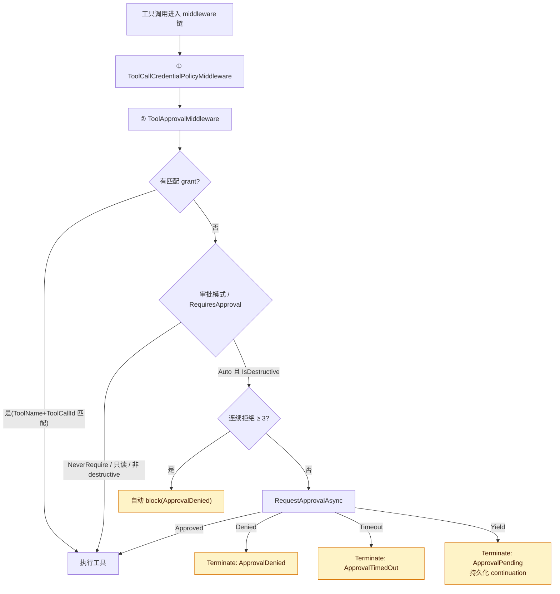
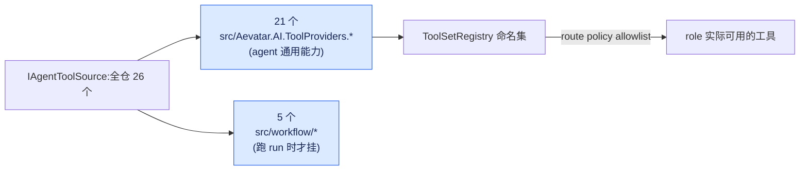

# ★ Tool 体系:ToolApprovalHandler + 26 个 ToolSource(MCP/Skills/Lark/Web/...)

## 本篇涉及的设计抽象

> 以下论断均可回指 `~/Code/aevatar` 源码验证,但本篇用设计语言描述,不贴文件路径/行号。

---

## 工具审批:ToolApprovalHandler

工具调用可能需要审批。`IToolApprovalHandler.RequestApprovalAsync` 返回 `ToolApprovalResult`:Approved / Denied / TimedOut / Yielded。

**两个实现**:

- `YieldApprovalHandler`:立即 `Yielded`——RoleGAgent 持有 pending-approval continuation(持久化 state + 远程升级 + timeout)。
- `MissingApprovalHandler`:fail-closed 回退(不持 continuation 的 surface,缺省即拒)。

**`ToolApprovalMiddleware` 的排序**——这里纠正旧文档:原文说"插在 tool call middleware 链最前面",但实际 `ToolCallMiddlewareChainFactory` 把两个安全中间件**一起钉在所有用户中间件之前并去重**,顺序是 **① `ToolCallCredentialPolicyMiddleware` → ② `ToolApprovalMiddleware`**。所以审批是"第二位、紧跟在凭证策略之后",不是字面第一。审批逻辑:

要点:`Auto` 模式下,只读 / 非 destructive 直接放行,只有 `IsDestructive` 才进审批;连续拒绝计数 ≥ `MaxConsecutiveDenials = 3`(请求级计数,不是实例字段)就自动 block;`Yield` 会 `Terminate` 并把 `TerminationKind` 置 `ApprovalPending`、写入 `PendingApproval` context,由 actor 层持久化、后续靠事件 continuation 续跑。

---

## 26 个 ToolSource:21 在 AI 层 + 5 在 workflow 层

工具来源(`IAgentToolSource`)全仓 **26** 个。比"数到几个"更重要的是**这条位置边界**:AI 层的是 agent 通用能力,workflow 层的是跑 run 时才挂的。

**21 个在 src/Aevatar.AI.ToolProviders.* 系列项目下**(各域一个 `.csproj`):

- **调度类**(`AevatarInvocationToolSources.cs` 一个文件里 5 个):`InvokeGAgentToolSource` / `InvokeTeamToolSource` / `StartWorkflowToolSource` / `ObserveRunToolSource` / `ReadWorkflowRunArtifactToolSource`
- **外部通道**:`MCPAgentToolSource`、`SkillsAgentToolSource`、`LarkAgentToolSource`、`TelegramAgentToolSource`、`WebAgentToolSource`、`OrnnAgentToolSource`
- **Channel / 注册 / 投递**:`ChannelInteractiveReplyToolSource`、`ChannelRegistrationToolSource`、`AgentDeliveryTargetToolSource`
- **NyxId**:`NyxIdAgentToolSource`、`NyxIdConnectedServiceToolSource`(per-user opt-in)
- **其它**:`ScriptingAgentToolSource`、`ServiceInvokeAgentToolSource`、`WorkflowAgentToolSource`、`BindingAgentToolSource`、`ChronoStorageAgentToolSource`

**5 个在 `src/workflow/`**(run 期工具):`WorkflowDocumentExtractToolSource`、`WorkflowSpreadsheetExtractToolSource`、`WorkflowFileSubmitToolSource`、`WorkflowConnectedServiceResourceFetchToolSource`(以上 `Infrastructure/Runs/`)、`HumanInteractionChannelToolSource`(`Integration.AI`)。

> 订正:旧版文档写"22 个",并列了 `LarkWorkflowFileSubmitToolSource`、`AgentWorkflowToolSource` 两个**并不存在**的类——前者真实名字是 `WorkflowFileSubmitToolSource`(在 workflow 层,非 Lark 专属),后者应为 `WorkflowAgentToolSource`。本次按当前源码(26 个)订正。

---

## ToolSetRegistry allowlist

`ToolSetRegistry` 管命名工具集:

- `Resolve(ChatRouteToolSetRef?)`:按名查 registration
- `AddSources`:支持 set inclusion(`IncludeToolSetNames`)+ cycle detection

三个命名集(`ToolSetNames`):

| 集 | 内容 |
|---|---|
| `workspace.default` | 一组默认 source(Invoke/StartWorkflow/ObserveRun/ReadArtifact、Channel×2、DeliveryTarget、NyxId、Lark、Telegram、ChronoStorage、Web、Skills、Ornn 等) |
| `lark.self_notify` | include `workspace.default` + Lark self-notify |
| `nyxid.connected_services` | opt-in only(`NyxIdConnectedServiceToolSource`) |

> connected-service 工具**不进** `workspace.default`,只在 route policy 显式选择该 set 时才注入——这是 per-user 授权的工具,默认集合里不该有。

---

## 验收

1. 工具审批的 Yield 模式怎么工作?(`YieldApprovalHandler` 立即 `Yielded`,actor 持久化 pending continuation,后续 self-continuation 续跑)
2. `ToolApprovalMiddleware` 排在第几位?(第二位,紧跟 `ToolCallCredentialPolicyMiddleware`;两者一起被钉在所有用户中间件之前)
3. ToolSource 一共多少、怎么分?(26 个:21 个在 src/Aevatar.AI.ToolProviders.* 是 agent 通用能力,5 个在 `src/workflow/` 是 run 期工具)
4. `tool_call` 和 `connector_call` 区别?(前者是 agent 工具系统;后者是 workflow connector,见 02/07)

⟦AI:AUTO-LOOP⟧
