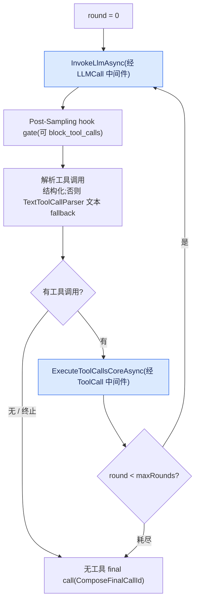
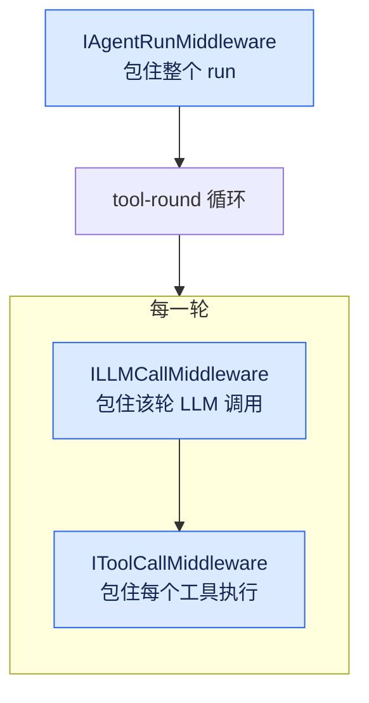

# ChatRuntime / ToolCallLoop / 中间件管线(IAgentRun / IToolCall / ILLMCall Middleware)

## 本篇涉及的设计抽象

> 以下论断均可回指 `~/Code/aevatar` 源码验证,但本篇用设计语言描述,不贴文件路径/行号。

---

## ChatRuntime:流式 chat 执行

`ChatRuntime` 是流式 chat 执行核心。它的 `ChatStreamAsync` 主干分三步:

1. 构建 `AgentRunContext`;
2. 经 `MiddlewarePipeline.RunAgentAsync` + `AgentRunMiddlewareBridge` 跑 agent-run 中间件;
3. 迭代 `RunChatStreamCoreAsync`(先做上下文压缩 → AfterCompression)。

`RunChatStreamCoreAfterCompressionAsync` 是主 `for (round)` 循环:per-round `StreamingToolExecutor`、per-round `LLMRequest` + `ComposeRoundCallId`,外加 skill-recovery 和 length-truncation recovery。

> ⚠️ **熔断在哪一层,要分清**(这是个容易写错的点):
> - `ChatRuntime.DefaultMaxToolRounds = int.MaxValue` 只是"调用方没给轮次上限"时的兜底——无参重载会把它透传,于是循环理论上能一直跑到 LLM 不再调工具。
> - 真正给 GAgent 路径兜底的是 **`AIAgentConfig.MaxToolRounds = 40`**:`AIGAgentBase` 把它透传进 ChatRuntime,且 `NormalizeEffectiveConfig` 会把 ≤0 的值重新夹回 40。
>
> 所以**经 `AIGAgentBase` 的对话被 40 轮兜住**;只有**直接调 ChatRuntime 无参重载**的调用方才会落到 `int.MaxValue` 无熔断。旧版文档把这条挂在 `AIGAgentBase.MaxToolRounds` 名下——准确字段是 `AIAgentConfig.MaxToolRounds`。上游 [#2210](https://github.com/aevatarAI/aevatar/issues/2210) 建议在 ChatRuntime 的轮次解析处也加一个合理硬上限,让所有调用方都有兜底(已登记 [08/04 P0-3](../08/04-todo-list.md))。

---

## ToolCallLoop:LLM → tool → result → LLM

`ToolCallLoop` 持 `ToolManager` + hooks + middleware。`ExecuteCoreAsync` 的骨架:

```text
for (round = 0; round < maxRounds; round++):
    InvokeLlmAsync
    Post-Sampling hook gate(可 block_tool_calls)
    DSML/XML 文本工具调用 fallback(TextToolCallParser.Parse)
    length-truncation recovery
    ExecuteToolCallsCoreAsync
maxRounds 耗尽 → 无工具 final call(ComposeFinalCallId)
```



`MaxLengthRecoveries = 3`:输出超长时用 `LengthRecoveryNudge` continuation prompt 续写,最多 3 次。

---

## 三层中间件管线(ASP.NET Core 风格)

`MiddlewarePipeline` 用递归 `Execute<TMiddleware,TContext>` 实现 `next` 链。三层各管一个粒度:

| 中间件 | 接口 | 包住的粒度 | Context 关键字段 |
|---|---|---|---|
| AgentRun | `IAgentRunMiddleware` | 整个 run(一次用户回合) | UserMessage / AgentId / Result / Terminate / Items |
| LLMCall | `ILLMCallMiddleware` | 每次 LLM provider 调用(每轮一次) | Request(可变)/ Provider / Response / Terminate / IsStreaming |
| ToolCall | `IToolCallMiddleware` | 每个工具执行 | Tool / ArgumentsJson / Result / Receipt / PendingApproval / Terminate / TerminationKind |

`TerminationKind` 取值:None / ApprovalDenied / ApprovalTimedOut / ApprovalPending / MiddlewareTerminated。每个中间件都是标准 `InvokeAsync(context, Func<Task> next)` 形态。



嵌套关系由外到内:AgentRun 包住整个 run;run 内是 tool-round 循环;每一轮里,LLMCall 包住该轮的 provider 调用,然后每个工具执行被 ToolCall 包住。三层粒度不同,所以埋点、审批、改写各自挂在对的层上,不会互相串味。

---

## 可观测性:OTel GenAI 语义约定

`GenAIActivitySource`:

- `ActivitySource = new("Aevatar.GenAI", "1.0.0")`
- Metrics:`gen_ai.client.token.usage`、`gen_ai.client.operation.duration`、`aevatar.tool.invocation.duration`
- Spans:`StartInvokeAgent`(op `invoke_agent`)、`StartChat`(op `chat`)、`StartExecuteTool`

`GenAIObservabilityMiddleware` 同时实现全部三个中间件,自动埋点(含 `EnableSensitiveData` 开关,控制是否记录 input)。把可观测性做成中间件而非散落埋点,正是上面"三层粒度"的直接收益:一个中间件就能在 run / LLM call / tool call 三个层级各开一个 span。

---

## 验收

1. ChatRuntime 的 tool loop 跑到什么时候?(LLM 不再调工具;无参时 `DefaultMaxToolRounds = int.MaxValue`,GAgent 路径被 `AIAgentConfig.MaxToolRounds = 40` 兜底)
2. 三层 middleware 各包什么粒度?(AgentRun = 整个 run;LLMCall = 每次 LLM 调用;ToolCall = 每个工具执行)
3. 可观测性用什么语义约定?(OTel GenAI,`Aevatar.GenAI` ActivitySource,经 `GenAIObservabilityMiddleware` 三层埋点)

⟦AI:AUTO-LOOP⟧
