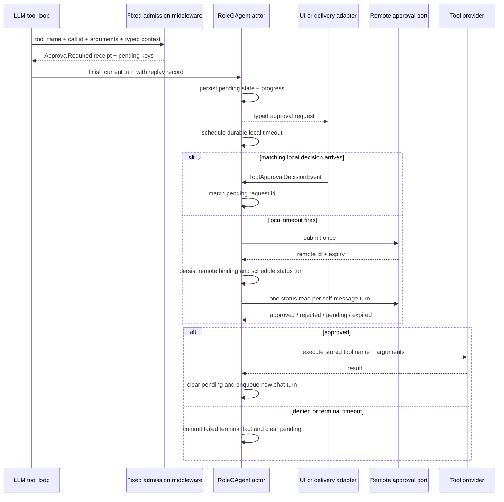

# 工具审批与授权：先确定调用者，再等待可恢复的决定

> 版本与结论：本章描述 `current`。工具被模型选中不代表可以执行：固定 admission 先决定本次调用能否使用正确的 caller credential，再依据 invocation safety 判断是否需要审批。需要跨 turn 等待时，middleware 只产出 typed pending outcome；`RoleGAgent` 持久化 continuation、接收决定并安排后续 turn。UI、通知和远端审批服务都不是 pending state 的所有者。

## 设计抽象与事实源

- `src/Aevatar.AI.Core/Middleware/ToolCallCredentialPolicyMiddleware.cs:12`：按 typed sender binding、credential 与 invocation mutation classification 选择调用身份或 fail closed。
- `src/Aevatar.AI.Core/Middleware/ToolApprovalMiddleware.cs:34`：把 approval mode、call-time safety、grant 与 handler decision 收敛成执行、拒绝、超时或 pending。
- `src/Aevatar.AI.Abstractions/ToolProviders/IRemoteToolApprovalPort.cs:7`：把远端 submit/status/decide 定义为窄端口，不在同步 middleware 栈里隐藏轮询。

## 三种 admission 不能合并成一个“授权”开关

一次工具调用至少经过三组相互独立的判断：

| 判断 | 输入 | 决定 | 不决定 |
|---|---|---|---|
| credential policy | channel sender、binding、sender token、schedule/direct context | 用哪类 credential；缺少 sender credential 时是否拒绝 mutation | 人是否同意本次副作用 |
| invocation safety | `IsReadOnly`、`IsDestructive`、`SideEffectKind`、`RequiresApproval(arguments)` | 是否按 mutation 收紧 credential；是否值得产出 receipt | caller 是否有 credential |
| approval policy | `ApprovalMode`、call-time safety、matching grant、handler result | 立即执行、拒绝、超时或 yield | tool 是否在本 turn 的目录中 |

目录/visibility 先在请求边界决定“模型能看到并调用什么”，见 `04/03-tool-loop-catalog-and-presentation.md`。这里的 admission 只会继续收窄，不会把一个目录外 tool 变成可执行。

`AgentToolCredentialPolicy.IsMutation` 的口径比“`IsDestructive` 为 true”更宽：非只读、destructive、有声明的 side effect，或 invocation 明确要求 approval，任一成立都按 mutation 处理。对 channel-mediated sender：

- sender 有 binding 且有 sender token，就在下游 scope 中使用 sender credential；
- sender 有 binding 但没有有效 sender token，mutation 返回 `credential_denied`，不会偷用 owner token；
- channel sender 连 binding 都没有，mutation 同样拒绝并提示先绑定；
- read-only 调用可以沿用 direct/owner credential fallback；direct/API caller 没有独立 channel sender 时也走 direct policy。

这是一项身份隔离策略，不是“只读永远安全”的证明。tool 的业务授权、外部服务 scope 与实际结果仍由 provider/adapter 检查。

## 固定链顺序与审批判定

```mermaid
%%{init: {"maxTextSize": 100000, "flowchart": {"useMaxWidth": false, "nodeSpacing": 12, "rankSpacing": 48}, "themeVariables": {"fontSize": "10px"}}}%%
flowchart LR
    I["exact request tool call"]
    A["optional audit middleware<br/>outer terminal observer"]
    C["credential policy<br/>caller identity + mutation admission"]
    P["approval policy<br/>mode + invocation safety + grant"]
    U["user middleware<br/>cannot precede fixed admission"]
    E["exact request executor"]
    T["typed result + optional receipt"]
    I --> A
    A --> C
    C --> P
    P --> U
    U --> E
    E --> T
```



chain factory 会去掉外部重复注册的 credential/approval middleware，再插入唯一实例。若有 audit middleware，它被提升为最外层 terminal observer；不可绕过的 admission 顺序仍固定为 **credential policy → approval policy → user middleware**。所以“approval 永远是链中第一个 middleware”并不准确。

approval 的判定顺序如下：

1. matching `ToolApprovalGrant` 的 tool name 与 call id 命中时，跳过再次请求审批；grant 缺字段或不匹配则 fail closed 为 `ApprovalDenied`。
2. `NeverRequire` 直接继续。
3. invocation 的 `RequiresApproval(arguments)` 明确为 `false` 时继续；明确为 `true` 时进入审批。
4. 没有 invocation override 且 mode 为 `Auto` 时，只读或非 destructive 调用继续，destructive 调用进入审批。
5. request/session 显式携带的连续拒绝计数达到 3 时自动拒绝；计数不是 middleware 实例中的隐藏长期状态。
6. handler 返回 `Approved` 才执行；`Denied`、`Timeout`、`Yield` 都终止本次 execution stack。

没有 approval handler 的 surface 使用 `MissingApprovalHandler`，得到明确 denial，而不是假装“已发起审批”。这让不具备交互通道的批处理/Host 保持 fail closed。

## approval 是 actor continuation，不是同步 UI pause

local handler 可以立即批准/拒绝，也可以返回 `Yield`。yield 时 middleware 产生 `ApprovalPending` termination、typed `ToolApprovalPendingContext` 与 `ApprovalRequired` receipt；它不会继续调用 tool。`RoleGAgent` 从 committed replay record 中识别该 receipt，把 request/session/tool/call/arguments、destructive flag、typed tool context 与 scope 保存进 `PendingToolApprovalState`，发布 approval-required progress/request，并安排 durable self timeout。



当前 chat session 在保存 pending approval 后仍可能以 `Completed` 结束；它表示当前 turn/handoff 已收敛，不表示审批已通过或 tool 已执行。真正批准后，actor 执行 stored call，再向自己的 inbox 发送一个新的 `ChatRequestEvent`，让 LLM 基于结果继续。拒绝、终端超时或 continuation failure 则提交单独的 `Failed` completion。

远端审批也不占住一个 actor turn。local timeout 当前为 15 秒；有远端 port 时 actor submit 一次，保存 remote id、attempt 与 deadline，再以 durable self callback 每次读取一个 status。默认远端窗口为 45 秒、检查间隔为 2 秒。每个 status event 都同时核对 request、session、remote id 与 attempt，旧 callback 不会推进新的 pending 请求。

notification port 只负责把远端审批入口送达某个 channel。通知失败会记录 warning，但不改写已经持久化的 remote pending/status 链；反之，“卡片已送达”也不能替 actor 宣告 approved。

## terminal outcome 与副作用诚实性

| 场景 | tool 是否执行 | typed / durable 结果 |
|---|---|---|
| credential denial | 否 | `credential_denied` result，termination receipt 归类 `Denied` |
| local approval denied | 否 | `ApprovalDenied` + `Denied` receipt |
| local handler timeout | 否 | `ApprovalTimedOut` + error receipt |
| approval yield | 否 | `ApprovalRequired` receipt + actor-owned pending state |
| decision request id 已不 pending | 否 | 新 continuation turn 以 `APPROVAL_REQUEST_NOT_PENDING` 失败 |
| remote rejected / cancelled / expired | 否 | failed completion，分别使用 denial/cancel/timeout reason |
| approved，tool 返回 error JSON | tool 可能已部分产生副作用 | error 作为 tool result 进入新的 continuation turn；不会自动变成 terminal failure |
| approved，批准后的 actor/continuation 路径抛异常 | tool 可能已产生副作用 | `APPROVAL_CONTINUATION_FAILED` terminal；异常继续抛给调用 surface |

最后两行尤其重要：批准路径使用的 actor-level `ToolManager` 会把 tool exception 包成 error JSON，随后仍清除 pending 并让新 turn 看见该结果；若 tool 已成功但 self-dispatch 等后续 actor 路径抛异常，系统会尽力持久化 failed terminal。两条路径都不会声称副作用已回滚。调用方应按外部幂等键与业务状态对账，不能仅凭 LLM 没有继续回复或结果含 error 就重放副作用。

typed `AuthorizationRequired` 也不等于 approval。它表示外部服务授权/credential 前置条件尚未满足，当前 role terminal 可为 `Blocked`；approval 则围绕一笔已识别 tool call 的人为决定，并以 pending continuation 表达。prompt、UI 文案或一个普通 metadata flag 都不能把二者互换。

## 最小 pending / decision 示例

> Demo status：`verified-static`（按冻结 middleware、actor state proto、approval handlers、remote port 与 continuation tests 静态核对；未启动 Host、未连接 NyxID，也未执行真实副作用。）

middleware yield 后的关键业务字段可抽象为：

```json
{
  "request_id": "approval-42",
  "session_id": "turn-original",
  "tool_name": "delete_draft",
  "tool_call_id": "call-7",
  "arguments_json": "{}",
  "is_destructive": true,
  "scope_id": "scope-a"
}
```

交互面只提交决定，不直接执行 tool 或修改 pending state：

```json
{
  "requestId": "approval-42",
  "continuationTurnId": "turn-after-approval",
  "approved": false,
  "reason": "Keep the draft"
}
```

静态预期：request id 与 actor 当前 pending 不匹配时不执行；匹配且拒绝时提交 failed terminal 并清除 pending；匹配且批准时才进入 stored tool call 与新的 continuation turn。HTTP/UI 层的“请求已发送”不能替代这些 actor facts。

## 为什么是它，不是别的

**为什么 credential gate 必须在 approval 前？** 用户同意一笔操作，不代表服务可以换用 owner token 代替缺失的 sender token。先确定 caller identity，才能确保随后批准的是“由谁执行”的同一语义。

**为什么等待状态由 actor 持有，而不是 middleware 的进程内 waiter？** 审批可跨越进程重启和长时间等待。actor state + durable callback 可以恢复并用相关键拒绝迟到事件；同步等待只拥有当前进程栈。

**为什么远端 port 拆成 submit/status/decide？** 这迫使每次外部交互成为短 actor turn，并让 remote id、attempt、expiry 成为持久事实；把轮询藏进 `RequestApprovalAsync` 会阻塞 mailbox，也无法在重启后恢复。

**为什么 presentation 不能拥有 approval？** presentation 可能重复投递、延迟或根本未送达。只有 actor 根据当前 pending request 接受的 typed decision 能改变状态，UI 只能展示和发送命令。

## 边界与演进

- `ApprovalGrant` 在 middleware 路径只校验 non-empty request id，以及 tool name/call id 与当前调用匹配；它不自行证明 grant 的签发者或来源。可信 workflow/actor 必须从自己的 pending state 构造 grant。
- `RoleGAgent` 的批准恢复当前按 persisted request id 匹配决定，但随后通过 actor-level `Tools` 按 tool name 直接执行，不重放原 turn middleware，也不持久化原 request catalog 的 exact instance/digest。source refresh 或同名替换跨越等待窗口时，批准事实不足以证明执行的是原实例。这是 current limitation，后续收敛需要把 approved invocation 绑定到可恢复 catalog identity，并在执行前重放 credential/authority fence；登记目标见 `12/05-open-gaps-and-canon-drift.md`。
- actor-level `ToolManager` 将 tool exception 转成 error JSON，批准恢复随后仍构造 continuation；这保留了“让 LLM 解释失败”的机会，但没有 typed 区分“调用前失败”与“可能已产生部分副作用后失败”。副作用 tool 必须依靠 provider 的幂等/查询协议对账。
- pending typed context 会剥离 raw credentials 与 owned metadata control keys；approval state 不是 credential vault。需要外部 credential 的 tool 必须走可恢复、可解析的 typed credential contract，不能从 pending metadata 复活 secret。
- local timeout scheduling 失败当前只记录 warning；pending 仍保留，但不会自动获得该 local escalation trigger。运维观察必须能识别长期 pending，而不是只看 UI 是否有卡片。
- remote notification failure 不取消 status polling；如果部署要求“必须通知到人才能等待”，应在 notification support/command policy 明确 fail closed，而不是从日志推断。
- workflow `human_approval`、workflow `tool_call` approval 与 RoleGAgent approval 各有自己的 pending owner 和相关键；不能把一个 surface 的 resume payload 直接套到另一个 surface。

## 读完应能回答

1. credential、invocation safety、approval 与 turn tool catalog 分别决定什么？
2. audit middleware 存在时，哪两个 admission gate 仍固定排在所有用户 middleware 前？
3. 为什么 `ApprovalRequired` 不表示当前 chat session 必须是 `Blocked`，也不表示 tool 已执行？
4. local timeout 后远端审批怎样用 actor self-message、remote id 与 attempt 恢复并 fencing？
5. 批准后 continuation dispatch 失败时，为什么不能假设外部副作用已回滚？

<details>
<summary>论断—证据映射</summary>

| 论断 | 等级 | 证据 |
|---|---|---|
| 固定链去重并按 audit observer、credential、approval、用户 middleware 排序 | E1 | `src/Aevatar.AI.Core/Middleware/ToolCallMiddlewareChainFactory.cs:25`、`test/Aevatar.AI.Core.Tests/Middleware/ToolCallMiddlewareChainFactoryTests.cs:79` |
| credential policy 对 channel mutation 禁止 owner fallback，read-only/direct 路径按 typed context 选择来源 | E1 | `src/Aevatar.AI.Core/Middleware/ToolCallCredentialPolicyMiddleware.cs:17`、`:43`、`:62` |
| mutation 口径包含非只读、destructive、side effect 与 call-time approval | E1 | `src/Aevatar.AI.Core/Tools/AgentToolCredentialPolicy.cs:7` |
| approval middleware 区分 grant、mode、call-time safety、denial threshold 与四类 handler decision | E1 | `src/Aevatar.AI.Core/Middleware/ToolApprovalMiddleware.cs:34`、`:87`、`:130` |
| missing approval channel 明确拒绝，不制造 pending 假象 | E1 | `src/Aevatar.AI.Core/Middleware/MissingApprovalHandler.cs:13` |
| RoleGAgent 从 receipt 持久化 pending/progress、发布 request 并安排 durable timeout | E1 | `src/Aevatar.AI.Core/RoleGAgent.cs:531`、`:1087` |
| remote approval 是 submit/status 端口；actor 持久化 remote binding 并按完整 stale keys 读取状态 | E1 | `src/Aevatar.AI.Abstractions/ToolProviders/IRemoteToolApprovalPort.cs:7`、`src/Aevatar.AI.Core/RoleGAgent.cs:298`、`:412` |
| approved 路径执行 stored call、清 pending并发送新 turn；拒绝和 actor/dispatch failure 提交 failed terminal | E1 | `src/Aevatar.AI.Core/RoleGAgent.cs:194`、`:228`、`:272` |
| pending state 持 typed tool context，metadata 字段已 reserved | E1 | `src/Aevatar.AI.Abstractions/ai_messages.proto:809` |
| approval continuation 直接使用 actor-level ToolManager 名称查找，不经过 request-local middleware/catalog replay | E1 | `src/Aevatar.AI.Core/RoleGAgent.cs:228`、`src/Aevatar.AI.Core/Tools/ToolManager.cs:48` |
| actor-level ToolManager 把 tool exception 转成 error JSON，而不是向 approval handler 抛出 | E1 | `src/Aevatar.AI.Core/Tools/ToolManager.cs:48` |
| credential denial、approval pending/denial/timeout 会被 finalizer 归一为 typed receipt | E1 | `src/Aevatar.AI.Core/Auditing/ToolCallReceiptFinalizer.cs:57` |

</details>
