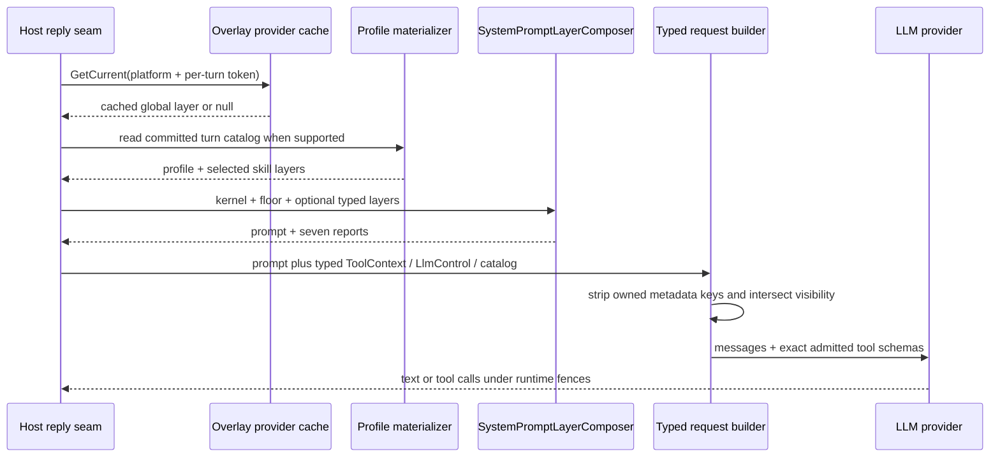
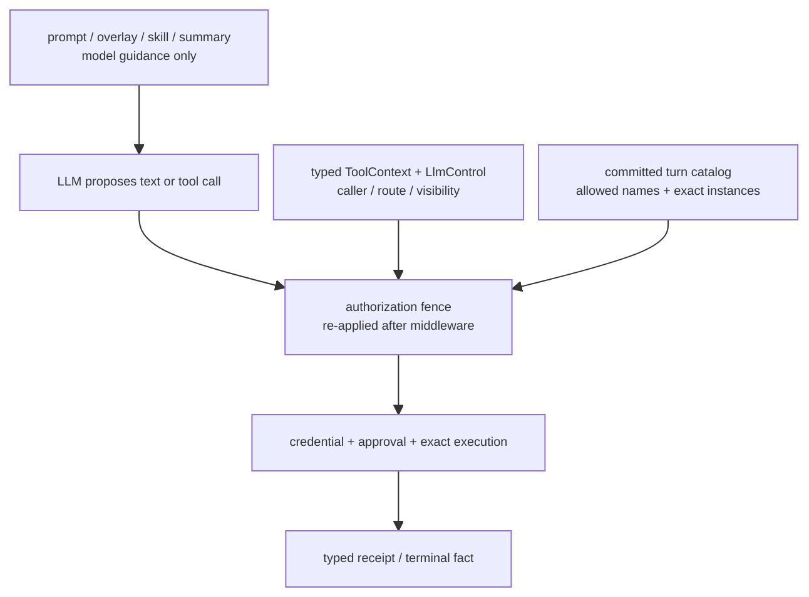

# Prompt overlay 与 Agent context：固定层序不是授权层级

> 版本与结论：本章描述 `current`。Aevatar 把 system prompt 拆成七个有名字、有 provenance、有预算的 slot，并按固定顺序组合；稳定 kernel、强制 built-in floor、Host global overlay、profile routing、selected skill、runtime facts 与 conversation summary 不再靠任意字符串拼接。这个顺序只规定模型看见什么，不授予 tool、route、credential 或 approval 权力；真正的 capability ceiling 仍在 typed request catalog 与 authorization fence 中。

## 设计抽象与事实源

- `src/Aevatar.AI.Abstractions/Prompting/SystemPromptLayers.cs:5`：定义七类 typed layer、各自的 bounds/provenance，以及逐 slot composition report。
- `src/Aevatar.AI.Core/Prompting/SystemPromptLayerComposer.cs:11`：唯一纯组合器，固定层序、required/optional 失败语义和 untrusted delimiter。
- `docs/canon/system-skill-overlay-authoring-contract.md:63`：规定 built-in floor 与动态 Host overlay 的所有权、来源、缓存、rollout 和 profile 边界。

## 七个 slot：组合协议，不是七级权限

```mermaid
%%{init: {"maxTextSize": 100000, "flowchart": {"useMaxWidth": false, "nodeSpacing": 12, "rankSpacing": 48}, "themeVariables": {"fontSize": "10px"}}}%%
flowchart LR
    K["1 KernelPromptLayer<br/>required stable invariants"]
    F["2 BuiltInPromptFloorLayer<br/>required capability floor"]
    G["3 GlobalSystemSkillPromptLayer<br/>optional Host overlay"]
    P["4 ProfileRoutingPromptLayer<br/>optional profile facts"]
    S["5 SelectedSkillPromptLayer<br/>optional reviewed procedure"]
    R["6 RuntimeFactsPromptLayer<br/>optional untrusted turn facts"]
    C["7 ConversationContextPromptLayer<br/>optional untrusted summary slot"]
    O["one system prompt<br/>seven named reports + provenance"]
    K --> F --> G --> P --> S --> R --> C --> O
```



| slot | 所有者与职责 | 当前 bound / 失败语义 |
|---|---|---|
| kernel | agent-specific 稳定不变量、runtime read contract、skill extension 与 capability-authority 原则 | 16 KiB / 4096 estimated tokens；空或越界使 composition 失败 |
| built-in floor | mandatory 静态 capability how-to；远端 overlay 失效时也必须存在 | 32 KiB / 8192 estimated tokens；空或越界使 composition 失败 |
| global | Host 可选的、按 platform 解析的 system-skill overlay | provider 声明正数 bound，冻结 Ornn provider 默认 32 KiB；越界只拒绝本 slot |
| profile | profile id/version/policy revision 与 candidate/selected intent 的 routing facts | 固定 8 KiB / 2048 estimated tokens；越界只拒绝本 slot |
| selected skill | 已提交 exact skill identity 对应的 `SKILL.md` body | bound 来自 profile 的 `max_selected_skill_bytes`；越界在 materialization 或 composition 时 fail closed |
| runtime facts | channel identity、connected/runtime hints、local-skill catalog、attachment/tool notice 等 turn facts | 16 KiB / 4096 estimated tokens；以 untrusted delimiter 包裹 |
| conversation | provider 交付的有界 summary/context | type 要求显式正数 bound；以独立 untrusted delimiter 包裹 |

estimated token 只是确定性的 `ceil(UTF-8 bytes / 4)`，UTF-8 byte bound 才是内容上限。required slot 缺失、空白或越界会抛 typed composition exception；五个 optional slot 空白时省略，越界时整块拒绝而不截断到半条指令，也不影响其他 slot。

每个结果保留七个 named reports：是否 included、actual bytes、estimated tokens、declared bounds、bounded diagnostics 与 typed provenance。单 slot 最多四条 diagnostic，每条 detail 最多 256 UTF-8 bytes，并在 rune 边界截断。report 是“这次组合放进了什么”的证据，不是“模型遵守了什么”的证明。

## stable kernel、built-in floor 与 Host overlay

三层解决不同变化频率：

- kernel 位于 NyxIdChat agent package，保存跨 turn 的安全/诚实不变量与“final tool schemas 才是 capability authority”等稳定规则；它可以描述这个具体 agent 的 Aevatar 边界，但不把任一 Host 的组织、set name 或部署路径塞进通用 `Aevatar.AI.Core`。
- built-in floor 同样来自 embedded resource，却由 mandatory provider 显式交给两个 reply seam。它承载部署通用 capability playbook，不能被 optional remote layer 替代或在 rollback 时关闭。
- global overlay 是 Host-level 可选层。canon 要求它指向 public、org-owned skillset，Host 只配置非 secret set name、开关和预算；冻结 provider 接受该 reference、读取 set members，并不在本地重新证明 public visibility 或 owning org。`overlay-scope-global` / `overlay-scope-<platform>` 决定注入范围，没有 scope tag 的成员 fail closed 跳过。

global provider 的 hot-path `GetCurrent` 是同步 cache read，不在一次 reply 中等待远端。stale 时只用该 turn 提供的 NyxID token 触发 single-flight background refresh；当前 turn 使用 last-known-good。首次按配置名解析到 set 后，进程内 provider pin stable GUID；pinned miss 不会静默按同名重新解析。每个 variant 先尝试完整 body，超预算时逐步降级成 catalog line / catalog-only，再以 member 内容与 scope 的 SHA-256 watermark 标识 provenance。

冻结 Mainnet 配置中 global overlay 默认 `Enabled: false`。因此“代码里存在 provider”不等于生产 turn 已注入远端 overlay；实际启用与 set 内容是 Host 配置事实。

## profile 与 selected skill：procedure 和 capability 分开提交

direct NyxIdChat 在本 turn 的 authority 已提交后，materializer 才构造 profile/selected-skill prompt slots：

1. profile layer 只写 profile id/version/policy revision 与 candidate/selected intent，不把整个 catalog 或 credential 塞进 prompt。
2. selected skill 必须命中 committed exact GUID + literal version，并核对 expected name、reviewed publisher 与 non-empty hash。
3. `SKILL.md` 先受 profile byte limit，再解析 frontmatter；实际注入 body，不把 frontmatter identity 当 instruction。
4. fetch、identity 或 body 校验失败时，authority 降到 recovery/restricted path；不会为了保留 procedure 而扩大 tools。
5. composer 无状态。下一 turn 没有 selected layer，就不会重放上一 turn 的 skill body；shadow candidate 没有 committed selected body，也不会注入“候选 procedure”。

profile/selected slot 和 tool policy 属于同一次 turn catalog，但职责不同：prompt 告诉模型怎样做，`FinalAllowedToolNames` 与 exact route-owned instances 决定它实际上能调用什么。procedure 写着“调用 admin_tool”不会把该名字加入目录。

## 两个生产 seam 怎样组合



direct `NyxIdChatGAgent` supplies kernel、floor、dm-scoped cached global、committed profile、selected skill 与 direct runtime facts。channel/relay `ConversationReplyGenerator` supplies the same kernel/floor、typed channel-platform global 与 relay runtime facts，但当前明确传 `profile: null`、`selectedSkill: null`；profile rollout contract 不能从 direct chat 外推到 relay。

两个生产 seam 当前都传 `conversation: null`。`ConversationContextPromptLayer` 已是正式 contract，并会被 composer 包进 `<untrusted-conversation-summary>`，但尚无生产 provider 接入该 slot。现有 `ContextCompressor` 会把 LLM 摘要作为普通 system history message 插回消息列表；它有 summarizer output limit，却不等同于有 provenance/bounds/report 的 typed conversation layer。不能把接口测试里的七层全量组合写成现行生产接线。

## prompt 为什么不能覆盖 typed authorization



prompt content can influence what the model proposes，所以每个 overlay、skill body、runtime fact 与 conversation summary 都必须当作 potentially adversarial input；delimiter 让语义边界可见，但不是一个 parser-level sandbox。真正的安全边界在 prompt 之外：

- request builder 从 typed `ToolContext` / `LlmControl` 构造 route 与 caller context，并从 generic metadata 中移除 owned control keys；
- profile allowed names 与 caller visibility 取交集，不能因 prompt 提到一个 tool 而扩大；
- authorization fence 保存 exact schema instances，在 LLM middleware 前后重放；
- credential 和 approval middleware 再对具体 invocation 收窄；
- success、denial、authorization-required 与 side effect 由 typed receipt/terminal fact 表达，不由模型句子决定。

因此 global set membership、reviewed skill identity 与 provenance 证明“内容从哪里来”，不是 capability grant。即使 trusted overlay 错写“忽略工具限制”，normal turn tool loop 也只会执行最终 schema catalog 中的 exact tool；approval yield 之后的 actor continuation 另有 catalog-replay 限制，见 `04/04-tool-approval-and-authorization.md`。

## 最小组合示例

> Demo status：`verified-static`（按冻结 typed layer、composer tests、direct/relay seam、profile materializer 与 authorization fence 静态核对；未启动 Host、未刷新真实 Ornn set，也未运行 prompt eval。）

假设 direct turn 交付以下 slot：

```json
{
  "kernel": "stable invariants",
  "built_in_floor": "mandatory capability floor",
  "global": null,
  "profile": "Agent profile: reviewer-v1",
  "selected_skill": "Review the supplied document",
  "runtime_facts": "Connected services: docs-readonly",
  "conversation": null,
  "final_allowed_tool_names": ["read_document"]
}
```

静态预期：prompt 顺序是 kernel → floor → profile → delimited selected skill → delimited runtime facts；global/conversation reports 为 not included。即使 selected skill 文本要求 `delete_document`，最终 request 仍只暴露 `read_document`。若 selected skill 超出 profile bound，该 slot 被拒绝/降级，不能截断后带着不完整 procedure 继续，也不能因此获得额外 tool。

## 为什么是它，不是别的

**为什么不用各 seam 手写字符串 append？** 两个 reply path 若各自决定顺序、delimiter 和 fallback，很快会产生安全 floor 丢失或 platform 行为漂移。一个纯 composer 让顺序与失败语义可测试，seam 只负责提供 context-specific layer。

**为什么 built-in floor 必须与 remote global 分开？** 远端内容可能首次不可达、过期或被 rollback。若 mandatory capability floor 藏在 remote fallback 里，网络故障会同时删除基础行为契约；独立 required slot 让缺失显式失败。

**为什么 global overlay 使用 cached read，而不是每 turn query Ornn？** prompt 热路径需要有界延迟，且远端失败不能阻塞 actor mailbox。cache + watermark + background refresh 给当前 turn 稳定快照，也把 freshness 代价留在 Host adapter。

**为什么 prompt 不能充当 authorization policy？** 模型输入本质上可被注入、误解或忽略；typed catalog/fence 才能机械拒绝目录外能力。把 tool allowlist 写在自然语言里只是建议，不是安全控制。

**为什么 generic core 不解析 Host facts？** `Aevatar.AI.Core` 只组合已类型化的 layer，不解析组织名、set、平台或项目路径。具体 agent/Host seam 拥有这些事实，避免高频部署变化下沉到稳定 engine。

## 边界与演进

- fixed order 是 append order，不是一个可验证的自然语言 precedence engine。kernel 声明的安全规则仍可能被模型违背，因此 runtime fence 不能省略，行为质量还需要 eval。
- global overlay cache、pinned GUID 与 last-known-good 都是 provider 进程内状态；它们不是跨进程 SSOT。重启后的首次解析仍依赖 Host 配置的 set name，而 public/org-owned 属性由上游 Ornn 与发布治理保证，不是 provider 本地校验。
- optional layer 越界会整 slot 拒绝而非自动摘要。作者必须主动控制内容；不能把安全必需规则只放在 optional overlay。
- direct profile layer/selected skill 当前不进入 relay seam。若将来要统一，必须先定义 relay 的 profile binding、caller authority 与 rollout cohort，不能只把两个参数从 null 改成对象。
- typed conversation slot 当前未接生产 seam，历史 compressor summary 也没有该 slot 的 provenance/report/untrusted wrapper。演进应由 conversation owner 提供有界 typed summary，并消除双重 summary 路径；登记目标见 `12/05-open-gaps-and-canon-drift.md`。
- canon 记录了 golden-task 文档，但冻结实现尚无自动 eval harness。rollout 的 staging/canary/fleet 结论不能只凭 composition tests 外推为模型行为验证。

## 读完应能回答

1. 七个 prompt slot 的固定顺序是什么，required 与 optional 越界分别怎样处理？
2. kernel、built-in floor 与 Host global overlay 为什么必须分离？
3. profile procedure 与 `FinalAllowedToolNames` 为什么是两种不同事实？
4. direct 与 relay seam 当前分别注入哪些层，conversation slot 是否已经接入生产？
5. 为什么 provenance、delimiter 和 set membership 都不能替代 typed authorization fence？

<details>
<summary>论断—证据映射</summary>

| 论断 | 等级 | 证据 |
|---|---|---|
| 七类 layer 持 bounds/provenance/report，kernel/floor/runtime 有固定默认 bound | E1 | `src/Aevatar.AI.Abstractions/Prompting/SystemPromptLayers.cs:5`、`:39`、`:201` |
| composer 固定七层顺序，required 失败、optional 单 slot 拒绝，并包裹 selected/runtime/conversation | E1 | `src/Aevatar.AI.Core/Prompting/SystemPromptLayerComposer.cs:11`、`:90`、`:118` |
| Ornn global provider 用同步 cached read、background refresh、platform variant、pinned GUID 与 watermark | E1 | `src/Aevatar.AI.ToolProviders.Ornn/SystemSkillOverlay/OrnnSystemSkillOverlayProvider.cs:49`、`:68`、`:125`、`:193` |
| direct seam 组合 profile/selected/runtime；relay seam 当前不组合 profile/selected | E1 | `agents/Aevatar.GAgents.NyxidChat/NyxIdChatGAgent.cs:303`、`agents/Aevatar.GAgents.NyxidChat/ConversationReplyGenerator.cs:1443` |
| selected skill 核对 exact identity、publisher/hash 与 byte bound，只注入 parsed body | E1 | `agents/Aevatar.GAgents.NyxidChat/AgentProfiles/AgentProfileTurnCatalogMaterializer.cs:430`、`:473`、`:302` |
| profile routing layer 固定 8 KiB，tool names/exact instances 保存在独立 turn catalog 字段 | E1 | `agents/Aevatar.GAgents.NyxidChat/AgentProfiles/AgentProfileTurnCatalogMaterializer.cs:885`、`src/Aevatar.AI.Core/AgentProfiles/AgentProfileTurnCatalog.cs:44` |
| 两个生产 seam 均未接 conversation slot，旧 compressor 另行插入 system summary message | E1 | `agents/Aevatar.GAgents.NyxidChat/NyxIdChatGAgent.cs:340`、`agents/Aevatar.GAgents.NyxidChat/ConversationReplyGenerator.cs:1482`、`src/Aevatar.AI.Core/Chat/ContextCompressor.cs:267` |
| request builder 从 typed context 交集化 visibility、剥离 owned metadata keys，并由 fence 保留 exact tool | E1 | `src/Aevatar.AI.Core/Chat/ChatRuntimeRequestBuilder.cs:20`、`:34`、`:160` |
| Core 只做纯组合，不解析 Host providers；CI guard 固定两条生产 seam | E1 | `tools/ci/architecture_guards.sh:1992`、`:2064` |
| overlay authoring contract 要求 public org-owned set、固定层序、cached read 与 staged rollout | E2 | `docs/canon/system-skill-overlay-authoring-contract.md:15`、`:63`、`:99`、`:131` |

</details>
