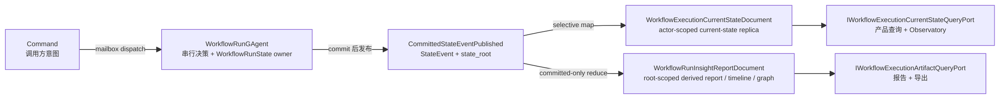
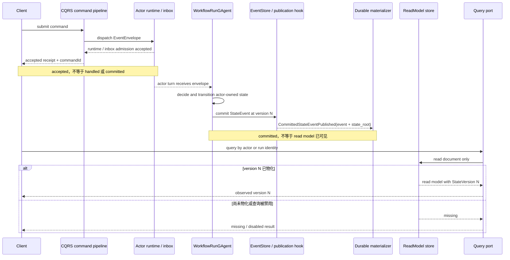

# Command、committed fact、Projection 与 ReadModel：把写入结果和查询视图分开

> 版本与结论：本章描述 `current`。Aevatar 的 command receipt、actor committed fact 与 read model observation 是三个不同阶段：accepted 只证明 runtime/inbox boundary 接受了投递，`StateEvent` 才记录 actor 提交的事实，read model 则是由 committed observation 异步物化出的查询副本。查询端只读副本；缺失或滞后不能触发 event-store replay、actor activation、projection priming 或索引修复。

## 设计抽象与事实源

- `docs/canon/cqrs-projection.md:55`、`:104`、`:131`：定义 command 骨架、投影约束，以及 query-time replay / priming 禁令。
- `src/Aevatar.CQRS.Projection.Core/README.md:3`、`:48`：区分 durable materialization 与 session observation，并把 durable 输入限定为 committed observation。
- `src/Aevatar.CQRS.Projection.Core.Abstractions/Abstractions/Orchestration/CommittedStateEventEnvelope.cs:7`、`:23`、`:48`：从包络中验证并解出 `state_event`、`state_root`、event id 与 authoritative state version。

## 四种对象，只有一个写侧事实拥有者



这四类对象不能互换：

| 对象 | 它证明什么 | 它不证明什么 | 所有者 |
|---|---|---|---|
| command / mailbox `EventEnvelope` | 调用方提出意图，runtime 获得可寻址的投递载体 | actor 已接受业务语义、状态已持久化 | 调用入口与投递链 |
| accepted receipt | runtime/inbox admission 成功，并给出 `commandId`、`correlationId` 与目标 identity | actor turn 已 handled、domain event 已 commit、projection 已可查询 | CQRS command pipeline + actor dispatch port |
| `StateEvent` + `state_root` | actor 已提交某个 version 的 event，并给出该次提交后的 typed state root | 所有读模型已经同步更新 | authoritative actor / event store |
| read model / artifact | 某个 committed version 已按消费者需要物化 | 它自身成为业务事实，或比 actor state 更新 | projection 与 read store |

`EventEnvelope` 是通用消息包络。command 可以装在其中进入 mailbox，committed observation 也可以装在其中离开写侧；真正区分语义的是 typed payload。durable materializer 必须先确认 payload 是 `CommittedStateEventPublished`，再读取内部 `StateEvent` 与 `state_root`。因此“看见一个 actor envelope”不等于“看见一个已提交领域事实”。

## 一个 actor state，多个稳定消费者视图

Task 10 的 state-owner/read-model 对照在 Workflow 链上可以落成两行：

| read model | authoritative actor / state | committed version 来源 | 稳定消费者 | query port |
|---|---|---|---|---|
| `WorkflowExecutionCurrentStateDocument` | `WorkflowRunGAgent` / `WorkflowRunState` | `StateEvent.Version`，同时保留 `EventId` | Workflow query application、run completion/finalize、Observatory | `IWorkflowExecutionCurrentStateQueryPort` |
| `WorkflowRunInsightReportDocument` | root run 与 runtime relay 进该 root scope 的各 `WorkflowRunGAgent` committed facts | 每个输入自己的 source-local `StateEvent.Version` + `EventId` | Observatory detail、timeline export、graph export | `IWorkflowExecutionArtifactQueryPort` |

这不是两套事实。current-state projector 只接受 projection root 与 publisher actor 相同的提交，把完整 `WorkflowRunState` 选择性映射成运行状态、结果、scope、saga 与版本字段；反向 relay 的 child state 不能覆盖 parent current-state document。root actor 自己的每次 committed input 同时也可进入 report projector；此外 runtime 会把 committed child facts relay 到 parent stream，report artifact 可以在 root scope 中聚合这些可观察事实。每条事实仍归发布它的 origin actor 所有，report 不因此成为跨 actor 业务 owner。它可以读回已有 report 以增量归约，但新增内容仍必须来自 committed input，不能从 wall clock、runtime children、命令参数或 UI callback 猜业务完成态。

为什么不做一个“万能文档”？current state 回答“这个 actor 在 version N 的权威状态是什么”，report/artifact 回答“这个 run 的可读历史与导出形状是什么”。把二者混成一个 schema，会让产品查询被历史累积拖累，也会诱使 artifact 字段反向定义 actor 状态。按稳定消费者拆分读模型，允许一份 committed fact 生成多种索引形状，同时保持单一写侧 owner。

## accepted、committed、observed 的动态边界



三个阶段各有独立失败面：

1. dispatch 被拒绝时，没有 accepted receipt，也不能假设 actor 收到命令。
2. accepted 后 actor 仍可能在校验、执行或 commit 时失败；receipt 只是追踪句柄。
3. committed 后 materializer、store 或 provider 仍可能暂时失败；查询看到旧 version 或 missing，不会把滞后改写成新的业务结果。

对 actor-scoped current-state document，`StateVersion` 是 read model 与该 actor authoritative commit 的对账坐标，不是查询端自己递增的 revision。对聚合多个 origin actor 的 artifact，每个 `StateEvent.Version` 只在自己的 actor 序列内有序；单一 artifact 字段不能被外推成整棵 topology 的全局 version。消费者必须按各自 port 的语义处理短暂不一致。具体 overwrite、idempotency 与 rebuild 规则见 [ReadModel store、versioning 与 rebuild](04-readmodel-stores-versioning-and-rebuild.md)。

!!! warning "当前限制：跨 actor artifact 水位"

    冻结实现的 report artifact 用一个 `StateVersion` / `LastEventId` 记录输入，并以该标量跳过旧版或重复输入；runtime 又允许 committed child facts relay 到 parent scope。actor-local version 之间没有全局可比性，所以这两个字段不能证明跨 actor 聚合已完整赶到某个全局水位。本文只把它们当作最近一次被 artifact 接受的 source marker；需要 per-origin watermark、可重放顺序或缺口检测的设计，留待 `12/05-open-gaps-and-canon-drift.md` 登记与收敛。

## 查询端为何必须保持“无副作用”

冻结实现的 current-state query port 只调用 `IProjectionDocumentReader.GetAsync` / `QueryAsync`，artifact port 只读 document/graph store。它们不依赖 `IEventStore`、`IActorRuntime` 或 projection activation service。这条边界同时解决四个问题：

- **延迟可预测**：query 不把一次事件全量 replay 藏进尾延迟。
- **权限可审计**：scope/filter 在 read-store query 中执行，不因临时创建 actor 或 session 绕过查询边界。
- **故障不扩散**：读流量不能触发写入、索引迁移或大量 actor activation。
- **语义诚实**：missing 明确表示“当前读侧没有可见副本”，而不是查询代码临时制造一个看似 current 的答案。

因此以下“补救”都属于阻断性缺陷：query-time `IEventStore` replay、临时 rebuild actor state、ensure/activate projection、创建 observation session、repair/reindex store，以及从旧 read model 反推并提交业务状态。恢复或 DR rebuild 是显式运维写流程，不是普通 query 的 fallback。

## Durable materialization 不等于所有实时观察

Projection Core 明确保留两条主链：durable materialization 与 session observation。本章只定义前者的 CQRS 读副本。后者可以把已观察到的事件映射为一次 session 的 SSE/AGUI 输出，但 session stream 不拥有业务事实，也不保证长期保存。

这解释了 canon 中“projection 消费 actor envelope stream”的宽口径：包络是共同运输形状，durable 与 live 链却有不同 admission 与产物。durable read model 只从 committed observation 物化；live/session 的生命周期、断线与非权威性分别见 [committed state 与 observation](02-committed-state-and-observation.md) 和 [Workflow AGUI 与 live observation](05-workflow-agui-and-live-observation.md)。

## 最小静态示例

> Demo status：`verified-static`（按冻结 command pipeline、committed envelope helper、Workflow projectors 与 query ports 静态核对；未启动 Host、未写入真实 store，也未测量端到端延迟。）

假设一个 run 的 command 被接受，随后 actor 提交 version 18：

```json
{
  "accepted_receipt": {
    "actor_id": "run-alpha",
    "command_id": "cmd-18",
    "correlation_id": "corr-alpha"
  },
  "committed_observation": {
    "state_event": {
      "agent_id": "run-alpha",
      "event_id": "evt-18",
      "version": 18
    },
    "state_root_type": "WorkflowRunState"
  },
  "current_state_readmodel": {
    "id": "run-alpha",
    "state_version": 18,
    "last_event_id": "evt-18",
    "status": "completed"
  },
  "report_artifact": {
    "id": "run-alpha",
    "state_version": 18,
    "last_event_id": "evt-18"
  }
}
```

这个样例故意只含一个 origin actor。静态预期只有两条：receipt 出现时，后面三个对象可以都还不存在；两个读模型出现时，它们的业务字段必须来自 `WorkflowRunState` 或 committed event payload，version/event id 来自同一个 `StateEvent`。即使 read model 暂缺，query port 也只返回 missing/empty，或由 enablement gate 表达 disabled，不会在请求内补跑 projection。

## 为什么是它，不是别的

**为什么由 actor 拥有写侧事实，而不是 projection？** actor mailbox 给同一 identity 串行决策边界，commit 给出可恢复的 versioned fact。projection 面向多个消费者且允许重放；若它能发明业务状态，重放顺序或 provider 差异就会产生多个事实源。

**为什么 accepted receipt 不等待 read model？** command admission、actor commit 与读侧物化是三个独立故障域。把它们绑成一个同步事务，会让 API 延迟和可用性受最慢 store 支配，也会把“已投递”误写成“所有视图一致”。需要完成态的调用方应携带 identity 观察 read model 或明确的 interaction stream。

**为什么查询不直接问 actor？** 列表、筛选、排序与跨 run Observatory 是读侧工作；逐 actor ask 会产生 N+1 mailbox 压力，并把 runtime availability 变成查询依赖。read store 可按消费者 schema 建索引，actor 继续只做决策。

**为什么允许一个 fact 生成多个 read model？** 不同消费者需要 current snapshot、timeline、report 与 graph，不需要共享一个不断膨胀的文档。多视图复制的是查询形状，不复制事实所有权；`StateVersion` / `LastEventId` 保留了回指 committed input 的证据。

## 边界与演进

- current-state replica 必须保持 actor-scoped。跨 actor relay 可生成明确的 derived artifact，却不能覆盖另一个 owner 的 current-state document。
- `state_root` 是 materializer 输入，不是允许直接暴露的通用 JSON bag。projector 只选择 consumer schema 所需字段；credential、secret 与无关内部状态不能因“已经 committed”就进入读模型。
- report artifact 可以增量读回已有 artifact，但业务变化仍须由 committed event/root 驱动。缓存时间、缺省值或 UI 行为不能成为新的 timeline fact。
- actor-scoped `StateVersion` 说明已物化到该 actor 的哪个 commit，不保证两个不同 read model 在同一瞬间版本相等；聚合 artifact 更不能把不同 actor 的 local version 当成全局序号。需要跨视图或跨 actor 一致性的用例必须显式定义 per-origin 水位与缺口策略，不能由 query 暗中 replay。
- session observation 是短期交互输出，不是 durable truth；其事件丢失、重连和 terminal mapping 不改变本章的 committed-only durable 边界。
- split / merge / re-key 的 bootstrap 只能从 committed durable feed 进入显式迁移流程；新 owner 仍要提交自己的事实。普通查询不能借 bootstrap 名义激活或改写 actor。

## 读完应能回答

1. command `EventEnvelope`、accepted receipt、`StateEvent` 与 read model 各自证明什么？
2. durable materializer 为什么必须解出 `CommittedStateEventPublished` 的 `state_event + state_root`？
3. 一个 `WorkflowRunGAgent` 的 committed state 为什么可以生成 current-state 与 report 两种视图，却仍只有一个事实源？
4. read model missing 或落后时，query port 为什么不能 replay event store 或 activate projection？
5. durable materialization 与 session observation 的输入约束和事实权威有何不同？

<details>
<summary>论断—证据映射</summary>

| 论断 | 等级 | 证据 |
|---|---|---|
| command pipeline 分离 prepare、runtime/inbox admission 与 receipt；dispatch completion 不表示 handled、committed 或 observed | E1 | `src/Aevatar.CQRS.Core/Commands/DefaultCommandDispatchPipeline.cs:52`、`:69`、`:103`；`src/Aevatar.Foundation.Abstractions/IActorDispatchPort.cs:47`；`src/workflow/Aevatar.Workflow.Application.Abstractions/Runs/WorkflowChatRunModels.cs:305` |
| committed fact 的 wire contract 是 `StateEvent`，publication 同时携 `state_event` 与 `state_root` | E1 | `src/Aevatar.Foundation.Abstractions/agent_messages.proto:140`、`:151`、`:157` |
| durable helper 拒绝非 committed payload，并能解出 typed state root、event id 与 version | E1 | `src/Aevatar.CQRS.Projection.Core.Abstractions/Abstractions/Orchestration/CommittedStateEventEnvelope.cs:7`、`:23`、`:48` |
| core current-state helper 从 committed state 映射后只写 read store | E1 | `src/Aevatar.CQRS.Projection.Core/Orchestration/MappedCurrentStateProjectionMaterializer.cs:41`、`:50`、`:68` |
| Workflow current-state projector 限定同一 publisher/root owner，并从 `StateEvent` 写 version/event id | E1 | `src/workflow/Aevatar.Workflow.Projection/Projectors/WorkflowExecutionCurrentStateProjector.cs:25`、`:29`、`:46`、`:69` |
| Workflow report artifact 从 committed root/event 累积，旧 version/event id 用于跳过重复或过期输入 | E1 | `src/workflow/Aevatar.Workflow.Projection/Projectors/WorkflowExecutionArtifactMaterializationSupport.cs:93`、`:114`、`:146`；`src/workflow/Aevatar.Workflow.Projection/Projectors/WorkflowRunInsightReportArtifactProjector.cs:30` |
| runtime 会把 committed child observation relay 到 parent stream；current-state projector 明确拒绝 child state 覆盖 root replica | E1 | `src/Aevatar.Foundation.Runtime.Implementations.Local/Actors/LocalActorRuntime.cs:242`；`src/Aevatar.Foundation.Runtime.Implementations.Orleans/Actors/OrleansActorRuntime.cs:136`；`src/workflow/Aevatar.Workflow.Projection/Projectors/WorkflowExecutionCurrentStateProjector.cs:29` |
| current-state query port 只读 document reader，artifact query port 只读 document/graph stores | E1 | `src/workflow/Aevatar.Workflow.Projection/Orchestration/WorkflowExecutionCurrentStateQueryPort.cs:34`、`:58`、`:84`；`src/workflow/Aevatar.Workflow.Projection/Orchestration/WorkflowExecutionArtifactQueryPort.cs:32`、`:43`、`:63` |
| durable 与 session 是两条链，durable 只消费 committed observation，host 不持有长期 runtime registry | E1 | `src/Aevatar.CQRS.Projection.Core/README.md:3`、`:48` |
| canon 明令禁止 query-time replay、temporary rebuild、projection priming 与 readmodel 反向定义业务事实 | E2 | `docs/canon/cqrs-projection.md:118`、`:131` |

</details>
