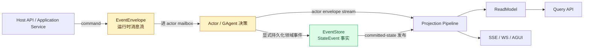
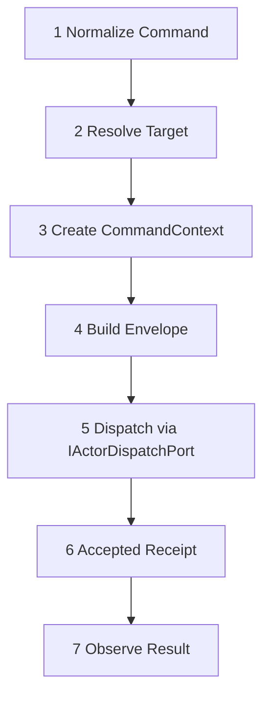

# Projection 总览:Command→EventEnvelope→Actor→持久化→Projection→ReadModel

## 本篇涉及的设计抽象

> 以下论断均可回指 `~/Code/aevatar` 源码验证,但本篇用设计语言描述,不贴文件路径/行号。

---

## 统一投影链路

整个 05 块的骨架就是这一条链路:

关键口径:**EventEnvelope Stream 是运行时消息流,不是 ES 事实流**。command → envelope → actor mailbox;只有显式持久化的领域事件才进 EventStore;projection 消费 actor envelope stream。这条链路解释了为什么 API 推送(SSE/WS/AGUI)和 CQRS 读模型**共享同一投影输入**——它们都是这条链路的输出分支。

---

## CQRS 统一命令骨架 7 步

`DefaultCommandInteractionService` 的实现展开是:Prepare → Observe → DispatchPrepared → Accepted callback → Pump → finalize → cleanup。这里有一个反直觉但关键的次序:**observation-before-dispatch**——观察绑定必须在 dispatch **之前**完成。否则 dispatch 一旦受理、actor 立刻产出的事件,会因为还没绑上观察而丢掉。所以第 7 步"观察结果"用到的绑定,实际发生在第 5 步"派发"之前。

---

## 投影约束(9 条)

1. CQRS / AGUI / SSE / WS 共享同一投影输入
2. EventTypeUrl 精确匹配
3. miss 时 no-op(匹配不上就什么都不做,不报错)
4. lease / session 生命周期
5. one-to-many 全分支(一个输入可投影到多个输出)
6. `IProjectionStoreDispatcher` + Store Binding
7. committed-state 发布 hook 激活 durable scope
8. durable 激活由 committed-state publication owner hook 触发(**非** command 路径)
9. host 侧只留薄适配

> 第 7、8 条是 05/02 的主题:durable 投影**只**经 committed-state 边界激活,不允许 command 路径直接激活 projection。

---

## 验收

1. 投影主链路是什么?(Command→EventEnvelope→Actor→持久化→Projection→ReadModel)
2. 为什么 SSE 和 ReadModel 共享输入?(都是同一投影链路的输出分支)
3. 命令骨架第 5 步?(Dispatch via `IActorDispatchPort`)
4. observation 和 dispatch 的顺序?(observation-before-dispatch,否则丢事件)

⟦AI:AUTO-LOOP⟧
