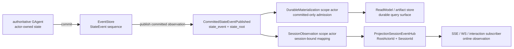
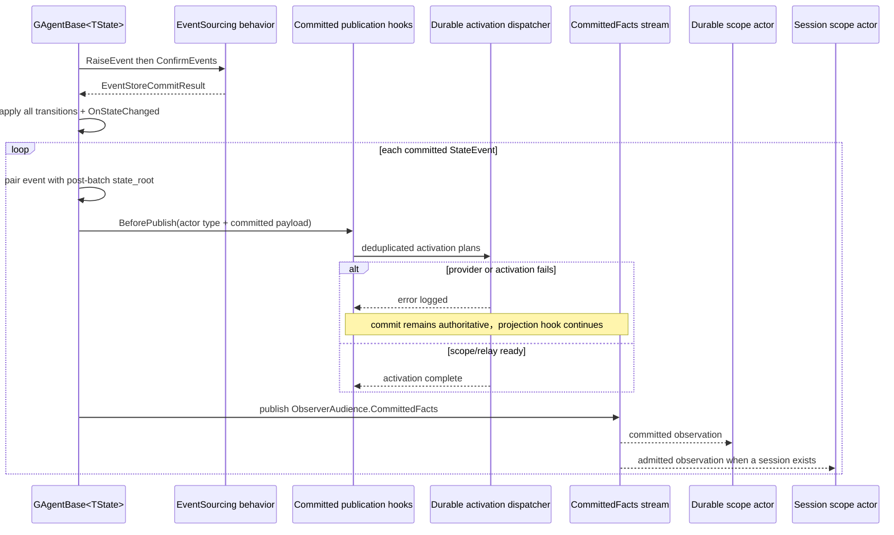

# Committed state 与 observation：持久事实和实时可见性不是一回事

> 版本与结论：本章描述 `current`。Aevatar 在 event-store commit 之后发布 `CommittedStateEventPublished`，其中 `state_event` 标识已提交的事实与 actor-local version，`state_root` 提供提交完成后的 typed state snapshot。durable materialization 只接受这种 committed observation；session observation 可以把同源 observation 映射成低延迟事件并按 `RootActorId + SessionId` fan-out，但 session event 只证明“某个在线观察链看见并映射了输入”，不是新的 durable truth。

## 设计抽象与事实源

- `src/Aevatar.Foundation.Abstractions/agent_messages.proto:140`、`:151`、`:157`：定义 `StateEvent`、commit result 与 `state_event + state_root` publication contract。
- `src/Aevatar.CQRS.Projection.Core/Orchestration/CommittedStateProjectionActivationHook.cs:8`、`:33`：在 committed publication boundary 规划 durable scope，并明确 activation 失败不阻断事实发布。
- `src/Aevatar.CQRS.Projection.Core/Streaming/ProjectionSessionEventHub.cs:7`、`:38`、`:67`：session event 以 `RootActorId + SessionId` 路由、protobuf 编解码和在线订阅。

## 两条 observation 链，共用输入不共享权威



| 维度 | Durable materialization | Session observation |
|---|---|---|
| scope identity | `RootActorId + ProjectionKind + DurableMaterialization` | `RootActorId + ProjectionKind + SessionObservation + SessionId` |
| 当前生产输入 | 必须能解出合法 `CommittedStateEventPublished` | 标准 observation relay 同样只放行 `CommittedStateEventPublished`，projector 再解出内部 event payload |
| 产物 | current-state replica、derived durable artifact、audit artifact | typed session event stream |
| 长期事实权威 | 没有新增权威；回指 actor commit | 没有；只表示一次 session mapping/fan-out |
| 消费方式 | query port 读取 read store | 当前订阅 handler 接收 protobuf event |
| reconnect / history | 由 durable store、rebuild 与各 query contract 负责 | hub contract 没有 history/cursor/replay API，不承诺补发断线区间 |

“两条链都叫 projection”只说明它们都做输入到消费形状的映射。durable 链的目标是可查询、可修复的副本；session 链的目标是把在线交互所需的 delta、terminal 或 custom event 尽快送达当前订阅者。把 session event 写成 durable fact，会把网络连接和 UI 生命周期抬成业务事实源；把 durable store 当 live sink，又会让每个 token/delta 都承担持久化与索引代价。

## `state_event + state_root` 的协议语义

`StateEvent` 保留一次提交的最小事件证据：

- `event_id`：该事件的稳定 identity；
- `timestamp`：事件时间；
- `version`：发布 actor 自己的 event sequence version；
- `event_type` / `event_data`：typed 业务事实；
- `agent_id`：该事实的 origin actor。

`state_root` 则是 protobuf `Any` 包装的 actor state snapshot。materializer 可以用 event payload 决定“发生了什么”，也可以用 typed root 覆盖式生成“提交后现在是什么”。这让 current-state replica 不必回读旧 read model，也不必 replay event store。

二者并非逐事件快照对：`PersistDomainEventsAsync` 先把一批 pending events 一次 commit，再按顺序 transition 全部 state，最后为 commit result 中每个 `StateEvent` 发布同一个 post-batch `_state`。因此：

- `state_event.version` / `event_data` 仍精确属于批次中的那一条 event；
- `state_root` 表示整批 transition 完成后的 committed state；
- materializer 不应假设 `state_root` 是“只应用到当前 event 为止”的中间状态，也不能把较早 event 的 version 与 final root 合起来解释成逐事件原子 snapshot；
- artifact 若要保留逐事件历史，使用 `state_event`；current-state replica 则使用完整 `state_root`。

`CommittedStateEventEnvelope` 还保留 origin actor：relay 到 parent projection scope 时，`StateEvent.AgentId` 不会变成 parent id。version 也只在该 origin actor 内有序，不能跨 actor 比大小。

## commit、activation 与 publication 的真实顺序



关键不变量是 **commit 在前，durable projection 接线在后**。只有 EventStore 成功返回的 event 才能进入 `CommittedStateEventPublished`；command arrival、pending event、state mirror 或 callback 都不能冒充 committed input。durable scope activation 放在 publication boundary，而不是 command/query path：command 尚未执行时，不知道是否会产生事实，更不该为了查询预热一个 durable read model。

Workflow plan provider 还会按 exact actor type 与 event descriptor 决定需要的 scope：`WorkflowRunGAgent` 的 commit 激活 execution materialization，definition/run bind 另有 binding scope。这是 projection 的生命周期路由，不是业务 event 的第二次 admission。

Session scope 是另一条生命周期：Workflow interaction 在 dispatch 前以已确定的 actor/command identity 准备 `SessionObservation` scope，再由 public observation port attach existing lease；准备或 attach 失败会阻止 command 进入 inbox。这个 session preparation 服务本次交互，不创建 durable read model，也不改变“只有 committed wrapper 进入标准 projection relay”的输入下限。

### activation 失败不回滚 commit

`CommittedStateProjectionActivationHook` 对 plan-provider 与 activation-dispatch 异常分别记录错误，然后继续 committed event publication。这个取舍保持事实所有权清楚：read-side 故障不能撤销已经成功的 actor commit。代价是 projection 可能滞后；而 committed-fact channel 当前是 live-forward-only，late attach 没有隐式历史 replay。

若后续 stream publication 自身抛错，异常会在 commit 之后向上传播；代码没有把 EventStore commit 与 observer delivery 包成一个原子事务。事实仍以已成功的 commit 为准，不能因调用方看见 publication failure 就宣称“未提交”。

当前 Foundation 提供显式 `RepublishCommittedStateAsync` 作为 current-state DR primitive：它不追加 domain event，用 deterministic synthetic event id 在当前 version 重发 state root。但代码明确限制它只适用于按 version 幂等的消费者，带 audit translator 的 actor 不能随意使用，否则会制造重复 audit artifact。repair/rebuild 必须由显式运维流程调用，不能藏进 query 或 session reconnect；详见 [ReadModel store、versioning 与 rebuild](04-readmodel-stores-versioning-and-rebuild.md)。

## Session hub 只拥有 fan-out，不拥有 session 事实

session scope actor 持有 active/released、observation attachment、per-origin watermark 与 failure records；hub 只是输出通道。通用 `ProjectionSessionScopeGAgentBase` 在方法层面对非 committed envelope 会以 version 0 继续分发，但标准 `ProjectionScopeObservationRelayBinding` 的 event-type filter 只转发 `CommittedStateEventPublished`；因此冻结生产接线不能外推成 raw live/control envelope 直通。当前流程是：

1. projector 把一个 admitted envelope 映射成零到多个 typed event；
2. entry 必须同时有 `RootActorId`、`SessionId` 与 event，否则跳过；
3. hub 用 codec channel 组成 `<channel>:<rootActorId>:<sessionId>` stream id；
4. transport 只写 protobuf payload、event type 与两个 routing key；
5. subscriber 再核对两个 key，空 payload 或解码失败会被丢弃并记录 warning；
6. subscription 返回 `IAsyncDisposable`，release/断线后 hub 没有 durable completion 或补历史的承诺。

Workflow 的 `WorkflowExecutionRunEventProjector` 使用 session command id 作为 `SessionId`，没有该 identity 就 fail closed；terminal run event 还要求 publisher 是 root actor，避免 child terminal relay 提前结束 parent session。mapper 遇到 committed wrapper 时只把内部 `event_data` 变成 observed envelope；已知事件按各自 typed frame 映射，未命中 handler 的 raw fallback 才额外携 event id/type/publisher/correlation/version。两条路径都不会把整个 `state_root` 发送给客户端。

这说明“session event 来自 committed fact”与“session event 是 committed fact”完全不同。前者描述 provenance，后者错误地转移了 authority。客户端收到 `run.finished` 适合结束当前渲染；需要跨连接确认最终状态时，仍应查询 durable read model。

## 最小静态示例

> Demo status：`verified-static`（按冻结 proto、commit/publication 顺序、durable/session scope 与 hub tests 静态核对；未启动 runtime、未模拟真实断线，也未验证某个 stream provider 的 retention。）

假设 `run-alpha` 在一个 commit 中提交两个 event，最终 state 为 completed，并存在 `session=cmd-alpha`：

```yaml
commit_result:
  agent_id: run-alpha
  committed_events:
    - { event_id: evt-17, version: 17, event_type: StepCompletedEvent }
    - { event_id: evt-18, version: 18, event_type: WorkflowCompletedEvent }
publications:
  - state_event: { event_id: evt-17, version: 17 }
    state_root: { type: WorkflowRunState, status: completed }
  - state_event: { event_id: evt-18, version: 18 }
    state_root: { type: WorkflowRunState, status: completed }
session_transport:
  channel: workflow-run
  root_actor_id: run-alpha
  session_id: cmd-alpha
  event_type: RUN_FINISHED
  payload: <WorkflowRunEventEnvelope protobuf bytes>
```

静态预期：durable current-state materializer 可从任一合法 publication 的 final `state_root` 构造 completed replica；report artifact 用两个 `state_event` 保留 step 与 terminal 语义。在线 session 可收到 `run.finished`，但 transport 中没有 `state_root`，断线后也不能仅凭 hub API要求补发。若 durable scope activation 失败，两个 actor events 仍已 committed；查询看到旧副本是 projection lag，不是 commit 回滚。

!!! warning "当前限制：batch root 与 event marker"

    在上面的两事件 batch 中，version 17 publication 已携 final completed root。若 current-state materializer立即写它，文档可能短暂出现“`StateVersion=17`、内容却是整批完成态”；随后 version 18 publication 会把 marker 推进到 18。冻结 contract 没有逐 event 中间 root。需要逐 event 原子 snapshot 的消费者必须只依赖 reducer/event history，不能把 `state_event.version + state_root` 无条件解释为同一步状态。

## 为什么是它，不是别的

**为什么 publication 同时带 event 和 root？** 只有 event 时，current-state projection 必须 replay 或读旧副本才能重建；只有 root 时，又会失去逐事件的审计、timeline 与路由语义。两者组合让 snapshot replica 与 event-derived artifact 各取所需，同时都回指同一次 commit。

**为什么 durable activation 放在 commit publication hook，而不是 command endpoint？** command 可能被拒绝、成为 no-op 或失败，提前 materialization 会把意图当事实，并让 query/command path承担 durable lifecycle 副作用。commit boundary 同时拥有 actor type、actor id 与 exact event descriptor，足以生成确定计划；session scope 为了防止漏掉首个在线 frame，可在 interaction dispatch 前用确定 identity 单独准备。

**为什么 activation failure 不能回滚 actor commit？** read side 是派生副本，不能反向决定写侧事实是否存在。将二者做分布式事务会把 store、stream 和 projection runtime 的可用性合并成一个故障域；当前选择是保住 commit并显式暴露 lag/repair。

**为什么 session hub 不直接写 read model？** token/delta 与连接级 terminal frame服务当前交互，频率、保留期和失败语义都不同于产品查询。让 hub 只 fan-out，durable materializer 只写 store，能避免 live backpressure 改写事实或污染查询 schema。

## 边界与演进

- committed publication 是 commit 后的 observer message，不是 EventStore 自身的可任意 replay log。需要历史 replay 的流程必须显式读取权威 store并受运维边界约束。
- `state_root` 可能含仅供 actor/materializer 使用的内部字段；session mapper 与外部 read model 必须选择性投影，不能把整包 `Any` 当通用客户端 JSON。
- 一个 batch 中多条 publication 共享 post-batch root。需要逐 event 中间状态的消费者只能根据 event reducer 重建，不能从 root 猜中间 snapshot。
- session scope 对 committed input 记录 per-origin version fence。通用 core 对直接送达的非 committed input会得到 version 0，但标准生产 relay 不放行这类输入；无论哪种情况都不能据此声称 exactly-once。
- hub 以 exact `RootActorId + SessionId` 隔离订阅，但 routing key 不是 authorization。外部 attach 仍要在 application/Host boundary 完成 caller 与资源授权。
- live/session 断线与 AGUI terminal/delta 的具体映射见 [Workflow AGUI 与 live observation](05-workflow-agui-and-live-observation.md)；scope lease、failure retention 与 replay command 见 [Projection lifecycle 与 leases](03-projection-lifecycle-and-leases.md)。

## 读完应能回答

1. `state_event` 与 `state_root` 各自表达什么，为什么一个 batch 中可能共享同一个 root？
2. 为什么只有 event-store commit 成功后的 publication 才能进入 durable materialization？
3. projection activation 失败后，actor commit、committed publication 与 read model 可见性分别怎样变化？
4. session event 即使来源于 committed fact，为什么仍不是 durable truth？
5. `RootActorId + SessionId` 解决了什么路由问题，又没有解决什么 authorization/reconnect 问题？

<details>
<summary>论断—证据映射</summary>

| 论断 | 等级 | 证据 |
|---|---|---|
| `StateEvent` 持 event identity/version/payload/origin，publication 同时携 state root | E1 | `src/Aevatar.Foundation.Abstractions/agent_messages.proto:140`、`:151`、`:157` |
| actor 先 confirm commit、应用整批 transition，再逐 event 配同一个 post-batch root 发布 | E1 | `src/Aevatar.Foundation.Core/GAgentBase.TState.cs:202`、`:218`、`:276` |
| publication hook 在 publish 前运行，context 固定为 `CommittedFacts` audience | E1 | `src/Aevatar.Foundation.Core/GAgentBase.TState.cs:338`；`src/Aevatar.Foundation.Abstractions/EventSourcing/CommittedStatePublicationContext.cs:8` |
| projection activation provider/dispatch 失败只记录错误，committed publication 继续 | E1 | `src/Aevatar.CQRS.Projection.Core/Orchestration/CommittedStateProjectionActivationHook.cs:33`、`:45`、`:61` |
| durable scope 拒绝非 committed wrapper，解包后才分发全部 materializers | E1 | `src/Aevatar.CQRS.Projection.Core/Orchestration/ProjectionMaterializationScopeGAgentBase.cs:13`、`:24`、`:37`、`:44` |
| session core 对 committed input 提取 source version；标准 observation relay 只转发 committed wrapper | E1 | `src/Aevatar.CQRS.Projection.Core/Orchestration/ProjectionSessionScopeGAgentBase.cs:13`、`:21`、`:24`；`src/Aevatar.CQRS.Projection.Core/Orchestration/ProjectionScopeObservationRelayBinding.cs:7`、`:18` |
| session projector/hub 以 exact root/session key 发布、过滤与 protobuf 解码 | E1 | `src/Aevatar.CQRS.Projection.Core/Orchestration/ProjectionSessionEventProjectorBase.cs:22`、`:35`；`src/Aevatar.CQRS.Projection.Core/Streaming/ProjectionSessionEventHub.cs:38`、`:67` |
| Workflow session mapper 解开 committed event payload；raw fallback 保留 version，任何路径都不复制 state root | E1 | `src/workflow/Aevatar.Workflow.Presentation.AGUIAdapter/EventEnvelopeToWorkflowRunEventMapper.cs:31`、`:56`、`:67` |
| Workflow terminal session event 只允许 root publisher 结束 root session | E1 | `src/workflow/Aevatar.Workflow.Presentation.AGUIAdapter/WorkflowExecutionRunEventProjector.cs:30`、`:107` |
| Workflow interaction 在 dispatch 前准备 session scope，随后 observation binder 只 attach existing lease | E1 | `src/workflow/Aevatar.Workflow.Projection/Orchestration/WorkflowChatRunObservationScopeActivationPort.cs:20`；`src/workflow/Aevatar.Workflow.Application/Runs/WorkflowRunObservationLifecycle.cs:20` |
| current-state republish 是 live-forward-only feed 的显式 DR primitive，对 audit consumers 不安全 | E1 | `src/Aevatar.Foundation.Core/GAgentBase.TState.cs:291`、`:309`、`:318` |

</details>
