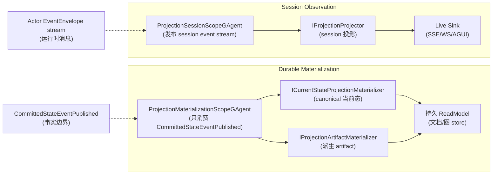

# ★ 两条投影主链:Durable Materialization vs Session Observation

## 关键代码(事实源,以 ~/Code/aevatar 为准)

- `src/Aevatar.CQRS.Projection.Core/README.md` 第 3-8 行:两条主链;第 8 行:scope actor 是唯一运行态事实源;第 12-27 行:durable/session 抽象清单;第 48-56 行:关键约束。
- `src/Aevatar.CQRS.Projection.Core/Orchestration/ProjectionScopeGAgentBase.cs` 第 13-238 行:scope actor 基类(`[EventHandler] EnsureProjectionScopeCommand` 第 45 行/`ReleaseProjectionScopeCommand` 第 73 行/`[AllEventHandler] EventEnvelope` 第 108 行/observation relay 第 201-221 行)。
- `src/Aevatar.CQRS.Projection.Core/Orchestration/ProjectionMaterializationScopeGAgentBase.cs` 第 6-68 行:`RuntimeMode = DurableMaterialization`(第 10-11 行);`ProcessObservationCoreAsync` 只接受 `CommittedStateEventPublished`(第 24-38 行);`ProjectionScopeDispatchExecutor.ExecuteMaterializersAsync`(第 46-51 行)。
- `src/Aevatar.CQRS.Projection.Core/Orchestration/ProjectionSessionScopeGAgentBase.cs` 第 6-57 行:`RuntimeMode = SessionObservation`(第 10-11 行);`ExecuteProjectorsAsync`(第 35-39 行)。
- `src/Aevatar.CQRS.Projection.Core/Orchestration/ProjectionScopeActivationService.cs` 第 7-108 行:host 薄适配(`EnsureAsync` 第 62-73 行;第 48-52 行:observation binder 不能激活 projection)。
- `src/Aevatar.CQRS.Projection.Core/Orchestration/ProjectionScopeReleaseService.cs` 第 5-48 行:`ReleaseIfIdleAsync`。
- `src/Aevatar.CQRS.Projection.Core/Orchestration/ProjectionScopeActorRuntime.cs` 第 8-121 行:统一 dispatch/replay/observation 入口;self-heal 第 49-89 行。
- `src/Aevatar.CQRS.Projection.Core.Abstractions/Abstractions/Pipeline/IProjectionMaterializerKinds.cs` 第 8 行:current-state;第 18 行:artifact;`ProjectionRuntimeMode.cs` 第 3-7 行:`DurableMaterialization=0`/`SessionObservation=1`。
- `src/Aevatar.CQRS.Projection.Core/Orchestration/CommittedStateProjectionActivationHook.cs` 第 14-92 行:committed-state 边界激活(非 command 路径;`BeforePublishAsync` 第 33 行)。

---

## 两条主链

`src/Aevatar.CQRS.Projection.Core/README.md` 第 3-8 行:当前框架只保留**两条主链**:

| 主链 | RuntimeMode | 消费什么 | 产出什么 |
|---|---|---|---|
| **Durable Materialization** | `DurableMaterialization`(`ProjectionRuntimeMode.cs:4`) | 只消费 **committed observation**(`CommittedStateEventPublished`,`ProjectionMaterializationScopeGAgentBase.cs:24-38`) | 持久 ReadModel(文档/图) |
| **Session Observation** | `SessionObservation`(`ProjectionRuntimeMode.cs:5`) | 发布 **session event stream**(不做生命周期事实) | 实时输出(SSE/WS/AGUI live sink) |

**两者都以 scope actor 为唯一运行态事实源**(README 第 8 行),host 侧只留薄适配。

---

## scope actor 是唯一运行态事实源

scope actor(`ProjectionScopeGAgentBase.cs` 第 13-238 行)持有:
- 存在性/水位/失败/release 状态(README 第 48-56 行关键约束)
- observation relay upsert/remove(第 201-221 行)

**禁止**host 侧保留 `actorId→runtime` 注册表(README 第 48-56 行)。`ProjectionScopeActivationService`(第 7-108 行)是 host 薄适配:`EnsureAsync`(第 62-73 行)dispatch `EnsureProjectionScopeCommand` 并等 observation relay;注释(第 48-52 行)强调 observation binder **不能**激活 projection。

**durable 激活只经 committed-state 边界**:`CommittedStateProjectionActivationHook`(第 14-92 行)`BeforePublishAsync`(第 33 行)—— 不是 command 路径(command 路径激活 projection 被禁止)。

---

## 两种 materializer

`IProjectionMaterializerKinds.cs`:
- **current-state**(第 8 行,`ICurrentStateProjectionMaterializer`):canonical 当前态副本,**不得依赖读前一个文档**(第 4-7 行)
- **artifact**(第 18 行,`IProjectionArtifactMaterializer`):派生非权威输出(第 13-17 行)

helper:`MappedCurrentStateProjectionMaterializer`(centralize committed-state unpack + upsert)。

---

## 并列对比

> **关键区分**:Durable 只消费 committed 事实;Session 消费运行时消息流(可含未提交)。Session **不做生命周期事实**(live sink 不当事实源)。

---

## 验收

1. 两条主链分别消费什么?(Durable:committed observation;Session:session event stream)
2. scope actor 持有什么?(存在性/水位/失败/release —— 唯一运行态事实源)
3. durable 激活经哪条路径?(committed-state hook,非 command 路径)
4. live sink 是事实源吗?(不是,Session Observation 不做生命周期事实)

⟦AI:AUTO-LOOP⟧
