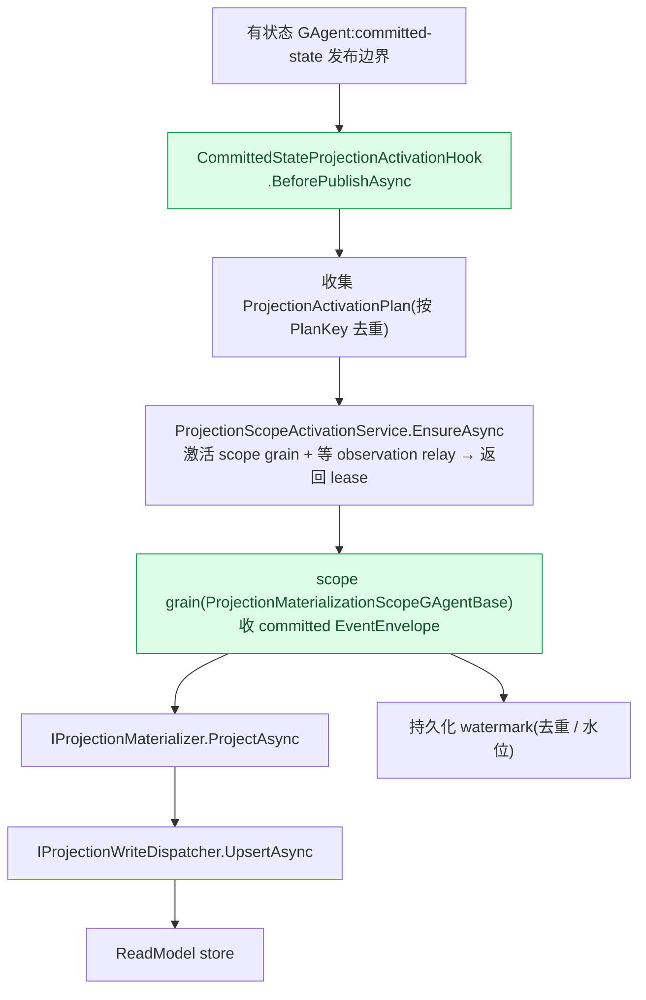
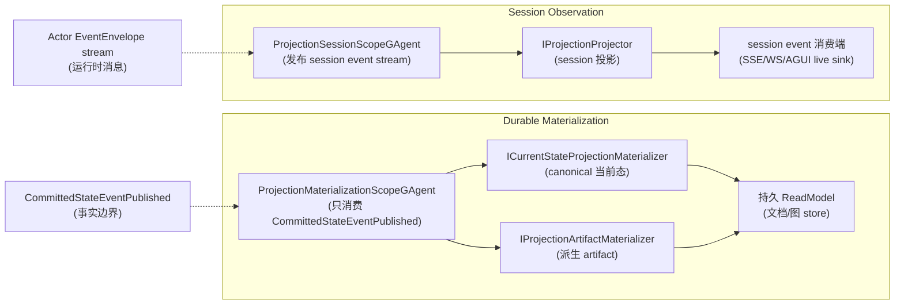

# ★ 两条投影主链:Durable Materialization vs Session Observation

## 本篇涉及的设计抽象

> 以下论断均可回指 `~/Code/aevatar` 源码验证,但本篇用设计语言描述,不贴文件路径/行号。

---

## 两条主链

当前框架只保留**两条主链**:

| 主链 | RuntimeMode | 消费什么 | 产出什么 |
|---|---|---|---|
| **Durable Materialization** | `ProjectionRuntimeMode.DurableMaterialization` | 只消费 **committed observation**(`CommittedStateEventPublished`,经 `ProjectionMaterializationScopeGAgentBase`) | 持久 ReadModel(文档 / 图) |
| **Session Observation** | `ProjectionRuntimeMode.SessionObservation` | **session event stream**(经 `ProjectionSessionScopeGAgentBase`,可含未提交) | 实时输出(SSE/WS/AGUI) |

两者都以 **scope actor 为唯一运行态事实源**,host 侧只留薄适配。

---

## scope actor 是唯一运行态事实源

scope actor(`ProjectionScopeGAgentBase`,它本身就是一个事件溯源 actor)持有:

- 存在性 / 水位(watermark)/ 失败 / release 状态
- observation relay 的 upsert / remove

**禁止** host 侧保留 `actorId→runtime` 注册表。`ProjectionScopeActivationService` 只是 host 薄适配:`EnsureAsync` dispatch `EnsureProjectionScopeCommand` 并等 observation relay;observation binder **不能**激活 projection。

**durable 激活只经 committed-state 边界**:`CommittedStateProjectionActivationHook.BeforePublishAsync`,而**不是** command 路径(command 路径激活 projection 被明令禁止)。完整的 durable 激活 + 物化链:

---

## 两种 materializer

- **current-state**(`ICurrentStateProjectionMaterializer`):canonical 当前态副本,**不得依赖读前一个文档**
- **artifact**(`IProjectionArtifactMaterializer`):派生非权威输出
- helper:`MappedCurrentStateProjectionMaterializer`(集中 committed-state unpack + upsert)

---

## 并列对比

> **关键区分**:Durable 只消费 committed 事实;Session 消费运行时消息流(可含未提交)。Session **不做生命周期事实**(live sink 不当事实源)。

---

## 三个易踩的术语 / 边界

- **"LiveSink" 不是一个类型**。源码里没有 `LiveSink`/`ILiveSink` 类型,它只是 `AttachLiveSinkAsync` / `LiveSinkLease` 这类**方法名片段**。真正可 grep 的抽象是 `IEventSinkProjectionLifecyclePort`(attach/detach/release 生命周期)+ `IProjectionSessionEventHub`(按 `RootActorId+SessionId` 的 pub/sub fan-out)。读到"live sink"时,脑子里替换成这两个名字。
- **投影并发不是单线程**。Durable 侧用的是 **OCC-retry**:`EventStoreOptimisticConcurrencyException` 触发"丢弃 pending → 从 EventStore replay → 重试",靠乐观并发重试收敛,而不是用进程内锁串成单线程。
- **自愈旁路 + 幂等缺口**:scope 激活遇到 stale actor-kind 时会 destroy+recreate(self-heal);但跨 commit 的**首次并发激活幂等目前是 best-effort**(`EnsureExistsAsync` 的 check-then-create 有 TOCTOU 窗口),已登记 [08/04 P0-4](../08/04-todo-list.md)。

---

## 验收

1. 两条主链分别消费什么?(Durable:committed observation;Session:session event stream)
2. scope actor 持有什么?(存在性 / 水位 / 失败 / release——唯一运行态事实源)
3. durable 激活经哪条路径?(committed-state hook,非 command 路径)
4. "live sink" 是类型吗?(不是;是方法名片段,真实抽象是 `IEventSinkProjectionLifecyclePort` + `IProjectionSessionEventHub`)

⟦AI:AUTO-LOOP⟧
