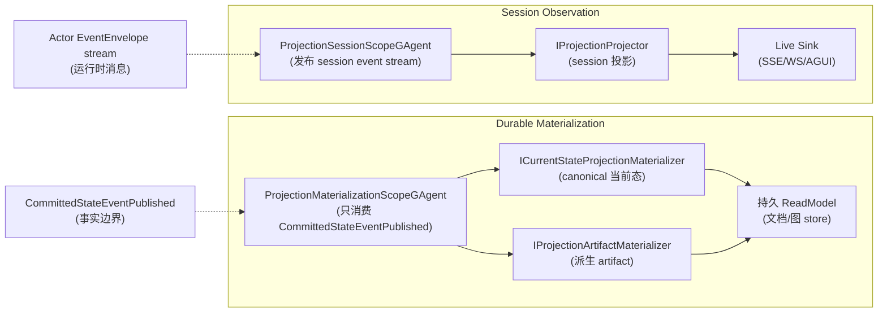

# ★ 两条投影主链:Durable Materialization vs Session Observation

## 本篇涉及的设计抽象

> 以下论断均可回指 `~/Code/aevatar` 源码验证,但本篇用设计语言描述,不贴文件路径/行号。

---

## 两条主链

`src/Aevatar.CQRS.Projection.Core/README.md` :当前框架只保留**两条主链**:

| 主链 | RuntimeMode | 消费什么 | 产出什么 |
|---|---|---|---|
| **Durable Materialization** | `DurableMaterialization`(`ProjectionRuntimeMode`) | 只消费 **committed observation**(`CommittedStateEventPublished`,`ProjectionMaterializationScopeGAgentBase`) | 持久 ReadModel(文档/图) |
| **Session Observation** | `SessionObservation`(`ProjectionRuntimeMode`) | 发布 **session event stream**(不做生命周期事实) | 实时输出(SSE/WS/AGUI live sink) |

**两者都以 scope actor 为唯一运行态事实源**(README ),host 侧只留薄适配。

---

## scope actor 是唯一运行态事实源

scope actor(`ProjectionScopeGAgentBase` )持有:
- 存在性/水位/失败/release 状态(README 关键约束)
- observation relay upsert/remove()

**禁止**host 侧保留 `actorId→runtime` 注册表(README )。`ProjectionScopeActivationService`()是 host 薄适配:`EnsureAsync`()dispatch `EnsureProjectionScopeCommand` 并等 observation relay;注释()强调 observation binder **不能**激活 projection。

**durable 激活只经 committed-state 边界**:`CommittedStateProjectionActivationHook`()`BeforePublishAsync`()—— 不是 command 路径(command 路径激活 projection 被禁止)。

---

## 两种 materializer

`IProjectionMaterializerKinds`:
- **current-state**(`ICurrentStateProjectionMaterializer`):canonical 当前态副本,**不得依赖读前一个文档**()
- **artifact**(`IProjectionArtifactMaterializer`):派生非权威输出()

helper:`MappedCurrentStateProjectionMaterializer`(centralize committed-state unpack + upsert)。

---

## 并列对比

> **关键区分**:Durable 只消费 committed 事实;Session 消费运行时消息流(可含未提交)。Session **不做生命周期事实**(live sink 不当事实源)。

---

!!! warning "设计待论证 / 已知缺口"
    CommittedStateProjectionActivationHook 自激活幂等性未确认。详见附录 TODO List(08/04)。

## 验收

1. 两条主链分别消费什么?(Durable:committed observation;Session:session event stream)
2. scope actor 持有什么?(存在性/水位/失败/release —— 唯一运行态事实源)
3. durable 激活经哪条路径?(committed-state hook,非 command 路径)
4. live sink 是事实源吗?(不是,Session Observation 不做生命周期事实)

⟦AI:AUTO-LOOP⟧
