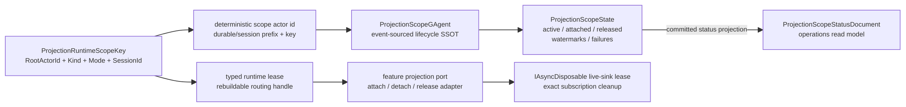
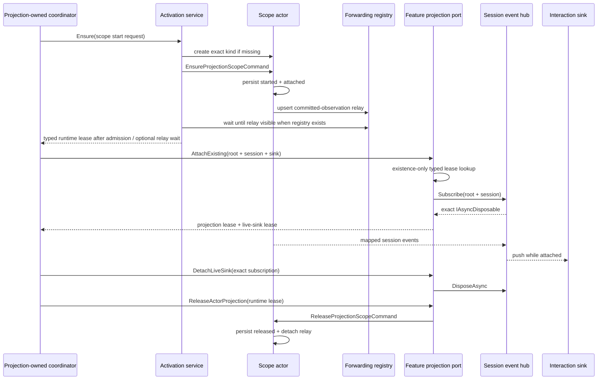

# Projection lifecycle 与 lease：scope actor 拥有状态，handle 只负责清理

> 版本与结论：本章描述 `current`。Aevatar 把每个 projection scope 建模为 deterministic identity 的 event-sourced actor；`active/released`、observation relay、水位与失败队列都属于该 actor。`ProjectionRuntimeLease` 只是由 scope key 重建的 typed handle，live sink attach 另返回 exact `IAsyncDisposable` subscription handle。Host 不保存 `actorId → context/runtime/subscription` 长期注册表；activate、attach、detach、release 与 failure replay 都通过明确端口完成。

## 设计抽象与事实源

- `src/Aevatar.CQRS.Projection.Core/Orchestration/ProjectionScopeGAgentBase.cs:14`、`:45`、`:73`、`:98`：scope actor 持久化 start/release/attachment/watermark/failure lifecycle。
- `src/Aevatar.CQRS.Projection.Core/Orchestration/ProjectionRuntimeLeaseBase.cs:3`、`:14`：runtime lease 只保留 root identity，session lease 再由 typed context 提供 routing identity。
- `src/Aevatar.CQRS.Projection.Core.Abstractions/Abstractions/Activation/ProjectionActivationPlan.cs:3`、`:9`：activation plan 只绑定一个 start request 与 exact lease type。

## 所有权图：actor state、runtime handle 与 subscription handle 分开



四个对象职责不同：

| 对象 | 包含什么 | 不包含什么 | 生命周期 owner |
|---|---|---|---|
| `ProjectionRuntimeScopeKey` | root、projection kind、mode、可选 session id | runtime object、subscription、业务 state | 调用协议值 |
| scope actor / `ProjectionScopeState` | active/released、relay attachment、global 与 per-origin watermarks、最多 64 条 failure envelope | client sink、进程内 callback、feature read model 内容 | projection scope actor |
| typed runtime lease | root identity，必要时携 typed materialization/session context | ownership、lock、ref-count、durability guarantee | 调用方暂持 handle |
| live sink lease | hub `SubscribeAsync` 返回的 exact subscription | projection actor state、read-model version | attach 调用方负责 dispose |

`ProjectionScopeStatusDocument` 是这里唯一新增命名的 read model：authoritative owner 是 scope actor，version 来自 scope actor 的 committed `StateEvent.Version`，消费者是 watermark gate 与 operations/status query ports。它只读 materialized status，不通过 event-store replay 恢复 scope。

## Deterministic identity 代替进程注册表

scope actor id 由 key 机械生成：

```text
projection.durable.scope:<projectionKind>:<rootActorId>[:<sessionId>]
projection.session.scope:<projectionKind>:<rootActorId>[:<sessionId>]
```

这让任一进程都能从 typed request 重建同一个 address。activation service 用 key 检查/创建 exact actor kind并发送 `EnsureProjectionScopeCommand`；attach-existing lookup 只用同一个 id 做 runtime existence check，然后通过纯 factory 重建 context 与 lease。scope actor 每次处理 observation 时也从自己的 persisted key 调用 context factory，而不是查 singleton dictionary。

旧式 `ConcurrentDictionary<actorId, context/subscription>` 会制造三个问题：进程重启即丢、集群节点之间不一致、release 时难以知道该删哪一个 callback。当前模型把跨进程事实交给 scope actor，把可重建寻址交给 key/lease，把进程内资源清理交给 exact `IAsyncDisposable`。没有哪一个 handle冒充 SSOT。

## activate、attach、observe、detach、release 的顺序



### Activate / ensure

`EnsureAsync` 做四件事：从 request 建 typed context/key；确保 deterministic actor 存在且 kind 正确；向 actor dispatch ensure command；在配置了 forwarding registry 时最多等待 10 秒，直到 relay target 可见。kind 不匹配时 runtime 会 destroy 旧 actor、best-effort reset stream pub/sub，再以 expected kind 重建。没有 forwarding registry 时，方法在 ensure command 获得 runtime/inbox admission 后就返回；此时 lease 只证明可寻址，不证明 scope command 已 handled 或 relay 已 ready。

scope actor 收到 ensure 时，如果从未 active 或已经 released，就提交新的 `ProjectionScopeStartedEvent`，把 `Released` 重置为 false；随后 upsert relay 并提交 `ObservationAttached=true`。因此 ensure 是幂等 reopen protocol，不是返回一个进程内 singleton。

### Attach existing

feature-facing port 不暴露通用 ensure。Workflow interaction 先由 projection-owned preparation 创建 session scope，observation binder 随后只 `AttachExistingActorProjectionAsync`：cold/missing scope 返回 unavailable，不在 binder 内创建 actor。attach 返回两个 handle：runtime projection lease 与 exact live subscription lease，调用方必须同时保留。

### Detach before release

正常 Workflow cleanup 依次 dispose exact live subscription、执行可选 detached callback、向 scope actor发送 release，最后 complete/dispose sink。先 detach 可避免 release 期间继续把 event 推给该 callback；即使某一步失败，`DetachReleaseAndDisposeAsync` 仍尝试后续清理并最终重抛首个异常。

### Release / reopen

release 不 destroy scope actor。actor 提交 `Released=true`、`ObservationAttached=false`，移除 root stream relay；之后 observation 与 replay handlers都直接返回。未来同一 key 再 ensure 时可以提交新 started event并重建 relay，保留同一个 deterministic actor history。

## 失败不是丢掉：保留 envelope，再显式 replay

一个 observation 会依次尝试所有已注册 materializer/projector；单个 handler 失败不阻断 sibling，最后以 aggregate exception 汇总。scope actor 的失败规则是：

1. payload normalization 或 projection execution 失败时，把 stage、event id/type、source version、reason 与 envelope clone 提交进自己的 failure state；默认只保留最新 64 条。
2. alert sink 是附加通知；alert 发布失败只记 warning，不覆盖 failure ledger。
3. deterministic/non-OCC projection failure 在记录后由 scope handler吞掉，避免持续打爆 stream delivery；OCC（含 aggregate 内的 OCC）会 discard stale pending scope events并向上传播，让 runtime retry。
4. admin replay 只对现存且 active、未 released、确有 failure 的 scope生效；`maxItems` 至少为 1。
5. replay 使用 failure 中保留的 exact envelope，并显式绕过 session successful-version fence；成功后移除原 failure。再次失败时，projection execution 会先记录一条新的 failure，随后原 failure 的 attempts/reason 也被更新。

这不是完整 event-log replay，也不是 query repair。failure replay 只重试已被 scope actor明确记录的失败输入；retention 超过 64 条会丢最旧记录，所以 operations 必须监控 failure count/alerts，不能把有限队列描述成无限恢复保证。

## 当前 lifecycle 限制

!!! warning "`ReleaseIfIdleAsync` 当前没有 idle/ref-count 判定"

    核心实现只检查 scope actor 是否存在，随后直接 dispatch release command；它不统计同一 scope 上还有多少 live sink。名称中的 `IfIdle` 不是已实现的引用计数保证。当前 Workflow 一次 session持有一组 projection/subscription handle，并按 detach → release 顺序清理；若未来允许多个独立消费者共享同一 session scope，必须先增加 actor-owned reference/ownership protocol，不能直接复用现状。

!!! warning "attach-existing 只检查存在性"

    typed lookup 调用 `IActorRuntime.ExistsAsync`，不读取 scope 的 `Active/Released` 状态。release 不销毁 actor，所以理论上 released scope 仍可返回 lease并成功订阅 hub，但 scope 已移除 relay，不会继续生产事件，形成静默空订阅。正常 coordinator 会先 ensure/reopen再 attach；通用 feature port 若接受任意 existing key，则需要 active-state-aware lookup 或 attach handshake。两项限制留待 `12/05-open-gaps-and-canon-drift.md` 登记。

!!! warning "失败 replay 会生成新的 failure 记录"

    replay 复用正常 dispatch 路径；若 projector 再次失败，该路径会提交新的 `ProjectionScopeDispatchFailedEvent`，然后 replay tracker 才给原记录增加一次 attempt。连续失败会同时保留旧记录和新记录，并受 64 条 retention 上限裁剪，不是单条记录的原地 retry。需要避免队列放大时，应让 replay dispatch 区分“首次记录”和“已有 failure 重试”，或按 source event identity 合并；当前运维只能结合 alert/failure count限速并观察。该缺口同样留待 `12/05-open-gaps-and-canon-drift.md`。

## 最小静态示例

> Demo status：`verified-static`（按冻结 scope key/id、activation/lookup/release services、Workflow cleanup 与 core tests 静态核对；未启动真实 actor runtime、未测 relay readiness timeout，也未并发 attach 多个 sink。）

```yaml
start_request:
  root_actor_id: run-alpha
  projection_kind: workflow-execution-session
  mode: SessionObservation
  session_id: cmd-alpha
derived_scope_actor_id: >-
  projection.session.scope:workflow-execution-session:run-alpha:cmd-alpha
handles:
  projection_lease:
    context: { root_actor_id: run-alpha, session_id: cmd-alpha }
  live_sink_lease: exact-subscription-handle
cleanup:
  - dispose: exact-subscription-handle
  - release: projection_lease
  - complete_and_dispose: interaction-sink
```

静态预期：重复 ensure 定位同一个 actor，不创建 Host registry entry；attach 只订阅 `workflow-run:run-alpha:cmd-alpha` 并返回 cleanup handle；detach 不需要用 actor id反查 callback；release 让 scope停止处理并移除 relay，但 actor仍存在。再次使用同一 session key前必须 ensure/reopen，不能只凭 existence attach。

## 为什么是它，不是别的

**为什么 lifecycle state 放在 actor，而不是 singleton manager？** active/released、failure 与 watermark 要跨 turn、进程和节点恢复。scope actor 已提供串行 mailbox 与 event sourcing；singleton map只能提供进程内缓存，无法成为权威账本。

**为什么 lease 是小 handle，而不是 runtime object？** runtime object无法安全跨节点保存，也会诱使调用方绕过 actor protocol直接改状态。key + typed context足够重建寻址，实际生命周期命令仍发给 actor。

**为什么 attach 返回 exact `IAsyncDisposable`？** 一个 scope可能出现多个订阅，按 actor id反查会误删或泄漏 callback。把 cleanup capability交给创建订阅的调用方，可按资源获取的逆序确定释放。

**为什么 failure envelope 存在 scope actor里？** 只写日志无法确定哪条输入尚未成功，也无法做受控 replay。保存 bounded exact envelope让恢复有证据；上限 64 避免一个坏 projector无限膨胀 actor state。

## 边界与演进

- scope key 是 routing identity，不是业务 resource authorization；外部调用方不能仅因知道 deterministic id就获得 attach/replay/release 权限。
- durable 与 session使用不同 actor-id prefix，避免同 root/kind 的生命周期状态互相覆盖；session id为空时仍必须由具体 contract证明该 scope合法。
- global `LastSuccessfulVersion` 是 operations摘要；session dedup 使用 `LastSuccessfulVersionsByActor`。跨 actor版本不可比较，不能用全局 max替代 per-origin fence。
- attach-existing 当前不验证 active/released，release 当前不做 ref-count；在这些协议补齐前，不支持多个不协调 owner共享同一 session scope。
- failed replay 会新增 failure并更新旧 failure，可能加速触发 bounded retention；failure count不是“唯一失败事件数”。
- stale actor-kind self-heal 会 destroy/recreate scope actor；pub/sub reset失败被 best-effort吞掉。recreate成功不等于旧 failure/watermark已迁移，运维必须把 kind migration视为显式演进。
- scope status query 只读 `ProjectionScopeStatusDocument`，released/inactive 返回无 watermark。查询不得为“拿到最新状态”而 ensure/reopen scope。
- read-model store 的 monotonic write与 rebuild见 [ReadModel store、versioning 与 rebuild](04-readmodel-stores-versioning-and-rebuild.md)。

## 读完应能回答

1. scope actor、runtime lease 与 live sink lease分别拥有哪部分生命周期事实？
2. 为什么 deterministic scope key 可以替代 `actorId → context/subscription` 长期注册表？
3. activate、attach、detach、release 的正确顺序是什么，release 后 actor是否被删除？
4. projector 失败怎样被保留、告警和 replay，为什么这不等于全量 event-log replay？
5. `ReleaseIfIdleAsync` 与 attach-existing 在冻结实现中各缺少什么保证？

<details>
<summary>论断—证据映射</summary>

| 论断 | 等级 | 证据 |
|---|---|---|
| scope actor 持 start/release/attachment/watermark/failure state，released 后停止 observation/replay | E1 | `src/Aevatar.CQRS.Projection.Core/Orchestration/ProjectionScopeGAgentBase.cs:24`、`:45`、`:73`、`:98`、`:112` |
| scope id 由 mode-specific prefix 与 root/kind/session key机械生成 | E1 | `src/Aevatar.CQRS.Projection.Core/Orchestration/ProjectionScopeActorId.cs:3`、`:8` |
| activation 创建/校验 exact actor kind、dispatch ensure；有 registry时等待 relay readiness，无 registry时不作 readiness readback | E1 | `src/Aevatar.CQRS.Projection.Core/Orchestration/ProjectionScopeActivationService.cs:44`、`:62`、`:78`；`src/Aevatar.CQRS.Projection.Core/Orchestration/ProjectionScopeActorRuntime.cs:34` |
| typed attach-existing lookup 只检查 deterministic actor existence并重建 lease，不 create/dispatch | E1 | `src/Aevatar.CQRS.Projection.Core/Orchestration/ProjectionScopeAttachExistingLeaseLookup.cs:22`、`:32`、`:39` |
| live attach返回 exact subscription lease，detach dispose该 handle，不维护 hidden registry | E1 | `src/Aevatar.CQRS.Projection.Core/Orchestration/EventSinkProjectionLifecyclePortBase.cs:35`、`:54`、`:62` |
| release service 只做 existence check后直接 dispatch release，没有 ref-count/idle read | E1 | `src/Aevatar.CQRS.Projection.Core/Orchestration/ProjectionScopeReleaseService.cs:28`、`:33`、`:37` |
| shared cleanup按 detach、optional callback、release、complete/dispose sink编排；Workflow target持有两类 handle | E1 | `src/Aevatar.CQRS.Core.Abstractions/Streaming/EventSinkProjectionLeaseOrchestrator.cs:71`；`src/workflow/Aevatar.Workflow.Application/Runs/WorkflowRunCommandTarget.cs:65`、`:145` |
| failure state保留 exact envelope，默认上限 64，replay绕过成功水位并记录结果 | E1 | `src/Aevatar.CQRS.Projection.Core/Orchestration/ProjectionScopeFailureTracker.cs:24`、`:62`；`src/Aevatar.CQRS.Projection.Core/Orchestration/ProjectionFailureRetentionPolicy.cs:5` |
| OCC向上传播，deterministic projection failure记录后吞掉 | E1 | `src/Aevatar.CQRS.Projection.Core/Orchestration/ProjectionObservationFailurePolicy.cs:5`；`src/Aevatar.CQRS.Projection.Core/Orchestration/ProjectionScopeGAgentBase.cs:127` |
| scope status由 scope actor committed state物化，watermark query只读 active/non-released document | E1 | `src/Aevatar.CQRS.Projection.Core/Orchestration/ProjectionScopeStatusProjector.cs:27`、`:54`；`src/Aevatar.CQRS.Projection.Core/Orchestration/ProjectionScopeStatusQueryPort.cs:18` |

</details>
