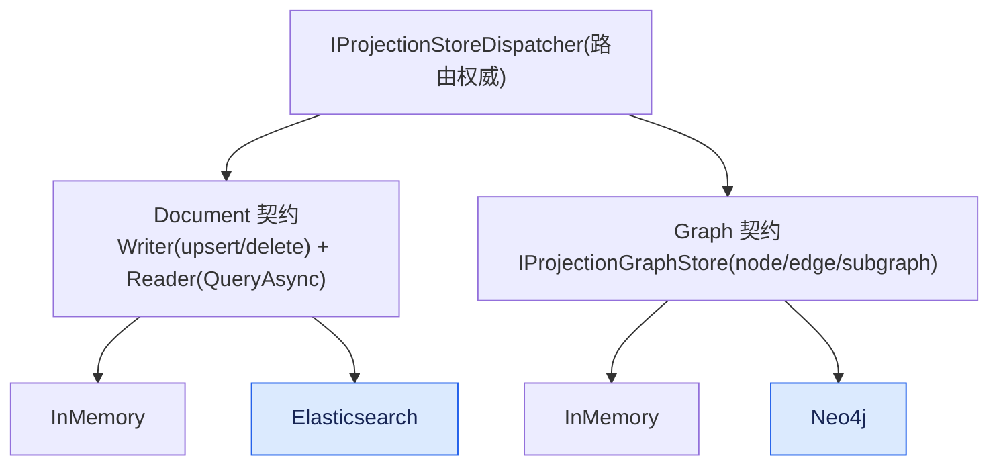
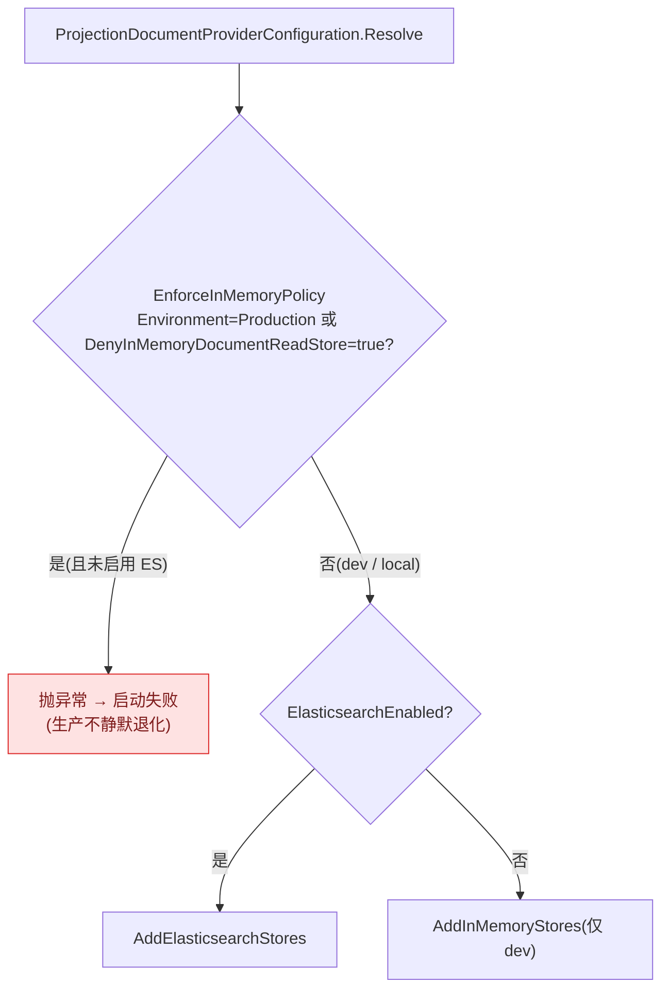

# ReadModel 存储实现:InMemory(默认) / Elasticsearch / Neo4j

## 本篇涉及的设计抽象

> 以下论断均可回指 `~/Code/aevatar` 源码验证,但本篇用设计语言描述,不贴文件路径/行号。

---

## Store 契约(并行 Document + Graph)

两套**并行**契约,store 层自身无 router/fanout 逻辑:

| 契约 | 操作 |
|---|---|
| `IProjectionDocumentWriter<TReadModel>` | upsert / delete |
| `IProjectionDocumentReader<TReadModel,TKey>` | 读(`QueryAsync`) |
| `IProjectionGraphStore` | ReplaceOwnerGraph / UpsertNode / UpsertEdge / Delete / List / Neighbors / Subgraph |

`IProjectionStoreDispatcher`(`ProjectionStoreDispatcher`)是路由权威。

> 别把它们当成"三个文档库":**文档读模型 = {InMemory, Elasticsearch};图读模型 = {InMemory, Neo4j}**。Neo4j 是图存储(走 Cypher),不是"另一个文档库",所以它和 ES 不在同一条契约线上。

---

## 三个 Provider

| Provider | 类型 | 用途 |
|---|---|---|
| **InMemory** | Document + Graph | dev/test(进程内 `Dictionary`,重启即丢) |
| **Elasticsearch** | Document only | 生产文档存储;schema-drift 权威 = augmented mapping fingerprint + alias 生命周期 |
| **Neo4j** | Graph only | 生产图存储(Uri / Username / Password / Database / MaxTraversalDepth) |

> ⚠️ **StateMirror 已移除**:目录 `Aevatar.CQRS.Projection.StateMirror/` 只剩 `bin/`/`obj/`(commit `da7944cf2`)。不再是活跃 provider。

---

## 生产怎么换(prod 会 fail-fast,不会静默退化)

`MainnetAgentProjectionDocumentStoresExtensions` 读 `ProjectionDocumentProviderConfiguration.Resolve(...)`,分支:`ElasticsearchEnabled` → `AddElasticsearchStores`;否则 → `AddInMemoryStores`。

**但生产 profile 不会"静默退化到内存"** —— 这是一个值得澄清的安全点:

`Resolve` 里的 `EnforceInMemoryPolicy` 在 `Projection:Policies:Environment=Production` 或 `DenyInMemoryDocumentReadStore=true` 时**直接抛异常**;Mainnet 的 `appsettings.Distributed.json` 两个都设了。所以**误配 ES 的生产环境会"启动即失败"**,而不是悄悄用内存读模型。静默回退 InMemory 只发生在 dev/local(没设这两个开关时)。

> 这订正了曾经担心的"生产静默退化成内存读模型"风险([08/04 P2-5](../08/04-todo-list.md)):Mainnet 档位其实**已经是 fail-fast**。本地用 `docker-compose.projection-providers.yml` 起 ES + Neo4j。

---

## 验收

1. 三个 ReadModel provider?(InMemory dev/test、Elasticsearch 文档、Neo4j 图)
2. ES 和 Neo4j 是一类吗?(不是;文档 = {InMemory, ES},图 = {InMemory, Neo4j})
3. 生产误配 ES 会怎样?(fail-fast 启动失败,不静默退化;由 `EnforceInMemoryPolicy` 守)
4. StateMirror 还在吗?(已移除,只剩 build artifact)

⟦AI:AUTO-LOOP⟧
