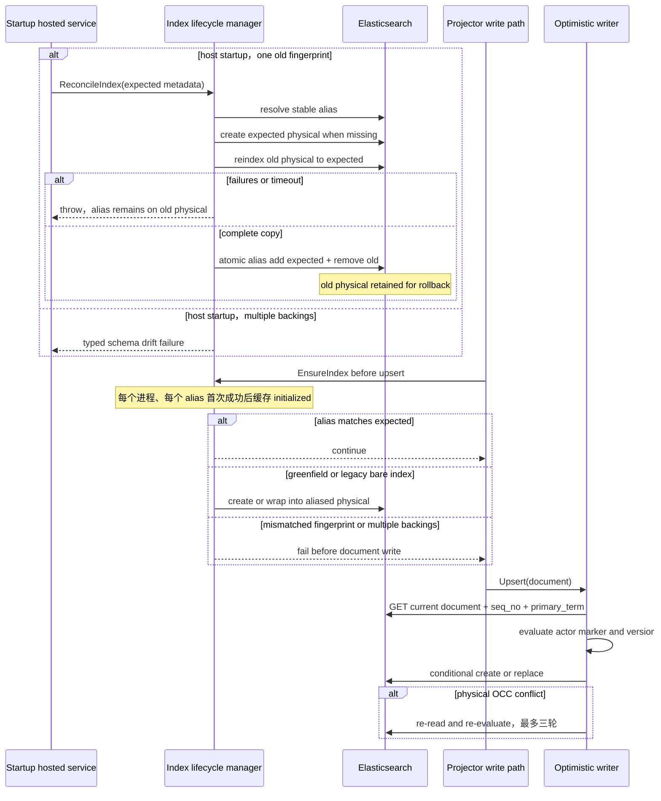

# ReadModel store、versioning 与 rebuild：副本可覆盖，修复必须显式

> 版本与结论：本章描述 `mixed`。当前通用 store 已用 actor-local `StateVersion`、`ActorId` 与 `LastEventId` 阻止旧版本和异源写入覆盖新副本，Elasticsearch 也有 fingerprinted physical index、stable alias、启动期 reconcile 与 optimistic concurrency。当前 DR rebuild 则只落地了少数显式入口，其中完整 E1 闭环是 `ExternalIdentityBindingGAgent` 的 current-state re-publication；它不是任意 read model 的通用 replay 服务，更不能由 query 暗中触发。

## 设计抽象与事实源

- `src/Aevatar.CQRS.Projection.Stores.Abstractions/Abstractions/ReadModels/ProjectionWriteResult.cs:3`、`:12`、`:16`：定义 applied、duplicate、stale、gap、conflict 的 store 写入结果协议。
- `src/Aevatar.CQRS.Projection.Providers.Elasticsearch/Stores/ElasticsearchIndexLifecycleManager.cs:87`、`:151`、`:206`、`:524`：alias consistency、请求路径 fail-closed、启动期 reindex 与完整性检查的 current 实现。
- `docs/adr/0040-current-state-readmodel-dr-rebuild.md:9`、`:36`、`:56`：current-state 副本丢失场景、accepted re-publication 决策及其 audit consumer 限制。

## 所有权图：store 保存副本，不接管事实

```mermaid
%%{init: {"maxTextSize": 100000, "flowchart": {"useMaxWidth": false, "nodeSpacing": 12, "rankSpacing": 48}, "themeVariables": {"fontSize": "10px"}}}%%
flowchart LR
    A["authoritative GAgent<br/>actor-local event sequence + state"]
    E["CommittedStateEventPublished<br/>StateEvent.Version + StateRoot"]
    M["current-state materializer<br/>consumer-specific covering document"]
    D["IProjectionWriteDispatcher<br/>exactly one enabled sink"]
    V["write evaluator<br/>ActorId + StateVersion + LastEventId"]
    I["InMemory store<br/>dev process-local dictionary"]
    X["Elasticsearch stable alias<br/>external durable read store"]
    P["physical index<br/>alias-v{mapping fingerprint}"]
    Q["typed query port<br/>read-model-only consumer"]
    S["declared metadata + protobuf descriptor<br/>schema lifecycle input"]
    A -->|"commit 后发布"| E --> M --> D --> V
    V --> I --> Q
    V --> X --> P --> Q
    S -->|"normalize + augment + fingerprint"| P
```



这条链只有一个业务事实 owner：actor。Elasticsearch 的 `_seq_no` / `_primary_term` 只保护一次物理条件写，mapping fingerprint 只标识声明式索引形状，`UpdatedAt` 只供展示与排序；它们都不能替代 actor 的 committed `StateVersion`。query port 只消费已经物化的副本，不能因副本缺失就激活 actor、回放 EventStore 或重建索引。

当前 dispatcher 还强制一个 read-model type 只能有一个 enabled sink。InMemory 与 Elasticsearch 是部署时二选一，不是双写、主备或自动迁移关系；这避免同一查询模型同时出现两个互相争夺权威的 store。

## state owner、read model 与稳定消费者

| Read model | authoritative owner | committed version 来源 | 稳定消费者 | query port |
|---|---|---|---|---|
| `WorkflowExecutionCurrentStateDocument` | 对应 `WorkflowRunGAgent` | 该 run actor 的 `StateEvent.Version` | Workflow observatory、run finalize、fork seed 与 execution query | `IWorkflowExecutionCurrentStateQueryPort` |
| `WorkflowCatalogCurrentStateDocument` | 对应 `WorkflowDefinitionGAgent` | 该 definition actor 的 `StateEvent.Version` | `aevatar_list_workflow_templates`、`aevatar_get_workflow_template` 与 capability inventory | `WorkflowCatalogReadModelQueryPort` / `IWorkflowCatalogPort` |
| `ExternalIdentityBindingDocument` | 对应 `ExternalIdentityBindingGAgent` | 该 binding actor 的 `StateEvent.Version` | NyxID capability broker、owner-scope 授权与 Channel identity lookup | `IExternalIdentityBindingQueryPort` |

表中的 version 都只在各自 actor 内单调。两个 run 的 `StateVersion=42` 没有先后关系；同一个 report 若汇总多个 origin actor，也不能用一个标量冒充全局 watermark。store 的 monotonic rule 只对“同一个 document id、同一个 authoritative `ActorId`”成立。

`WorkflowCatalogCurrentStateDocument` 还说明 store guard 不能代替数据范围设计。冻结 projector 对非空 `ScopeId` 直接跳过，只让 global definition 进入共享 catalog；否则两个 tenant 的同名 workflow 会争用同一个 document id，甚至把 scope-owned YAML 与 system prompt 暴露给全局工具。issue `#2925` 的状态本身不是实现证据，current 结论来自冻结 projector 与回归测试。

## 写入协议：单调覆盖，不是连续消费证明

所有通用 document provider 共用一个 evaluator。它先要求 incoming `Id` 与 `ActorId` 非空，再按下面的状态表决策：

| existing 与 incoming 的关系 | disposition | 是否改写 document | 语义 |
|---|---|---|---|
| existing 不存在 | `Applied` | 是 | 首次物化或 wiped-row rebuild |
| `ActorId` 不同 | `Conflict` | 否 | 同一 key 被另一个 authority 占用 |
| incoming version 更小 | `Stale` | 否 | 延迟旧 publication |
| version 相同且 `LastEventId` 相同 | `Applied` | 是 | covering rewrite，可重放同一 marker |
| version 相同但 `LastEventId` 不同 | `Conflict` | 否 | 同一 actor/version 出现两个 identity |
| incoming version 更大 | `Applied` | 是 | 直接推进，允许从 1 跳到 4 |

这里的“幂等”不是“第二次一定返回 `Duplicate`”。同 version、同 event id 会再次覆盖整份 document并返回 `Applied`；它适合由完整 `state_root` 生成的 current-state snapshot。`Duplicate` 目前主要用于重复删除不存在的 key；`Gap` 虽然在结果 enum 中存在，但冻结通用 evaluator 不会产生它。也就是说，`StateVersion` 防回退，却不证明中间 version 全部被观察过。

这套规则还依赖两个 projector 不变量：同 marker 必须确定性地产生同一内容，且一个 document key 必须长期归属于同一个 actor。evaluator 不计算内容 hash；若同 `ActorId + StateVersion + LastEventId` 生成了不同 payload，后到内容仍会被接受覆盖。业务 projector 不能把 nondeterministic enrichment 塞进 covering snapshot，再把 store 当一致性裁判。

### InMemory 与 Elasticsearch 共享语义，物理保证不同

| 维度 | InMemory | Elasticsearch |
|---|---|---|
| 保存位置 | 进程内 `Dictionary`，lock 内 evaluate + clone | 外部 index，经 stable alias 访问 |
| 并发 | 单进程 `_gate` 串行 | 先 GET，再以 `_seq_no` / `_primary_term` 条件 PUT，冲突后最多重评估三轮 |
| 重启后数据 | 丢失 | 由 Elasticsearch 保存，但仍是可重建副本 |
| schema lifecycle | 无 | mapping fingerprint、physical index、alias reconcile |
| 适用边界 | local/dev/test | 可用于 production document read store |
| production policy | `Production` 或 deny policy 下拒绝选择 | 需显式 endpoint/config 与运维生命周期 |

Elasticsearch writer 不把 OCC conflict 等同于业务 conflict。物理 PUT 冲突后会重新 GET 当前 document，再跑同一个 version evaluator：若对手已经写入相同或更新版本，本次变成 stale/conflict/covering result；只有三轮后仍应 apply 才抛出无法 reconcile 的异常。这使 actor version 决定业务先后，ES concurrency token 只保证“比较过的那一份没有被并发偷换”。

通用 `DeleteAsync(id)` 是另一个边界：接口没有 actor/version/event marker，所以重复删除可幂等，却没有 monotonic delete protection。延迟 delete 是否允许删除当前 document，必须由 feature protocol在调用前保证；不能把 upsert 的 version 不变量外推到 delete。

## Elasticsearch schema lifecycle：alias 是门，声明式 mapping 是尺

store 会先 normalize metadata，再用 protobuf descriptor补齐 mapping。fingerprint 对 canonicalized `Mappings` 做 SHA-256 并取前 4 bytes，得到 8 位 hex suffix：

```text
stable alias:       aevatar-workflow-execution
expected physical: aevatar-workflow-execution-v<8-hex-mapping-fingerprint>
```

fingerprint 的 authority 是代码声明的 augmented mapping，不是运行中 Elasticsearch 返回的 live mapping。query/probe 不通过“读 mapping后猜兼容”来修复漂移，这让多个 pod 能从相同代码得到相同 expected physical。代价也要说清：当前 fingerprint 只覆盖 `Mappings`，不覆盖 `Settings` 或 `Aliases`；它不是所有 index metadata 的完整版本号。

### 请求路径与启动路径不是同一种 reconcile



启动期 `ReconcileWithReindexAsync` 可以把唯一旧 fingerprint 的数据复制到 expected physical，再原子换 alias并保留旧 physical；reindex 报 per-document failure 或 timeout 时不会换 alias。多个 backing 无法确定 source，直接 fail closed。请求写路径在每个进程第一次成功初始化该 alias 时拒绝普通 fingerprint mismatch，不在 projection turn 自动搬迁数据；但会处理 greenfield 和 legacy bare index 的一次性包裹。初始化成功后 manager会缓存 alias，不再于每次 upsert重查；若外部在进程存活期间改动 alias，write path本身没有持续 drift probe。

read path 在 `AutoCreateIndex=true` 时先做 consistency probe：drift 会在真正 GET/search 前抛 typed exception，probe 本身不改 alias。`AutoCreateIndex=false` 表示 operator 完全拥有 lifecycle，store 会跳过这项检查与自动 reconcile，因此不能把上述 fail-closed 保证无条件外推到所有配置。

Mainnet 的 startup hosted service逐 target reconcile，但会捕获单个 target 的异常并继续 Host 启动。准确语义是“出错 alias 继续 drift，随后其受保护 read/write path fail closed”，不是“任一索引失败就阻止整个服务启动”。此外还有两个 current 缺口：

- dynamic per-document index scope 没有单一 static alias，`ReconcileIndexAsync` 当前直接跳过；
- 若 expected physical 已经存在，startup reconcile 会直接 repoint alias，不读取 document count、完成标记或 provenance来证明该 physical 是完整副本。上一次中断留下的 partial physical 因而需要运维辨识。

## 两类 rebuild：索引搬迁与事实重物化不能混为一谈

**Schema reconcile** 在 Elasticsearch 内把已有副本文档从旧 physical 搬到新 physical。它不接触 actor，也不能补回 projection store reset 后已经消失的 row。

**Current-state re-publication** 从幸存 actor state 重新生成某一行。冻结 kernel 的 `RepublishCommittedStateAsync` 取 actor 当前 committed version，构造 deterministic `rebuild:{actorId}:{version}` event id，携当前 `state_root` 走原 committed publication trunk，但不追加 domain event。

当前完整落地 slice 是 external identity binding：

1. 重复 `CommitBindingCommand` 在已有 binding 时不追加事实，而是重发当前 binding state；
2. operator 可经 fail-closed admin authorization 的 `POST /api/oauth/nyxid-binding/rebuild` dispatch maintenance command；
3. actor 没有 active binding 时 no-op，有 binding 时以当前 version重发；
4. endpoint 的 HTTP 202 / `rebuild_pending` 只证明 command 获得 admission，不证明 actor handled、publication delivered 或 row 已可查询。

这不是通用 rebuild framework。kernel primitive 会向该 actor 的全部 `CommittedFacts` consumers 重播；带 audit translator 或其他非幂等 consumer 的 actor不能直接使用。冻结代码也没有“枚举所有丢失 row并批量重放所有 actor”的服务。accepted ADR 给出的是受约束的 DR 设计，current E1 只证明 binding slice 与 kernel primitive已经存在。

健康 row 上还有一个容易误读的细节：原始 materialization 的 `LastEventId` 通常是真实 domain event id，而 rebuild publication 使用 synthetic id。同一个 version配不同 event id会由通用 evaluator返回 `Conflict`，因此健康 row不被覆盖；wiped row因 existing 缺失可写入 synthetic marker，之后重复同一 rebuild marker才是 covering `Applied`。这能避免破坏健康副本，但当前 disposition 不是 benign `Duplicate`，且通用 mapped materializer不会自行把返回的 `Conflict` 升级成 exception。运维不能只看 command accepted或 scope无异常来断言 rebuild完成，必须 read back目标 row及其 version。

## 最小静态示例

> Demo status：`verified-static`（按冻结 evaluator、InMemory/Elasticsearch provider、index lifecycle、binding actor与 endpoint tests 静态核对；未连接真实 Elasticsearch，未执行真实 operator rebuild，也未验证多 pod 中断恢复。）

```yaml
document_key: binding:nyxid:owner-1
existing:
  actor_id: binding-actor-1
  state_version: 7
  last_event_id: evt-bound-7
cases:
  delayed_event:
    incoming: { actor_id: binding-actor-1, state_version: 6, last_event_id: evt-bound-6 }
    expected: { disposition: Stale, overwrite: false }
  repeated_original_marker:
    incoming: { actor_id: binding-actor-1, state_version: 7, last_event_id: evt-bound-7 }
    expected: { disposition: Applied, overwrite: true }
  healthy_row_rebuild_marker:
    incoming: { actor_id: binding-actor-1, state_version: 7, last_event_id: "rebuild:binding-actor-1:7" }
    expected: { disposition: Conflict, overwrite: false }
  wiped_row_rebuild_marker:
    existing: null
    incoming: { actor_id: binding-actor-1, state_version: 7, last_event_id: "rebuild:binding-actor-1:7" }
    expected: { disposition: Applied, overwrite: true }
  authoritative_skip_ahead:
    incoming: { actor_id: binding-actor-1, state_version: 10, last_event_id: evt-bound-10 }
    expected: { disposition: Applied, overwrite: true, proves_contiguous_delivery: false }
```

静态预期只覆盖 store decision。实际 repair 还要验证：actor state确实存活、projection scope/relay可用、目标 document read back成功、`ActorId` 与 `StateVersion` 匹配预期。HTTP 202、日志中的 dispatch accepted、alias swap成功，任何单项都不是 row重建完成证明。

## 为什么是它，不是别的

**为什么用 actor `StateVersion`，不用 ES `_seq_no`？** `_seq_no` 只描述某个 physical shard document 的写入历史，reindex或重建会改变它；actor version才与 authoritative fact sequence同源。ES token适合保护 compare-and-swap，不适合成为业务 watermark。

**为什么 current-state 用 covering rewrite，不要求 version连续？** `state_root` 已携完整当前状态，缺少中间 publication仍能让副本收敛到新版本。强制 `n+1` 会把可恢复的 lag变成永久 gap；需要逐事件完整性的 audit/artifact必须使用自己的 append/idempotency contract，不能借 current-state store假装得到保证。

**为什么 schema authority来自声明式 mapping与 alias，不来自 live mapping？** live mapping 是运行结果，可能已被错误修改；把它当第二真相会让不同 pod作出不同兼容判断。代码声明生成 expected fingerprint，alias只承担稳定访问与原子切换，漂移才能被明确暴露。

**为什么 repair不能藏进 query？** query没有写侧授权、actor ownership或运维意图。读请求触发 event replay、actor activation、reindex或alias swap会把流量变成不可预测的 mutation，并让一次普通 GET获得灾备权限。当前 architecture test直接禁止 query/read 文件调用 replay、rebuild或materialize。

**为什么 re-publication不用 synthetic domain event？** projection-store丢失不代表业务事实发生变化。把“请重建副本”写入 EventStore会污染 audit与业务历史；重发 current committed snapshot保留事实序列不变，同时复用既有 delivery trunk。

## 当前边界与演进

- monotonic guarantee只覆盖 upsert；delete协议没有 version fence。需要乱序删除保护时，先扩展 tombstone/conditional delete contract，不能靠调用时序猜测。
- 同 marker covering write不验证 payload hash；projector必须确定性映射。需要检测同 marker内容分叉时，应在 store contract加入稳定 content identity。
- `Gap` 是协议枚举但通用 evaluator不产生；若某 consumer必须连续处理，应在该 artifact自己的 append contract里实现，不能改变所有 current-state projection。
- `Conflict` / `Gap` 被标为 rejected，但通用 mapped materializer只 await dispatcher并忽略 result。目标 document不会被错误覆盖，然而 projection scope未必把 rejection记成 failure；需要统一 escalation或显式 result policy。
- fingerprint只覆盖 mapping；`AutoCreateIndex=false` 绕过 store-managed lifecycle，dynamic index scope绕过单一 static alias的 startup reconcile。这些模式需要各自独立、可审计的 operator lifecycle。
- startup发现 expected physical已存在时直接换 alias，缺少完成标记/来源校验；中断恢复需要 physical build provenance与可验证完成条件。
- current-state republish只适用于所有 committed-fact consumers都能按 version幂等处理的 actor；audit translator未幂等前禁止扩展。
- scope/data authorization必须在 projector与 query port完成。store只看到 document marker，无法推断 tenant visibility；global workflow catalog的 `ScopeId` guard就是这一边界。
- DR完成必须以目标 query port readback为证据。command accepted、actor handled、publication emitted、store write applied与query observed是五个不同阶段。
- committed publication、scope failure replay与 live observation边界分别见 [Committed state 与 observation](02-committed-state-and-observation.md) 和 [Projection lifecycle 与 lease](03-projection-lifecycle-and-leases.md)。

## 读完应能回答

1. `StateVersion`、ES `_seq_no` 与 mapping fingerprint分别属于哪个 owner，为什么不能互换？
2. 同 version、同 event id和同 version、不同 event id分别得到什么 disposition？version从 1 跳到 4是否允许？
3. InMemory 与 Elasticsearch共享哪些写入语义，又为什么前者不能提供 production durability？
4. 请求路径 fail-closed、启动期 schema reindex和 actor current-state re-publication各解决什么问题？
5. 为什么 HTTP 202、alias swap或rebuild publication都不能单独证明 read model已经恢复？

<details>
<summary>论断—证据映射</summary>

| 论断 | 等级 | 证据 |
|---|---|---|
| read model marker由 `Id`、`ActorId`、`StateVersion`、`LastEventId`、`UpdatedAt` 组成 | E1 | `src/Aevatar.CQRS.Projection.Stores.Abstractions/Abstractions/ReadModels/IProjectionReadModel.cs:5` |
| evaluator拒绝空 id/actor、异源与回退；同 version同 event可覆盖、不同 event冲突、更高 version可直接应用 | E1 | `src/Aevatar.CQRS.Projection.Stores.Abstractions/Abstractions/ReadModels/ProjectionWriteResultEvaluator.cs:5`、`:15`、`:18`、`:21`、`:24`、`:31` |
| InMemory 在进程 lock中 evaluate并 clone覆盖，重复缺失删除返回 Duplicate | E1 | `src/Aevatar.CQRS.Projection.Providers.InMemory/Stores/InMemoryProjectionDocumentStore.cs:40`、`:51`、`:85`、`:98` |
| provider配置要求 document store二选一，并在 Production/deny policy下禁止 InMemory | E1 | `src/Aevatar.CQRS.Projection.Providers.Elasticsearch/DependencyInjection/ProjectionDocumentProviderConfiguration.cs:18`、`:30`、`:72`、`:83` |
| dispatcher只允许一个 enabled sink；mapped current-state helper不读取 write result | E1 | `src/Aevatar.CQRS.Projection.Runtime/Runtime/ProjectionStoreDispatcher.cs:20`、`:37`、`:43`、`:58`；`src/Aevatar.CQRS.Projection.Core/Orchestration/MappedCurrentStateProjectionMaterializer.cs:68`、`:72` |
| ES writer用 evaluator决定业务顺序，以 seq_no/primary_term条件写并在 physical conflict后重评估 | E1 | `src/Aevatar.CQRS.Projection.Providers.Elasticsearch/Stores/ElasticsearchOptimisticWriter.cs:42`、`:56`、`:66`、`:74`、`:86`、`:94` |
| fingerprint只对 canonicalized mappings取 SHA-256前 4 bytes，不读 live mapping修复 | E1 | `src/Aevatar.CQRS.Projection.Providers.Elasticsearch/Stores/ElasticsearchProjectionSchemaFingerprint.cs:7`、`:20`、`:23`、`:26` |
| read path在 auto-create模式检测 drift后于查询前失败；static reconcile与 dynamic/disabled边界明确 | E1 | `src/Aevatar.CQRS.Projection.Providers.Elasticsearch/Stores/ElasticsearchProjectionDocumentStore.cs:276`、`:287`、`:291`、`:297`、`:302` |
| startup单旧 physical可 reindex后原子换 alias，multi-backing失败；reindex failure/timeout阻止 swap | E1 | `src/Aevatar.CQRS.Projection.Providers.Elasticsearch/Stores/ElasticsearchIndexLifecycleManager.cs:206`、`:214`、`:224`、`:231`、`:246`、`:524`、`:552`、`:559` |
| Mainnet startup逐 target reconcile但单项失败只记录并继续 | E1 | `src/Aevatar.Mainnet.Host.Api/Hosting/ElasticsearchProjectionIndexReconcileHostedService.cs:30`、`:38`、`:45`、`:58` |
| kernel republish使用当前 committed version与 deterministic synthetic id，不追加 event，并限制非幂等/audit consumers | E1 | `src/Aevatar.Foundation.Core/GAgentBase.TState.cs:291`、`:309`、`:318`、`:322`、`:327`、`:335` |
| binding actor提供重复 commit自愈和显式 rebuild command，operator endpoint先授权再返回 pending admission | E1 | `agents/Aevatar.GAgents.Channel.Identity/ExternalIdentityBindingGAgent.cs:104`、`:113`、`:319`、`:332`、`:352`；`agents/Aevatar.GAgents.Channel.Identity/Endpoints/IdentityOAuthEndpoints.cs:722`、`:732`、`:764` |
| global workflow catalog拒绝 scope-owned definition，回归测试验证不落 store | E1 | `src/workflow/Aevatar.Workflow.Projection/Projectors/WorkflowCatalogCurrentStateProjector.cs:61`、`:67`；`test/Aevatar.Workflow.Host.Api.Tests/WorkflowProjectionMaterializationTests.cs:218`、`:254` |
| query/read source不得调用 event replay、state rebuild或projection materialization | E1 | `test/Aevatar.Architecture.Tests/Rules/ForbiddenPatternTests.cs:12`、`:17`、`:23` |

</details>
