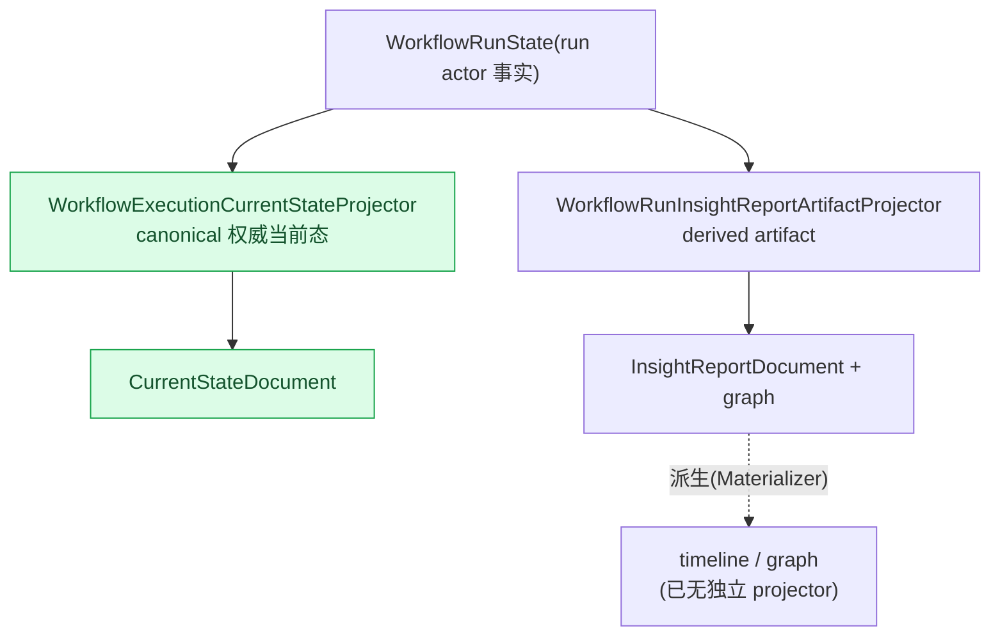
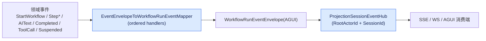

# Workflow 专属投影:CurrentState canonical + Insight/Timeline/Graph Artifact + AGUI 映射

## 本篇涉及的设计抽象

> 以下论断均可回指 `~/Code/aevatar` 源码验证,但本篇用设计语言描述,不贴文件路径/行号。

---

## canonical vs derived

workflow projection 有两类 projector:

| Projector | 类型 | 说明 |
|---|---|---|
| `WorkflowExecutionCurrentStateProjector` | **canonical current-state** | `WorkflowRunState → WorkflowExecutionCurrentStateDocument` 的权威当前态副本 |
| `WorkflowRunInsightReportArtifactProjector` | **derived artifact** | upsert InsightReport document + graph |
| `WorkflowCatalogCurrentStateProjector` | current-state | workflow binding 当前态 |
| `WorkflowActorBindingProjector` | artifact | binding artifact |

> ⚠️ **Timeline/Graph 不再有独立 projector 类**:重构(commit `416108d7a`)删掉了 `WorkflowRunTimelineArtifactProjector` / `WorkflowRunGraphArtifactProjector`(canon 文档的引用已过期)。现在 timeline/graph 从单一 `WorkflowRunInsightReportDocument` artifact **派生**(`WorkflowRunGraphArtifactMaterializer.Materialize(report)`)。

---

## AGUI 事件映射

`EventEnvelopeToWorkflowRunEventMapper` 用 ordered handlers 把领域事件映射成 AGUI `WorkflowRunEventEnvelope`:

| Handler | 领域事件 → AGUI |
|---|---|
| `StartWorkflowRunEventEnvelopeMappingHandler` | `StartWorkflowEvent` → `RunStarted` |
| `StepRequestRunEventEnvelopeMappingHandler` | → `StepStarted` + `aevatar.step.request` |
| `StepCompletedRunEventEnvelopeMappingHandler` | → `StepFinished` + `aevatar.step.completed` |
| `AITextStreamRunEventEnvelopeMappingHandler` | → `TextMessageStart/Content/End`、`MediaContent`、`ChatResponse`、`Usage` |
| `WorkflowCompletedRunEventEnvelopeMappingHandler` | → `RunFinished` / `RunError` |
| `ToolCallRunEventEnvelopeMappingHandler` | → `ToolCallStart` / `ToolCallEnd` |
| `WorkflowSuspendedRunEventEnvelopeMappingHandler` | → `aevatar.tool_approval.pending` / `aevatar.human_input.request` |

`WorkflowExecutionRunEventProjector` 是 session projector:它跑这个 mapper,并把结果 publish 到 `ProjectionSessionEventHub`(把 stream pin 到 `context.SessionId`,缺失时 fail-closed)。

---

## session event fan-out

`ProjectionSessionEventHub` 按 `RootActorId + SessionId` key 把 session 事件 fan-out 到各 live 消费端;stream id 形如 `{channel}:{rootActorId}:{sessionId}`(`PublishAsync` / `SubscribeAsync`)。

> 术语提醒:这里常说的 "live sink" **不是一个类型**,而是 `AttachLiveSinkAsync` / `LiveSinkLease` 这类方法名。真正的抽象是 `IProjectionSessionEventHub`(fan-out)+ `IEventSinkProjectionLifecyclePort`(attach/detach/release 生命周期);消费端自己持有 `IEventSink<TEvent>`。

---

## 验收

1. canonical 和 derived projector 区别?(canonical = 权威当前态副本;derived = 派生非权威输出)
2. Timeline/Graph 还有独立 projector 吗?(没有,从 `WorkflowRunInsightReportDocument` artifact 派生)
3. AGUI 映射谁做?(`EventEnvelopeToWorkflowRunEventMapper`,ordered handlers)
4. session 事件怎么 fan-out?(`ProjectionSessionEventHub`,按 `RootActorId+SessionId` key;"live sink" 是方法名,不是类型)

⟦AI:AUTO-LOOP⟧
