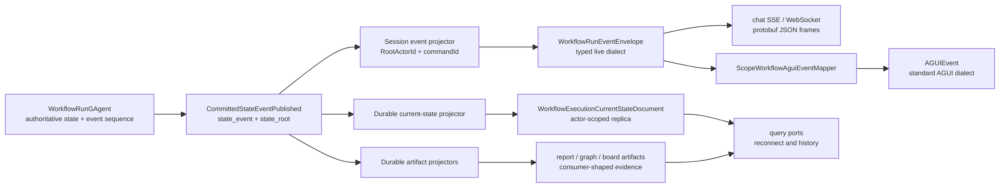
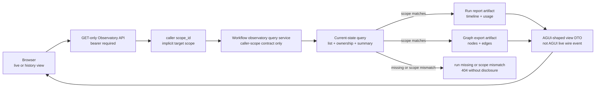
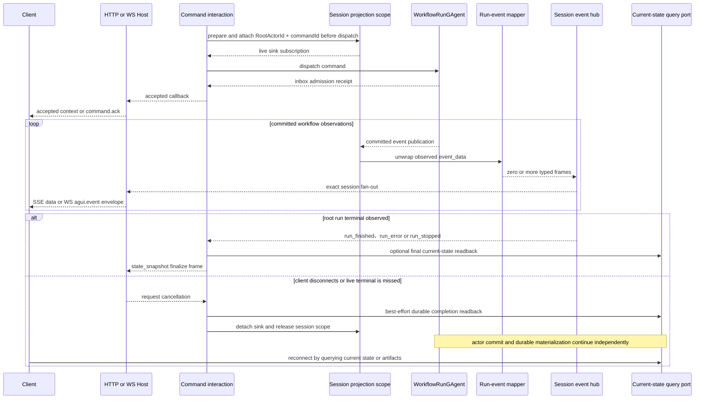

# Workflow AGUI 与 live observation：同源映射，不同持久性

> 版本与结论：本章描述 `current`。Workflow 的 committed observation 同时供 current-state replica、durable artifact 与 session event projector消费；三者共享同一输入 provenance，不共享产物形状与生命周期。当前 session projector先产出 `WorkflowRunEventEnvelope`，chat SSE/WS直接传这种方言，scoped workflow入口可再映射成标准 `AGUIEvent`。新增 Workflow Run Observatory 只组合 scope-gated current-state 与 artifact query，不接管事实、发 command 或回放 live frame。

## 设计抽象与事实源

- `src/workflow/Aevatar.Workflow.Application/Observatory/WorkflowRunObservatoryQueryService.cs:14`、`:30`、`:61`、`:96`、`:131`：`bd9975c8` 初版读服务只承载caller-scope ownership查询，并只组合current-state与artifact query ports。
- `src/workflow/Aevatar.Workflow.Infrastructure/CapabilityApi/WorkflowRunObservatoryEndpoints.cs:23`、`:41`、`:46`、`:51`：`bd9975c8` 初版页面壳与三个caller-scope GET数据入口的认证边界。
- `src/workflow/Aevatar.Workflow.Application/Observatory/WorkflowRunObservatoryTimelineMapper.cs:17`、`:44`、`:62`：committed timeline stage 到 AGUI-shaped view event、tool detail与usage展示模型的映射。

## 三种输出：事实同源，owner不同



`Aevatar.Workflow.Presentation.AGUIAdapter` 这个程序集名容易让人误会：冻结实现的核心 mapper并不直接生成 `Aevatar.AGUI.Contracts.AGUiEvent`，而是生成 Workflow 自己的 `WorkflowRunEventEnvelope`。真正的标准 AGUI方言转换位于 scoped workflow Host adapter。这样 runtime语义只映射一次，再由出口决定 wire dialect，避免 chat SSE和 AGUI各维护一套领域事件识别逻辑。

| 产物 | authoritative owner / provenance | version或identity | 稳定消费者与端口 |
|---|---|---|---|
| `WorkflowExecutionCurrentStateDocument` | exact `WorkflowRunGAgent` 的 committed root state | root actor的 `StateEvent.Version` | execution query、finalize snapshot、fork seed，经 `IWorkflowExecutionCurrentStateQueryPort` |
| `WorkflowRunInsightReportDocument` | root run拥有artifact identity，内容可包含 root与child committed facts | 每个 observation保留自己的 origin marker；单标量不是跨 actor全局水位 | observatory、timeline/graph export，经 `IWorkflowExecutionArtifactQueryPort` |
| `WorkflowExecutionBoardDocument` | root workflow run的 committed observation，materializer拒绝非 root publisher | root actor的 `StateEvent.Version + LastEventId` | Mission Wall / workflow-board snapshot，经 `IWorkflowBoardExecutionQueryPort` |
| `WorkflowRunEventEnvelope` | session projector对 committed observation的表示层映射 | `RootActorId + commandId` 路由；frame本身没有 durable cursor | 当前 interaction sink、chat SSE/WS、scoped AGUI adapter |

Observatory不是第四种事实产物，而是前三种输出之上的授权读模型组合器。列表和summary来自带`ScopeId`、`StateVersion`的current-state；timeline与usage来自run report artifact；graph来自graph-export subgraph。由此页面可以轮询同一套committed读侧展示运行中与历史run，但eventual consistency仍然可见：report尚未物化时，detail保留summary并返回空timeline与零usage，而不是把“暂未投影”误报成“从未发生”。

这张表也解释了 Mission Wall为什么读取 durable board artifact，而不是保存浏览器收到的 SSE。board materializer只接受 root publisher，按 committed version更新 document；query port还把 `StateVersion + LastEventId` 暴露成 revision。首次出现的新 run可由前端选择并聚焦，但刷新、换浏览器或断线后的视图仍来自 snapshot query，不依赖某条连接是否从开头在线。

成员发布服务的 run history也是 durable view：`GET /api/scopes/{scopeId}/members/{memberId}/runs` 先解析成员绑定的 published service，再从 service-run projection列出记录；不传 `scheduleId` 时返回该成员的运行窗口，传入时由读侧做等值过滤。Mission Wall则每 5 秒读取 workflow-board snapshot；前端窗口尊重手工选择，否则按 route/preferred、仍在运行的选择、新增 run等候选决定焦点，新增 run可在无需刷新时自动显示拓扑。两种产品交互都只是在 committed read model上筛选、排序或选择，不消费、缓存或回放 session frame。

## Workflow Run Observatory：授权查询，不是控制面



本节按引入 Observatory 的固定提交 `bd9975c8` 描述初版边界。数据面只有三个 bearer 保护的 GET：`/runs`、`/runs/{runId}`、`/runs/{runId}/graph`。scope只来自caller bearer中的`scope_id`，接口不接受目标scope；列表在source query中带scope过滤，detail与graph先读取带scope stamp的current-state并核对ownership。未知run与scope不匹配都返回404，避免用响应差异披露跨scope run是否存在。

该固定提交没有`/me`、`scope=<id>`、`scope=__all__`、`/admin/runs/*`或`/resolve-scope`，也没有平台管理员authorizer与跨scope query contract。这些属于后续演进，不能作为 `bd9975c8` 的current能力使用。初版因此是严格的单caller-scope读面，不提供管理员诊断通道。

timeline mapper把committed report stage转换成`RunStarted`、`StepStarted`、`Message`、`ToolCall`、`RunError`、`HumanInputRequest`、`RunFinished`等view kind。这里的“AGUI-shaped”只描述浏览器DTO的语义形状：role reply是已提交的整块内容，不是token delta，也不具备`AGUIEvent.sequence`或session replay语义。usage从report aggregate读取，不从timeline拼算；tool arguments/result/error进入artifact前仅做最长2000字符的长度截断，短值原样保留，viewer也原样消费已物化字段。

!!! warning "长度截断不是秘密清除"
    `Redact`这个实现名称不能当作安全保证：它不识别key、Bearer、token、Vault引用或其他secret。敏感值若进入tool detail，即使长度未超限也可能出现在Observatory；producer必须在写入artifact前另行控制敏感数据，viewer不能把截断函数视为脱敏边界。

为什么要让live与history共用这条读路径，而不是让页面直接查三个store？scope ownership属于current-state，timeline/usage与graph属于各自artifact；初版caller-scope路径统一先以current-state做ownership gate，再组合consumer-shaped输出，不会先把run-id-only artifact暴露给未授权caller。反过来，这个服务不能依赖actor dispatch，因为观测页面一旦能发command，“查看”就会变成隐式控制面。

## 从 committed payload 到 typed live frame

mapper先尝试把 `CommittedStateEventPublished` 解成 observed envelope，只把内部 `state_event.event_data` 交给 handlers；`state_root` 不会被整包发往客户端。handlers按 `Order`全部执行，因此一个 committed progress 事件可以同时产生文本 delta与 reasoning custom frame。主要映射是：

| observed payload | `WorkflowRunEventEnvelope` 输出 |
|---|---|
| `StartWorkflowEvent` | `run_started` |
| `StepRequestEvent` | `step_started` + `aevatar.step.request` |
| `StepCompletedEvent` | `step_finished` + `aevatar.step.completed` |
| text start/content/end、`ChatResponseEvent` | `text_message_start/content/end` |
| `RoleChatSessionProgressedEvent`（text/reasoning/tool/usage progress） | content → text delta，reasoning → `aevatar.llm.reasoning` |
| tool call/result | `tool_call_start/end` |
| suspension、wait signal、buffered signal | typed `custom` payload |
| successful `WorkflowCompletedEvent` | usage unavailable marker + `run_finished` |
| failed `WorkflowCompletedEvent` | `run_error`，code=`WORKFLOW_FAILED` |
| stopped events | `run_stopped` |
| recognized bookkeeping event | handled但输出 0 frame |
| unknown payload | `aevatar.raw.observed`，携 event id/type/publisher/correlation/version与原 payload |

known handler“识别但输出空”与“没有 handler”必须区分。`WorkflowRunExecutionStartedEvent` 是runtime bookkeeping，故被有意吞掉；若把它当 unknown fallback，就会把内部启动细节冒充用户可见 run start。真正的 user-facing start来自 `StartWorkflowEvent`。

`aevatar.raw.observed` 是兼容性逃生口，不是安全脱敏器。它 clone unknown payload并放进 live custom frame；producer、projection scope与出口授权仍必须保证该 payload适合当前 caller。需要稳定产品契约的字段应升级成 typed handler，不能让前端长期解析任意 protobuf `Any`，更不能把 raw fallback当 audit export。

## session、terminal 与 transport 的实际顺序



interaction在 command dispatch前准备并 attach session observation；失败会阻止 command进入 inbox。获得 admission后，chat SSE与scoped AGUI出口发 `aevatar.run.context`，chat WebSocket则发 `command.ack` envelope；它们都只是accepted receipt，不是 handled或terminal证明。completion policy只把 `run_finished`、`run_error`、`run_stopped` 三种 Workflow frame认作 live终态，其余 delta、step、usage与custom再多都不会结束 interaction。

projector始终使用 context里的 `SessionId`，即本次 command id。它不会用 envelope correlation id兜底；session id为空直接不发。冻结 `Aevatar.Workflow.Presentation.AGUIAdapter/README.md` 仍声称可回退 correlation id，这是文档漂移，current code与回归测试以 fail-closed为准。

terminal还有 topology fence：publisher非空时，只有 `publisherActorId == RootActorId` 才能结束 root session，child terminal frame会被过滤但child非终态 custom仍可观察。当前代码对缺失 publisher id的terminal frame选择放行，因此“root-only”保证依赖标准 relay保留 route identity；缺 route不是已验证安全的root证明。

live pump结束后，finalize emitter会查询 `WorkflowExecutionCurrentStateDocument`，再发一个 `state_snapshot` frame，其中明确带 `projection_completed`、completion status与 `snapshot_available`。读取失败时snapshot为空而不是伪造状态。这一帧把“我在线观察到什么”与“durable query现在能确认什么”放在同一响应尾部，但它仍是本次连接上的输出，不会反过来写actor事实。

## `WorkflowRunEventEnvelope` 与标准 `AGUIEvent`

两种 proto oneof大体对应，但并非同一个类型，也不是无损同构：

| Workflow frame | AGUI mapping |
|---|---|
| start/finish/error、step、text、snapshot、tool、usage | 对应 AGUI typed event |
| human-input request/response custom | 提升为 AGUI顶层 human-input event |
| `run_stopped` | AGUI没有 stopped oneof，映射成 `aevatar.run.stopped` custom |
| 其他 custom | 保留 name与 `Any` payload |
| none/未知 frame case | 不写 AGUI frame |

scoped workflow入口以 `eventFormat=workflow|agui` 协商，默认 `workflow`。两种出口都消费同一 `WorkflowRunEventEnvelope`；AGUI adapter只做方言转换。当前 mapper没有设置 `AGUIEvent.sequence`，`RunFinishedEvent.status` 也保持 proto默认值；因此不能从字段存在推导出已实现全局排序、resume cursor或完整 completion-status映射。

chat SSE writer把 Workflow frame序列化为 protobuf JSON并写成 `data: ...\n\n`，15 秒 `: keepalive` 只维持连接；WebSocket把同一 JSON包进类型名为 `agui.event` 的Host envelope。这个 WS名称不改变 payload实际类型。更细的请求/心跳/方言边界见 [请求与 streaming lifecycle](../01/04-request-streaming-lifecycle.md)。

## 断线与恢复：恢复状态，不补齐帧

`IProjectionSessionEventHub` 只有 `PublishAsync` 与 `SubscribeAsync`，没有 cursor、history、rewind或 replay API。chat SSE也不写 `id:`，SDK只收集 `data:` 行，忽略注释与其他字段。当前断线语义因此是：

1. 关闭当前live sink并release session scope；
2. 不撤销已经accepted的 actor command，不停止durable materialization；
3. 用 `/api/workflow-actors/{actorId}/current-state`、scope-filtered artifact/board query或 Observatory的ownership-checked detail确认现状；
4. 不声称补回断线期间每个 token、reasoning chunk或tool frame。

open issue `#2661` 提出的 run-event resume stream、`Last-Event-ID` / `afterEventId` contract在冻结代码中不存在。Step IO面板与从历史run创建draft debug会话（`#2105`、`#2106`、`#2654`）也不是 current AGUI能力；它们需要durable、可授权、可脱敏的artifact contract，不能靠缓存live frames补出来。Mission Wall已有durable board snapshot slice，但不证明更广泛的低交互展示板（`#2333`）或运行一段时间后拓扑消失（`#2639`）已经解决。

## 最小静态示例

> Demo status：`verified-static`（按冻结 mapper/projector、session hub、completion/finalize、SSE/WS与 scoped AGUI adapter静态核对；未启动Host、未执行浏览器断线重连，也未证明任一stream provider的历史保留。）

```yaml
interaction:
  root_actor_id: workflow-run-42
  command_id: cmd-9
  accepted_frame:
    custom: { name: aevatar.run.context, actor_id: workflow-run-42, command_id: cmd-9 }
committed_observations:
  - RoleChatSessionProgressedEvent:
      payload: { text_delta: { delta: "结论" } }
  - RoleChatSessionProgressedEvent:
      payload: { reasoning_delta: { delta: "比较两个方案" } }
  - WorkflowCompletedEvent:
      success: true
      output: "结论"
workflow_frames:
  - { text_message_content: { delta: "结论" } }
  - { custom: { name: aevatar.llm.reasoning, delta: "比较两个方案" } }
  - { usage: { available: false } }
  - { run_finished: { result: "结论" } }
finalize_readback:
  current_state: available
response_tail:
  - { state_snapshot: { projection_completed: true, snapshot_available: true } }
reconnect:
  resume_from_frame: unsupported
  authoritative_read: GET /api/workflow-actors/workflow-run-42/current-state
observatory_read:
  list: GET /api/workflow/observatory/runs?status=completed&take=100
  detail: GET /api/workflow/observatory/runs/workflow-run-42
  graph: GET /api/workflow/observatory/runs/workflow-run-42/graph
  scope_source: bearer scope_id claim
  cross_scope_run_result: 404 after ownership mismatch
  target_scope_parameter: unsupported
  admin_cross_scope_surface: unavailable_at_bd9975c8
```

静态预期：两个 LLM delta可由同一 observed payload映射并保持handler顺序；保留标准publisher identity时只有root terminal结束本次interaction，publisher缺失则当前实现仍会放行；final snapshot来自read model而不是重新读actor/EventStore。若连接在terminal前断开，客户端不能要求从第二个frame续传，只能查询committed视图，并接受token级细节可能不可恢复。

## 为什么是它，不是别的

**为什么 current-state、artifact与live event共享输入却分开产物？** 它们优化目标不同：current-state回答“现在是什么”，artifact回答“怎样发生/怎样展示”，live event回答“当前连接此刻看见什么”。把三者塞进一张文档会让token delta污染查询store，也会让断线决定历史是否存在。

**为什么先产出 Workflow frame，再适配 AGUI？** Workflow mapper最了解step、suspension、signal与run terminal语义；Host最了解客户端要求的wire dialect。中间typed contract让SSE、WS、SDK与AGUI共享一次领域映射，同时允许`run_stopped`这种非同构差异显式降级为custom。

**为什么带publisher identity的terminal只接受root？** child workflow完成不等于root orchestration完成。让child terminal结束root sink会截断后续join、compensation或parent completion；保留child非终态观察又能让UI展示进度。缺publisher时当前实现仍放行，所以这条理由解释的是既有topology fence，不把它夸大成严格root proof。

**为什么 unknown payload保留raw fallback？** 新event可以在旧adapter上保持可观察，而不必因缺handler完全消失。代价是它不稳定且可能过度暴露，所以只能作为受授权live诊断escape hatch，产品/审计字段成熟后要迁到typed mapping。

**为什么断线后query，而不是自动replay？** hub没有durable cursor contract，session frame也未被定义为可重放日志；即使它的源observation已committed，hub仍不保留已映射frame。伪造resume会制造重复、漏帧与错误终态；current-state和artifact已经提供按committed version校验的恢复面，直到显式run-event log与授权协议落地前，这是唯一诚实语义。

**为什么 Observatory 初版统一先做scope ownership gate？** report与graph查询以run id为键，本身不承担caller ownership。固定提交只支持caller自己的scope，因此先用带scope stamp的current-state判定归属，再允许读取artifact；否则run-id命中本身就会成为存在性侧信道。管理员跨scope读取在该提交尚不存在，不能从这个普通查询契约推导出来。

## 当前边界与演进

- session id为空时 projector fail closed；冻结 adapter README的correlation fallback描述已过时，应在 `12/05-open-gaps-and-canon-drift.md` 登记并修正上游文档。
- terminal publisher为空时当前filter放行；若route identity可能在生产relay丢失，需要改为严格root proof或为trusted-root origin提供typed标志。
- `AGUIEvent.sequence`与`RunFinishedEvent.status`在 Workflow dialect adapter中未填，不能作为resume/order/completion guarantee。
- raw observed fallback复制unknown payload，没有字段级redaction；敏感producer必须在事实/mapper边界输出public-safe typed event。
- live completion与durable completion是两个观察面。前者miss时resolver只读current-state；read失败得到incomplete，不把timeout或transport断开伪装成run failure。
- finalize `state_snapshot` 是response尾帧，不是新的durable snapshot owner；其`projection_completed`与`snapshot_available`必须分别解释。
- SSE/WS断线不回滚actor commit；session release也不停止durable materialization。具体detach/release顺序见 [Projection lifecycle与lease](03-projection-lifecycle-and-leases.md)。
- run-event resume、Step IO、historical draft debug与更广展示板仍是open gap；必须建在authorized durable artifact上，而不是扩张session hub职责。
- Observatory的“live”是对eventually-consistent committed read model轮询，不是SSE token流；summary带`StateVersion`与更新时间，timeline/graph没有被提升为新的authoritative owner。
- board artifact与report artifact不是actor current-state replica，即使它们实现同一个store envelope；其consumer边界见 [command、event、projection与read model](01-command-event-projection-readmodel.md)。

## 读完应能回答

1. `WorkflowExecutionCurrentStateDocument`、report/board artifact与`WorkflowRunEventEnvelope`分别由谁拥有，断线后该读哪一个？
2. 为什么名为 `AGUIAdapter` 的mapper先产出Workflow方言，真正的`AGUIEvent`在哪里生成？
3. 文本delta、reasoning、terminal与unknown payload分别怎样映射，为什么child terminal不能结束root session？
4. accepted context frame、live terminal与final state snapshot各证明到哪个阶段？
5. 当前为何不能用`Last-Event-ID`续传，哪些产品需求必须先有durable artifact contract？
6. Observatory初版如何用caller scope ownership gate保护三个只读接口，且为何它的AGUI-shaped timeline不等于AGUI live stream？

<details>
<summary>论断—证据映射</summary>

| 论断 | 等级 | 证据 |
|---|---|---|
| Workflow projection明确拆分current-state、durable artifacts与session observation | E1 | `src/workflow/Aevatar.Workflow.Projection/README.md:3`、`:24`、`:52` |
| mapper解开committed payload，ordered handlers可一对多，unknown payload降级raw observed并保留version/provenance | E1 | `src/workflow/Aevatar.Workflow.Presentation.AGUIAdapter/EventEnvelopeToWorkflowRunEventMapper.cs:31`、`:39`、`:52`、`:56`、`:67`、`:76` |
| LLM content chunk映射text delta，reasoning chunk独立映射custom reasoning | E1 | `src/workflow/Aevatar.Workflow.Presentation.AGUIAdapter/EventEnvelopeToWorkflowRunEventMapper.cs:300`、`:312`、`:459`、`:466` |
| completed success映射usage+finished，failure映射error；stopped有独立frame | E1 | `src/workflow/Aevatar.Workflow.Presentation.AGUIAdapter/EventEnvelopeToWorkflowRunEventMapper.cs:514`、`:529`、`:558`、`:574` |
| session projector只使用context SessionId；terminal在publisher非空时要求root identity | E1 | `src/workflow/Aevatar.Workflow.Presentation.AGUIAdapter/WorkflowExecutionRunEventProjector.cs:30`、`:34`、`:107`、`:115`、`:122` |
| hub只按root/session publish+subscribe并验证protobuf payload，没有history/cursor API | E1 | `src/Aevatar.CQRS.Projection.Core.Abstractions/Abstractions/Streaming/IProjectionSessionEventHub.cs:10`、`:13`、`:19`；`src/Aevatar.CQRS.Projection.Core/Streaming/ProjectionSessionEventHub.cs:38`、`:67` |
| interaction在dispatch前prepare/attach，accepted后pump，live未终止时read durable completion，最终清理session | E1 | `src/Aevatar.CQRS.Core/Interactions/DefaultCommandInteractionService.cs:56`、`:70`、`:76`、`:125`、`:135`、`:146`、`:186` |
| completion policy只认finished/error/stopped，finalizer从current-state query构造可缺失的snapshot frame | E1 | `src/workflow/Aevatar.Workflow.Application/Runs/WorkflowRunCompletionPolicy.cs:11`、`:16`、`:22`、`:28`；`src/workflow/Aevatar.Workflow.Application/Runs/WorkflowRunFinalizeEmitter.cs:19`、`:29`、`:31`、`:43` |
| chat SSE写data JSON与keepalive，SDK只解析data且没有Last-Event-ID续传 | E1 | `src/workflow/Aevatar.Workflow.Infrastructure/CapabilityApi/ChatSseResponseWriter.cs:17`、`:52`、`:76`；`src/workflow/Aevatar.Workflow.Sdk/Streaming/SseChatTransport.cs:105`、`:147`、`:158` |
| chat WebSocket的`agui.event`只命名Host envelope，其JSON payload直接来自`WorkflowRunEventEnvelope` | E1 | `src/workflow/Aevatar.Workflow.Infrastructure/CapabilityApi/ChatWebSocketRunCoordinator.cs:72`、`:77`；`src/workflow/Aevatar.Workflow.Infrastructure/CapabilityApi/ChatWebSocketMessageContracts.cs:28`、`:30`、`:65` |
| scoped endpoint协商workflow/agui，同一Workflow frame经Host mapper变成标准AGUI；stopped降为custom | E1 | `src/platform/Aevatar.GAgentService.Hosting/Endpoints/ScopeWorkflowEndpoints.cs:352`、`:374`、`:413`、`:442`；`src/platform/Aevatar.GAgentService.Hosting/Endpoints/ScopeWorkflowAguiEventMapper.cs:51`、`:83`、`:167` |
| AGUI proto声明sequence与completion status，但Workflow mapper构造时未赋值 | E1 | `src/Aevatar.AGUI.Contracts/agui_events.proto:11`、`:13`、`:39`；`src/platform/Aevatar.GAgentService.Hosting/Endpoints/ScopeWorkflowAguiEventMapper.cs:55`、`:68` |
| board artifact只接受root committed observation并用root version写入，Mission Wall query从document构造revision | E1 | `src/Aevatar.Studio.Projection/Projectors/WorkflowExecutionBoardMaterializer.cs:62`、`:71`、`:81`、`:135`；`src/Aevatar.Studio.Hosting/WorkflowBoards/WorkflowProjectionBoardExecutionQueryPort.cs:22`、`:48`、`:136` |
| 成员发布运行目录读取service-run projection，`scheduleId`是可选等值过滤，不是session stream筛选 | E1 | `src/platform/Aevatar.GAgentService.Hosting/Endpoints/ScopeServiceEndpoints.cs:83`、`:85`、`:1218`、`:1254`、`:1268`；`src/platform/Aevatar.GAgentService.Projection/Queries/ServiceRunQueryReader.cs:23`、`:51`、`:88` |
| Mission Wall从workflow-board snapshot构造视图；前端窗口保留手工选择，并让符合候选顺序的新增runtime run可自动获得焦点 | E1 | `apps/aevatar-console-web/src/pages/MissionWall/hooks/useMissionWallData.ts:218`、`:221`、`:334`；`apps/aevatar-console-web/src/pages/MissionWall/hooks/usePublishedRunWindow.ts:65`、`:75`、`:88`、`:100` |
| `bd9975c8` Observatory数据面只有三个需认证的GET；scope隐式来自caller claim，不接受目标scope | E1 | `src/workflow/Aevatar.Workflow.Infrastructure/CapabilityApi/WorkflowRunObservatoryEndpoints.cs:39`、`:41`、`:46`、`:51`、`:72`、`:92`、`:105` |
| 列表按caller scope从source过滤并复核；detail与graph统一先以current-state scope stamp做ownership gate，缺失或不匹配返回null | E1 | `src/workflow/Aevatar.Workflow.Application/Observatory/WorkflowRunObservatoryQueryService.cs:30`、`:41`、`:50`、`:61`、`:96`、`:131`、`:143`、`:147` |
| tool detail所谓`Redact`仅截断超过2000字符的值，不识别或清除secret | E1 | `src/workflow/Aevatar.Workflow.Core/WorkflowArtifactFactBuilder.cs:194`、`:205`、`:215`、`:220` |
| report未物化时detail保留summary并返回空timeline/usage；已物化timeline按时间排序，usage读取report aggregate | E1 | `src/workflow/Aevatar.Workflow.Application/Observatory/WorkflowRunObservatoryQueryService.cs:70`、`:73`、`:83`、`:88` |
| Observatory把committed stage映射为AGUI-shaped view kind，tool detail读取已物化data，role reply不是token delta | E1 | `src/workflow/Aevatar.Workflow.Application/Observatory/WorkflowRunObservatoryTimelineMapper.cs:6`、`:17`、`:44`、`:62` |

</details>
