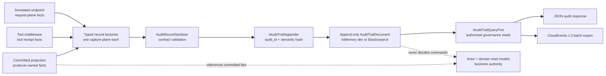
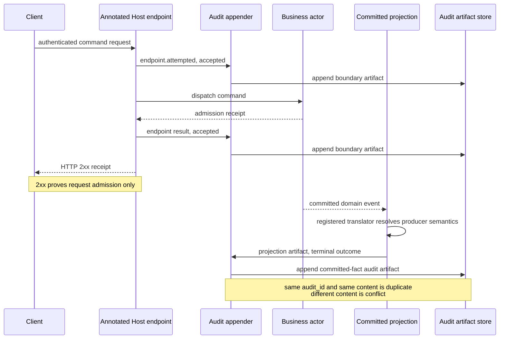

# Audit Trail：生命周期、追加语义与 CloudEvents 导出

> 版本与结论：本章描述 `current`。平台 audit trail 是安全治理 artifact，不是 Actor state、业务 read model、trace 或第二条 Projection 链。冻结实现把 boundary endpoint、tool execution 与 committed projection 三类事实翻译成同一份 typed `AuditRecord`，经校验与脱敏后按稳定 `audit_id` 追加；查询与 CloudEvents 只读取这份 artifact，不能反向证明业务当前状态。

## 设计抽象与事实源

- `src/Aevatar.Audit.Abstractions/audit_messages.proto:55`、`:62`、`:70`、`:153`：定义 capture plane、lifecycle、terminal outcome 与 audit artifact wire contract。
- `src/Aevatar.Audit.Core/CommittedFacts/CommittedAuditArtifactMaterializer.cs:39`、`:44`、`:58`、`:94`：committed-fact capture只消费标准 committed envelope，由显式 translator产出治理记录。
- `docs/canon/audit-trail.md:11`、`:25`、`:55`、`:205`：治理边界是不替代业务权威、不把 boundary receipt冒充执行成功、不创建第二条投影主链。

## 一份治理 artifact，三类 producer



三类 producer共享存储契约，不共享事实所有权。Boundary只拥有某次 HTTP request 的尝试与结果；tool middleware只拥有某次 tool receipt；projection translator只拥有它认识的 committed event到治理语义的映射。没有 translator的 committed event被跳过，而不是被通用 mapper猜成安全事件；维护性 republish 的合成 event id 也会在 translator 查找前直接跳过（`CommittedStateRepublish.IsRepublishEventId`，`CommittedAuditArtifactMaterializer.cs:55`），不产生重复治理记录——republish 动作本身由调用它的 admin endpoint 审计。

| capture plane | producer拥有的 subject | lifecycle来源 | provenance强度 | 当前缺失时的行为 |
|---|---|---|---|---|
| `boundary_endpoint` | 一次被显式 metadata标注的 HTTP request | status、异常、取消与 timeout；`2xx`仍是 nonterminal `accepted` | caller scope、HMAC identity、safe route target与request correlation | 无 metadata不采集；普通未认证请求默认跳过；无 appender/hasher则业务继续 |
| `tool_execution` | 一次 tool invocation / finalized receipt | receipt status、approval状态与受控 failure code | HMAC identity、scope、call/session/run correlation与safe target | 无 appender/hasher装配为 null observer；append异常只告警，不改 tool结果 |
| `projection_artifact` | 一个已注册 translator认识的 committed fact | translator显式给出 accepted/running/waiting/terminal | committed event id、actor、event type、`StateEvent.Version`与业务 provenance | 未注册 type跳过；翻译异常或 append失败记录 operational error |

这里没有“audit actor 聚合所有写入”。`AuditTrailDocument` 的 owner是 capture plane产生的 immutable record；业务 actor只在 committed-fact record里被引用。这样高并发写入不必经过一个全局 hot actor，也不会让 audit artifact变成新的业务权威。

## lifecycle：subject局部，不是全局流程状态

`AuditOutcome`保留了旧兼容枚举；current contract的强语义来自 `lifecycle_phase + terminal_outcome + failure`：

- `accepted`、`running`、`waiting_approval` 都是 nonterminal，必须没有 `terminal_outcome`。
- `terminal` 必须且只能带一个 `succeeded | failed | cancelled | timed_out`。
- `failed` 与 `timed_out` 必须带结构化 failure；其他 terminal outcome不得带 failure。
- 拥有执行生命周期语义的 `schema_version=1.0` producer必须显式给 lifecycle；不适用的 event kind可保持 `unspecified`，mapper不会根据 legacy outcome替 current record脑补。



图中的两条 record不能合并。Boundary的 `accepted` subject是 HTTP request，即使 handler返回 `2xx`也不能宣布 workflow或service已经成功；随后 committed producer的 terminal record才可引用 authoritative event/version。反过来，HTTP rejection可以是 request subject的 terminal failure，却不等于某个此前已accepted的业务 run失败。

## append-only、幂等与失败边界

appender先运行 sanitizer，再对 semantic record计算 SHA-256；`recorded_at`被排除在 hash外，因此同一事实重投时不会因捕获时钟不同而冲突。存储已有相同 `audit_id` 时：

| existing vs incoming | disposition | 是否修改旧 artifact |
|---|---|---|
| 同 `audit_id`、同 semantic hash | `Duplicate` | 否 |
| 同 `audit_id`、不同 semantic hash | `Conflict` | 否 |
| 不存在 | `Applied` | 新增一次 |

这不是 current-state store的“更高版本覆盖”。`audit_id`固定了一条不可变治理事实，content hash检测producer漂移；发生 conflict时应修 producer或执行受控调查，不能覆盖旧记录来换取通过。Elasticsearch实现注册为 `IAuditTrailArtifactStore + IAuditTrailQueryPort + IProjectionIndexReconcileTarget`，不注册成 CQRS read-model inventory；InMemory实现只适合开发/测试。

当前写入采用 fail-open取舍。Endpoint与tool主链不会因 audit append异常而改变原业务响应；committed materializer也只记录翻译或写入错误。这保护了业务可用性，但不等于审计交付有强事务保证：尤其 endpoint/tool wrapper不检查 appender返回的 `Conflict` / `StoreUnavailable`，只有抛出的异常或 terminal timeout会被自身日志路径捕获。生产运维必须监测 appender/store健康与错误，不能从“业务成功”反推“audit一定已落盘”。

## identity 与 redaction：先收窄，再校验

外部主体先组成 canonical key，再用 host配置的 HMAC-SHA256 key派生 `audit_actor_id`；`identity_key_id`随记录保存，使历史记录在key rotation后仍能按旧key验证。普通查询只传派生id；raw provider/subject只进入 admin-only actor-resolution请求体，响应不回显它。

record还必须带 redaction policy、omitted fields与 `values_sanitized=true`。当前 sanitizer会：

1. 校验 schema、identity、capture plane、lifecycle/failure与 provenance一致性；
2. 限长并规范化summary和annotation；
3. 拒绝secret-shaped annotation key、Bearer/private-key形态以及若干credential前缀；
4. 验证 W3C trace context内部一致，但不要求一定有trace。

这是一道最后防线，不是任意文本的完备DLP。proto仍有 `request_summary`、`result_summary`、`error_summary` 与 `annotations` 等字符串位；sanitizer对summary主要做规范化/限长，无法证明所有凭证形态都被识别。因此真正的不变量仍是 producer只构造allowlisted safe fields，raw body、headers、prompt、tool args/result与credential不得进入 record。不能把“通过 sanitizer”写成“任何输入都已脱敏”。

## 查询、coverage 与 CloudEvents

Host只通过 `IAuditTrailQueryPort` 读取 artifact，不旁路查actor、EventStore或其他 projection store。当前HTTP面是：

| route | 授权 | 输出语义 |
|---|---|---|
| `GET /api/audit/trail` | authenticated；默认caller scope，跨scope与`__all__`需platform admin | typed records + coverage |
| `GET /api/audit/trail/cloudevents` | 同上 | 当前查询页的 CloudEvents 1.0 JSON batch + coverage headers |
| `POST /api/audit/actor-resolutions` | platform admin | provider + raw subject → server-side HMAC identity |

缺 query port或query执行失败返回 `503 AUDIT_QUERY_UNAVAILABLE`；跨scope缺admin authorizer返回 `503 AUDIT_ADMIN_AUTH_UNAVAILABLE`，不是降级为旁路读取。查询结果按 `occurred_at DESC`，同时间以 `audit_id ASC`稳定排序，并通过 cursor继续向更旧记录翻页。

coverage必须与records一起解释：

- `truncated=true` 或 continuation cursor表示这只是一页。
- `ingestion_watermark`是已知最大 `recorded_at`，不是业务发生时间，也不自动证明之前无漏写。
- 只有真实 `complete_through >= requested.to` 才能声称bounded window完整。冻结 InMemory与Elasticsearch provider都没有提供 `complete_through`，所以 bounded查询最多是 `unknown` 或 `behind_ingestion_watermark`。
- `schema_compatibility`区分 current、含legacy与incompatible；legacy映射只发生在response adapter，不写回旧artifact。

CloudEvents是出口表示，不是内部 envelope。`specversion=1.0`，`id/source/type/subject/time/dataschema`来自已存 record，`data`复用同一 typed query response；trace/correlation只是可选extension。重复导出不会mint新id，也不会让治理artifact升级为业务事件。

## 最小静态示例

> Demo status：`verified-static`（按冻结 proto、sanitizer、appender、query endpoint与CloudEvents mapper静态核对；未启动Host、未写Elasticsearch，也未证明任一生产时间窗完整。）

```yaml
record:
  audit_id: committed:evt-42:workflow.run.completed
  occurred_at: 2026-07-25T08:00:00Z
  recorded_at: 2026-07-25T08:00:01Z
  event_kind: workflow.run.completed
  subject: workflow_run/run-42
  source: urn:aevatar:audit:projection-artifact
  schema_version: "1.0"
  capture_plane: projection_artifact
  operation_kind: system
  operation_name: workflow.run.completed
  sensitivity_level: confidential
  outcome: success
  lifecycle_phase: terminal
  terminal_outcome: succeeded
  scope_id: scope-a
  audit_actor_id: system
  identity_key_id: system
  actor_kind: system
  credential_source: system
  target: { kind: workflow_run, id: run-42 }
  committed_fact_ref:
    committed_event_id: evt-42
    actor_id: workflow-run-42
    event_type_url: type.googleapis.com/aevatar.workflow.WorkflowCompletedEvent
    state_version: 9
  provenance:
    scope_id: scope-a
    run_id: run-42
    actor_id: workflow-run-42
    actor_state_version: 9
    actor_event_id: evt-42
  redaction:
    policy: aevatar.audit.safe-fields.v1
    omitted_fields: [source_event.payload]
    values_sanitized: true
append_again:
  same_semantic_content: duplicate
  changed_terminal_outcome: conflict
export_page:
  content_type: application/cloudevents-batch+json
  coverage:
    truncated: true
    continuation_cursor: required-for-next-page
    complete_through: null
    window_completeness: unknown
```

静态预期：这条 artifact引用 `StateEvent.Version=9`，但自己不是actor state version；第二次同内容append不会新增，篡改outcome也不会覆盖。CloudEvents导出只证明该页的表示已映射，`truncated=true`且没有`complete_through`时不能宣称审计区间完整。

## 为什么是它，不是别的

**为什么是 append-only artifact，不是普通日志？** 日志可能采样、聚合和格式漂移；治理记录需要稳定identity、schema、lifecycle、redaction与幂等冲突语义。两者可共享correlation，却不能互相冒充。

**为什么 committed capture复用 Projection Pipeline？** 只有committed feed能给出authoritative event id与state version。复用既有fan-out避免第二条event router；boundary若重建committed结果，会把HTTP receipt变成伪事实。

**为什么不用一个全局 AuditGAgent？** 全局actor会成为吞吐热点和新的状态所有者。artifact store按稳定id做create/duplicate/conflict已经提供所需不可变语义，不需要引入序列化全平台写入的聚合。

**为什么 CloudEvents只放在出口？** 外部系统需要标准交换格式，内部投影需要既有 `EventEnvelope` 与 typed `AuditRecord`。在HTTP边界映射可保持标准兼容，又不复制内部路由与事实模型。

**为什么业务继续而audit fail open？** 安全日志故障不应随机改变已经授权的业务动作结果。代价是必须把audit delivery failure升级为独立运维信号；当前缺少与业务commit同事务的outbox，不能声称零丢失。

## 当前边界与演进

- current实现已有三capture-plane框架、typed v1 contract、HMAC identity、InMemory/Elasticsearch store、authorized query与CloudEvents slice；这不证明 open epic `#2592` 的全平台endpoint/tool/event inventory已经覆盖完。
- endpoint/tool在依赖缺失时可静默退化为无采集，且不检查非异常append failure status；需要coverage inventory、强健康门禁或durable delivery机制后，才能宣称平台级完整捕获。
- sanitizer无法对所有自由字符串提供结构性secret排除；producer allowlist与专项测试仍是主防线。canon中“契约无处存放敏感材料”的目标表述强于current proto，应在 `12/05-open-gaps-and-canon-drift.md` 登记。
- current provider不提供`complete_through`，coverage不得写成完整审计区间；若要合规导出，需要真实ingestion checkpoint与可验证的分页/计数流程。
- index reconcile会copy-forward并保留旧physical index；retention、legal hold、备份后删除与离线export job仍是独立运维职责，不能由在线query或schema迁移顺手执行。
- legacy record可读但只做response-time保守映射；unknown schema标incompatible，不自动升级或写回。
- audit artifact引用committed fact但不替代它；业务状态继续读相应current-state/read model，见 [command、event、projection与read model](01-command-event-projection-readmodel.md)。

## 读完应能回答

1. Boundary、tool与projection capture分别拥有哪类subject，哪一类能证明业务terminal outcome？
2. 为什么HTTP `2xx` audit只能是`accepted`，不能写成run succeeded？
3. 同一`audit_id`重投、内容漂移分别得到什么结果，为什么都不能覆盖旧artifact？
4. HMAC identity、producer allowlist与sanitizer各保护哪一层，为什么sanitizer不是万能DLP？
5. CloudEvents batch、cursor、ingestion watermark与complete-through分别证明什么，何时不能声称导出完整？

<details>
<summary>论断—证据映射</summary>

| 论断 | 等级 | 证据 |
|---|---|---|
| v1 proto显式区分capture plane、lifecycle、terminal outcome、failure、provenance、redaction与committed reference | E1 | `src/Aevatar.Audit.Abstractions/audit_messages.proto:55`、`:62`、`:70`、`:117`、`:125`、`:133`、`:147`、`:153` |
| sanitizer强制current schema、terminal/failure组合、provenance一致与redaction metadata，并拒绝部分secret carrier | E1 | `src/Aevatar.Audit.Core/Sanitization/AuditRecordSanitizer.cs:40`、`:92`、`:126`、`:164`、`:193`、`:305` |
| appender按去除recorded_at后的semantic hash判断duplicate/conflict，既有artifact不覆盖 | E1 | `src/Aevatar.Audit.Core/Projection/AuditRecordContentHasher.cs:8`、`:12`；`src/Aevatar.Audit.Core/Projection/ProjectionAuditTrailAppender.cs:24`、`:48`、`:49`、`:52` |
| committed capture只解包标准committed envelope并调用显式translator，附event id与state version | E1 | `src/Aevatar.Audit.Core/CommittedFacts/CommittedAuditArtifactMaterializer.cs:39`、`:44`、`:50`、`:59`、`:82`；`src/Aevatar.Audit.Core/CommittedFacts/CommittedAuditRecordFactory.cs:107`、`:109`、`:112` |
| endpoint capture对2xx分类accepted，attempt/result best-effort append且不改变原异常/响应 | E1 | `src/Aevatar.Bootstrap/Hosting/EndpointAuditOutcomeClassifier.cs:30`、`:36`；`src/Aevatar.Bootstrap/Hosting/EndpointAuditCaptureMiddleware.cs:41`、`:67`、`:74`、`:84`、`:180` |
| tool middleware在finally产出finalized receipt audit，append异常仅告警；缺appender/hasher时装配null observer | E1 | `src/Aevatar.AI.Core/Middleware/ToolExecutionAuditMiddleware.cs:25`、`:40`、`:46`、`:54`；`src/Aevatar.AI.Core/Auditing/ToolExecutionAuditServiceCollectionExtensions.cs:24`、`:26`、`:28` |
| actor identity使用host key做HMAC-SHA256并保存active key id，verify使用fixed-time comparison | E1 | `src/Aevatar.Audit.Core/Identity/AuditActorIdentityHasher.cs:9`、`:30`、`:37`、`:45`、`:60`、`:77` |
| audit HTTP默认caller scope，跨scope/all需admin，缺query/admin能力返回503且不旁路读取 | E1 | `src/Aevatar.Audit.Hosting/AuditTrailEndpoints.cs:35`、`:41`、`:47`、`:153`、`:156`、`:164`、`:181`、`:308` |
| response暴露coverage；没有真实complete-through时bounded window只能unknown或behind watermark | E1 | `src/Aevatar.Audit.Abstractions/Models/AuditTrailPage.cs:11`、`:20`、`:40`、`:48`、`:51`；`src/Aevatar.Mainnet.Host.Api/Hosting/MainnetAgentProjectionDocumentStoresExtensions.cs:435`、`:442`、`:443`、`:485` |
| CloudEvents export映射稳定stored fields，使用batch content type并把coverage放响应headers | E1 | `src/Aevatar.Audit.Hosting/AuditTrailResponseMapper.cs:9`、`:17`、`:63`、`:68`、`:79`；`src/Aevatar.Audit.Hosting/AuditTrailEndpoints.cs:218`、`:221`、`:342` |
| mainnet按provider注册InMemory或Elasticsearch audit artifact/query store，ES额外参与startup reconcile但不进入read-model inventory | E1 | `src/Aevatar.Mainnet.Host.Api/Hosting/MainnetAgentProjectionDocumentStoresExtensions.cs:120`、`:140`、`:195`、`:205`、`:207`、`:209`、`:213` |

</details>
