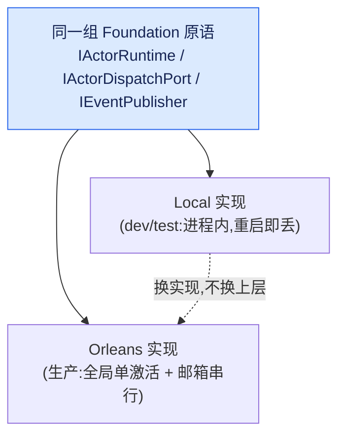
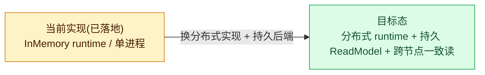

# 诚实对比:当前实现 vs 目标态(ActorRuntime / Transport / Projection / LiveSink / ReadModel)

## 本篇涉及的设计抽象

> 以下论断均可回指 `~/Code/aevatar` 源码验证,但本篇用设计语言描述,不贴文件路径/行号。

---

## 对照表

aevatar 对分布式 Runtime 做了"当前实现 vs 目标态"的诚实对比,评分依据是**已落地代码**,不是承诺:

| 维度 | 当前实现 | 目标态 |
|---|---|---|
| **Actor Runtime** | `ActorRuntime:Provider=InMemory`(dev/test) | 非 InMemory Provider(Garnet 等)+ 分布式 Actor Runtime |
| **Orleans Transport** | `Provider=Orleans` 默认内置 link;可选 `Transport=Kafka` 启用 KafkaProvider | 可插拔 transport,由 stream/queue 层承载跨节点转发 |
| **Projection 并发(Ensure/Release)** | 收口到 projection-coordination actor + lease 串行化(不再进程内 `SemaphoreSlim`) | 继续依赖"同 actorId 单激活 + 邮箱串行" |
| **LiveSink(Attach/Detach)** | 改为 session event stream sub/unsub(不再 `ProjectionContext` 内存 sink 列表) | 分布式 stream provider 下原生跨节点 |
| **ReadModel storage** | 默认 InMemory provider,可换 Provider | 换持久 read-model Provider 实现跨节点一致读 |

> ⚠️ **表里的字符串是示意名,不是字面常量**:`projection:{rootActorId}` / `workflow-run:{actorId}:{commandId}` 在源码里 grep 不到——真实机制是 typed `ProjectionRuntimeScopeKey`(`RootActorId / ProjectionKind / Mode / SessionId`)+ **lease 句柄**(`EnsureAsync` 返回、`ReleaseProjectionAsync` 释放)。同理 "LiveSink" 不是类型,真实抽象是 `IEventSinkProjectionLifecyclePort` + `IProjectionSessionEventHub`(见 [05/02](../05/02-two-projection-modes.md))。本表沿用示意名只为对齐 README 口径。

---

## 关键澄清

- 生产语义是分布式 `IActorRuntime` 的**全局单激活 + 邮箱串行**;
- `AddAevatarFoundationRuntimeOrleans()` 和 `AddAevatarRuntime()` 暴露**同一组** `IActorRuntime` / `IActorDispatchPort` / `IEventPublisher` 原语——Local 和 Orleans 是同一抽象的两种实现;
- InMemory 仅 dev/test;生产用 `Aevatar.Foundation.Runtime.Persistence.Implementations.Garnet`。

---

## 验收

1. Actor Runtime 当前用什么?目标?(InMemory dev/test → 非 InMemory 分布式)
2. Projection 并发怎么做?(收口到 projection-coordination actor + lease,不再 `SemaphoreSlim`)
3. 表里的 `projection:{rootActorId}` 是字面常量吗?(不是,是示意名;真实是 `ProjectionRuntimeScopeKey` + lease)
4. Local 和 Orleans 是两套抽象吗?(不是,同一组原语的两种实现)

⟦AI:AUTO-LOOP⟧
