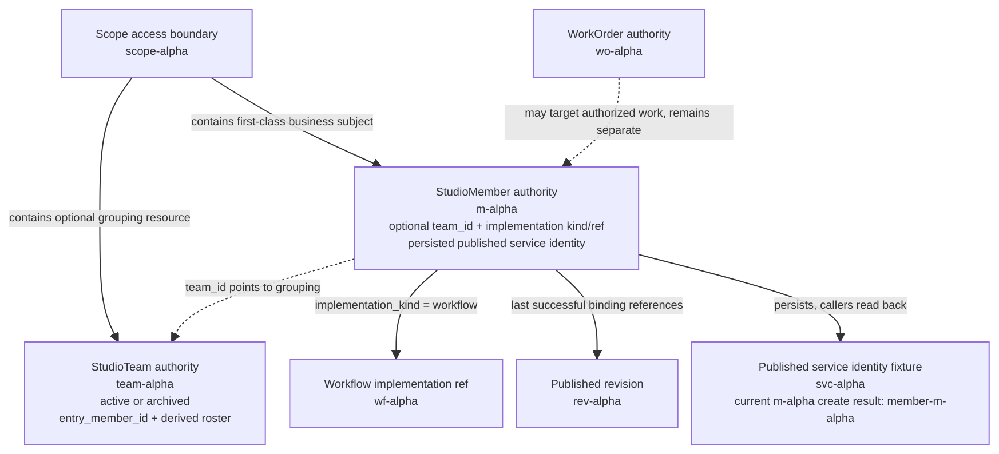
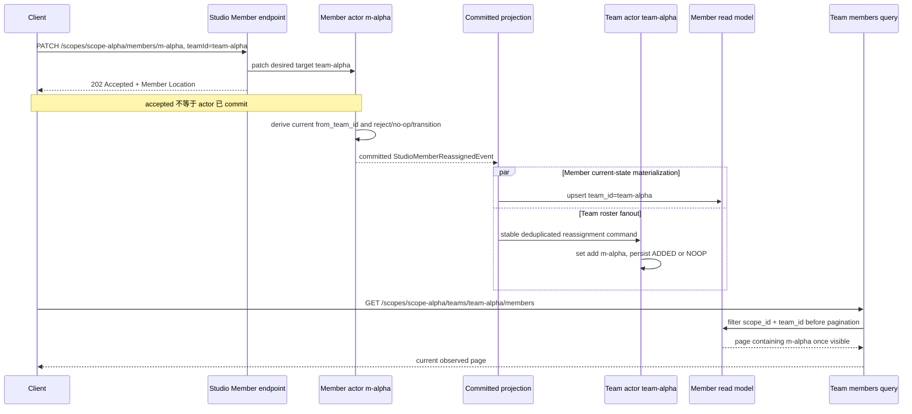
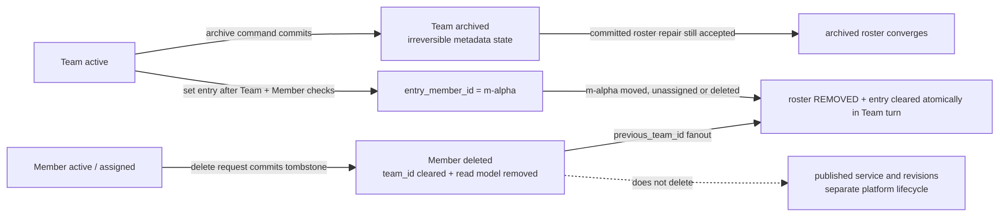

# Scope、Team 与 Member：产品资源、归属权威与派生 roster

> 版本与结论：本章描述 `current`。Studio 以 `scopeId` 划定访问边界，以 `StudioMember` 表示一等业务主体；`StudioTeam` 是可选分组，不是 Member 的替代身份。成员归属由 Member actor 的 `team_id` 决定，Team actor 只从 committed reassignment 维护可重放的派生 roster；产品的 Team 成员列表最终按 Member read model 的 `scope_id + team_id` 查询，不能把 Team roster、Member identity、implementation identity 或 published service identity 混成同一个 ID。

## 设计抽象与事实源

- `agents/Aevatar.GAgents.StudioMember/studio_member_messages.proto:10`、`:176`、`:185`、`:201`：Member 是唯一一等主体，implementation 是 typed kind/ref，`team_id` 是 authority state 的可选归属字段。
- `agents/Aevatar.GAgents.StudioTeam/studio_team_messages.proto:7`、`:19`、`:22`、`:69`：Team 是可选分组层，roster 由 committed Member reassignment 以幂等 set 语义派生。
- `src/Aevatar.Studio.Projection/Projectors/StudioTeamRosterFanoutMaterializer.cs:46`、`:52`、`:62`、`:79`：只有 committed reassignment / deletion fact 才被 fanout 到受影响的 Team actor，并使用稳定去重 identity。

## 身份先分开，关系再组合

Task 11 使用一组故意不相等的身份夹具。它的目的不是规定生产 ID 命名，而是让每条 route、event 与查询都必须说清自己接收哪一种 identity：

| 语义 | 身份夹具 | 谁拥有或解析它 | 不能替代 |
|---|---|---|---|
| scope 访问边界 | `scope-alpha` | Host 的 scope guard 与 scope-scoped actor identity | Team、Member、Workflow 或 Service |
| Team 资源 | `team-alpha` | `StudioTeamGAgent` | `m-alpha` |
| Member 资源 | `m-alpha` | `StudioMemberGAgent` | `wf-alpha` 或 `svc-alpha` |
| draft Workflow | `wf-alpha` | Workflow draft authority | Member API 的 `memberId` |
| published revision | `rev-alpha` | service revision authority | draft Workflow 或 Member |
| published service | `svc-alpha` | Member authority 保存并在 binding 中引用的独立身份夹具 | Member、revision |
| WorkOrder | `wo-alpha` | WorkOrder authority | Team、Member 或 Workflow run |

`svc-alpha` 在这张表中是**概念身份夹具**，用来证明调用方不得从 `m-alpha` 猜 service identity；它不是冻结实现对 `m-alpha` 的实际生成结果。current helper 在 Member 创建时生成并持久化 `member-m-alpha`，随后调用方必须读取 authority / read model 中保存的值，不能再次按字符串形状推导。后续示例若使用 `svc-alpha`，只表达“已由 authority 给出的 published service ID”；描述 current create 输出时则明确写 `member-m-alpha`。



图中只有 Scope 是共同边界，不存在一条可把其余 ID 互换的继承链。Actor ID 只是内部寻址形式：

- Team actor：`studio-team:scope-alpha:team-alpha`。
- Member actor：`studio-member:scope-alpha:m-alpha`。

route 仍分别接收 `scopeId + teamId` 或 `scopeId + memberId`，不会接收拼好的 actor ID。Workflow、revision、published service 与 WorkOrder 也都有自己的 authority；某个 ID 恰好能由另一个 ID 生成，不会让两者成为同一种资源。

## 两个 authority，各自只做一件事

### Member authority 决定“这个成员属于哪里”

`StudioMemberState` 持有不可变的 `member_id + scope_id`、display metadata、固定的 `implementation_kind`、typed implementation ref、持久化 `published_service_id`、binding authority、可选 `team_id` 与 deletion tombstone。workflow、script、gagent 只是三种 implementation kind；它们不是三套平级 Member API，也不能在创建后把同一个 Member 从一种 kind 偷换成另一种。

归属变更的调用方只提交目标 `teamId`。Member actor 从自己的 current state 推导 `from_team_id`，相同目标直接 no-op；真正变化才提交一个 `StudioMemberReassignedEvent`。这条规则避免应用层从可能滞后的 read model 拼出 source team，也让 stale / hand-crafted event 无法覆盖 Member 当前归属。

### Team authority 维护“这个分组目前聚合了谁”

`StudioTeamState` 持有 Team lifecycle、`entry_member_id` 与 persisted `member_ids`。但 roster 不是第二个成员归属写入口：Team actor只接收 committed Member reassignment 的 fanout，对集合执行 `ADDED | REMOVED | NOOP`，并由集合大小派生 `member_count`。重复 delivery 会得到稳定 command / deduplication identity；即使到达 handler，set 语义也会把重复 add/remove折叠为 `NOOP`。

因此“authority”需要分两层理解：

| 问题 | 应读的权威 | 原因 |
|---|---|---|
| Member 当前归属哪个 Team | Member actor 的 `team_id`，产品侧读其 current-state document | reassignment 只由 Member 决策并提交 |
| Team actor 如何恢复自己的 roster / entry member | Team actor 的 persisted `member_ids + entry_member_id` | 它保存 committed fanout 的可重放集合效果 |
| 产品分页列出 Team 成员 | Member read model，按 `scope_id + team_id` 在 store 过滤 | Team read model故意不复制完整 roster，且过滤必须发生在分页前 |
| Team 列表显示成员数 | Team read model 的 `member_count` | projector从 Team roster集合大小派生，不维护独立易漂移计数器 |

Team roster 可能在 fanout 期间短暂落后于 Member authority，所以它适合 Team actor恢复与 Team-local invariant，不适合成为另一个 assignment command surface。反过来，产品列表也不应逐个 ask Team actor或把 roster复制进 Team read model：前者制造 N+1 runtime 查询，后者让同一成员明细出现两份分页事实。

## 转组：先提交归属，再异步收敛分组视图



这条链有三个不同完成点：

1. `202 Accepted` 只证明命令已进入投递边界。
2. `StudioMemberReassignedEvent` commit 才证明 Member authority 已改变归属。
3. Member read model 与 Team roster各自异步收敛，没有一个 `202` 能证明两者已同时可见。

fanout失败会向 projection lifecycle冒泡，由 retained failure / retry边界处理，而不是在 request handler里偷偷重放。旧 Team 与新 Team分别收到同一个 reassignment payload；旧侧remove，新侧add。纯assign只发新侧，纯unassign只发旧侧。

## 路由是资源契约，不是 ID 转换器

当前 Host 的核心 surface 为：

| 方法与 route | identity 参数 | 语义 |
|---|---|---|
| `POST /api/scopes/{scopeId}/teams` | scope | 创建 Team |
| `GET /api/scopes/{scopeId}/teams` | scope | 从 Team read model分页列 Team |
| `GET/PATCH /api/scopes/{scopeId}/teams/{teamId}` | scope + Team | 读取或提交 Team metadata变更 |
| `POST /api/scopes/{scopeId}/teams/{teamId}/archive` | scope + Team | 提交不可逆 archive |
| `PUT/DELETE /api/scopes/{scopeId}/teams/{teamId}/entry-member` | scope + Team，PUT body含 Member | 设置或清除 entry member |
| `GET /api/scopes/{scopeId}/teams/{teamId}/members` | scope + Team | 先确认 Team可见，再按 Member read model过滤分页 |
| `POST/GET /api/scopes/{scopeId}/members` | scope | 创建或分页列 Member |
| `GET/PATCH/DELETE /api/scopes/{scopeId}/members/{memberId}` | scope + Member | 读取、变更或 tombstone Member authority |

所有这些 endpoint先过 `AevatarScopeAccessGuard`。`scope-alpha` URL 下的 `m-alpha` 不能通过把 body里的 `teamId`、`workflowId` 或 `serviceId` 换个字符串来逃逸到另一 scope；Member actor还会校验 committed command/event里的 `scope_id` 与自身 state一致。

这里也不存在“给 Member endpoint传 `wf-alpha`，反正它最终实现的是 workflow”的捷径。Member API只接受 `m-alpha`；Workflow draft API才接受 `wf-alpha`；published service调用必须使用 authority返回的 `svc-alpha` 类身份；WorkOrder API使用 `wo-alpha`。route边界若允许猜 ID，会把一次合法 lookup变成跨 authority confused-deputy 风险。

## lifecycle、entry member 与删除



### Team archive

Team lifecycle只有 `ACTIVE -> ARCHIVED`，没有 reactivate。archive后普通 Team metadata更新以及 entry-member set/clear被拒绝；已有 Member不会随 Team一起删除或自动unassign。Team actor仍接受 committed roster add/remove，这是恢复与收敛语义，不是重新开放 metadata编辑。

当前 assignment入口还有一条必须诚实暴露的边界：

!!! warning "当前边界：目标 Team admission 不闭合"

    Member创建时带 `teamId` 只检查目标 Team read model存在，不检查其 lifecycle；Member PATCH team assignment甚至不读目标 Team，而是直接把目标意图交给 Member actor。不存在的 Team会在后续 fanout到未初始化 Team actor时失败；已归档 Team则仍会接受 roster修正。因此 `202 Accepted` 不能证明目标 Team存在、可写或关系已经双侧收敛。若产品要求“不能新分配到 archived Team”，需要由 Team authority提供显式 admission / committed coordination，而不是让 Member依赖滞后 read model猜测。该缺口应在 `12/05-open-gaps-and-canon-drift.md` 收敛 owner与 exit criterion。

### Entry member

设置 entry member前，application service读取 Team与Member read model，要求 Team存在且未archive、Member存在且其 observed `team_id`等于目标 Team；Team actor再用自己的 roster做第二次 invariant校验。两层检查不是强事务：若 Member read model已更新而 Team roster尚未收敛，命令可能先被投递，随后由 Team actor拒绝。

当 entry member被move、unassign或delete时，Team actor在同一个 turn提交 roster removal与 entry clear，避免留下指向非成员的 entry identity。重复 removal是 `NOOP`；只有实际 `REMOVED` 才触发这个清理分支。

### Member delete

`DELETE` 先从 Member read model确认资源当前可见，再返回 `delete_accepted` receipt。Member actor把删除写成不可逆 tombstone，清除 `team_id`，并在事件中保留 `previous_team_id`；committed materializer随后把它转换成对旧 Team的remove fanout。Member current-state projector看到 tombstone后删除查询文档，因此后续GET/list呈现not found。

这不是抹除 event history，也不是级联销毁 published service。冻结实现明确把 service artifacts与revision lifecycle留给平台 service authority；调用方不能从 Member read model消失推断 `svc-alpha` 或 current实际值 `member-m-alpha` 已退役。

## 最小静态示例

> Demo status：`verified-static`（按冻结 proto、Member / Team actor、committed fanout、current-state projectors、query ports与Host routes静态核对；未启动Host，未观察实际projection延迟，也未证明目标 Team admission已闭合。）

身份夹具：

```yaml
scopeId: scope-alpha
teamId: team-alpha
memberId: m-alpha
draftWorkflowId: wf-alpha
revisionId: rev-alpha
publishedServiceId: svc-alpha  # conceptual authority-returned fixture
workOrderId: wo-alpha
currentCreateConvention:
  memberId: m-alpha
  persistedPublishedServiceId: member-m-alpha
```

提交转组意图：

```http
PATCH /api/scopes/scope-alpha/members/m-alpha
Content-Type: application/json

{"teamId":"team-alpha"}
```

静态预期是 `202 Accepted`，`Location` 指向 `/api/scopes/scope-alpha/members/m-alpha`；response不是 committed Member snapshot。观察侧应分别查询：

```http
GET /api/scopes/scope-alpha/members/m-alpha
GET /api/scopes/scope-alpha/teams/team-alpha
GET /api/scopes/scope-alpha/teams/team-alpha/members?pageSize=50
```

当 Member read model已物化时，detail里的 `teamId` 才显示 `team-alpha`；Team summary只给 `memberCount`与可选 `entryMemberId`，不会返回完整 `member_ids`；第三个route从 Member read model按 `scope-alpha + team-alpha`过滤。三个GET不接受 `wf-alpha`、`rev-alpha`、`svc-alpha` 或 `wo-alpha` 来替代 `m-alpha / team-alpha`。

## 为什么是它，不是别的

**为什么 Member 是一等主体，而 workflow / script / gagent 只是 implementation？** 产品需要稳定地表达“同一个成员是谁”，同时允许其实现被更新、绑定和观察。若每种实现都是平级资源，Team roster、权限、display identity与published service都会随实现类型分叉，调用方只能靠字符串或分支猜主体。

**为什么 Team 是可选分组，不是 Member 的父级 identity？** Member可在无Team时存在，也可以move/unassign；把 Team写进 Member主键会让转组变成删除重建，并破坏published service与历史绑定的连续性。`scopeId + memberId`保持authority稳定，`team_id`只描述当前关系。

**为什么 roster要持久化在 Team actor，却仍称为派生聚合？** Team需要在自己的turn内维护entry-member与member-count invariant，也需要在重启后恢复集合；纯内存缓存不够。它的输入仍只来自Member committed fact，所以不会出现第二条assignment写入口。

**为什么 Team members列表不直接返回 Team state的 `member_ids`？** 产品需要Member display、implementation、binding与分页字段。若先取Team roster再逐个查Member，会产生N+1查询；若把Member详情复制进Team文档，又会制造两份明细。按Member read model的typed filter在store中先过滤再分页，既保留单一查询形状，也避免稀疏Team被scope级分页截断。

**为什么 mutation返回`202`，不等待两边read model一致？** Member commit、Team fanout、两类projection store是独立故障域。同步等待会把最慢读侧变成写入可用性依赖；诚实receipt配稳定查询identity更清楚。代价是调用方必须把accepted、committed与observed分开，且目标Team admission缺口不能被`202`掩盖。

## 边界与演进

- Scope guard约束HTTP访问，但不是全局事务。Member与Team actor都把`scope_id`纳入identity并拒绝跨scope event；读侧仍必须把scope filter下推到store。
- Team read model只暴露derived `member_count`与`entry_member_id`，不暴露完整roster。需要成员页时只走Member query port，不增加第二份Team roster API。
- Member与Team projection可能短暂不同步。不能用“两个GET碰巧一致”证明全局原子commit；若业务需要一致快照，必须定义显式watermark或coordination contract。
- Member delete的查询文档删除与Team remove fanout分别发生；中间窗口可能出现Member已not found而Team count尚未减少，或相反。恢复依赖committed input与幂等set，不靠query-time repair。
- archive不级联删除Member，也不阻止Team actor应用恢复性roster fact。是否禁止新assignment到archived Team目前没有闭合的authority admission，应作为current gap处理。
- entry-member预检依赖两个read model，Team actor才是最后invariant gate；accepted response本身没有terminal outcome query contract。需要可靠产品反馈时，应增加可观察command outcome，而不是把read-after-write包装成同步成功。
- `StudioMemberConventions.BuildPublishedServiceId("m-alpha")` 当前得到 `member-m-alpha`，但这只是创建约定。所有后续调用必须从Member authority/read model读取published service ID；不能把prefix写入客户端或拿`m-alpha`直接调用service API。
- open issue `#435` 的member-first surface在冻结树已部分落地（roster/detail与revision activate/retire route存在），不能笼统写成全部缺失；仍未闭合的契约按具体E1与`12/05`逐项跟踪。open issue `#1016` 的Team-call-Member协作状态机不是本章current行为。

## 读完应能回答

1. `scope-alpha`、`team-alpha`、`m-alpha`、`wf-alpha`、`rev-alpha`、`svc-alpha`与`wo-alpha`分别属于哪个authority，为什么不能互换？
2. 为什么Member的`team_id`是归属authority，而Team的`member_ids`仍值得持久化？
3. `GET /teams/team-alpha/members`为什么查询Member read model，而不直接复制或返回Team roster？
4. `202 Accepted`之后，Member commit、Team roster与两个read model分别可能处于什么状态？
5. Member delete、Team archive与entry-member removal各自会清理什么，又明确不会级联清理什么？

<details>
<summary>论断—证据映射</summary>

| 论断 | 等级 | 证据 |
|---|---|---|
| StudioMember是唯一一等主体，workflow/script/gagent是typed implementation kind/ref | E1 | `agents/Aevatar.GAgents.StudioMember/studio_member_messages.proto:10`、`:13`、`:49`、`:69` |
| Member authority持有identity、implementation、published service、binding、可选team与deletion tombstone | E1 | `agents/Aevatar.GAgents.StudioMember/studio_member_messages.proto:176`、`:185`、`:196`、`:201`、`:205` |
| Team是可选分组，持久化roster并从set size派生count | E1 | `agents/Aevatar.GAgents.StudioTeam/studio_team_messages.proto:7`、`:19`、`:22`、`:25` |
| Team与Member actor ID分别是scope-scoped且不可互换的格式 | E1 | `agents/Aevatar.GAgents.StudioTeam/StudioTeamConventions.cs:18`、`:22`；`agents/Aevatar.GAgents.StudioMember/StudioMemberConventions.cs:21`、`:25` |
| current create约定从immutable member ID生成一次published service ID并持久化，m-alpha对应member-m-alpha | E1 | `agents/Aevatar.GAgents.StudioMember/StudioMemberConventions.cs:28`、`:34`、`:37`；`agents/Aevatar.GAgents.StudioMember/StudioMemberGAgent.cs:49`、`:56` |
| Member actor从current state推导from/to、抑制no-op并提交reassignment；stale source被拒绝 | E1 | `agents/Aevatar.GAgents.StudioMember/StudioMemberGAgent.cs:338`、`:349`、`:393`、`:401`、`:474`、`:499`、`:506` |
| committed materializer只fanout reassignment或带previous team的deletion，并使用稳定command/deduplication ID | E1 | `src/Aevatar.Studio.Projection/Projectors/StudioTeamRosterFanoutMaterializer.cs:46`、`:52`、`:62`、`:79`、`:91`、`:96` |
| Team actor对roster执行ADDED/REMOVED/NOOP；实际移除entry member时同turn清entry | E1 | `agents/Aevatar.GAgents.StudioTeam/StudioTeamGAgent.cs:146`、`:180`、`:184`、`:194`、`:205`、`:215` |
| archive是不可逆metadata lifecycle，禁止普通update/entry变更但不拒绝committed roster修正 | E1 | `agents/Aevatar.GAgents.StudioTeam/StudioTeamGAgent.cs:26`、`:71`、`:101`、`:128`、`:146` |
| Team members route先确认Team，再把TeamId交给Member列表查询 | E1 | `src/Aevatar.Studio.Hosting/Endpoints/StudioTeamEndpoints.cs:307`、`:316`、`:331`、`:335`、`:340` |
| Member query port把scope_id与team_id filter下推到store并在过滤后分页 | E1 | `src/Aevatar.Studio.Projection/QueryPorts/ProjectionStudioMemberQueryPort.cs:37`、`:47`、`:57`、`:62`、`:70` |
| Team current-state document只投影member_count与entry_member_id，不复制完整roster | E1 | `src/Aevatar.Studio.Projection/Projectors/StudioTeamCurrentStateProjector.cs:13`、`:19`、`:58`、`:71`、`:75` |
| PATCH、archive、entry-member与delete endpoint返回Accepted，不把receipt冒充read model snapshot | E1 | `src/Aevatar.Studio.Hosting/Endpoints/StudioTeamEndpoints.cs:202`、`:207`、`:223`、`:235`、`:252`、`:265`；`src/Aevatar.Studio.Hosting/Endpoints/StudioMemberEndpoints.cs:437`、`:444`、`:456`、`:468` |
| Member delete写tombstone、清team_id、保留previous_team_id供fanout，current-state projector删除查询文档 | E1 | `agents/Aevatar.GAgents.StudioMember/StudioMemberGAgent.cs:418`、`:425`、`:439`、`:444`、`:451`、`:965`；`src/Aevatar.Studio.Projection/Projectors/StudioMemberCurrentStateProjector.cs:55` |
| Member delete不级联删除published service/revisions | E1 | `agents/Aevatar.GAgents.StudioMember/StudioMemberGAgent.cs:418`、`:420`；`src/Aevatar.Studio.Hosting/Endpoints/StudioMemberEndpoints.cs:25` |
| current PATCH assignment不读取目标Team；Member只拥有归属意图，missing Team在fanout handler处被拒，archived Team仍接受roster fact | E1 | `src/Aevatar.Studio.Application/Studio/Services/StudioMemberService.cs:392`、`:397`；`agents/Aevatar.GAgents.StudioTeam/StudioTeamGAgent.cs:26`、`:153`、`:155` |
| scope guard覆盖Team与Member routes，actor与query port继续校验scope | E1 | `src/Aevatar.Studio.Hosting/Endpoints/StudioTeamEndpoints.cs:72`、`:94`、`:117`、`:326`；`src/Aevatar.Studio.Hosting/Endpoints/StudioMemberEndpoints.cs:88`、`:114`、`:137`、`:351`、`:463` |

</details>
