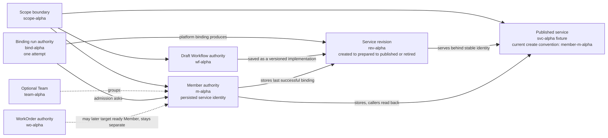
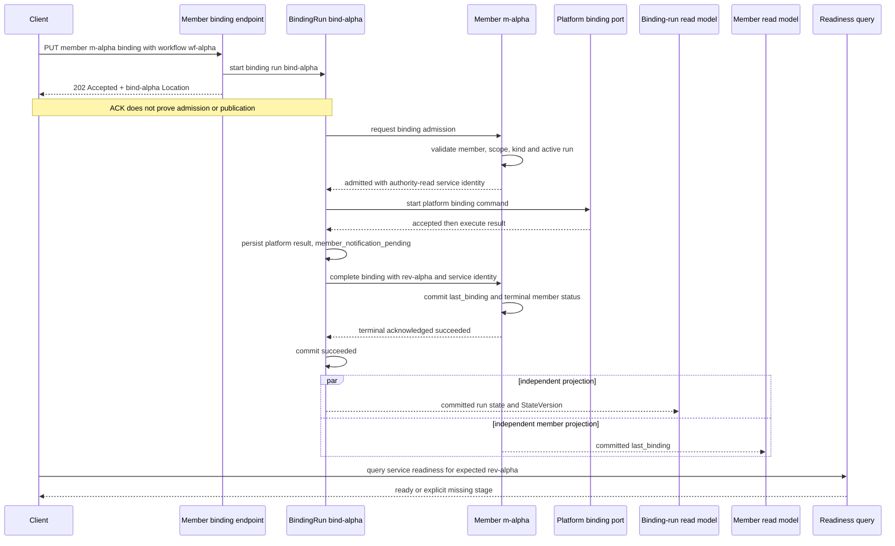
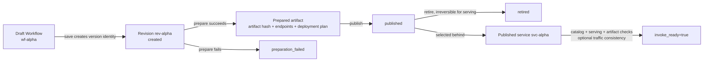

# Draft、Revision、Binding Run 与 Published Service：五种身份，三层完成语义

> 版本与结论：本章描述 `current`。Studio 的 draft Workflow、published revision、Member、binding run 与 published service 是五种独立身份。首次发布走可恢复的 binding-run actor；已发布 Member 的再保存走 save-and-bind command 组合。两条路径都先返回 acceptance，不能把 ACK、binding terminal、Member `last_binding` 与 service `invoke_ready` 合并成一个“发布成功”。

## 设计抽象与事实源

- `src/Aevatar.Studio.Application/Studio/Services/StudioMemberWorkflowBindingPort.cs:33`、`:70`、`:89`、`:118`、`:130`：按 Member 的已发布状态选择首次 binding run 或复用其 persisted service identity 做 save-and-bind。
- `agents/Aevatar.GAgents.StudioMember/StudioMemberBindingRunGAgent.cs:29`、`:55`、`:213`、`:233`、`:379`：一次 binding attempt 由独立 actor 持有，可在 activation 后恢复，并以 Member terminal acknowledgement 收口。
- `src/platform/Aevatar.GAgentService.Abstractions/Protos/service_revision.proto:31`、`:64`、`:107`、`:117`：revision 有独立 identity、implementation spec、prepared artifact 与 lifecycle，不是 draft 或 service 的别名。

## 身份夹具：相等只是偶然，不是契约

Task 11 的固定夹具继续保持故意不相等：

| 身份 | 固定示例 | 本章中的角色 | 不可替代 |
|---|---|---|---|
| `scopeId` | `scope-alpha` | 所有 Studio / service 操作的访问与租户边界 | 任何资源 ID |
| `teamId` | `team-alpha` | Member 的可选分组 | Member 或 service |
| `memberId` | `m-alpha` | 产品主体与 binding admission authority | draft Workflow |
| `draftWorkflowId` | `wf-alpha` | 被保存、修订的逻辑 Workflow identity | Member 或 revision |
| `revisionId` | `rev-alpha` | 一次可准备、发布、退役的 service revision | draft Workflow 或 service |
| `publishedServiceId` | `svc-alpha` | 跨 revision 稳定的发布服务 identity 夹具 | Member 或 revision |
| `workOrderId` | `wo-alpha` | 另一个 durable intent authority | binding run |
| `bindingRunId` | `bind-alpha` | 一次 binding attempt 的执行与恢复 identity | Member、Workflow、revision 或 WorkOrder |

`svc-alpha` 仍是概念夹具：它表示“从 Member authority/read model读到的 published service ID”。冻结实现创建 `m-alpha` 时实际持久化的是 `member-m-alpha`。示例用 `svc-alpha` 是为了阻止客户端从 `m-alpha` 猜值；描述 current create convention 时必须使用 `member-m-alpha`。



这不是一条 ID 转换流水线。`wf-alpha` 可以产生多个 revision；`rev-alpha` 只能在某个 service identity下解释；`svc-alpha` 可把不同 revision作为 serving target；`m-alpha` 保留产品身份与 last successful binding；`bind-alpha` 只标识一次 attempt。Team与WorkOrder不参与 binding identity resolution。

## 两条写路径，不能伪装成同一协议

`StudioMemberWorkflowBindingPort` 先做 capability admission，然后读取 Member detail：

| 当前分支 | 判定 | 写入协议 | immediate result | 后续观察 |
|---|---|---|---|---|
| unpublished / Member read model missing | 没有 last binding，或 Member尚不可见 | `IStudioMemberService.BindAsync` 创建新的 `bindingRunId`；首次 binding 可携带可选 `revisionId`，适配器透传后平台 binding 优先使用该显式 revision（不给时仍从 run identity 派生），并参与 request hash | `accepted + bindingRunId + memberId` | binding-run status、Member binding view、readiness |
| published | `LastBinding != null` 或 `LastBoundRevisionId`存在 | 读取 Member保存的 `publishedServiceId`，执行 Workflow save + service bind，再 dispatch `RecordPublishedBinding` | `save_and_bind + acceptanceStage + workflowId + revisionId` | Workflow/service read models、Member last binding、readiness |

“Member read model missing”在适配器中被当作 unpublished fallback。这不会让 draft Workflow成为 Member：首次 path仍把显式 `memberId=m-alpha`交给 Member binding admission，Member authority不存在时会在 run 内 `rejected`。HTTP层的accepted只说明新run已启动，不证明 admission通过。

已发布分支不能从 `memberId`重算 service identity。它读取 `member.Summary.PublishedServiceId`，缺失就报 invariant violation；save-and-bind request把这个值作为 `ServiceId`。返回的 Workflow result与Binding result必须共享同一个新 `revisionId`，否则组合服务直接拒绝。完成后，适配器再把 `publishedServiceId + revisionId + implementationRef + expectedActorId` dispatch回 Member authority。

这里的 `RecordPublishedBindingAsync` 仍是 command dispatch，不是同步 state commit。`StudioMemberWorkflowBindingResult.Status`沿用 save-and-bind 的 `AcceptanceStage`；调用方不能因为响应已经带 `rev-alpha` 就宣称 Member read model或service readiness已收敛。

## 首次 binding run：terminal 前必须通知 Member authority



成功链的顺序很重要：platform result先把 run推进到 `member_notification_pending`；run把结果送给 Member；Member提交 `StudioMemberBindingCompletedEvent`并回送 terminal acknowledgement；run收到与自身 result一致的 acknowledgement 后才进入 `succeeded`。因此 run authority的terminal success比单纯platform ACK强：它包含“Member authority已接受并提交 last binding”的协议握手。

但产品看到的 `GET binding-runs/{bind-alpha}` 是 run current-state **read model**。它带 `StateVersion`、status、failure或result，可能晚于actor terminal；刚拿到accepted Location时甚至可能暂时404，因为document尚未物化。查询端不激活run、不重放event store，也不会用Member projection猜run状态。

失败同样分层：

- Member不存在、已删除、scope/member不匹配、implementation kind不匹配或已有active run时，admission可 `rejected`。
- platform port缺失、执行失败或watchdog恢复后仍得到failure时，run先进入 `member_notification_pending`，通知Member记录failure，再以ack收口为`failed`。
- activation恢复会按 `admission_pending | admitted | platform_binding_pending | member_notification_pending` 重发下一步；terminal `succeeded | failed | rejected`不再续跑。
- 同一 `bindingRunId` + 相同request是idempotent no-op；相同run ID + 不同payload是hard conflict。HTTP service每次调用会生成新的run ID，因此调用方不能自行把两个不同accepted receipt合并成同一次attempt。

## revision lifecycle 与 service readiness 是另一个观察面

service revision contract把 `ServiceIdentity`、`revision_id`与implementation spec组成一条revision记录。其状态为：



prepared artifact携带artifact hash、endpoint descriptors、deployment plan与protocol descriptor；它属于`rev-alpha`，不是draft YAML本身。published service identity `svc-alpha`在revision之外保持稳定，serving selection再决定当前哪个revision/deployment承载调用。

readiness query不是“service存在就true”。它按 `scopeId + serviceId`，并可携expected revision/deployment/endpoints，依次观察：

1. service catalog是否可见；
2. serving set是否可见；
3. 是否存在active、正权重、identity匹配的eligible target；
4. endpoint是否已进入service catalog；
5. 若traffic view已有相关endpoint target，是否至少存在与预期revision/deployment相符的target；
6. 对应revision是否有暴露所需endpoint的prepared artifact。

前四类硬条件与prepared artifact条件满足，且**已有的相关**traffic observation不矛盾时，才返回 `Ready + InvokeReady=true`。冻结实现把`trafficView == null`或没有相关target的空观察当作通过，所以`Ready`不证明traffic plane一定已经给出正向证据；它只证明当前query没有看到traffic冲突。因此存在三层不同的成功证据：

| 层 | 最强current信号 | 能证明 | 仍不能证明 |
|---|---|---|---|
| command admission | HTTP / port accepted、command handle或bindingRunId | 写意图被接收 | actor commit、read model、可调用 |
| binding protocol | run actor terminal `succeeded`，并经Member terminal ack | Member authority已提交last binding | service catalog/serving/traffic/artifact都可见 |
| invocation observation | readiness `Ready && InvokeReady`且revision/deployment符合预期 | 当前查询快照观察到可调用路径 | 未来永不漂移，或所有调用一定成功 |

## 最小静态示例

> Demo status：`verified-static`（按冻结 Member workflow binding adapter、binding-run/Member actor、service revision proto、projectors与readiness evaluator静态核对；未启动Host、未执行真实publish，也未测量read model propagation。）

固定身份夹具：

```yaml
scopeId: scope-alpha
teamId: team-alpha
memberId: m-alpha
draftWorkflowId: wf-alpha
revisionId: rev-alpha
publishedServiceId: svc-alpha  # authority-returned conceptual fixture
workOrderId: wo-alpha
bindingRunId: bind-alpha
currentCreateConvention:
  memberId: m-alpha
  persistedPublishedServiceId: member-m-alpha
```

首次binding的HTTP形状：

```http
PUT /api/scopes/scope-alpha/members/m-alpha/binding
Content-Type: application/json

{
  "workflow": {
    "workflowId": "wf-alpha",
    "workflowYamls": ["name: alpha\nsteps: []"]
  }
}
```

accepted response只应被解释为：

```yaml
status: accepted
bindingRunId: bind-alpha
scopeId: scope-alpha
memberId: m-alpha
location: /api/scopes/scope-alpha/members/m-alpha/binding-runs/bind-alpha
notProven:
  - revisionId == rev-alpha
  - publishedServiceId == svc-alpha
  - invokeReady == true
```

随后静态观察顺序是：先查询`binding-runs/bind-alpha`直到terminal；再读Member binding确认authority保存的service/revision；最后用endpoint contract中的readiness验证`revisionId=rev-alpha`且`canInvoke=true`。`team-alpha`与`wo-alpha`不参与这三个lookup，`wf-alpha`也不能传给Member route替代`m-alpha`。

## 为什么是它，不是别的

**为什么 published service 不直接等于 Member？** Member是产品主体，service是可调用发布面。Member可先存在、可被删除而service artifacts仍由平台独立管理；service又可跨多个revision保持稳定。两者必须通过authority保存的binding关联，而不是共用字符串。

**为什么 revision 不等于 draft Workflow？** draft identity回答“编辑的是哪条逻辑定义”，revision回答“哪一版spec/artifact被准备、发布或退役”。复用一个ID会让修改draft看似原地改写已发布artifact，破坏回滚、审计与serving selection。

**为什么首次binding需要独立run actor？** admission、platform执行、Member写回与失败恢复跨多个turn。一个durable attempt identity可以保存request hash、command ID、attempt count与中间状态，并在activation后从明确阶段续跑；同步HTTP线程无法安全拥有这些事实。

**为什么已发布Member走save-and-bind，而不是再猜一个service？** 后续revision必须继续挂在Member已有稳定service identity下。读取Member authority值避免rename或prefix规则变化创建第二个service；同一revision ID同时进入Workflow与binding result则防止两条命令各自产生不同版本。

**为什么run succeeded之后还要readiness？** run terminal证明协议与Member authority写回完成，不证明service catalog、serving target和prepared artifact已可见，也不检查已有traffic observation是否矛盾。readiness把这些consumer-facing条件集中成显式query，不需要请求线程sleep或query-time priming；但其traffic空观察放行边界不能被扩大成“已正向观察全部plane”。

## 边界与演进

- `bindingRunId`是attempt identity，不是revision ID。run result可携`publishedServiceId + revisionId`，但不能拿run ID调用service或revision API。
- Member只保存last successful binding和active/last terminal run摘要；完整attempt状态由binding-run actor/read model拥有。Member projection缺run detail时可回退显示自身摘要，但binding-run query不会反向用Member推导terminal。
- accepted后run document可能短暂不存在；current endpoint把它映射为typed 404，尚无独立`not_yet_materialized`响应。客户端必须保留accepted receipt并做有界观察，不能把第一次404直接当成run从未存在。这个契约缺口应在`12/05-open-gaps-and-canon-drift.md`登记。
- published分支的save-and-bind result带acceptance stage与revision identity，却没有bindingRun actor；随后`RecordPublishedBindingAsync`只是dispatch admission。需要强terminal状态时，应提供统一的durable operation handle，而不是把返回`revisionId`当成commit证明。
- service activate当前是两个非原子command（set default serving revision，再activate）；第二步失败时可能出现default已改变但未active，重试依赖平台幂等收敛。revision identity隔离能描述这个中间态，但不能消除它。
- readiness是观察快照。`Ready`后catalog或deployment仍可能变化；调用错误仍需按invoke协议处理，不能把一次readiness结果缓存成永久许可。
- readiness对缺失traffic view或空相关target集合采取permissive pass；只有已有相关target且均不匹配时才返回`TrafficViewTargetMissing`。若invoke admission要求traffic plane正向证明，需要把absence与empty改成fail closed并补明确coverage语义；该缺口应在`12/05-open-gaps-and-canon-drift.md`登记。
- current binding HTTP每次生成新run ID。若需要跨网络重试的exactly-once user intent，应增加caller supplied idempotency key映射到稳定run，而不是让客户端重用或猜`bind-alpha`形状。
- `svc-alpha`仅用于身份区分；冻结helper对`m-alpha`生成`member-m-alpha`。无论当前prefix是什么，consumer必须从Member detail/binding result读取真实值。

## 读完应能回答

1. `m-alpha`、`wf-alpha`、`rev-alpha`、`svc-alpha`与`bind-alpha`分别由谁拥有，为什么任何两者都不能互换？
2. 首次binding为什么返回`bindingRunId`，而已发布Member的save-and-bind为什么必须读取persisted service identity？
3. binding run从platform success到terminal `succeeded`之间，为什么还需要Member acknowledgement？
4. run `succeeded`、Member `last_binding`可见与service `invoke_ready=true`分别证明什么？
5. `team-alpha`和`wo-alpha`为什么不参与draft、revision或binding身份解析？

<details>
<summary>论断—证据映射</summary>

| 论断 | 等级 | 证据 |
|---|---|---|
| Member workflow binding adapter在unpublished与published分支间选择不同协议 | E1 | `src/Aevatar.Studio.Application/Studio/Services/StudioMemberWorkflowBindingPort.cs:33`、`:70`、`:72`、`:73`、`:83`、`:118` |
| unpublished分支创建binding run并只返回accepted + run identity | E1 | `src/Aevatar.Studio.Application/Studio/Services/StudioMemberWorkflowBindingPort.cs:89`、`:90`、`:94`、`:106`；`src/Aevatar.Studio.Application/Studio/Services/StudioMemberService.cs:95`、`:139`、`:141`、`:150` |
| published分支从Member读取service ID，save-and-bind后dispatch resolved binding回Member | E1 | `src/Aevatar.Studio.Application/Studio/Services/StudioMemberWorkflowBindingPort.cs:130`、`:137`、`:138`、`:147`、`:154`、`:168` |
| save-and-bind生成一个revision ID并强制Workflow result与binding result一致 | E1 | `src/platform/Aevatar.GAgentService.Application/Workflows/ScopeWorkflowSaveAndBindApplicationService.cs:31`、`:33`、`:66`、`:81`、`:96`、`:102` |
| Member admission校验自身identity、kind、active/superseded run，并从authority state给出published service ID | E1 | `agents/Aevatar.GAgents.StudioMember/StudioMemberGAgent.cs:151`、`:168`、`:175`、`:186`、`:196`、`:202`、`:215` |
| binding-run actor按中间状态恢复，terminal状态不续跑 | E1 | `agents/Aevatar.GAgents.StudioMember/StudioMemberBindingRunGAgent.cs:29`、`:33`、`:36`、`:499` |
| 相同run请求幂等，不同payload冲突；platform command使用attempt identity | E1 | `agents/Aevatar.GAgents.StudioMember/StudioMemberBindingRunGAgent.cs:55`、`:58`、`:66`、`:72`、`:529`、`:539` |
| platform result先进入member_notification_pending，Member commit并ack后run才terminal | E1 | `agents/Aevatar.GAgents.StudioMember/StudioMemberBindingRunGAgent.cs:213`、`:219`、`:233`、`:239`、`:379`、`:387`、`:412`、`:423`；`agents/Aevatar.GAgents.StudioMember/StudioMemberGAgent.cs:256`、`:279` |
| Member completed binding写last_binding并保存service/revision/expected actor | E1 | `agents/Aevatar.GAgents.StudioMember/StudioMemberGAgent.cs:699`、`:705`、`:706`、`:708`、`:709`、`:712` |
| run read model独立投影status/version/result，query按scope/member/run三重identity校验 | E1 | `src/Aevatar.Studio.Projection/Projectors/StudioMemberBindingRunCurrentStateProjector.cs:39`、`:51`、`:55`、`:58`、`:62`、`:68`；`src/Aevatar.Studio.Projection/QueryPorts/ProjectionStudioMemberBindingRunQueryPort.cs:25`、`:34`、`:36`、`:40`、`:56` |
| revision contract分离revision ID、spec、prepared artifact与created/prepared/published/retired lifecycle | E1 | `src/platform/Aevatar.GAgentService.Abstractions/Protos/service_revision.proto:31`、`:64`、`:107`、`:117`、`:137`、`:178`、`:184` |
| readiness显式区分catalog、serving、eligible target、traffic conflict与artifact缺失；traffic view缺失或无相关target时当前放行 | E1 | `src/platform/Aevatar.GAgentService.Abstractions/ScopeBindings/ScopeBindingReadinessModels.cs:3`、`:15`、`:23`；`src/platform/Aevatar.GAgentService.Application/Bindings/ScopeBindingReadinessQueryService.cs:30`、`:43`、`:61`、`:77`、`:93`、`:108`、`:124`、`:141`、`:200`、`:206`、`:209` |
| endpoint contract把readiness映射为canInvoke与具体reason，而非从binding ACK推断 | E1 | `src/Aevatar.Studio.Application/Studio/Services/StudioMemberService.cs:440`、`:455`、`:460`、`:464`、`:468`、`:479` |
| current published service create convention对m-alpha实际生成member-m-alpha，后续从authority读取 | E1 | `agents/Aevatar.GAgents.StudioMember/StudioMemberConventions.cs:28`、`:34`、`:37`；`agents/Aevatar.GAgents.StudioMember/StudioMemberGAgent.cs:544`、`:549`、`:559` |

</details>
