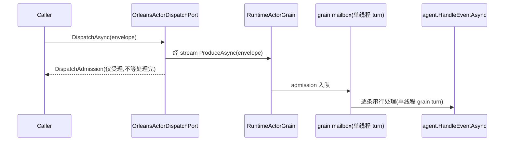
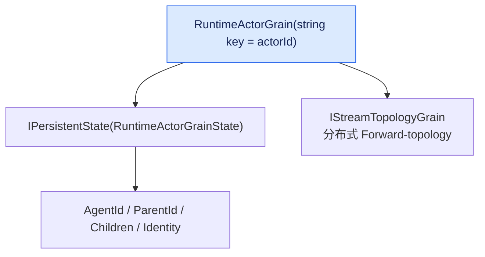

# Orleans Runtime:同一组原语在分布式下的语义

## 本篇涉及的设计抽象

> 以下论断均可回指 `~/Code/aevatar` 源码验证,但本篇用设计语言描述,不贴文件路径/行号。

---

## 同一组原语,分布式实现

Foundation 三原语(`IActorRuntime` / `IActorDispatchPort` / `IEventPublisher`)在 Local 和 Orleans 是**同一抽象的两种实现**。Orleans 实现:

- `OrleansActorRuntime`:`GetGrain<IRuntimeActorGrain>(actorId)`——**Orleans virtual actor 保证全局单激活**
- `OrleansActorDispatchPort`:`DispatchAsync` → grain → 经 stream `ProduceAsync(envelope)` → 邮箱串行 admission → 返回 `DispatchAdmission`
- `OrleansGrainEventPublisher`:实现 `IEventPublisher`(经 stream publish)

注意 `DispatchAsync` 的返回语义和 Local 一致:只表示"已受理进入 dispatch 路径",不表示 handler 已跑完——这条边界在 [03/01](../03/01-agent-actor-runtime.md) 讲过,分布式下同样成立。

---

## RuntimeActorGrain:实际激活

`RuntimeActorGrain` 是 string-keyed grain(`IGrainWithStringKey`,`IRuntimeActorGrain`)= **每 actorId 集群单激活**。

- `[ImplicitStreamSubscription]` + `IPersistentState(RuntimeActorGrainState)`
- `OnActivateAsync`:从持久化 kind 解析 identity、绑定 agent
- `HandleEnvelopeAsync`:**单线程 grain turn = 邮箱串行处理**;内含 dedup、routing、`agent.HandleEventAsync`
- self-stream 订阅:`SubscribeSelfStreamAsync` / `OnSelfStreamEventAsync` 把事件喂进 mailbox

`RuntimeActorGrainState`(`[GenerateSerializer]`)持有 `AgentId`、`ParentId`、`Children`、`Identity`——这就是 [03/05](../03/05-routing-and-topology.md) 说的"拓扑事实在 Orleans 存于 grain state"的落点。

---

## 分布式拓扑存储

- `IStreamTopologyGrain`:分布式 Forward-topology grain;
- `OrleansDistributedStreamForwardingRegistry`:分布式 `IStreamForwardingRegistry`;
- `AddAevatarFoundationRuntimeOrleansStreaming()`:把 forwarding 注册替换成 Orleans 分布式实现。

---

## ADR-0002 §8(无独立 Orleans ADR)

- §8.1 三模式:InMemory / MassTransit(历史) / Orleans
- §8.2 Orleans 分布式拓扑:virtual actor + Kafka + Garnet
- §8.3 config keys:`ActorRuntime:Provider=Orleans`、`OrleansStreamBackend=KafkaProvider`、`OrleansPersistenceBackend=InMemory|Garnet`

> 目前没有独立的 Orleans Runtime ADR,分布式 Runtime 架构记录在 ADR-0002 §8。Orleans 相关代码量很大,补一份合并性的 "Orleans Runtime" ADR 已登记 [08/04 P2-4](../08/04-todo-list.md)。

---

## 验收

1. Orleans 怎么保证全局单激活?(string-keyed grain,每 actorId 一个激活)
2. grain turn 和邮箱串行的关系?(单线程 grain turn = 邮箱串行)
3. Local 和 Orleans 是同一抽象吗?(是,同一组三原语的两种实现)
4. 分布式拓扑存哪?(`IStreamTopologyGrain` + grain state `Children`/`ParentId`)

⟦AI:AUTO-LOOP⟧
