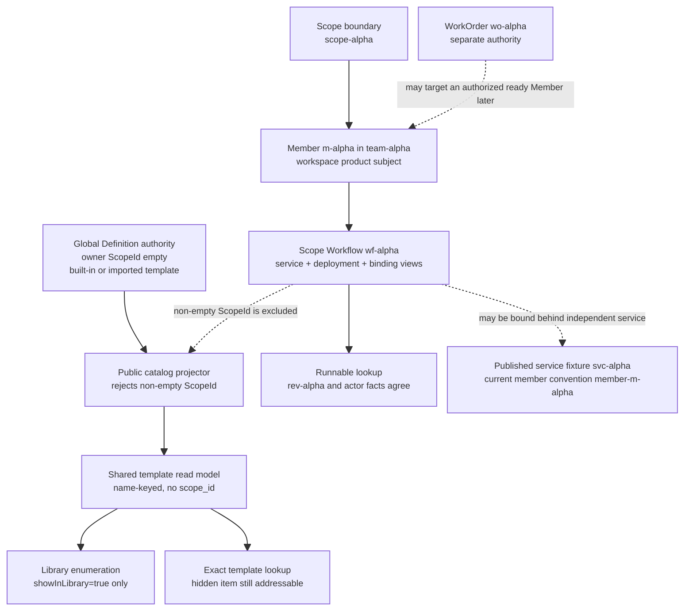
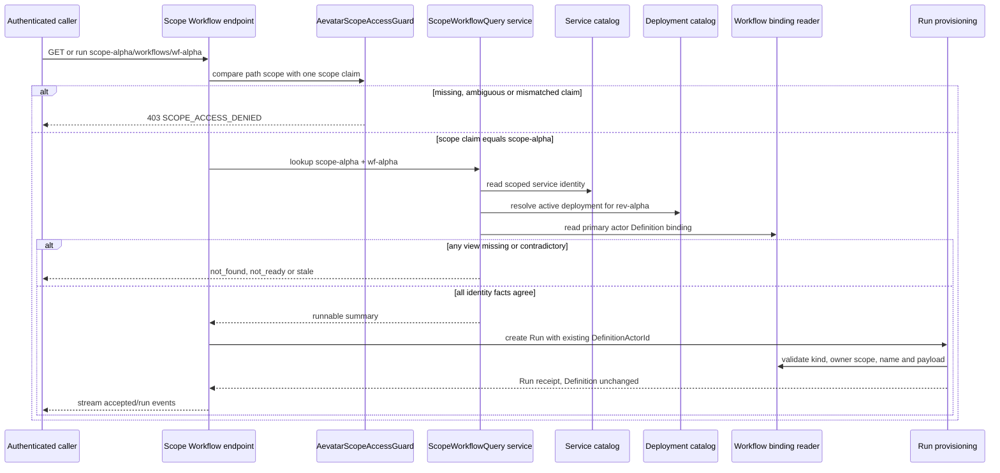
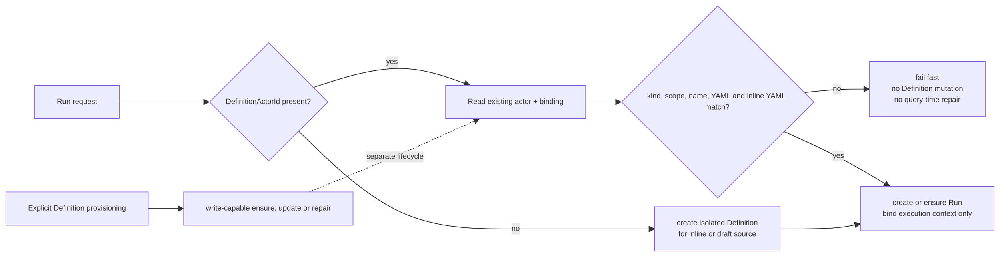

# Workflow Catalog 可见性与 Scope 授权：公共模板不是私有可运行资源

> 版本与结论：本章描述 `current`。Aevatar 把公共 Workflow template catalog 与 scope-owned Workflow 分成两条读写链：公共 catalog 在投影写入时只接收 owner scope 为空的 Definition，scope 私有定义根本不进入共享文档；scope Workflow 则从 service、deployment 与 actor-binding read model 组合出 `not_found | not_ready | stale | runnable`。`showInLibrary` 只控制公共模板是否可枚举，不代表 scope 资源已可运行；Run provisioning 复用非空 `DefinitionActorId` 时只验证，不改写 Definition。

## 设计抽象与事实源

- `docs/canon/workflow-catalog-visibility.md:11`、`:22`、`:28`、`:37`：定义公共 template、scope Workflow、Run/Definition 写边界与 `showInLibrary` 语义。
- `src/workflow/Aevatar.Workflow.Projection/Projectors/WorkflowCatalogCurrentStateProjector.cs:40`、`:48`、`:61`、`:67`：公共 catalog 只消费 committed Definition binding，非空 `ScopeId` 在写入前直接跳过。
- `src/workflow/Aevatar.Workflow.Projection/Workflows/WorkflowCatalogReadModelQueryPort.cs:20`、`:23`、`:34`、`:47`：query port 只读 freshness-bearing catalog documents，不发现文件、不解析私有 scope，也不触发 projection。

## 四层语义必须分开

Task 11 的身份夹具继续保持不相等：

| 身份 | 示例 | 本章用途 | 不能替代 |
|---|---|---|---|
| scope | `scope-alpha` | 私有 Workflow 的访问与 owner boundary | Team、Member 或 service |
| Team | `team-alpha` | workspace 中的可选分组 | catalog template |
| Member | `m-alpha` | Team-owned Workflow 的产品主体 | `wf-alpha` |
| draft Workflow | `wf-alpha` | scope 内的逻辑 Workflow / service lookup identity | `m-alpha` 或 template name |
| revision | `rev-alpha` | runnable lookup要求一致的active deployment revision | Workflow identity |
| published service | `svc-alpha` | Member authority返回的独立service identity夹具 | Workflow identity |
| WorkOrder | `wo-alpha` | 后续durable intent | template或Run |

公共 template 使用自己的精确 `template_name`；它不是这张表中的任一产品 identity。`svc-alpha` 仍只表示 authority-returned service ID；冻结 helper 对 `m-alpha` 的 current create convention 是 `member-m-alpha`。无论字符串是否相似，catalog query、scope Workflow route、Member route、service route与WorkOrder route都不能互换ID。



这四层分别是：

1. **公共可见**：Definition owner scope为空，允许进入共享catalog。
2. **library可枚举**：公共document还要满足`showInLibrary=true`才出现在list tool。
3. **精确可寻址**：隐藏的公共primitive/demo不参与枚举，但可用精确template name读取detail。
4. **scope runnable**：`scope-alpha/wf-alpha`的service、deployment与Definition binding读侧事实一致。

前三层都不等于第四层。公共template YAML是浏览/导入来源；它没有自动变成`scope-alpha`中的`wf-alpha`，也没有成为`m-alpha`的implementation，更不证明`rev-alpha`或`svc-alpha`已发布。

## 公共 catalog：安全边界在写入侧

公共 projector 只接受标准 committed envelope中的 `BindWorkflowDefinitionEvent`，解出 `WorkflowState` 后先检查`ScopeId`。只要非空就返回，不生成document；owner scope为空、name与YAML有效时才解析definition并写入：

- key是normalized `workflowName`，不是`scopeId + workflowId`；
- document包含YAML、role system prompt、steps、edges、connectors、workflow calls与authorization dependencies；
- `StateVersion + LastEventId + UpdatedAt`保留authority与freshness坐标；
- `source/category`只做group、sort、label与`showInLibrary`分类。

因为document包含可能敏感的YAML和system prompt，同名scope私有定义若混入，不仅跨tenant泄漏，还会在name-keyed ID上互相覆盖。因此最小且正确的防线是“私有事实永不写入共享read model”，而不是把私有文档先放进去，再要求每个query/tool记得做scope filter。

`WorkflowCatalogReadModelQueryPort`本身没有scope参数：list读取最多1000个共享documents并排序，get按trimmed exact name读一个document。这个无scope接口是共享catalog语义的结果，不是授权豁免。若私有document已被历史版本污染，query path不会删除或修复；必须走独立后台migration。

## Scope Workflow：授权与 runnable 是两道门



所有scope Workflow upsert、save-and-bind、list、detail与run入口先调用`AevatarScopeAccessGuard`。认证启用时，它只接受一个明确的`scope_id`或`workflow.scope_id`值；缺失、多个不同值、或与path中的`scope-alpha`不相等都返回403。没有“admin看任意scope”的旁路。开发环境可显式关闭auth，非Development即使配置false也会重新启用。

授权通过后，`LookupByWorkflowIdAsync`才判断可运行性：

| 状态 | current判定 | 解释 |
|---|---|---|
| `not_found` | scoped service catalog中没有`wf-alpha` identity | 资源不可见，不从公共template fallback |
| `not_ready` | deployment read model缺失、runtime facts不完整或actor binding缺失 | accepted/published链尚未观察闭合 |
| `stale` | service catalog与deployment的revision/deployment/actor不一致，或binding指向另一Definition | 读侧矛盾，拒绝猜一个winner |
| `runnable` | active deployment含非空`revisionId + deploymentId + primaryActorId`，且binding的effective Definition actor与primary actor相等 | 当前scope lookup可交给Run provisioning |

因此`showInLibrary=true`不是runnable flag；scope list里出现summary也不保证某条lookup runnable；run endpoint必须重新走lookup。`rev-alpha`只在deployment事实与service catalog相符时有意义，`svc-alpha`或current实际`member-m-alpha`也不能拿来代替`wf-alpha`访问scope Workflow route。

## Run provisioning 只消费 Definition，不顺手改写

Run请求带非空`DefinitionActorId`时，`ResolveDefinitionActorForRunAsync`只做以下验证：

1. actor必须已存在；
2. binding read model必须存在且`ActorKind=Definition`；
3. 两边scope都非空时必须相等；global Definition的空owner scope可供不同run scope复用；
4. Workflow name必须兼容；
5. root YAML与所有inline YAML必须逐值一致。

任一检查失败都在创建Run前报错，且不向Definition actor发送bind event。只有`DefinitionActorId`为空的inline/draft/fork路径，Run provisioning才创建一个隔离Definition并绑定请求payload。显式`EnsureDefinitionAsync`是另一个write-capable provisioning入口，允许创建、更新或修复Definition；Run入口永远不借它修复binding read model或覆盖YAML。



这条边界阻止Run请求把catalog模板、旧binding或不同scope的payload当成一次“方便的更新”。运行时要的是稳定输入快照；Definition变更需要独立command、审计和projection收敛。

!!! warning "当前边界：空 scope 的兼容检查较宽"

    Run provisioning的scope compatibility只在**两边都非空**且不同才拒绝。global Definition owner scope为空时跨scope复用是设计目标；但若调用方对一个scope-owned Definition提交空run scope，current helper也会放行。正常scope endpoints把path scope写入Run context并在入口鉴权，因而不触发此分支；底层port本身不能被当作完整authorization boundary。若未来出现不经scope endpoint的调用者，应要求scope-owned Definition必须携匹配的non-empty run scope，或在上层提供等价的typed authorization proof。该缺口应登记到`12/05-open-gaps-and-canon-drift.md`。

## `showInLibrary`、精确读取与导入

公共catalog projector按name/source/category分类。已知primitive mini examples（例如索引1–7）标记`showInLibrary=false`；其他starter、AI、interactive、integration与advanced模板通常为true。Agent tool遵循两个不同合约：

- `aevatar_list_workflow_templates`先读共享catalog，再只返回`ShowInLibrary=true`的项目；
- `aevatar_get_workflow_template`按exact name读取detail，不再次要求`ShowInLibrary`。

隐藏项目因此是“公共但不建议枚举”，不是“scope私有”。精确读取也只是获得template detail，不会自动创建`wf-alpha`。要成为scope-owned runnable Workflow，必须经过scope Workflow command / save-and-bind链，形成service、revision、deployment与binding事实，再由runnable lookup观察。

Chat语义也保持分离：没有template/public/example/library限定词时，“workflow”默认指当前workspace的Team-owned Member，使用Member read model与`m-alpha`；只有明确询问模板库才用公共template tools。Prompt帮助选工具，但projection和Host guard才是权限边界。

## 最小静态示例

> Demo status：`verified-static`（按冻结canon、public catalog projector/query port、scope Workflow query/endpoint、template tools与Run provisioning静态核对；未启动Host、未执行真实cross-scope请求，也未清理历史catalog污染。）

固定identity：

```yaml
scopeId: scope-alpha
teamId: team-alpha
memberId: m-alpha
draftWorkflowId: wf-alpha
revisionId: rev-alpha
publishedServiceId: svc-alpha  # authority-returned fixture
workOrderId: wo-alpha
currentMemberCreateConvention: member-m-alpha
publicTemplateName: daily_digest
```

三种读取不能互换：

```text
aevatar_list_workflow_templates()
aevatar_get_workflow_template({"template_name":"daily_digest"})
GET /api/scopes/scope-alpha/workflows/wf-alpha
```

静态预期：前两条只读owner scope为空的共享catalog；list只列`showInLibrary=true`，get可按名取隐藏公共项。第三条要求caller唯一scope claim等于`scope-alpha`，并且只有service/deployment/binding views一致才返回runnable detail。`team-alpha`、`m-alpha`、`rev-alpha`、`svc-alpha`、`wo-alpha`或`member-m-alpha`都不能替代path里的`wf-alpha`。

## 为什么是它，不是别的

**为什么在projection写入处排除私有Definition，而不是query时filter？** 共享document包含YAML与system prompt，且按name keyed。让私有数据先进入意味着任何漏filter的consumer都会泄漏，同名scope还会互相覆盖。按构造保持共享store无私有数据，边界最小且可审计。

**为什么公共template与scope Workflow分两套query？** 前者回答“有哪些可复用示例”，后者回答“当前tenant发布了什么并能否运行”。合并接口会迫使每个item携带不同owner/auth/runnable语义，也会诱导Chat把template当用户资产。

**为什么`showInLibrary`不等于runnable？** 它只是一项浏览分类，隐藏公共项仍可精确读取；scope runnable需要service、active deployment和Definition binding的一致证据。把二者合并会让UI标志承担部署授权。

**为什么Run入口不修Definition？** Run是执行资源，Definition是版本化输入authority。若一次Run能顺手覆盖YAML或scope，重试会改变未来运行的输入，也绕过显式provisioning与审计。验证并复用让失败可见，空ID隔离definition则服务真正的inline/draft用例。

**为什么scope guard之外还要runnable lookup？** scope claim只证明caller可访问`scope-alpha`，不证明`wf-alpha`已发布或各read model一致；runnable只证明资源当前可执行，不证明caller属于该scope。两道门分别处理authorization与readiness，缺一不可。

## 边界与演进

- public catalog query一次`Take=1000`，没有cursor。若共享模板超过上限，当前list会截断且无coverage信号；需要分页或完整性契约后才能宣称“全部模板”。
- 历史版本若已把scope私有Definition写入公共store，current projector的skip只阻止新增污染，不会删除旧document。清理必须运行独立migration并核对name collisions，不能在GET时顺手修。
- scope query的`ListAsync`会列出service summaries，即使某项尚未runnable；detail/run按ID会返回typed not-ready/stale。UI不能把list存在当成可运行保证。
- scope-owned Definition对两个不同non-empty scope fail closed；empty requested scope当前被兼容放行。底层port调用者必须提供匹配scope或等价授权证明。
- general Service endpoints使用另一套`tenant_id + app_id + namespace` identity claims。open `#2389`记录了认证会话缺这些claims时`/api/services`返回403；这不应通过放宽scope Workflow guard来修，也不能把scope claim自动当成完整service identity。应在`10/05-authentication-scope-and-admin-authorization.md`与`12/05`跟踪issuer/claim contract。
- `AevatarScopeAccessGuard`允许Development显式关闭auth，生产配置false仍强制启用。任何demo结论必须标明环境，不能从本地未鉴权成功外推生产授权。
- `svc-alpha`是概念夹具，current `m-alpha` create convention为`member-m-alpha`；两者都不是`wf-alpha`。consumer只使用authority返回值，不从prefix猜身份。

## 读完应能回答

1. `scope-alpha`、`team-alpha`、`m-alpha`、`wf-alpha`、`rev-alpha`、`svc-alpha`与`wo-alpha`分别属于哪类资源，为什么公共template name也不能替代它们？
2. 为什么scope私有Definition必须在public catalog projector写入前被排除，而不是靠query filter？
3. `showInLibrary=true`、精确可读取与`runnable`分别证明什么？
4. `scope-alpha/wf-alpha`从not-ready到runnable需要哪些service、deployment与binding事实一致？
5. Run复用已有Definition时为何只能验证不能改写，global与scope-owned Definition的scope规则有何不同？

<details>
<summary>论断—证据映射</summary>

| 论断 | 等级 | 证据 |
|---|---|---|
| public projector只消费committed Definition bind且跳过非空ScopeId | E1 | `src/workflow/Aevatar.Workflow.Projection/Projectors/WorkflowCatalogCurrentStateProjector.cs:40`、`:48`、`:56`、`:61`、`:67` |
| public document按name keyed并包含YAML、system prompt、capability与freshness字段 | E1 | `src/workflow/Aevatar.Workflow.Projection/Projectors/WorkflowCatalogCurrentStateProjector.cs:77`、`:95`、`:108`、`:134`、`:136`、`:138`、`:142`、`:168` |
| catalog query port无scope参数，只读最多1000个documents或按exact name读取 | E1 | `src/workflow/Aevatar.Workflow.Projection/Workflows/WorkflowCatalogReadModelQueryPort.cs:23`、`:34`、`:41`、`:47`、`:49`、`:51` |
| classification把部分primitive标为hidden，list tool过滤ShowInLibrary而exact get不再过滤 | E1 | `src/workflow/Aevatar.Workflow.Projection/Workflows/WorkflowCatalogClassificationPolicy.cs:68`、`:90`、`:114`、`:148`；`src/Aevatar.AI.ToolProviders.Workflow/Tools/AevatarWorkflowCatalogTools.cs:42`、`:50`、`:67`、`:124` |
| scope Workflow endpoints对upsert/save/list/get/run都执行scope guard | E1 | `src/platform/Aevatar.GAgentService.Hosting/Endpoints/ScopeWorkflowEndpoints.cs:106`、`:116`、`:142`、`:151`、`:181`、`:193`、`:216`、`:228`、`:256`、`:267`、`:305`、`:315` |
| scope guard要求唯一scope claim与path一致，非Development无法关闭auth | E1 | `src/Aevatar.Capabilities/AevatarScopeAccessGuard.cs:57`、`:98`、`:109`、`:115`、`:124`、`:130`、`:136`、`:143`、`:154` |
| scope runnable lookup显式区分not-found、not-ready、stale与runnable | E1 | `src/platform/Aevatar.GAgentService.Application/Workflows/ScopeWorkflowQueryApplicationService.cs:62`、`:70`、`:81`、`:97`、`:107`、`:116`、`:136` |
| existing Definition run provisioning只验证actor/binding/scope/name/payload，不进入write-capable ensure路径 | E1 | `src/workflow/Aevatar.Workflow.Infrastructure/Runs/WorkflowRunActorPort.cs:266`、`:270`、`:274`、`:281`、`:288`、`:294`、`:302`、`:311`、`:325` |
| DefinitionActorId为空才创建隔离Definition，非空missing或payload mismatch直接失败 | E1 | `src/workflow/Aevatar.Workflow.Infrastructure/Runs/WorkflowRunActorPort.cs:270`、`:272`、`:275`、`:302`、`:370` |
| global Definition可供不同run scope复用且不被改写，两个不同non-empty scope-owned owner被拒绝 | E1 | `src/workflow/Aevatar.Workflow.Infrastructure/Runs/WorkflowRunActorPort.cs:537`、`:542`、`:544`；`test/Aevatar.Workflow.Host.Api.Tests/WorkflowRunActorPortBranchTests.cs:548`、`:572`、`:591`、`:595`、`:616`、`:625` |
| authenticated general service identity缺tenant/app/namespace claims会返回403，属于不同授权面 | E1 | `src/platform/Aevatar.GAgentService.Governance.Hosting/Identity/ServiceIdentityEndpointAccess.cs:13`、`:25`、`:31`、`:45`、`:87`、`:94`、`:121`、`:124` |
| canon明确公共/私有资源、run不改Definition与污染离线修复边界 | E2 | `docs/canon/workflow-catalog-visibility.md:13`、`:22`、`:28`、`:37`、`:45`、`:60` |

</details>
