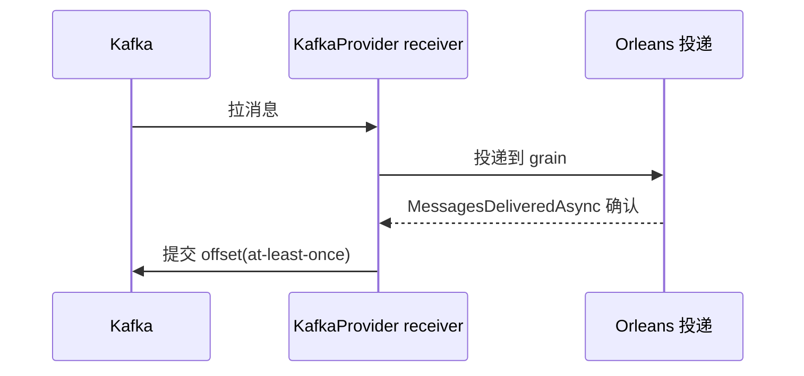

# Kafka Transport(Orleans KafkaProvider)插件 + ADR-0003 设计

## 本篇涉及的设计抽象

> 以下论断均可回指 `~/Code/aevatar` 源码验证,但本篇用设计语言描述,不贴文件路径/行号。

---

## ⚠️ MassTransit 已退役

README 提到 MassTransit/Kafka,但 **MassTransit 是历史路径,已完全退役**:

- 目录 `...Transport.Implementations.MassTransitKafka/` 无源码 / 项目文件(只剩 build artifact);
- 不在 `aevatar.slnx` 或任何 `.slnf`;
- CI 守卫禁止 MassTransit v9、pin v8.x;
- ADR-0002 §8.1 明确标 MassTransit 为"历史路径"。

> 注:`Directory.Packages.props` 里还留着 MassTransit 的 `PackageVersion` 死条目(零消费,仅靠 guard 挡 v9),清理已登记 [08/04](../08/04-todo-list.md)。

**当前生产 transport = Orleans 原生 KafkaProvider backend**——本质是一个手写 `Confluent.Kafka` 客户端,藏在 Orleans `IQueueAdapter` 之后。


---

## KafkaProvider:Kafka partition 与 Orleans queue 收敛

`KafkaQueuePartitionMapper` 让 Kafka partition 绑定与 Orleans queue 所有权**收敛到一个 runtime slot**。映射规则:

```
PartitionId = SHA256(StreamNamespace + "\n" + StreamId) % QueueCount
```

三层 ID 对齐:业务 stream ↔ Kafka partition ↔ Orleans queue 一一对应。

**commit 边界**:Kafka offset 仅在 Orleans `MessagesDeliveredAsync` 确认后才提交——所以语义是 **at-least-once**。



**拓扑不变量**:`QueueCount == TopicPartitionCount`;多 silo 要求共享持久 runtime state(不能用 InMemory pubsub)。

---

## 配置

`KafkaProviderTransportOptions`:

| 选项 | 默认 |
|---|---|
| `BootstrapServers` | `localhost` |
| `TopicName` | — |
| `ConsumerGroup` | — |
| `TopicPartitionCount` | 8 |
| `ProducerMaxMessageBytes` | 10MB |
| `ProducerCompressionType` | Gzip |

启用:`AddAevatarFoundationRuntimeOrleansKafkaProviderTransport`;config key `OrleansStreamBackend=KafkaProvider`。

---

## ADR-0003 Non-Goals

- 不做 exactly-once(只保证 at-least-once);
- 不支持自由分区扩展;
- 不兼容 InMemory 多 silo。

---

## 验收

1. 当前 Kafka transport 是 MassTransit 吗?(不是,是 Orleans KafkaProvider;MassTransit 已退役)
2. Kafka partition 和 Orleans queue 的关系?(收敛到一个 slot,`SHA256 % QueueCount`)
3. commit 语义?(at-least-once,Orleans 确认后才提交 offset)
4. QueueCount 和 TopicPartitionCount 的关系?(必须相等,拓扑不变量)

⟦AI:AUTO-LOOP⟧
