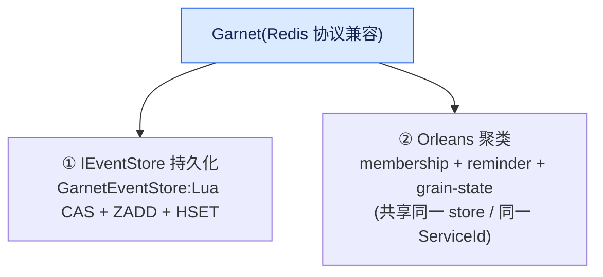
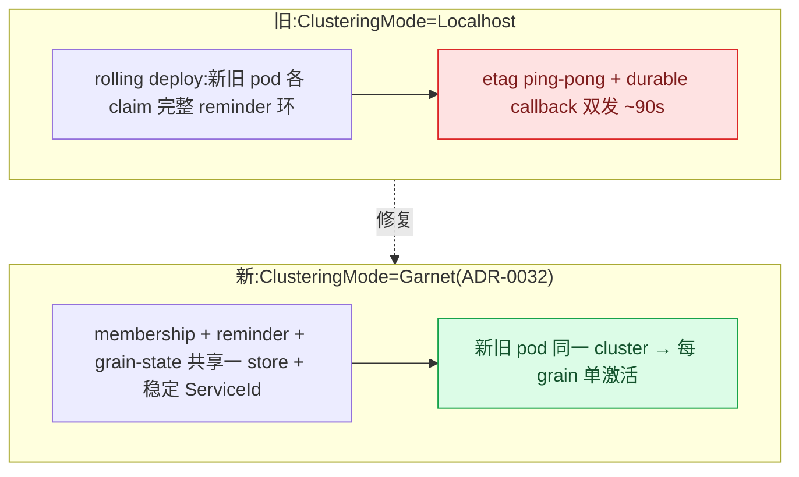

# Garnet 生产聚类 + 持久化实现

## 本篇涉及的设计抽象

> 以下论断均可回指 `~/Code/aevatar` 源码验证,但本篇用设计语言描述,不贴文件路径/行号。

---

## Garnet 的两个生产职责

Garnet(Redis 协议兼容)在生产里同时干两件事:

### 1. IEventStore 持久化

`GarnetEventStore` 实现 `IEventStore`。核心是 Lua 脚本做 OCC CAS(`AppendScript`):

- CAS on `VersionKey`(乐观并发);
- `ZADD` 到 sorted-set index(版本排序);
- `HSET` 到 data hash(事件 payload)。

key layout:`{prefix}:{agentId}:version|index|data`,hash-tag `{agentId}` 保证 Redis-cluster slot 亲和。版本不连续或 OCC 冲突时抛 `EventStoreOptimisticConcurrencyException`(这正是 [03/04](../03/04-state-guard-and-event-sourcing.md) 说的 OCC 来源)。`DeleteEventsUpToAsync` 做 snapshot 压缩。DI 用 `AddGarnetEventStore` 注册 `IConnectionMultiplexer` 并替换 `IEventStore`。

### 2. Orleans 聚类 / membership / grain-state / reminder

`ClusteringMode=Garnet`:需 `OrleansGarnetConnectionString`;`UseRedisClustering(...)` over 同一 Garnet 连接串;membership + reminder table + grain state **共享同一 Garnet store + 同一 ServiceId**。

---

## ADR-0032:为什么需要共享 Garnet membership

- **Context**:生产曾用 `ClusteringMode=Localhost` + 共享 Garnet grain-state/reminder。每次 rolling deploy,新旧 pod 都 claim 完整 reminder 环 → `InconsistentStateException` etag ping-pong + durable callback 双发,持续约 90s。
- **Decision**:加 `Orleans:ClusteringMode=Garnet`(经 `Microsoft.Orleans.Clustering.Redis`,同一 Garnet 连接串)。membership + reminder + grain-state 共享一个 store + 稳定 `ClusterId`/`ServiceId` → 每 grain 单激活。`Distributed` profile 默认 `Garnet`;`Localhost` 留给 dev。
- **Consequences**:pod 须在 overlap 期互通 silo port 11111;graceful shutdown 把 reminder 环交给存活 silo;Garnet 须支持 Orleans Redis providers 的命令面(含 Lua,`RedisGrainStorage` 的 etag 写已验证)。

---

## 验收

1. Garnet 做哪两件事?(`IEventStore` 持久化 + Orleans 聚类/membership/grain-state/reminder)
2. `GarnetEventStore` 怎么做 OCC?(Lua CAS on `VersionKey` + `ZADD` + `HSET`)
3. 为什么需要共享 Garnet membership?(否则 rolling deploy 双 owner → etag ping-pong + callback 双发)
4. membership / reminder / grain-state 共享什么?(同一 Garnet store + 同一 ServiceId)

⟦AI:AUTO-LOOP⟧
