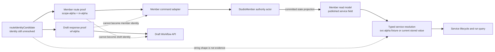
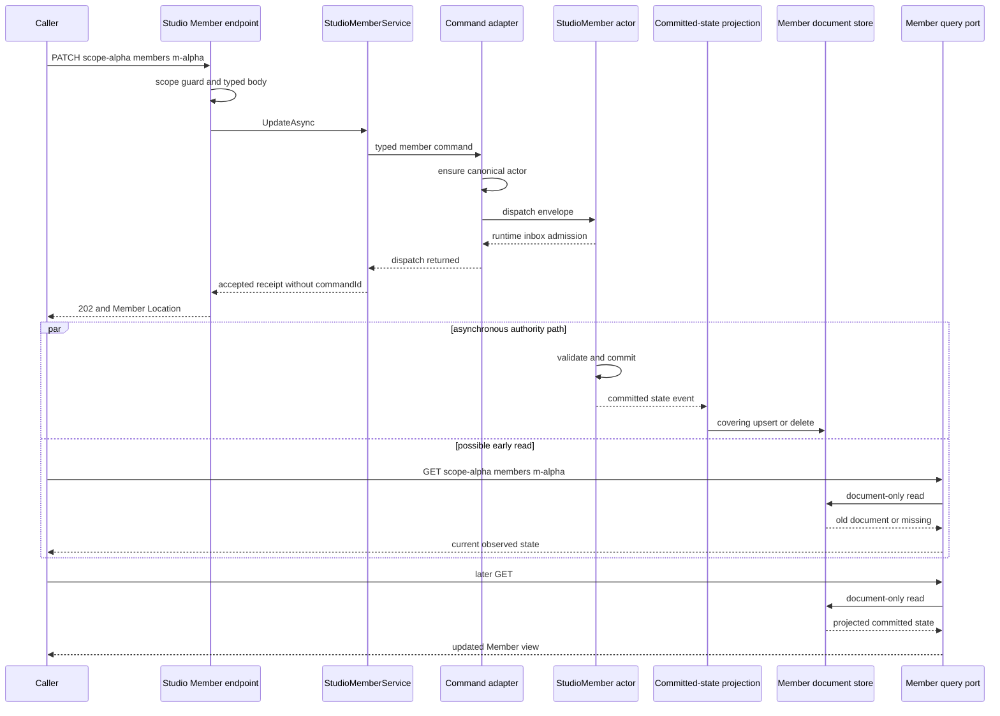
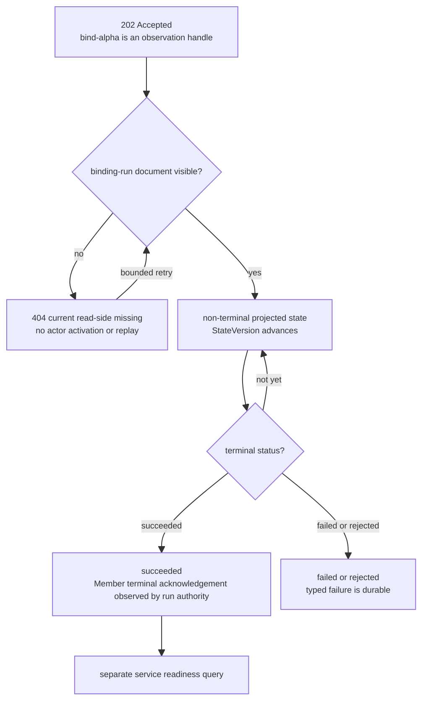

# Studio Command、ACK 与 Read Model：受理不是提交，查询不是修复

> 版本与结论：本章描述 `current`。Studio Member 写入口把已验证的 typed command 投递给 actor，HTTP `202 Accepted` 只确认请求越过当前 admission / dispatch 边界；actor commit 与 projection observation 是后续两个独立事实。Member 与 binding-run 查询只读 projection document，不激活 actor、不重放 EventStore，也不在请求栈内补投影。任何可能同时表示 Member、draft Workflow 或 published service 的值，必须先保留为 identity candidate，再由 route contract 或 Member authority/read model 一次性解析。

## 设计抽象与事实源

- `src/Aevatar.Studio.Hosting/Endpoints/StudioMemberEndpoints.cs:47`、`:53`、`:155`、`:175`、`:348`、`:449`、`:461`、`:474`：Member 路由、bind/PATCH/DELETE 的 HTTP receipt 与稳定 observation Location。
- `src/Aevatar.Studio.Projection/CommandServices/ActorDispatchStudioMemberCommandService.cs:35`、`:76`、`:259`、`:273`、`:289`、`:404`：command adapter 规范化 identity、ensure authority actor 并只做 dispatch。
- `src/Aevatar.Studio.Projection/QueryPorts/ProjectionStudioMemberQueryPort.cs:37`、`:47`、`:70`、`:77`、`:89`、`:98`：Member list/detail 只读 document store，scope/team filter 在分页前下推。

## 先分清 identity，再选择 API

Task 11 的夹具故意让所有身份不相等：

| 身份 | 夹具 | 确定来源 | 可进入的边界 | 绝不能替代 |
|---|---|---|---|---|
| scope | `scope-alpha` | authenticated caller 与 path scope 校验 | scope guard、所有 scoped query/command | Team、Member、service |
| Team | `team-alpha` | Team route/read model | Team detail、Member roster filter | `m-alpha` |
| Member | `m-alpha` | Member route 或 Member read model | `/members/{memberId}`、Member bind/run route | `wf-alpha`、`svc-alpha` |
| draft Workflow | `wf-alpha` | draft API response 或 typed binding body | draft API、Member binding body的`workflowId`字段 | Member path |
| revision | `rev-alpha` | publish/binding result或service revision catalog | revision action、readiness comparison | Workflow或service identity |
| published service | `svc-alpha` | Member authority/read model或typed resolver结果 | service lifecycle与run query | Member、draft Workflow |
| binding run | `bind-alpha` | bind accepted receipt | `binding-runs/{bindingRunId}` | service run |
| WorkOrder | `wo-alpha` | WorkOrder authority | WorkOrder command/query | Studio command或Workflow run |

`svc-alpha`在本章只表示“authority 已明确返回的 published service identity”这一合同夹具。冻结实现中新建`m-alpha`时，Member authority按 current convention保存的是`member-m-alpha`；客户端仍不能自行拼接这个字符串。它必须读取 Member summary/resolve contract保存的值，因为命名约定不是跨版本身份转换协议。

上游治理规则要求：来源尚未确定的值先命名为`routeIdentityCandidate`或`bindingIdentityCandidate`，不能提前叫`memberId`、`workflowId`或`publishedServiceId`。冻结代码没有一个统一的`IdentityCandidate`对象；这是边界上的命名与解析纪律，不应虚构成 current domain type。最小解析表如下：

| candidate 来源 | 唯一可接受的解析证据 | 解析后名称 | 下一步 |
|---|---|---|---|
| `/members/{segment}` 的资源位 | Member route template + scope guard | `memberId` | Member command/query |
| draft API 的`workflowId`字段 | typed draft response/binding spec | `draftWorkflowId` | draft API或Member bind body |
| Member summary 的`publishedServiceId` | Member current-state document | `publishedServiceId` | service lifecycle/run query |
| `IMemberPublishedServiceResolver`结果 | typed resolution及`IsMemberAuthorityBacked` | `publishedServiceId` | member-first invoke/run path |

字符串相等、共同前缀、路由位置猜测和“历史上一直这么叫”都不是解析证据。尤其不能把`wf-alpha`发到Member API，也不能把`m-alpha`发到draft API。



## Canonical command skeleton：一次写入跨三条边界

Studio Member mutation的共同骨架是：

1. Host先用path中的`scopeId`执行scope access guard，再把body解析成typed request。
2. Application service验证字段与必要前置条件；它可以读取read model做显式业务检查，但不能把查询结果伪装成actor commit。
3. Command adapter规范化`scopeId/memberId`，ensure canonical actor，再dispatch typed event envelope。
4. Runtime返回admission。内部receipt有`CommandId`、`CorrelationId`、`ActorId`与`AckedAt`，语义仍只是accepted-for-dispatch。
5. Actor在自己的turn中验证不变量并commit；标准committed-state链随后物化Member或binding-run document。
6. GET/tool只读取document。读到旧值或missing时返回当前read-side事实，不反向调用actor或EventStore。

不同HTTP入口复用这个骨架，但公开receipt并不完全相同：

| 入口 | 当前HTTP结果 | 已证明 | 未证明 | observation handle |
|---|---|---|---|---|
| `POST /api/scopes/{scopeId}/members` | `201 Created` + locally built summary | create event已dispatch，返回稳定Member Location | Member event已commit、Member document已可读、Team roster已收敛 | Member Location |
| `PATCH .../members/{memberId}` | `202 Accepted` + `status/scopeId/memberId/ackedAt` | 所请求的dispatch调用已返回 | 所有字段原子提交、投影已更新 | Member Location |
| `DELETE .../members/{memberId}` | `202 Accepted` + `delete_accepted` | delete request已dispatch | tombstone已commit、document已移除、service artifacts已清理 | Member Location |
| `PUT .../members/{memberId}/binding` | `202 Accepted` + `bindingRunId`、`ackStage=dispatch_accepted`；capability admission 不通过时直接 `400 STUDIO_MEMBER_EXTERNAL_CAPABILITY_NOT_READY`（body 含 readiness 详情，发生在 run 创建之前，**没有** accepted receipt） | candidate binding-run已dispatch | Member已admit、platform bind成功、Member已ack、service已ready | binding-run Location |

Create的`201`与summary也不能被扩大解释为read-model-ready：summary直接由规范化输入与current convention构造。PATCH/DELETE的公开`StudioMemberCommandResponse`没有暴露内部`CommandId/CorrelationId`；bind则用独立`bindingRunId`作为长流程观察身份，不等于dispatch command ID。

PATCH还有一个必须显式保留的current边界：一个body可同时包含`displayName`、`teamId`和`implementationRef`，Application service会顺序dispatch最多三个命令，而不是一次原子actor command。前一个已受理、后一个失败时可能形成部分变更；单个`202`不能证明“三字段全有或全无”。



## `accepted → committed → observed` 不能折叠

| 阶段 | owner / evidence | 可以下的结论 | 不能下的结论 |
|---|---|---|---|
| accepted | actor runtime/inbox admission；HTTP receipt | envelope被接收用于dispatch | handler执行、event commit、业务成功 |
| committed | Member或binding-run actor持久化的domain/current-state event | authority不变量已通过且状态版本推进 | 任一consumer已看到新版本 |
| observed | projection document的`StateVersion/LastEventId/UpdatedAt`或typed result | 该read model已物化某个committed版本 | 所有其他read model与runtime plane都同步 |
| ready | service catalog、serving target、traffic/artifact readiness的组合观察 | 对指定revision/endpoint当前可调用 | 未来永不漂移 |

Binding尤其需要这个分层。`202`返回的`bindingRunId`只是candidate run；run read model随后可展示`admission_pending → admitted → platform_binding_pending → member_notification_pending → succeeded`，或terminal `failed/rejected`。只有run在platform result之后收到Member terminal acknowledgement，才进入最终success。即使如此，service readiness仍是另一套consumer observation。

刚拿到binding-run Location时，projection document可能尚不存在。当前query port返回`null`，Host统一映射为`404 STUDIO_MEMBER_BINDING_RUN_NOT_FOUND`；这个形状无法区分“从未存在/identity错误”与“已accepted但尚未物化”。正确的客户端行为是只用receipt给出的Location做有界重试，并把持续404当未决/失败处理；查询端不能为了消除404去激活run或重放EventStore。



## Read model 是查询合同，不是 authority 替身

| read model | authoritative actor | committed version | consumer | query约束 |
|---|---|---|---|---|
| Member current state | `StudioMemberGAgent` | committed state event version | Member endpoints、Studio query tools、published-service resolver | list在store内按`scope_id`与可选`team_id`过滤后分页；detail按canonical actor ID读取并复核scope |
| binding-run current state | `StudioMemberBindingRunGAgent` | run committed state event version | binding-run status endpoint、Member detail hydration | key按`bindingRunId`，返回前同时核对scope、member与run ID |
| service run catalog | service/run authorities经projection形成的registry | service run snapshot | `/members/{memberId}/runs` | 先把Member解析为published service，再把可选`scheduleId/status/time`过滤下推 |

`ProjectionStudioMemberQueryPort`的依赖只有document reader。list最大页为200，scope filter永远存在，team filter若提供则在pagination前下推；返回后还复核每条document的scope。detail只读`studio-member:{scopeId}:{memberId}`对应document并再次校验scope。missing就是当前read side missing，不会fallback到actor、scope binding或EventStore。

`aevatar_list_members`与`aevatar_get_member`复用同一query port，均声明`IsReadOnly=true`。scope来自tool execution context，schema不接受`scope_id`；detail返回的`member_id`、`published_service_id`与workflow implementation ref仍是不同字段。Team与schedule的四个查询工具也遵循相同原则，总计六个Studio query tools；它们不是隐式repair命令。

## Member → published service resolution 与 run history

Studio-enabled Host用`StudioAwareMemberPublishedServiceResolver`替换platform默认resolver：输入是typed `(scopeId, memberId)`，先查询Member document；若summary含非空`publishedServiceId`，返回该值并标记`IsMemberAuthorityBacked=true`。`/api/scopes/{scopeId}/members/{memberId}/runs`随后才以resolved service identity查询run catalog，可选`scheduleId`在这个解析之后下推。测试夹具明确证明`m-alpha`解析到`svc-alpha`后，query使用`svc-alpha`，不会查错到`m-alpha`。

不带`scheduleId`是未过滤的Member run history；带`scheduleId`可选择某一automation产生的runs。它没有独立的`manual-only`谓词，也不能从“未传filter”推断返回项都是manual。Member route始终使用`m-alpha`，service query始终使用resolver返回值，前端不能把`scheduleId`、`wf-alpha`或`svc-alpha`塞进Member path。

这个resolver保留了一条legacy fallback：Member document missing或其service字段为空时，返回`publishedServiceId = memberId`且`IsMemberAuthorityBacked=false`，以兼容直接platform bind。它不做字符串前缀猜测，但在projection lag期间也无法区分“刚创建、尚未物化的Studio Member”与“非Studio legacy Member”。因此authority-backed service尚未可见时，Studio consumer不能把fallback误报成Member已ready；current member-first routes尚未统一fail closed于这个flag，这是需要演进的边界。

## 冻结 issue 对账：落地相邻能力，不混淆协议层

| issue | 冻结基线可证明的落点 | 本章中的准确位置 |
|---|---|---|
| `#1969` | Member `DELETE` route、service与测试存在 | 证明物理删除command入口，不把`202`当删除已observed |
| `#2103` | Member runs route支持`scheduleId/status/time`过滤，前端已有published-runs surface | 证明run-history查询链，未证明open的统一Studio体验已完成 |
| `#2244` | bind返回candidate `bindingRunId`与可观察Location，rejected run有typed failure | 直接支撑ACK与terminal observation分离 |
| `#2777` | Scheduled issuer、Studio schedule port与前端API已进入同一current lane | 只说明automation邻接入口已迁移，不改变Member ACK语义 |
| `#2828` | Team、Member、schedule共六个query tools均为read-only | 直接支撑document-only查询合同 |
| `#2861` | Studio compatibility profile允许`roles[].allowed_tools` | 属bind前schema compatibility，不证明bind已commit |
| `#2873` | 已解析的bound Member Workflow可按显式flag无input启动 | 属invoke normalization，不把Member ID变成Workflow ID |
| `#2892` | Workflow Studio canvas及视觉证据存在 | 属presentation改进，不承担authority、ACK或projection语义 |

这些closed issue只有冻结E1落点才支持`current`陈述；它们共享“Studio”标签，不代表属于同一个state owner或同一完成信号。

## 最小静态示例

> Demo status：`verified-static`（按冻结Member endpoints、command adapter、Member/binding-run query ports、resolver、query tools与member run endpoint/tests静态核对；未启动Host、未测量projection延迟，也未执行真实binding。）

先把candidate解析为Member identity，再发PATCH：

```http
PATCH /api/scopes/scope-alpha/members/m-alpha
Content-Type: application/json

{"displayName":"Alpha reviewer"}
```

静态合同：

```http
HTTP/1.1 202 Accepted
Location: /api/scopes/scope-alpha/members/m-alpha

{
  "status": "accepted",
  "scopeId": "scope-alpha",
  "memberId": "m-alpha",
  "ackedAt": "<server timestamp>"
}
```

立即GET可能仍看到旧`displayName`。当前公开receipt没有`commandId`或expected/committed version，所以示例只能有界轮询目标字段，不能声称有精确watermark correlation；并发写入时还应以产品自己的冲突策略处理。

绑定时，Member path与draft identity同时出现但位置不同：

```http
PUT /api/scopes/scope-alpha/members/m-alpha/binding
Content-Type: application/json

{
  "revisionId": "rev-alpha",
  "workflow": {
    "workflowId": "wf-alpha",
    "workflowYamls": ["name: alpha\nsteps: []"]
  }
}
```

响应中的`bind-alpha`只能用来读`/members/m-alpha/binding-runs/bind-alpha`。若authority/read model明确返回`publishedServiceId=svc-alpha`，service/run consumer才可使用`svc-alpha`；若本例的`m-alpha`是current新建Member，冻结约定实际保存`member-m-alpha`。两种情况下客户端都不能从`m-alpha`或`wf-alpha`自行推导结果。`team-alpha`与`wo-alpha`不参与这次command。

## 为什么是它，不是别的

**为什么HTTP不等待projection再返回？** Actor commit与投影传播跨异步边界。把read-model可见性塞进写请求会把projection延迟变成command超时，并在成功commit后制造“HTTP失败但业务已生效”的歧义。Accepted receipt把责任切在可审计的dispatch boundary，长流程再给独立observation handle。

**为什么query missing时不激活actor或replay？** 查询若顺手写入，读流量会改变系统状态，延迟与失败域也会被EventStore/runtime拖入。纯document query允许缓存、分页和scope filter保持稳定；repair必须是独立、可重试、可审计的后台流程。

**为什么先保留identity candidate？** `m-alpha`、`wf-alpha`与`svc-alpha`分属不同authority。提前把候选值命名成某一确定ID，会让类型和变量名替错误路由背书；先记录来源、再解析一次，能在API边界前拒绝错传。

**为什么bind有`bindingRunId`而普通PATCH只有Member Location？** Binding包含admission、platform effect、Member acknowledgement与terminal failure，需要run-owned durable状态。普通Member mutation当前只暴露resource Location；这保持协议小，但也留下无command/version精确关联的观察缺口。

## 边界与演进

- PATCH可拆成最多三个顺序dispatch，且receipt不含command/version；需要跨字段原子语义时，应收敛为一个actor-owned typed command并暴露可关联的committed/observed version。open `#2621`的editor/server/runtime version provenance因此仍未解决。
- Binding accepted后的document lag仍呈现普通404，没有`not_yet_materialized`或receipt-linked watermark。加入显式pending shape前，客户端只能做有界重试，不能把第一次404判成最终不存在。
- Studio-aware service resolver在Member projection missing时legacy fallback到`memberId`。若Studio route要求authority-backed identity，应在typed boundary检查`IsMemberAuthorityBacked`并返回not-ready，而不是悄悄查询错误service key。
- Composite provisioning不能借某个`accepted`掩盖后续失败。冻结实现中open `#2679`仍记录“bind失败但schedule已enabled、重试可遗留重复资源”的风险；receipt必须逐阶段可观察并由durable compensation收口。
- Member run endpoint已有可选`scheduleId`过滤，但统一Studio历史surface、manual-only语义与完整automation coverage仍由open `#2655/#2717`追踪。已落地route不能证明这些产品面全部完成。
- Member-first routes、物理删除、binding-run observation与六个query tools已在冻结树；open `#435`是部分落地后仍未关闭的迁移议题，不能整单写成完成。Team协作状态机`#1016`也不是current能力。
- `#220` scripts includeSource、`#222` provider draft、`#2266` draft-run multipart与`#2853` YAML apply baseline仍是各自开放边界；本章的Member command skeleton没有自动修复这些UI/transport问题。以上缺口都应汇入`12/05-open-gaps-and-canon-drift.md`。

## 读完应能回答

1. `scope-alpha`、`team-alpha`、`m-alpha`、`wf-alpha`、`rev-alpha`、`svc-alpha`、`bind-alpha`与`wo-alpha`分别由什么证据确定，为什么字符串相似不能互换？
2. `202 Accepted`、actor committed、Member document observed与service ready分别证明什么？
3. 为什么PATCH/DELETE receipt里的Member Location不是commit proof，bind receipt里的`bindingRunId`也不是dispatch command ID？
4. binding-run Location刚返回时GET 404，为什么query port不能激活actor或replay来“修好”它？
5. `/members/m-alpha/runs?scheduleId=...`为什么必须先由Member authority/read model解析published service，而不能把`m-alpha`、`wf-alpha`或`svc-alpha`相互代用？

<details>
<summary>论断—证据映射</summary>

| 论断 | 等级 | 证据 |
|---|---|---|
| Member create/list/detail/bind/binding-run/PATCH/DELETE均以scope+member寻址，bind/PATCH/DELETE返回各自receipt与Location | E1 | `src/Aevatar.Studio.Hosting/Endpoints/StudioMemberEndpoints.cs:47`、`:49`、`:51`、`:53`、`:58`、`:76`、`:78`、`:174`、`:175`、`:444`、`:449`、`:473`、`:474` |
| bind 的 capability admission 失败映射为 `400 STUDIO_MEMBER_EXTERNAL_CAPABILITY_NOT_READY`，无 accepted receipt | E1 | `src/Aevatar.Studio.Hosting/Endpoints/StudioMemberEndpoints.cs:179-182`；`src/Aevatar.Studio.Hosting/Endpoints/StudioExternalCapabilityAdmissionHttpMapper.cs:14-33`、`:70-98` |
| runtime dispatch admission只代表accepted，内部携CommandId/AckedAt/ActorId/CorrelationId | E1 | `src/Aevatar.Foundation.Abstractions/IActorDispatchPort.cs:3`、`:6`、`:24`、`:38`、`:50`、`:55` |
| Studio command dispatch内部生成receipt与command context，但Member command adapter只ensure actor并丢弃返回receipt | E1 | `src/Aevatar.Studio.Projection/CommandServices/StudioProjectionActorCommandDispatch.cs:14`、`:36`、`:70`、`:92`、`:117`、`:134`、`:143`；`src/Aevatar.Studio.Projection/CommandServices/ActorDispatchStudioMemberCommandService.cs:404`、`:411`、`:412` |
| create summary由输入构造，PATCH可顺序dispatch多个字段且公开receipt没有command/version，delete先读Member projection | E1 | `src/Aevatar.Studio.Projection/CommandServices/ActorDispatchStudioMemberCommandService.cs:53`、`:62`、`:76`、`:100`；`src/Aevatar.Studio.Application/Studio/Services/StudioMemberService.cs:328`、`:374`、`:383`、`:392`、`:404`、`:413`、`:420`、`:428`、`:432` |
| bind生成独立bindingRunId并返回dispatch_accepted candidate receipt，不以Member projection做存在性预检 | E1 | `src/Aevatar.Studio.Application/Studio/Services/StudioMemberService.cs:95`、`:103`、`:105`、`:139`、`:141`、`:150`；`src/Aevatar.Studio.Application.Abstractions/Studio/Contracts/MemberContracts.cs:32`、`:45`、`:50`、`:329`、`:335`、`:337` |
| binding-run command只ensure run/member actors并dispatch，ACK不代表readmodel materialization | E1 | `src/Aevatar.Studio.Projection/CommandServices/ActorDispatchStudioMemberCommandService.cs:259`、`:265`、`:268`、`:272`、`:273`、`:274`、`:278`、`:289` |
| binding-run projector只消费committed state并写StateVersion/LastEventId，query按scope/member/run复核document | E1 | `src/Aevatar.Studio.Projection/Projectors/StudioMemberBindingRunCurrentStateProjector.cs:39`、`:50`、`:55`、`:56`、`:58`、`:70`；`src/Aevatar.Studio.Projection/QueryPorts/ProjectionStudioMemberBindingRunQueryPort.cs:25`、`:34`、`:36`、`:40`、`:56`、`:61` |
| missing binding-run document返回null并被Host映射为typed 404，未区分尚未物化 | E1 | `src/Aevatar.Studio.Projection/QueryPorts/ProjectionStudioMemberBindingRunQueryPort.cs:36`、`:37`；`src/Aevatar.Studio.Application/Studio/Services/StudioMemberService.cs:172`、`:179`、`:180`；`src/Aevatar.Studio.Hosting/Endpoints/StudioMemberEndpoints.cs:220`、`:233`、`:235`、`:513` |
| Member query只读document，scope/team filter在分页前下推，detail按canonical ID读取并复核scope | E1 | `src/Aevatar.Studio.Projection/QueryPorts/ProjectionStudioMemberQueryPort.cs:10`、`:24`、`:37`、`:47`、`:57`、`:70`、`:77`、`:89`、`:96`、`:98`、`:102` |
| list/get Member tools从caller context取scope、拒绝scope参数并直接消费Member query port | E1 | `src/Aevatar.AI.ToolProviders.StudioProvisioning/StudioQueryTools.cs:194`、`:204`、`:208`、`:231`、`:236`、`:269`、`:302`、`:312`、`:316`、`:333`、`:338`、`:366` |
| Studio resolver优先读取Member authority-backed service ID，missing/empty时fallback到memberId，并在Studio Host替换default resolver | E1 | `src/Aevatar.Studio.Application/Studio/Services/StudioAwareMemberPublishedServiceResolver.cs:42`、`:54`、`:57`、`:58`、`:59`、`:60`、`:62`、`:64`；`src/Aevatar.Studio.Application/Studio/DependencyInjection/ServiceCollectionExtensions.cs:80`、`:84` |
| Member run route先解析published service，再用该identity和可选scheduleId查询run catalog | E1 | `src/platform/Aevatar.GAgentService.Hosting/Endpoints/ScopeServiceEndpoints.cs:85`、`:1218`、`:1240`、`:1243`、`:1254`、`:1258`、`:1268`；`test/Aevatar.GAgentService.Integration.Tests/ScopeServiceEndpoints/ScopeServiceRunQueryEndpointTests.cs:683`、`:687`、`:690`、`:716`、`:726`、`:728`、`:731`、`:736` |
| allowed_tools兼容、bound Member空输入启动与canvas视觉改进分别落在schema、invoke与presentation边界 | E1 | `src/Aevatar.Studio.Domain/Studio/Compatibility/WorkflowCompatibilityProfile.cs:190`、`:198`；`src/workflow/Aevatar.Workflow.Infrastructure/CapabilityApi/ChatRunRequestNormalizer.cs:233`、`:887`；`apps/aevatar-console-web/src/pages/team-member-workflow-studio/components/WorkflowStudioCanvas.tsx:26`、`:82` |
| Scheduled issuer、Studio automation port与前端schedule API均存在，但不改变Member command ACK合同 | E1 | `agents/Aevatar.GAgents.Scheduled/Authoring/ScheduledAgentApiKeyIssuer.cs:10`；`src/Aevatar.Studio.Application.Abstractions/Provisioning/IStudioMemberWorkflowSchedulePort.cs:22`；`apps/aevatar-console-web/src/shared/api/scheduledDispatchApi.ts:554` |
| upstream规则要求Member/Workflow/service身份隔离，candidate在解析前不得命名成确定identity | E2 | `AGENTS.md:18`、`:19`、`:24`、`:25`、`:26` |

</details>
