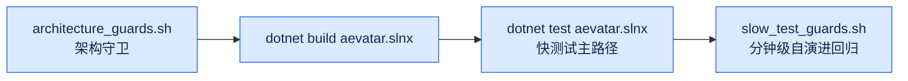
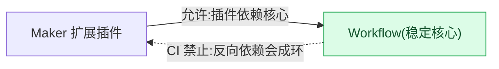

# 架构门禁:architecture_guards.sh / slow_test_guards.sh 守卫什么

## 本篇涉及的设计抽象

> 以下论断均可回指 `~/Code/aevatar` 源码验证,但本篇用设计语言描述,不贴文件路径/行号。

---

## 四个 mandatory gate

1. `bash tools/ci/architecture_guards.sh`(架构守卫)
2. `dotnet build aevatar.slnx --nologo`(构建)
3. `dotnet test aevatar.slnx --nologo`(快测试主路径)
4. `bash tools/ci/slow_test_guards.sh`(分钟级自演进回归)

---

## architecture_guards.sh 关键守卫

| 守卫 | 禁止 / 强制什么 |
|---|---|
| 禁止 legacy host 项目 | `Aevatar.Host.Api` / `Aevatar.Host.Gateway` |
| Directory.Build 版本 | 强制 `0.1.0-beta` / `0.1.0.0` |
| Channel 入站凭证 | `ChannelInboundEvent` 保留 field 9 + 名 `registration_token` |
| Workflow.Core 交互边界 | 只持 typed `InteractionSpec`,不持 channel 内容 / 原始 Lark card |
| **禁止 query-time replay** | QueryPort / QueryService / ApplicationService 不得在请求路径 replay 事件 / 重建 state / 物化投影 |
| 禁止 provider 非流式 ChatAsync | 必须用 `ChatStreamAsync` |
| 禁止 legacy metadata bag | `CommandContext.Metadata` / `EventEnvelope.Metadata` 不得在 core context |
| 禁止直投 `actor.HandleEventAsync` | 仅 allowlist(`LocalActor` / `RuntimeActorGrain`)外禁止 raw `SubscribeAsync<EventEnvelope>` |
| `DispatchAsync` 只返回 `DispatchAdmission` | dispatch port 不得调 / await `HandleEventAsync` |
| EventSourcing 事实纯度 | 禁止 `DefaultAutoPersistedStateEventFactory`、`StateStore.LoadAsync` in `GAgentBase<TState>` |
| **stateful GAgent 直改守卫** | AWK AST-walk 禁止 `GAgentBase` 派生类里 `State.X =` 直改(必须发领域事件) |
| MassTransit pin v8.x | v9 禁止 |
| **Workflow→Maker 反向依赖** | `src/workflow` 不得引用 Maker 项目 |
| 强制 Mainnet 装配 Maker | 必须 `AddAevatarPlatform(...EnableMakerExtensions=true...)` |
| **SemaphoreSlim 投影仲裁(文件级)** | **仅** `WorkflowExecutionProjectionPort.cs` 不得用进程内 `SemaphoreSlim` 仲裁投影启动 |
| 禁止中间层内存 ID 映射字典 | 必须 actor 化编排 / lease handle / 分布式状态 |
| 投影 provider 业务无关 | 不得 ref Workflow/AI;agents 不得 ref 具体 projection provider |

> ⚠️ **订正一处旧措辞**:旧版本把 SemaphoreSlim 那条写成"禁止进程内 SemaphoreSlim 仲裁投影",读起来像全局禁令。实际 `architecture_guards.sh` 只 grep **单个文件** `src/workflow/Aevatar.Workflow.Projection/Orchestration/WorkflowExecutionProjectionPort.cs`——意思是**这个 port** 必须靠 actor/lease 仲裁投影启动,而不是进程内信号量;`SemaphoreSlim` 在代码库别处可以正常用。精确表述见 [08/04](../08/04-todo-list.md) 4.3。

---

## 为什么"禁止 Workflow→Maker 反向依赖"是 CI 强制

`architecture_guards` 扫描 `src/workflow` 的项目文件,任何引用 Maker 项目都 `exit 1`。原因:Maker 是 **workflow 扩展插件**,依赖方向应是 Maker→Workflow。禁止反向,是为了让 Workflow(稳定核心)不能反向引用 Maker 插件——否则成环,破坏插件模型。这条由 `AddMakerCapability` 禁令 + ADR-0002("Maker 以插件方式装配到 Mainnet")共同强制。

---

## slow_test_guards.sh

- 构建 `dotnet test` args(`-m` / `UseSharedCompilation=false` / `NuGetAudit=false`);
- `SLOW_TEST_NO_RESTORE` / `SLOW_TEST_NO_BUILD` opt-out;
- 跑 `test/Aevatar.Integration.Slow.Tests`——分钟级自演进回归(从快测试主路径拆出)。

---

## 验收

1. 四个 mandatory gate 是什么?(architecture_guards + build + test + slow_test_guards)
2. 为什么禁止 Workflow→Maker?(Maker 是 Workflow 插件,反向依赖成环破坏插件模型)
3. SemaphoreSlim 那条守卫的真实范围?(**文件级**:只盯 `WorkflowExecutionProjectionPort.cs`,不是全局禁 `SemaphoreSlim`)
4. stateful GAgent 为什么禁止 `State.X =` 直改?(必须发领域事件,保 Event Sourcing 纯度)

⟦AI:AUTO-LOOP⟧
