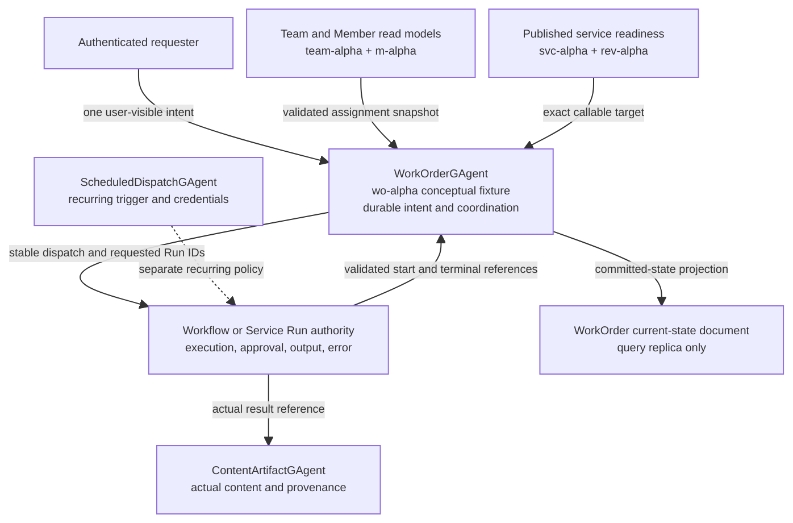
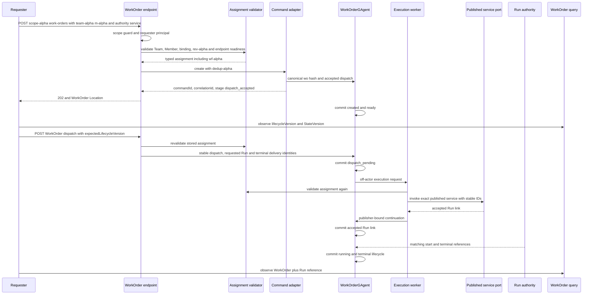
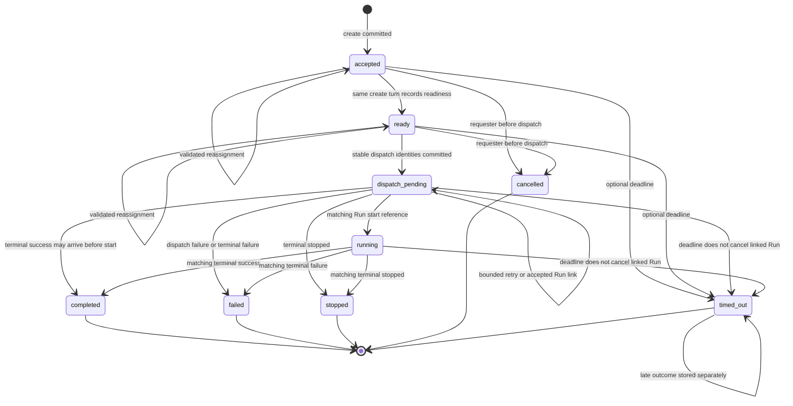

# WorkOrder：耐久授权意图，不是通用任务队列

> 版本与结论：本章描述 `current`。WorkOrder 是 scope-owned、用户可见的一次性执行意图：它在任何 Run 之前存在，保存 requester、Team/Member assignment snapshot、typed input、可选 deadline 与协调生命周期；执行、审批、输出、错误、artifact 内容和周期触发仍由各自 authority 拥有。`202 Accepted` 只证明 WorkOrder command 已越过 dispatch admission，真正状态由 `WorkOrderGAgent` commit，查询只看它的 current-state projection。

## 设计抽象与事实源

- `agents/Aevatar.GAgents.WorkOrder/work_order_messages.proto:8`、`:79`、`:113`、`:164`、`:187`、`:257`、`:299`：WorkOrder 生命周期、assignment、稳定 dispatch/Run identities 与 terminal reference 协议。
- `agents/Aevatar.GAgents.WorkOrder/WorkOrderGAgent.cs:28`、`:45`、`:75`、`:112`、`:182`、`:246`、`:274`、`:302`、`:460`：唯一 authority 的创建、改派、派发、恢复、超时与 outcome 守门。
- `docs/canon/work-orders.md:9`、`:34`、`:74`、`:98`、`:122`、`:179`、`:199`：产品资源与 Run、Workflow、Schedule、Artifact 的边界。

## 资源定位：拥有“为什么做”，不拥有“怎样跑”

Task 11 的身份夹具继续保持不相等：

| identity | 夹具 | WorkOrder 中的角色 | authority | 不能替代 |
|---|---|---|---|---|
| scope | `scope-alpha` | owner boundary | authenticated scope / Host guard | Team或WorkOrder |
| Team | `team-alpha` | assignment containment snapshot | Team authority/read model | Member |
| Member | `m-alpha` | 被委派责任的产品主体 | Member authority/read model | draft Workflow |
| draft Workflow | `wf-alpha` | workflow-backed Member 的implementation identity | Member implementation ref / Workflow authority | Member或service |
| revision | `rev-alpha` | dispatch前验证的published revision | Member binding与readiness views | Workflow identity |
| published service | `svc-alpha` | 实际可调用service identity | Member authority/read model | Member identity |
| WorkOrder | `wo-alpha` | 本章的durable intent fixture | `WorkOrderGAgent` | Workflow Run或queue item |

`svc-alpha`与`wo-alpha`都是用于解释隔离身份的 authority-returned 概念夹具，不能被调用方随意指定成current实际结果。冻结实现会从`scopeId + dedupKey`计算真实`workOrderId = wo-<sha256>`；例如`scope-alpha + dedup-alpha`得到`wo-0db10205d140684521e4827cc8c6c008e2d2889347899e134e2fc9b76bd3c84b`。创建request没有`workOrderId`字段，客户端只能读取receipt。类似地，request虽然携带`publishedServiceId`，assignment validator仍要求它精确等于Member read model中的authority值，不能从`m-alpha`或`wf-alpha`猜。



WorkOrder authority拥有：

- requester的intent、chat input、input artifact refs与declared result refs；
- 创建时验证过的Team/Member/service/revision/implementation assignment snapshot；
- `dispatchCommandId`、`requestedRunId`、`terminalDeliveryId`等稳定协调身份；
- reassign、cancel、optional timeout、dispatch retry与自身lifecycle；
- accepted Run link，以及经过严格身份验证的terminal outcome reference。

它明确不拥有：Workflow permission/approval plan、approver与decision、Run output/error/start time、实际artifact内容与provenance、schedule与credential lifecycle。Declared result artifact只是“希望得到什么”的意图，不是artifact已存在的证明。

## 创建与 assignment：三次守门，不借 stale read model 终审

`POST /api/scopes/{scopeId}/work-orders`先经过scope guard并从认证principal提取requester。Application service规范化request，然后由`WorkOrderAssignmentValidator`检查：

1. `team-alpha`存在于`scope-alpha`且active；
2. `m-alpha`在同一scope且当前属于`team-alpha`；
3. caller提供的published service精确等于Member summary中的authority值；
4. Member处于`bind_ready`并有同service的last binding与非空revision；
5. readiness对指定endpoint返回`Ready + InvokeReady`，且revision与binding一致；
6. workflow-backed Member的typed implementation ref必须给出`wf-alpha`。

validator从Member read model派生`workflowId`、`serviceRevisionId`和`implementationKind`，caller不能在create body中覆盖这三项。Reassign会对新Member重复同样检查；dispatch在发command前对保存的assignment再检查；off-actor execution adapter在真正调用service前第三次验证并要求结果仍与WorkOrder snapshot逐字段一致。任何Member转组、rebind或readiness漂移都会fail closed，要求先显式reassign并使用新的lifecycle version。

Application侧验证不是最终并发锁。每个mutable command携带`expectedLifecycleVersion`，`WorkOrderGAgent`再次验证requester、version、允许的source state与canonical identity。即使Application读到旧projection，actor也会拒绝stale command。



## ACK、lifecycle 与 projection 是三种证据

| 证据 | current字段 | 能证明 | 不能证明 |
|---|---|---|---|
| command admission | receipt的`workOrderId/commandId/correlationId/stage=dispatch_accepted/acceptedAtUtc` | canonical actor已接收typed envelope用于dispatch | actor已commit、assignment仍有效、Run已创建 |
| WorkOrder authority | `lifecycleStatus + lifecycleVersion` | actor已接受哪些业务transition | projection已追平或Run output内容 |
| query projection | `StateVersion + lifecycleVersion + UpdatedAtUtc` | current-state document观察到某个committed actor version | 任意Run/service/artifact plane都同步 |
| accepted Run link | `runId/runActorId/commandId/correlationId/revisionId/deploymentId` | invocation admission保留了授权身份 | Run已started或terminal |
| outcome reference | exact delivery/Run/actor/command/correlation + outcome/time | authority接受了可信Run terminal reference并推进自身lifecycle | WorkOrder拥有output/error/artifact |

WorkOrder mutation比上一章的普通Member PATCH多暴露稳定`commandId/correlationId`，但receipt仍不是commit proof。客户端应先保存receipt，再GET WorkOrder Location并比较`lifecycleVersion/StateVersion`与目标状态；不能把HTTP `202`、`dispatch_pending`、accepted Run link、`running`或`completed`折叠为同一个“已完成”。

## 生命周期：允许的状态少，职责才清楚



Create在一个actor turn中持久化`created + ready`两个events；`accepted`仍是协议中的authority状态，但正常query很可能直接观察到`ready`。只有`accepted/ready`可reassign或cancel。进入`dispatch_pending`后，取消会被拒绝；WorkOrder没有“顺手停止Run”的权限。

不存在`waiting_approval`或`denied`状态，也没有`:approve/:deny` endpoints。若Workflow执行遇到external action approval，suspended continuation与决定都留在Workflow/Run authority；WorkOrder最多继续显示`running`，直到收到可信terminal reference。

Terminal通知可以早于独立start通知；terminal lifecycle优先，后来到的start不能倒退它。deadline到期写`timed_out`，message明确不声称linked Run已cancel。之后若收到正确的terminal通知，只写`lateRunOutcome`，不把`timed_out`重写为completed/failed/stopped。

## Dispatch、retry 与 outcome：队列不是事实源

进入dispatch时，adapter从真实workOrderId派生固定`dispatchCommandId`、`requestedRunId`和`terminalDeliveryId`。Actor要求三者使用canonical值；在caller先提供**当前**`expectedLifecycleVersion`的前提下，相同dispatch在pending、running或terminal状态下可幂等收口，不同payload/identity不能抢占同一WorkOrder。原始HTTP请求若携带已经过期的version，Application与actor都会拒绝，而不会把“幂等”解释成绕过optimistic concurrency。

Actor先commit`dispatch_pending`，再向自己发送execute signal。实际service invocation在bounded in-memory `Channel`与background worker中执行，避免慢I/O阻塞actor turn；但queue item不是durable truth：

- queue满或scheduler缺失时，actor写入带attempt/callback/time的durable retry event；
- 即使enqueue成功也安排watchdog，直到accepted Run link出现；
- actor activation看到`dispatch_pending`且无Run link，会恢复timeout与execution scheduling；
- retry采用250ms起步、最大30s的指数backoff，并被可选deadline截断；
- deterministic command/run/delivery identities吸收重复执行与continuation。

Execution worker返回的continuation必须由固定publisher `studio.work-order-execution-worker`发送，并匹配WorkOrder、dispatch command与requested Run；Run start/outcome还必须匹配accepted Run link的delivery、Run、actor、command、correlation，并来自对应Run publisher。重复相同outcome幂等，冲突outcome fail closed。

这解释了为什么WorkOrder不是通用task queue：产品资源是durable intent，queue只是当前Host内的off-actor transport；它只支持“一个已验证Team Member调用一个published service”的窄合同，input当前还强制包含chat prompt。任意批处理、优先级、worker leasing、通用payload或project-management ticket都不在合同内。

## 最小静态示例

> Demo status：`verified-static`（按冻结WorkOrder proto/actor、endpoint、assignment validator、command adapter、execution port/worker、projector/query与tests静态核对；未启动Host、未实际调用published service，也未测量projection或retry时序。）

请求不提交`workOrderId`、`workflowId`或`revisionId`：

```http
POST /api/scopes/scope-alpha/work-orders
Content-Type: application/json

{
  "teamId": "team-alpha",
  "memberId": "m-alpha",
  "publishedServiceId": "svc-alpha",
  "endpointId": "run",
  "intent": "审阅本周变更并给出摘要",
  "dedupKey": "dedup-alpha",
  "input": {
    "chat": {"prompt": "生成审阅摘要"},
    "declaredResultArtifacts": [
      {"artifactId": "report-alpha", "artifactKind": "review-report"}
    ]
  }
}
```

静态解析：`team-alpha`与`m-alpha`必须在Member read model中匹配；`svc-alpha`只能作为authority-returned fixture，冻结新建`m-alpha`的实际service约定仍可能是`member-m-alpha`，请求必须填读到的真实值。validator从Member implementation ref派生`wf-alpha`，从last binding派生`rev-alpha`。receipt返回实际canonical `wo-0db10205…`与稳定command/correlation IDs；`wo-alpha`只保留为本章的概念身份夹具，不能放入create body。

随后最小观察顺序：

```text
1. GET <receipt Location> until lifecycleStatus=ready and record lifecycleVersion
2. POST <receipt Location>:dispatch {"expectedLifecycleVersion": <observed version>}
3. GET again until run link appears, then resolve Run authority for execution detail
4. Treat completed as a validated outcome reference, obtain any actual artifact reference from its owning Run/application contract, then resolve artifact authority
```

声明`report-alpha`不创建artifact；WorkOrder `completed`也不含报告正文、Run output或审批记录。

## 为什么是它，不是别的

**为什么不是直接返回一个Run receipt？** 用户意图在Run之前就需要稳定identity，可在未dispatch时改派/取消，也可无deadline长期存在。Run只回答某次执行，无法自然承载这段前置产品生命周期。

**为什么不是Workflow的另一个状态？** Workflow定义与Run拥有执行图、approval和continuation；WorkOrder可指向workflow、script或GAgent-backed Member，只保存assignment与结果引用。把它塞进Workflow会让非Workflow执行失去统一产品资源，也让intent与execution耦合。

**为什么不是Schedule或通用queue？** Schedule拥有重复触发、credential与automation policy；queue只解决Host内慢I/O隔离。WorkOrder是一条一次性、scope-owned、user-visible intent，durability来自actor history，不来自queue。

**为什么dispatch前要重复验证assignment？** 创建后Member可转组、rebind或失去readiness。重复验证阻止WorkOrder用旧snapshot调用不再授权的service；actor的version/requester检查再解决read-model lag下的并发竞争。

**为什么只保存outcome reference？** Run与artifact authority已经拥有output、error和content。WorkOrder复制它们会形成第二事实源；保存严格绑定的引用足以推进自身lifecycle并让consumer去正确authority读取细节。

## 边界与演进

- WorkOrder list是scope-scoped，并支持requester filter，但endpoint没有自动把普通caller限制为“只看自己的WorkOrder”。当前scope claim即读边界；若产品需要per-user confidentiality，必须在SQL/document query前注入授权scope，不能靠UI filter。
- Application create/dispatch依赖eventually consistent Team、Member与readiness views。Actor能拒绝stale lifecycle version，但不会自己重新查询assignment；真正invoke前的第三次validator是防止旧assignment被执行的关键。
- WorkOrder timeout不发Run stop，cancel也只允许dispatch前。若需要“取消意图并确保执行停止”，必须引入跨authority saga与独立stop observation，不能改写`cancelled/timed_out`含义。
- Bounded in-memory queue可在Host崩溃时丢item；actor-owned`dispatch_pending`、durable retry callback、activation recovery与稳定IDs负责重驱。当前至少一次重驱意味着service invocation必须继续保持idempotent。
- `declaredResultArtifacts`没有完成时存在性验证，WorkOrder也不把实际artifact link写回。需要产品级交付清单时，应由Run/Artifact authority提供可验证引用，再定义新的typed observation，而不是把声明当结果。
- closed `#2789`在冻结树有proto、actor、API、projection与tests，可支撑本章current语义。open `#2949`的Smart Home capability、typed authorization card与设备语义仍是未来场景，不能借WorkOrder已有“durable intent”名称写成已落地；应登记到`12/05-open-gaps-and-canon-drift.md`。

## 读完应能回答

1. `scope-alpha`、`team-alpha`、`m-alpha`、`wf-alpha`、`rev-alpha`、`svc-alpha`与`wo-alpha`分别属于哪个authority，为什么current create不能手填短`wo-alpha`？
2. WorkOrder command receipt、`lifecycleVersion`、projection `StateVersion`、accepted Run link与terminal outcome各证明什么？
3. 为什么WorkOrder不是Workflow、Schedule、Run、artifact store或通用task queue的替代品？
4. assignment为什么在create、dispatch与真正invoke前重复验证，actor又为什么仍需检查requester和expected lifecycle version？
5. WorkOrder `timed_out/completed`为什么既不证明Run已cancel，也不包含output或实际artifact内容？

<details>
<summary>论断—证据映射</summary>

| 论断 | 等级 | 证据 |
|---|---|---|
| WorkOrder proto隔离intent、assignment、dispatch identities、Run link、outcome与late outcome | E1 | `agents/Aevatar.GAgents.WorkOrder/work_order_messages.proto:79`、`:99`、`:103`、`:104`、`:107`、`:164`、`:187`、`:205`、`:299`、`:304` |
| workOrderId由scope+dedupKey的SHA-256 canonical计算，actor/dispatch/run/delivery identity各自稳定 | E1 | `agents/Aevatar.GAgents.WorkOrder/WorkOrderConventions.cs:11`、`:15`、`:16`、`:19`、`:22`、`:25`、`:28`；`agents/Aevatar.GAgents.WorkOrder/WorkOrderGAgent.cs:696`、`:703` |
| create在actor内持久化created+ready，可改派/取消只限dispatch前且所有mutable命令检查version/requester | E1 | `agents/Aevatar.GAgents.WorkOrder/WorkOrderGAgent.cs:45`、`:51`、`:59`、`:75`、`:80`、`:82`、`:83`、`:246`、`:251`、`:253`、`:257`、`:656`、`:665` |
| assignment validator校验Team、Member containment、exact service、binding、revision readiness并派生workflow identity | E1 | `src/Aevatar.Studio.Application/Studio/Services/WorkOrderAssignmentValidator.cs:24`、`:38`、`:41`、`:44`、`:47`、`:49`、`:54`、`:63`、`:70`、`:75`、`:78`、`:93` |
| create/reassign/dispatch分别在Application层验证，off-actor invoke前再次校验snapshot一致 | E1 | `src/Aevatar.Studio.Application/Studio/Services/WorkOrderService.cs:25`、`:37`、`:72`、`:91`、`:107`、`:121`；`src/Aevatar.Studio.Application/Studio/Services/ValidatedWorkOrderExecutionPort.cs:24`、`:33`、`:40`、`:54`、`:67`、`:164` |
| mutation receipt公开稳定command/correlation但stage仍为dispatch_accepted | E1 | `src/Aevatar.Studio.Application/Studio/Contracts/WorkOrderContracts.cs:16`、`:57`；`src/Aevatar.Studio.Projection/CommandServices/ActorDispatchWorkOrderCommandService.cs:137`、`:145`、`:148`、`:156`、`:160`；`src/Aevatar.Studio.Hosting/Endpoints/WorkOrderEndpoints.cs:46`、`:47`、`:192`、`:213` |
| actor只接受canonical dispatch identities和可信publisher continuation，Run evidence须逐identity匹配 | E1 | `agents/Aevatar.GAgents.WorkOrder/WorkOrderGAgent.cs:112`、`:118`、`:131`、`:136`、`:145`、`:182`、`:191`、`:194`、`:302`、`:328`、`:334`、`:382`、`:391`、`:397`、`:605`、`:625` |
| queue是bounded in-memory transport，actor通过durable retry、activation与stable IDs恢复pending coordination | E1 | `src/Aevatar.Studio.Application/Studio/Services/WorkOrderExecutionQueue.cs:16`、`:24`、`:32`、`:35`；`agents/Aevatar.GAgents.WorkOrder/WorkOrderGAgent.cs:28`、`:38`、`:41`、`:460`、`:479`、`:488`、`:496`、`:500`、`:534`、`:535` |
| timeout不宣称取消Run，late terminal只写late outcome而不改timed_out | E1 | `agents/Aevatar.GAgents.WorkOrder/WorkOrderGAgent.cs:274`、`:295`、`:297`、`:399`、`:406`；`agents/Aevatar.GAgents.WorkOrder/WorkOrderGAgent.State.cs:154`、`:176` |
| projector只消费committed WorkOrder state，query按scope过滤document并返回lifecycle/state版本 | E1 | `src/Aevatar.Studio.Projection/Projectors/WorkOrderCurrentStateProjector.cs:27`、`:35`、`:46`、`:56`、`:68`、`:85`、`:86`；`src/Aevatar.Studio.Projection/QueryPorts/ProjectionWorkOrderQueryPort.cs:34`、`:44`、`:46`、`:77`、`:95`、`:102`、`:105`、`:126`、`:128` |
| canon明确WorkOrder拥有intent/coordination而不拥有execution、approval、artifact或schedule | E2 | `docs/canon/work-orders.md:9`、`:21`、`:34`、`:45`、`:118`、`:143`、`:175`、`:223` |
| #2789 frozen implementation landed，#2949仍为open future capability | E5 | upstream [#2789](https://github.com/aevatarAI/aevatar/issues/2789) 与 [#2949](https://github.com/aevatarAI/aevatar/issues/2949) 的冻结成员记录；current结论另由本表E1支撑 |

</details>
