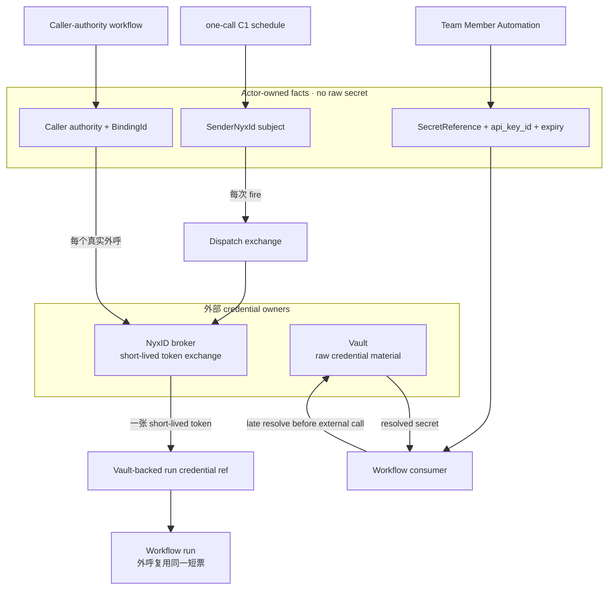
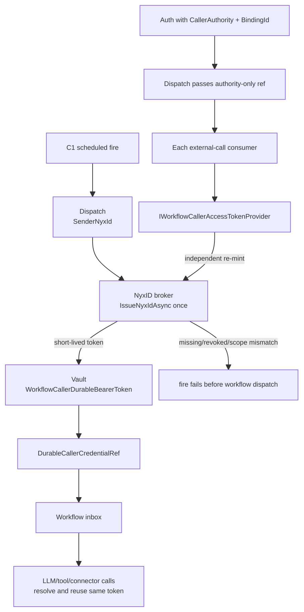
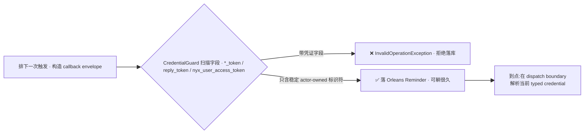

# Raw credential 不入事实层:aevatar 的凭证与信任边界

> 本篇是 06 分布式与生产态的**凭证边界收口**。当前统一不变量不是“全系统没有长期 key”,而是 **raw credential 不进入 actor state、read model、durable callback、日志或 public API**。broker-bound surface 只持 subject/caller authority,在明确边界换短票;canonical Team Member Automation 持 Vault-backed typed locator,raw Agent Key 的唯一持久化位置是 Vault。

## 本篇涉及的设计抽象

> 以下是本篇的**事实源脊柱**(以 `~/Code/aevatar` 为准,当前 contract 核对基线 `origin/feature/integrate @ 4e0def2c231b7074209b852b855954b3db7d3e71`;非正文骨架)。早期 broker 设计来自 ADR-0018,但当前 schedule/Vault 结论只按这条包含 ADR-0041/0043 的稳定基线表述。

- **broker-bound short-ticket issuance**:`INyxIdCapabilityBroker`、`StudioWorkflowProvisioningService`、`ScheduledServiceInvocationDispatchPort` 与 ADR `docs/adr/0018-per-user-nyxid-binding-via-oauth-broker.md`。
- **Vault-backed Team Member Automation**:`docs/canon/scheduled-skill-runners.md`、`docs/adr/0041-scheduled-invocation-agent-key-credential-reference.md`、`docs/adr/0043-scheduled-credential-lifecycle-compensation.md`。
- **raw credential exclusion 与已知 voice 例外**:`DurableCallbackEnvelopeCredentialGuard` 及其集成测试、OpenAI/MiniCPM voice credential resolver 边界。

---

## 一句话先把信任边界钉住

> **凭证事实源在 aevatar 事实层之外。** broker-bound actor 只持 `SenderNyxId` 或带 `BindingId` 的 caller authority;Agent Key actor 只持 `SecretReference + api_key_id + expiry`。当前 C1 在每次 fire 的 dispatch 边界换一张短票,再以 Vault-backed run reference 交给 workflow;带完整 caller authority 的另一种基础设施路径才会把换票推迟到每个外呼。Agent Key 则在 workflow 消费边界 late resolve Vault。三者都不把 raw secret 写进 actor/readmodel/callback。



---

## 1. Broker-bound surface:只持身份句柄,不持有 token

subject re-mint 这条路径的接口契约写在 `INyxIdCapabilityBroker` 上,它把“换凭证”收成一个**只写**的能力面(发起绑定 / 吊销 / 签发短期 token),并在接口文档里把不变量讲死。

<details>
<summary><code>INyxIdCapabilityBroker</code>:契约里写明"不存长期密钥"</summary>

```csharp
// agents/Aevatar.GAgents.Channel.Identity.Abstractions/INyxIdCapabilityBroker.cs
//
// Production implementation issues no long-lived user secret material into
// aevatar grain state; aevatar holds only the opaque BindingId.
// See ADR-0018 §INyxIdCapabilityBroker.
public interface INyxIdCapabilityBroker
{
    Task<BindingChallenge> StartExternalBindingAsync(ExternalSubjectRef externalSubject, /*...*/);
    Task RevokeBindingAsync(ExternalSubjectRef externalSubject, /*...*/);

    // RFC 8693 token-exchange:换一张短期 token。
    // 没有有效绑定 → BindingNotFoundException
    // NyxID 报 invalid_grant(已吊销) → BindingRevokedException
    // NyxID 报 invalid_scope(绑定不覆盖该 scope) → BindingScopeMismatchException
    // token 不覆盖 required services → BindingServiceAccessMismatchException
    Task<CapabilityHandle> IssueShortLivedAsync(ExternalSubjectRef externalSubject, CapabilityScope scope, /*...*/);
}
```
</details>

四类失败被做成**独立异常类型**(`BindingNotFoundException` / `BindingRevokedException` / `BindingScopeMismatchException` / `BindingServiceAccessMismatchException`),让调用方能区别未绑定、已吊销、scope 不足与 required UserService 资源不足。绑定缺失可提示用户重跑 `/init`;接口注释还点明一条务实兜底——**普通 LLM 回合换不到用户票时,可以退回 bot-owner 凭证继续**(不是所有路径都强制 per-user)。ADR-0018(`accepted`)在 2026-04-30 的更新里进一步收紧:改用 **public client + PKCE**,连集群级 OAuth `client_secret` 都不再由 aevatar 持有。

**为什么是它,不是“把 token 存进 actor 长期事实”**:对 broker-bound surface,长期持久 token 会累积泄漏面与死票。actor 只留身份句柄,让每次授权都以当前 binding/scope 为准;C1 只在每个 fire 后把新短票临时放入 Vault,供该 run 解析复用。Agent Key 是另一种 owner contract,见 §4;它同样不把 raw key 放进事实层。

---

## 2. Broker-bound schedule:区分 C1 fire-time exchange 与 per-call authority

`SenderNyxId` 与 `CallerAuthority` 不是同一个字段,也不触发同一条时序。当前 one-call C1 `StudioWorkflowProvisioningService.BuildScheduleAuth` 只写 `SenderNyxId`;它不写带 `BindingId` 的 `CallerAuthority`。因此 workflow schedule 虽然启用 caller-credential projection,dispatch 仍会在**每次 fire**调用 `IssueNyxIdAsync` 换一张短票。

换到的 raw token 不写入 schedule state 或 workflow envelope。dispatch 把它写入 Vault 的 `WorkflowCallerDurableBearerToken` purpose,再把 `DurableCallerCredentialRef(SourceKind=ScheduledDispatch)` 交给 workflow。run 内的 LLM/tool/connector consumer 会在各自外呼前解析这个 reference,但复用的是**同一张 fire-time token**,不是每次重新 mint。



所以当前 C1 是“一次 fire 一次 exchange”,即使 workflow 最终没有 credential-consuming call,dispatch 也已经换票。binding missing/revoked、scope mismatch、exchange provider 或 Vault 不可用都会在 workflow 入箱前 fail closed。

基础设施另有一条 caller-authority 模式:当 auth 同时带完整 `CallerAuthority + BindingId` 时,dispatch 不换票,只传 authority-only reference,每个真实外呼再通过 `IWorkflowCallerAccessTokenProvider` 独立 re-mint。这个分支不能反推为当前 C1 contract。

---

## 3. 持久回调里一行凭证都不许写

定时/挂起靠 Orleans Reminder 持久回调(与 [02/08 saga 持久挂起](../02/08-saga-durable-execution.md) 同一套引擎,运行时语义见 [06/02 Orleans Runtime](02-orleans-runtime.md)),而 Reminder 状态**可能在库里躺很久**。aevatar 因此立了一条铁律:**任何要持久化的 callback envelope,都不许携带运行期凭证**。`DurableCallbackEnvelopeCredentialGuard` 扫描 envelope 的每个字段,命中 `reply_token` / `nyx_user_access_token` / 任意以 `_token` 结尾的字段就当场抛异常,拒绝落库。

<details>
<summary>持久回调凭证守卫:扫描 <code>*_token</code> 即拒</summary>

```csharp
// src/Aevatar.Foundation.Runtime.Implementations.Orleans/Grains/Callbacks/DurableCallbackEnvelopeCredentialGuard.cs
private static bool IsRuntimeCredentialField(FieldDescriptor field)
{
    var name = field.Name;
    return name == "reply_token"
        || name == "reply_token_expires_at_unix_ms"
        || name == "nyx_user_access_token"
        || name.EndsWith("_token", StringComparison.Ordinal);   // 兜底:任何 *_token
}
// 命中即:
//   throw new InvalidOperationException(
//     $"Durable callback trigger envelope contains runtime credential field '{violationPath}'. " +
//     "Callback payloads must carry stable actor-owned identifiers only.");
```
</details>



这条铁律由集成测试 `RuntimeCallbackSchedulerGrainCredentialGuardIntegrationTests` 钉死:带 `nyx_user_access_token` 的 Lark 卡片超时、带 `reply_token` 的 relay 超时都必须被拒,只有 sanitize 过的才放行。

**为什么 callback 必须无 raw credential**:短期 token 的寿命以分钟计,Reminder 状态的寿命以天/月计。callback 只需要稳定 fire identity;raw token/key 放进去既会过期又扩大泄漏面。这条守卫不禁止 schedule actor 持有 typed `SecretReference` locator:C1 的短票在 fire 后进入临时 Vault reference,Agent Key 的 raw secret 则始终只在 Vault,二者都由 workflow 在外呼前解析。

---

## 4. 两条产品 surface:C1 fire-time short ticket vs Vault-backed Agent Key

aevatar 并非教条地“只用短期 token”。当前两条 schedule surface 采用不同契约,不能互相替代:

| 维度 | C1 fire-time short ticket | dedicated Agent Key |
|---|---|---|
| 主要 schedule surface | one-call `/provision-workflow` | canonical Team Member Automation |
| 持久事实 | `SenderNyxId` subject reference | `SecretReference + api_key_id + expiry` typed locator |
| raw credential | 每次 fire 签发一张短票,写入临时 Vault reference;不进入 actor/readmodel/callback | 唯一持久化位置是 Vault,不进入 actor/readmodel |
| runtime 依赖 | 每次 fire 都依赖 broker + binding + scope + Vault | 已提交授权事实;每次外呼前 late Vault resolution |
| 收敛手段 | scope 限定 + 短寿命 | exact UserService grants + expiry + 可吊销 key ID |

Team Member Automation 在 create/reauthorize 时先让 schedule actor 提交 effect locator,写侧再重读当前来源并重新校验 Aevatar authorization plan 与 `PermissionDigest`。校验通过后,issuer 用计划里的 exact service IDs 请求 NyxID targeted scope-plan;NyxID 返回的 `normalized_grant_digest` 才作为 key-create 的 `scope_plan_digest`。raw key 写入 Vault后,actor 只提交 typed locator。fire 时 dispatch adapter 只传 borrowed credential handle;workflow 的 LLM/tool/connector consumer 在每次真实外呼前 late resolve Vault secret。public read model 只投影 source kind、expiry、generation、状态和版本。

**为什么允许 Agent Key**:无人值守任务若每次触发都依赖“某用户此刻的 binding 还在、还能换票”,会非常脆。创建期 exact grant、Vault-backed locator、独立 NyxID/Vault 吊销 tracks 把可用性与最小权限同时建模;这不是把 raw key 固化进 actor state。旧 `SkillRunnerGAgent` 与其 raw-key state 模型已经退役,只可作为历史清理事实出现。

---

## 为什么是这样设计(正当性小结)

- **为什么 C1 schedule 只留 subject?** 让每次 fire 重新按当前 binding/scope 换短票,而不是把旧 token 固化进 schedule state。
- **为什么 caller-authority path 还要单独建模 `BindingId`?** 只有完整 authority 才能安全把 mint 推迟到每个 external-call consumer;`SenderNyxId` 不能冒充它。
- **为什么 Agent Key path 只留 typed locator?** actor 要持有 credential lifecycle 事实,但 raw key 由 Vault 单独拥有;public read model 不投影 locator。
- **为什么持久回调强制零 raw credential?** callback 只负责唤醒,不拥有授权或 secret;实际 credential 在更晚的消费边界解析。

!!! warning "诚实缺口:voice 静态 key 未 fail-closed"
    raw credential 不入事实层并不自动解决 host config secret。OpenAI voice 会在无 resolver 或 resolver 返回空时回退静态 config key,且不按环境门禁;MiniCPM 也没有同等 broker path。该缺口登记在 [08/04 P0-2](../08/04-todo-list.md),与 Vault-backed scheduled Agent Key 是不同 owner contract。

---

## 验收

1. aevatar 的信任边界画在哪里、actor state 可以存什么?(raw credential 的 owner 在 NyxID/Vault;state 可存 subject/`BindingId` 或 typed `SecretReference + api_key_id + expiry`,不能存 raw secret)
2. 四类绑定异常各对应什么失败、为什么要分开?(NotFound=未绑定/未同步、Revoked=invalid_grant、ScopeMismatch=invalid_scope、ServiceAccessMismatch=required UserService 资源不足;分开让调用方能分别提示/兜底)
3. 当前 C1 在哪里换票、一个 fire 换几张?(dispatch 每 fire 调一次 exchange;短票写入 Vault reference,run 内外呼解析并复用)
4. 持久回调为什么不能写 raw credential、谁来强制?(`DurableCallbackEnvelopeCredentialGuard`;callback 只携带 stable fire identity)
5. 两条 schedule surface 如何选 credential?(C1 保存 `SenderNyxId` 并在 fire-time exchange;canonical Member Automation 经 preflight/create 使用 Vault-backed Agent Key)
6. 当前 voice 缺口是什么?(静态 config key fallback 未按生产环境 fail closed,且 MiniCPM broker 能力不对等)

⟦AI:AUTO-LOOP⟧
