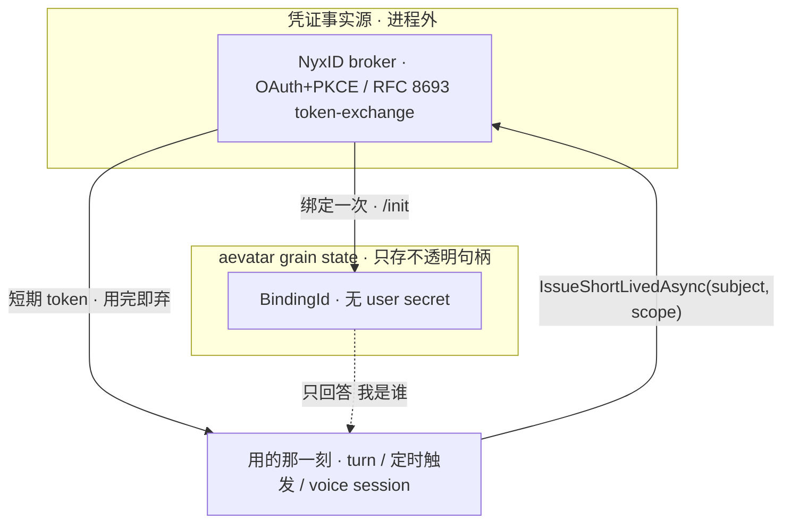
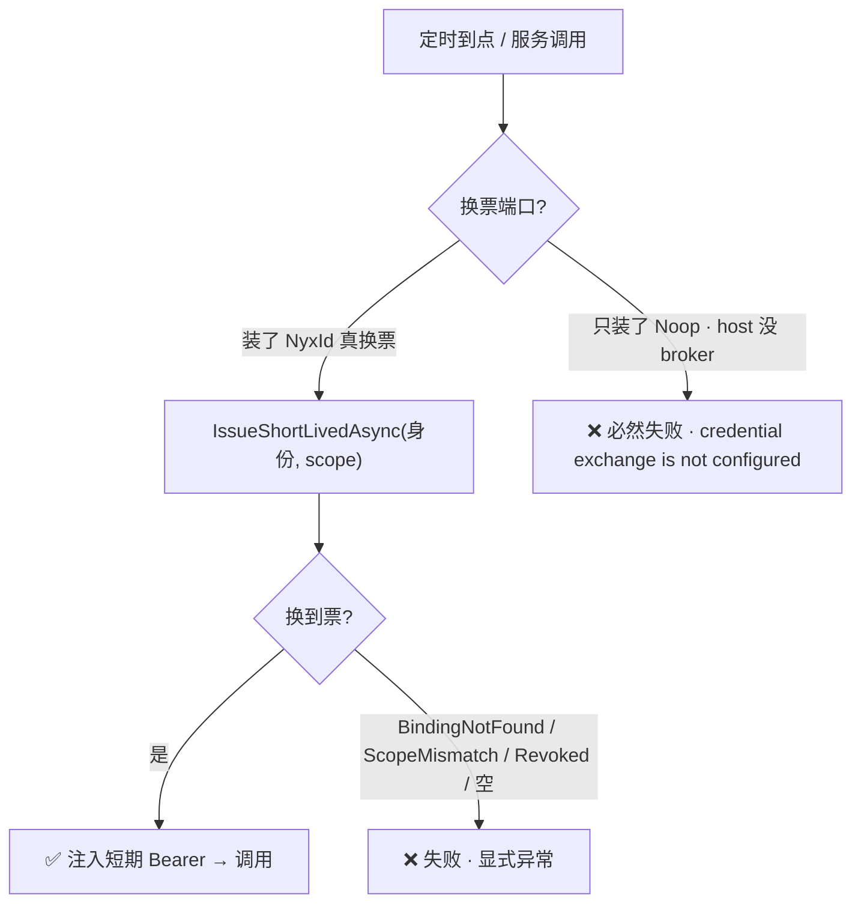
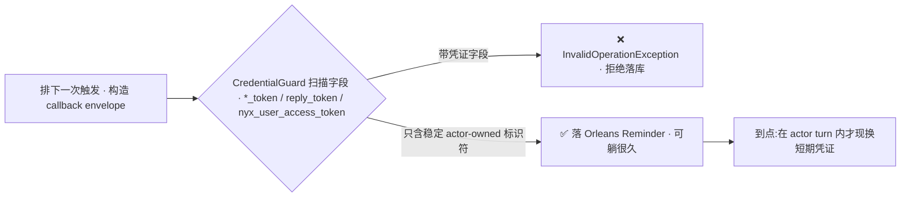

# 零长期密钥:aevatar 的凭证与信任边界

> 本篇是 06 分布式与生产态的**亮点收口**:普通 Agent 框架要么把 provider API key 塞进 env/config,要么明文存用户 token;aevatar 走的是**零长期密钥**——grain state 里只存一个不透明的 `BindingId`,用的那一刻才去 NyxID broker 换短期 token,持久回调里一行凭证都不许写。本篇把散在 [07/08 Lark](../07/08-lark-end-to-end.md) / [07/09 voice](../07/09-voice-presence-edge-brain.md) / [07/01 Channel](../07/01-channels.md) 的凭证片段合成一张"信任边界全景",并诚实标注唯一一处 fail-closed 缺口(voice 静态 key)。

## 本篇涉及的设计抽象

> 以下是本篇的**事实源脊柱**(以 `~/Code/aevatar` 为准,核对基线 `feature/integrate @ efaee423d`;非正文骨架):正文用设计语言论证,代码摘抄一律折叠。`agents/` 与 `test/` 路径属事实源,书写时不计入 aevatar 源码路径校验。

- **信任边界(只存不透明句柄)**:`agents/Aevatar.GAgents.Channel.Identity.Abstractions/INyxIdCapabilityBroker.cs`(`IssueShortLivedAsync` + 三类绑定异常)、ADR `docs/adr/0018-per-user-nyxid-binding-via-oauth-broker.md`(`accepted`)。
- **触发期换票 vs Noop fail-closed**:装配点 `src/platform/Aevatar.GAgentService.Hosting/DependencyInjection/ServiceCollectionExtensions.cs`、`src/platform/Aevatar.GAgentService.Infrastructure/Schedules/NyxIdScheduledServiceInvocationCredentialExchangePort.cs`、`src/platform/Aevatar.GAgentService.Application/Schedules/NoopScheduledServiceInvocationCredentialExchangePort.cs`。
- **持久回调零凭证守卫**:`src/Aevatar.Foundation.Runtime.Implementations.Orleans/Grains/Callbacks/DurableCallbackEnvelopeCredentialGuard.cs`、集成测试 `test/Aevatar.Foundation.Runtime.Hosting.Tests/RuntimeCallbackSchedulerGrainCredentialGuardIntegrationTests.cs`。
- **长效 key 作用域收敛**:`agents/Aevatar.GAgents.Authoring.Lark/ScheduledAgentApiKeyIssuer.cs`。
- **诚实缺口(voice)**:`src/Aevatar.Foundation.VoicePresence.OpenAI/OpenAIRealtimeProvider.cs`、`src/Aevatar.Bootstrap.Extensions.AI/NyxIdRealtimeProviderCredentialResolver.cs`、`src/Aevatar.Foundation.VoicePresence.MiniCPM/MiniCPMRealtimeProvider.cs`、ADR `docs/adr/0033-voice-provider-nyxid-ephemeral-broker.md`(`proposed`)。

---

## 一句话先把信任边界钉住

> **信任边界画在 aevatar 进程的外面:NyxID 才是凭证的事实源;aevatar grain state 里只躺着一个不透明的 `BindingId`,没有任何 user secret。** 每次要代表某个用户去调外部服务,aevatar 都在**用的那一刻**拿 `BindingId` 对应的身份去 broker `IssueShortLivedAsync` 换一张短期 token,用完即弃;换不到票就**显式失败**,而不是退回某个长期密钥硬扛。



---

## 1. 信任边界:aevatar 只持有不透明 `BindingId`,不持有密钥

整套姿态的接口契约写在 `INyxIdCapabilityBroker` 上,它把"换凭证"收成一个**只写**的能力面(发起绑定 / 吊销 / 签发短期 token),并在接口文档里把不变量讲死。

<details>
<summary><code>INyxIdCapabilityBroker</code>:契约里写明"不存长期密钥"</summary>

```csharp
// agents/Aevatar.GAgents.Channel.Identity.Abstractions/INyxIdCapabilityBroker.cs
//
// Production implementation issues no long-lived user secret material into
// aevatar grain state; aevatar holds only the opaque BindingId.
// See ADR-0018 §INyxIdCapabilityBroker.
public interface INyxIdCapabilityBroker
{
    Task<BindingChallenge> StartExternalBindingAsync(ExternalSubjectRef externalSubject, /*...*/);
    Task RevokeBindingAsync(ExternalSubjectRef externalSubject, /*...*/);

    // RFC 8693 token-exchange:换一张短期 token。
    // 没有有效绑定 → BindingNotFoundException
    // NyxID 报 invalid_grant(已吊销) → BindingRevokedException
    // NyxID 报 invalid_scope(绑定不覆盖该 scope) → BindingScopeMismatchException
    Task<CapabilityHandle> IssueShortLivedAsync(ExternalSubjectRef externalSubject, CapabilityScope scope, /*...*/);
}
```
</details>

三类失败被做成**独立异常类型**(`BindingNotFoundException` / `BindingRevokedException` / `BindingScopeMismatchException`),让调用方能区别对待:绑定缺失可提示用户重跑 `/init`;接口注释还点明一条务实兜底——**普通 LLM 回合换不到用户票时,可以退回 bot-owner 凭证继续**(不是所有路径都强制 per-user)。ADR-0018(`accepted`)在 2026-04-30 的更新里进一步收紧:改用 **public client + PKCE**,连集群级 OAuth `client_secret` 都不再由 aevatar 持有。

**为什么是它,不是"把 token 存下来"**:存下来的长期凭证 = 一个随时间累积的泄漏面 + 一堆会过期/被吊销的死票。把事实源放在 NyxID、aevatar 只留不透明句柄,等于把"凭证生命周期管理"外包给专门的 broker,aevatar 侧的爆炸半径收敛到"一个可吊销的 BindingId"。这是 **FI-002**(host 事实由 host 注入,核心不硬编码具体凭证)与 **FI-004**(权威记录在 broker,不在进程内)的合流。

---

## 2. 触发期换票 vs Noop:换不到票就 fail-closed

"用的那一刻才换票"在无人值守的**后台定时触发**场景最见真章。aevatar 把"会不会换票"做成**条件装配**:容器里有 `INyxIdCapabilityBroker` 才装真换票端口,否则装一个**永远返回失败**的 Noop。

<details>
<summary>条件装配:有 broker 才换票,否则 fail-closed</summary>

```csharp
// src/platform/Aevatar.GAgentService.Hosting/DependencyInjection/ServiceCollectionExtensions.cs
private static void AddScheduledCredentialExchangePort(this IServiceCollection services) =>
    services.TryAddSingleton<IScheduledServiceInvocationCredentialExchangePort>(sp =>
        sp.GetService<INyxIdCapabilityBroker>() is { } broker
            ? new NyxIdScheduledServiceInvocationCredentialExchangePort(broker, /* logger */)  // 真换票
            : new NoopScheduledServiceInvocationCredentialExchangePort());                      // 永远失败

// src/platform/Aevatar.GAgentService.Application/Schedules/NoopScheduledServiceInvocationCredentialExchangePort.cs
//   return Failure("Scheduled service invocation sender NyxID credential exchange is not configured.");
```
</details>



**为什么 Noop 也要"显式失败"而不是回退长期 key**:这正是 fail-closed 的精神——**缺少换票能力时,宁可让操作明确失败、暴露配置缺口,也不偷偷启用一条长期凭证旁路**。它也解释了一个真实现象:经 NyxID relay 进来的入站身份(见 [07/01 Channel](../07/01-channels.md))天然有可换短期 token 的 binding,而某些后台/登录身份未必绑定到能换票的 NyxID subject/scope——一旦 host 没装 broker 或身份无可用 binding,这类触发就 100% 显式失败,而走固化长效 key 的路径(见 §4)不受影响。代价是体验缺口(失败目前偏静默),但**方向是对的**:没有票就不动,符合 **FI-005**(边界优先于便利)。

---

## 3. 持久回调里一行凭证都不许写

定时/挂起靠 Orleans Reminder 持久回调(与 [02/08 saga 持久挂起](../02/08-saga-durable-execution.md) 同一套引擎,运行时语义见 [06/02 Orleans Runtime](02-orleans-runtime.md)),而 Reminder 状态**可能在库里躺很久**。aevatar 因此立了一条铁律:**任何要持久化的 callback envelope,都不许携带运行期凭证**。`DurableCallbackEnvelopeCredentialGuard` 扫描 envelope 的每个字段,命中 `reply_token` / `nyx_user_access_token` / 任意以 `_token` 结尾的字段就当场抛异常,拒绝落库。

<details>
<summary>持久回调凭证守卫:扫描 <code>*_token</code> 即拒</summary>

```csharp
// src/Aevatar.Foundation.Runtime.Implementations.Orleans/Grains/Callbacks/DurableCallbackEnvelopeCredentialGuard.cs
private static bool IsRuntimeCredentialField(FieldDescriptor field)
{
    var name = field.Name;
    return name == "reply_token"
        || name == "reply_token_expires_at_unix_ms"
        || name == "nyx_user_access_token"
        || name.EndsWith("_token", StringComparison.Ordinal);   // 兜底:任何 *_token
}
// 命中即:
//   throw new InvalidOperationException(
//     $"Durable callback trigger envelope contains runtime credential field '{violationPath}'. " +
//     "Callback payloads must carry stable actor-owned identifiers only.");
```
</details>



这条铁律由集成测试 `RuntimeCallbackSchedulerGrainCredentialGuardIntegrationTests` 钉死:带 `nyx_user_access_token` 的 Lark 卡片超时、带 `reply_token` 的 relay 超时都必须被拒,只有 sanitize 过的才放行。

**为什么持久化的东西必须无凭证**:短期 token 的寿命以分钟计,Reminder 状态的寿命以天/月计——把前者写进后者,等于在库里埋一堆"出土即过期"的死票 + 一个长期泄漏面。所以凭证必须在**触发那一刻**、在 actor turn 内重新解析,而不是提前固化进持久状态。这是 **FI-002 / FI-004** 在持久层最干净的一次落地。

---

## 4. 两种凭证策略:短期换票 vs 作用域收敛的长效 key

aevatar 并非教条地"只用短期 token"。它按场景选了两条策略,差别正是"触发期有没有外部依赖":

| 维度 | 短期换票(默认) | 作用域收敛的长效 key |
|---|---|---|
| 谁用 | 在线 turn、后台服务调用、voice session | Lark 定时智能体(SkillRunner) |
| 凭证 | 用时 `IssueShortLivedAsync` 现换,用完即弃 | 创建期签发一次,固化进 state |
| 触发期外部依赖 | 需要 broker + 身份 binding + scope 匹配 | 无(零换票) |
| 收敛手段 | scope 限定 + 短寿命 | **作用域收敛** + 可吊销 `api_key_id` |

长效 key 这条由 `ScheduledAgentApiKeyIssuer` 实现:它在创建定时智能体时向 NyxID 申一张 `scopes = "read write proxy"` 的 key,但**把可达服务收敛**到必需集合(`RequiredSlugs`:主交付 slug、失败通知 slug、Ornn、owner 的 LLM 路由 slug),并保留 `api_key_id` 以便随时吊销。

**为什么允许长效 key**:无人值守的后台任务若每次触发都依赖"某用户此刻的 binding 还在、还能换票",会非常脆。给它一张**创建期就授权、作用域收敛、可吊销**的长效 key,换来触发期零外部依赖的稳定性——这是在"最小权限"与"可用性"之间的一次**显式取舍**,而不是图省事的默认。

---

## 为什么是这样设计(正当性小结)

- **为什么把凭证事实源放进程外、只留 `BindingId`?** 把生命周期管理外包给 broker,aevatar 侧爆炸半径收敛到一个可吊销句柄,符合 FI-002/FI-004。
- **为什么换不到票宁可 fail-closed?** 偷偷回退长期凭证会把"零长期密钥"姿态在最隐蔽的后台路径上破掉;显式失败暴露缺口,符合 FI-005。
- **为什么持久回调强制零凭证?** 短票寿命(分钟)与 Reminder 寿命(天/月)严重错配,固化即泄漏 + 死票;触发期现换才正确。

!!! warning "诚实缺口:voice 静态 key 未 fail-closed"
    零长期密钥姿态目前有一处明确破口,登记在 [08/04 P0-2](../08/04-todo-list.md):**OpenAI voice 会回退静态 key,且不按环境门禁**。`OpenAIRealtimeProvider.ResolveEffectiveConfigAsync` 在无 credential resolver 时直接返回原始 config(含静态 key),换票拿到空 key 也返回原始 config;而 `NyxIdRealtimeProviderCredentialResolver` 拿不到 caller token 时只记警告、返回 null(不抛异常)——于是静默回退到 config 里的静态 `OPENAI_API_KEY`,与 ADR-0018「零长期密钥」相悖。修法:mainnet 加 fail-closed 守卫,生产检测到静态 key 直接拒启/告警,只在 dev 保留直连。另:`MiniCPMRealtimeProvider` 构造函数根本不接受 credential resolver,**无 NyxID broker 路径**,与 OpenAI 凭证成熟度不对等;ADR-0033 仍 `proposed`。

---

## 验收

1. aevatar 的信任边界画在哪里、它的 grain state 里到底存什么?(画在进程外;只存不透明 `BindingId`,无 user secret)
2. 三类绑定异常各对应什么失败、为什么要分开?(NotFound=未绑定/未同步、Revoked=invalid_grant、ScopeMismatch=invalid_scope;分开让调用方能分别提示/兜底)
3. "换不到票就失败"的 Noop fail-closed 为什么不退回长期 key?(偷偷回退会在最隐蔽路径破掉零长期密钥姿态;显式失败暴露缺口)
4. 持久回调为什么一行凭证都不能写、谁来强制?(短票寿命 vs Reminder 寿命错配;`DurableCallbackEnvelopeCredentialGuard` 扫描 `*_token` 即拒,集成测试钉死)
5. 什么时候用短期换票、什么时候用作用域收敛的长效 key,取舍依据是什么?(在线/需 per-user 用短票;无人值守后台用长效 key 换触发期零依赖,以作用域收敛+可吊销兜底)
6. 零长期密钥姿态目前的唯一破口在哪、怎么补?(voice 静态 key fallback 未 fail-closed;mainnet 加守卫拒启 + MiniCPM 补 broker 路径)

⟦AI:AUTO-LOOP⟧
