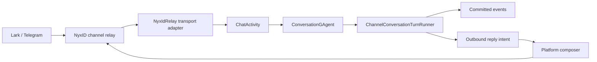

# Channel Runtime:通道如何进入 Actor 主链

## 事实源/设计抽象(以 ~/Code/aevatar 为准)

- `docs/adr/0012-channel-runtime-credential-boundary.md`:ChannelRuntime 不是凭证权威;生产路径收敛到 Lark/Telegram -> NyxID -> Aevatar。
- `docs/adr/0013-unified-channel-inbound-backbone.md`:统一入站骨干是 transport adapter -> `ChatActivity` -> `ConversationGAgent` -> turn runner。
- `docs/adr/0014-interactive-reply-abstraction.md`:交互回复是 turn-scoped collector + composer + relay dispatcher 的加法扩展。

---

Channel Runtime 的主语不是"支持了几个平台",而是"外部 IM 如何不绕开 Actor + ES + CQRS 主链"。Lark/Telegram 的差异停在 transport/rendering 边界;进入业务主干后,它们都要变成同一种 ChatActivity。

## 三个边界

**Transport adapter** 只做认证、解析、规范化和投递。HTTP relay endpoint 是 shim,不在 endpoint 里编排对话、不直接造业务 actor,也不等待跨 actor 回复。

**Conversation actor** 是入站事实拥有者。去重、slash flow、workflow resume、agent-builder routing、turn completion 都必须穿过 ConversationGAgent,否则就会长出第二条通道业务链。

**Platform renderer** 只把平台无关的 outbound intent 翻译成 Lark/Telegram 原生消息。交互卡片也是加法:新增 composer/producer/register,不是让 runtime 学会某个平台的卡片协议。

## 为什么 ChannelRuntime 不是凭证权威

凭证权威单一化是安全边界,不是实现偏好。ChannelRuntime 只保留 route、identity、status、opaque handle 这类非 secret 事实;长期 bot token、滚动密钥、吊销和审计都留在 NyxID/secret store 侧。这样做有两个收益:

1. actor event/readmodel 不会沉淀长期 secret,历史事件也不需要因为密钥轮换而重写。
2. 新平台必须先提供外部凭证经纪契约,不能靠"先把 token 塞进 ChannelRuntime"进入生产支持面。

⚠️ Telegram direct-callback 和 local-credential 路径已从 ADR-0012 的支持契约移除;ADR-0013 的 Telegram 修正案把 Telegram 也放到同一 NyxID relay 骨干上。本篇按"有意收敛到 NyxID"解释,但是否还要恢复 direct-callback 兼容面需要维护者另行决策。

本章只描述当前支持契约,不把被移除的本地凭证路径当作待补教程。

## 验收

1. ChannelRuntime 是凭证权威吗?不是,它只保存非 secret routing/identity/status/handle。
2. 通道入站有几条业务骨干?一条:relay adapter -> ChatActivity -> ConversationGAgent -> turn runner。
3. 平台代码负责什么?只负责 native rendering/composition,不拥有路由和凭证。

⟦AI:AUTO-LOOP⟧
