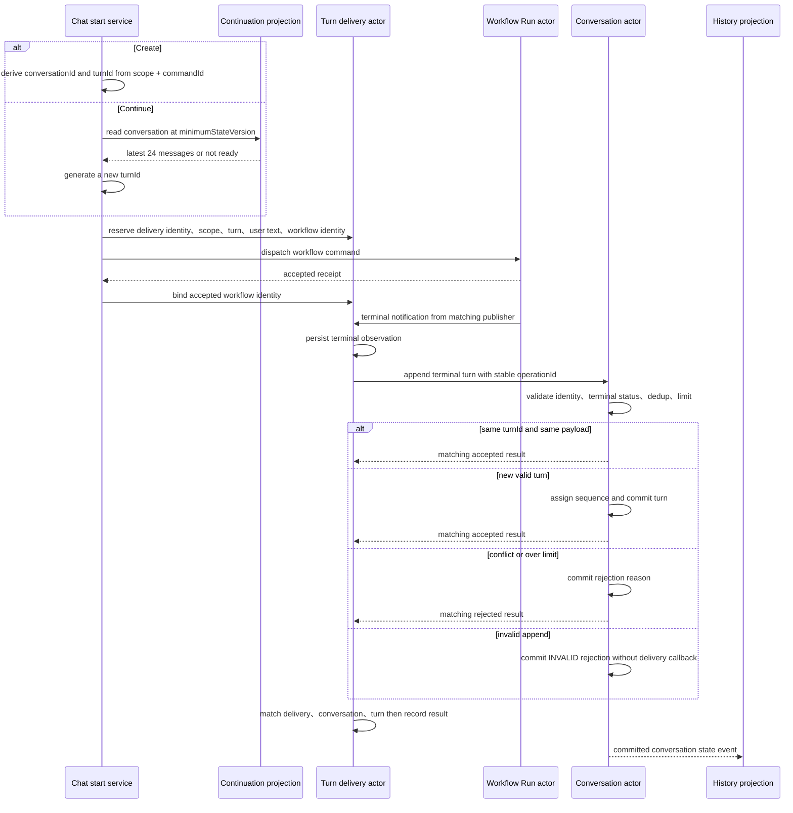
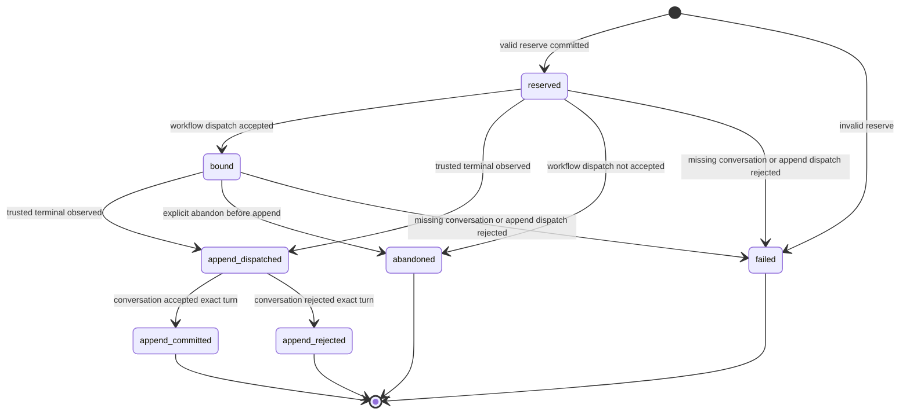

# Conversation、Turn 与耐久聊天历史

> 版本与结论：本章描述 `current`。`ChatConversationGAgent` 是单个 conversation 的终态历史权威；一次 run 的终态必须先经过独立 delivery actor，再由 conversation 确认追加结果。Workflow 已结束、append 已派发、历史已提交是三个不同事实；只有收到显式 append result，delivery 才能闭合为 committed 或 rejected。

本章承接 [Chat / Conversation / Turn 服务端身份契约](../01/03-chat-conversation-turn-contract.md)，不再重复 HTTP scope 与身份签发规则；这里回答的是：身份签发以后，哪一方拥有有序历史、终态怎样可靠收口、续聊和查询怎样读取它。

## 设计抽象与事实源

- `agents/Aevatar.GAgents.ChatHistory/chat_history_messages.proto:47`：定义 terminal `ChatTurn`、append 拒绝原因、conversation 状态与 delivery 生命周期。
- `agents/Aevatar.GAgents.ChatHistory/ChatConversationGAgent.cs:14`：单 conversation actor 只接受 terminal turn，并分配顺序、执行幂等与 250 轮硬上限。
- `agents/Aevatar.GAgents.ChatHistory/ChatTurnHistoryDeliveryGAgent.cs:120`：delivery actor 校验 Workflow terminal publisher，派发 append，并等待 conversation 回报 committed 或 rejected。

## 四个职责面，不共享“完成”一词

静态边界如下。实线表示命令或事实流，虚线表示从 committed state 派生的读侧材料；查询端不会为一次读取激活或重放 conversation actor。

```mermaid
%%{init: {"maxTextSize": 100000, "flowchart": {"useMaxWidth": false, "nodeSpacing": 18, "rankSpacing": 52}, "themeVariables": {"fontSize": "10px"}}}%%
flowchart LR
    Client["Client<br/>持有 conversationId 与水位"]
    Start["Chat start service<br/>Create / Continue 准入"]
    Run["Workflow Run actor<br/>执行与 terminal authority"]
    Delivery["Turn delivery actor<br/>单 turn 归档协调"]
    Conversation["Conversation actor<br/>有序 terminal history authority"]
    ConvProjection["Conversation projection<br/>索引、消息与续聊上下文"]
    RecoveryProjection["Create-recovery projection<br/>scope + commandId 恢复句柄"]
    Reader["History / continuation readers"]

    Client -->|"Create 或 Continue"| Start
    Start -->|"reserve identity 与 user text"| Delivery
    Start -->|"dispatch accepted 后绑定"| Delivery
    Start -->|"执行命令"| Run
    Run -->|"publisher-bound terminal notification"| Delivery
    Delivery -->|"AppendChatTurnCommand"| Conversation
    Conversation -->|"正常路径回送 identity-matched result"| Delivery
    Conversation -.->|"committed state event"| ConvProjection
    Delivery -.->|"committed state event"| RecoveryProjection
    ConvProjection --> Reader
    RecoveryProjection --> Reader
    Reader --> Client
```



| 面 | 唯一职责 | 它的终态能证明什么 | 不能证明什么 |
|---|---|---|---|
| Workflow Run | 执行一次 workflow | run 已 `completed / failed / stopped` | terminal turn 已进入 conversation |
| Turn delivery | 把一个已预留 turn 与可信 run terminal 绑定并收口 | 收到匹配 identity 的 append result 后记录 `append_committed / append_rejected`，或记录 `failed / abandoned` | result publisher 已被认证、projection 已追平 |
| Conversation | 保存一个 conversation 的有序 terminal turns | 某个 exact payload 已追加并获得 actor 分配的 `sequence` | live delta、执行进度、外部副作用 |
| Projection | 提供 scope-scoped 查询、create recovery 和 continuation admission | 某个 actor `StateVersion` 已可查询 | 写侧 actor 当前一定没有更高版本 |

这层拆分的核心不是多放一个 actor，而是拒绝含混的成功语义：Workflow terminal 是执行事实，`append_dispatched` 只是投递准入，只有 conversation 回送 accepted 后，delivery 才进入 `append_committed`。

## 一轮如何成为耐久历史

### 先 reserve，再观察 terminal，最后确认 append



Create 与 Continue 的身份规则不同：

- Create 的 `conversationId = chatc-<hash(scopeId, commandId)>`，`turnId = turn-<hash(scopeId, commandId, "turn")>`。相同 scope 与 commandId 重试得到同一身份。
- Continue 必须引用已有 conversation 且带正数 `minimumStateVersion`；准入通过后为这一轮生成新的 turnId。客户端不提交 turnId。
- Conversation actor ID 对 `(scopeId, conversationId)` 做长度前缀 tuple 的 SHA-256 编码，避免简单字符串拼接碰撞；点查同时保留 legacy actor ID 回退，供旧数据迁移读取。

Delivery 在 reserve 时已经固定 `deliveryId / scopeId / conversationId / turnId / workflowActorId / workflowCommandId / requestFingerprint`。它只接受 route publisher 与 notification 内 `workflowActorId` 相同、且 delivery 与 command identity 都匹配的 **Workflow terminal 通知**。不匹配的 terminal 通知被忽略，不会触发历史写入。

terminal 通知可以在 delivery 处于 `reserved` 或 `bound` 时到达。`bound` 记录 dispatch accepted receipt，但不是历史追加的替代证据；真正的围栏是 reserve 中固定的 workflow identity 加上 publisher 校验。收到 terminal 后，delivery 把：

- `completed` 映射为 assistant text；
- `failed` 映射为空 assistant text 与 sanitized error；
- `stopped` 映射为空 assistant text与 stop error code；

再连同原始 user text 组装为一个 terminal `ChatTurn`。live token、thinking delta 和中间 step 不进入这个 aggregate。

### Delivery 状态机是一张恢复账本

下图表达 start service、Workflow 与 conversation 按预期协作时的正常路径；它不是对任意内部消息都成立的完整安全状态机。



Actor activation 会重驱“已记录 terminal、尚未落到 `append_dispatched`”的 reserve/bound 状态。进入 `append_dispatched` 后，协议等待 append result；代码没有把 dispatch accepted 自动升级为 committed。因此运维和客户端必须保留这个中间态，不能把它渲染为“历史已保存”。

但 result handler 与 terminal handler 的信任强度不同：terminal handler 显式核对入站 publisher，append-result handler 只核对 delivery actor ID、conversationId 与 turnId，没有读取或验证 `ActiveInboundEnvelope.Route.PublisherActorId`，且不要求当前状态恰为 `append_dispatched`。正常 result 确由 conversation append 后回送，但 `append_committed` 在当前实现中只是“收到了 identity 匹配的 accepted result”，不是带 publisher proof 的不可伪造证明。`HandleAbandonedAsync` 也没有把 predecessor 限定为 reserved/bound，意外内部命令可让 committed/rejected 回退到 abandoned。

## Conversation 如何守住顺序与幂等

Conversation state 只保留 terminal turn，每个 turn 同时包含 user text、assistant text、terminal status、sanitized error、terminal time 及可选 LLM route/model。它执行四条关键规则：

1. **同 turnId、同完整 payload**：直接回送 accepted，不追加第二份。完整 payload 包含 terminal time、route 与 model，不只是问答文本。
2. **同 turnId、不同 payload**：持久化 `CONFLICT` 拒绝，并回送 rejected。
3. **新 turn**：actor 以 `Turns.Count + 1` 分配 sequence，再持久化；caller 无法指定插入位置。
4. **达到 250 turns**：第 251 个 turn 以 `MAX_TURNS_EXCEEDED` 拒绝，原 250 个不裁剪、不覆盖。缺 identity、terminal status 未指定或 conversation 已删除则在 conversation 内持久化 `INVALID` 拒绝。

冻结实现里，`CONFLICT` 与 `MAX_TURNS_EXCEEDED` 会把 rejected result 回送 delivery；`INVALID` 分支只持久化 rejection 后返回，没有回送 result。正常 delivery 已校验必填 identity 并构造 terminal status，最现实的竞态是 conversation 在 reserve 后、append 前被删除：conversation 记录 `INVALID`，delivery 却可能保持 `append_dispatched`。所以“conversation 已记录拒绝”与“delivery 已闭合为 `append_rejected`”仍不能等同。

另一个内部边界是，conversation 的 append validation 只检查命令字段非空、terminal status 与 deleted 标志，没有在已有 state 非空时复核 `command.ScopeId / ConversationId` 与 state/actor identity 一致，也没有校验 append publisher。正常 delivery 会把 reserve 中固定的身份发往相应 actor；但 actor 自身没有形成最终 ownership fence，内部错误路由或伪造命令仍可能污染这个 aggregate。

为什么选择“硬拒绝而非自动裁剪”？历史是续聊输入和审计证据。静默删掉最旧 turn 会让相同 conversationId 在没有显式版本迁移的情况下改变语义；明确拒绝把“开新 conversation、归档或提高上限”的产品决策留给上层。250 是当前实现上限，不是无限历史承诺。

为什么一个 turn 原子保存 user 与 assistant，而不是不断覆盖 transcript？终态追加给出天然的幂等单位：一个 turnId 对应一个不可歧义 payload。若把 live delta 逐条写进同一 aggregate，重连、重复 token 和失败清理都会污染业务顺序，并把高频流量压进 conversation mailbox。live observation 应由执行/流式读面承担，terminal history 只保存闭合结果。

## 查询、续聊与 create recovery

### 索引与消息都只读 projection

Conversation committed state 被投影成包含 turns 与 `StateVersion` 的 current-state document。查询合同是：

- index 必须带 scope；`scopeId == caller scope` 与 `deleted == false` 在 document store 下推过滤；
- 缺省或非正数 `pageSize` 使用 50，正数超过 200 时钳制为 200；
- 排序固定为 `updatedAt desc, conversationId asc`，下一页使用 store cursor，不使用易受插入影响的 offset；
- 单 conversation 点查同时尝试 canonical 与 legacy actor ID，复核 document 的 scope、conversationId 与 deleted 标志；
- messages 按 actor sequence 排序，每个 turn 展开为 user/assistant 两条消息，并返回该 conversation projection 的 `StateVersion`。

读路径不激活 actor，也不从 EventStore 临时重放历史。代价是 eventual consistency，所以返回的 `StateVersion` 是“这个 projection 已看到哪里”，不是“全系统现在没有更新”。

### Continuation admission 用水位拒绝残缺上下文

Continue 读取同一 conversation projection，依次验证：document 存在且未删除、scope 与 conversationId 精确匹配、`document.StateVersion >= minimumStateVersion`、至少有一条非空执行消息。任一归属失败表现为 not found；水位不足或没有可用消息表现为 not ready。

准入成功后，turn 按 sequence 展开为消息，空内容被剔除，只保留最近 **24 条消息**，并返回 `Truncated=true` 与上限。这里限制的是消息数，不保证恰好 12 个完整 turn。这样既把历史真正注入下一轮执行，又避免 conversation 越长，单次 LLM 请求无界增长。

为什么不直接问 conversation actor？准入发生在新 run 派发前，是高频只读路径。查询 projection 避免为了读而激活 actor，并让 scope filter 与分页留在读存储；`minimumStateVersion` 则把读侧滞后从隐性风险变成显式拒绝。

### Create recovery 恢复身份，不伪造归档成功

Create 的 delivery state 另投影为 `(scopeId, workflowCommandId)` 可寻址的 recovery document，暴露 conversation、turn、workflow actor/command/correlation、request fingerprint、delivery status、`StateVersion` 与更新时间。重复 Create 的处理顺序是：

1. 用 scope + commandId 查 recovery；
2. 对同一请求重新计算规范化 fingerprint；
3. fingerprint 不同则 `IDEMPOTENCY_CONFLICT`；
4. identity 字段齐全则恢复原 receipt 与 conversation/turn identity，而不是启动第二个 run。

Recovery 的 status 仍可能是 `reserved / bound / append_dispatched / append_committed / append_rejected / abandoned / failed`。恢复到原身份只证明“这是同一次 Create”，不证明历史已经追加；判断归档结果仍要看 delivery status，读取消息仍要看 conversation projection 水位。

这里还有一个必须保持诚实的版本边界：recovery document 的 `StateVersion` 是 **delivery actor** 的 committed version；Continue 的 `minimumStateVersion` 比较的是 **conversation actor projection** 的 version。冻结后端在恢复 receipt 时把 recovery version 放进 `WorkflowChatContext`，冻结 Console 的 `bindCreateRecovery` 又暂存这个值；两条水位没有可比较关系。正常 context 后的 reconciliation 会点查 conversation detail 取得正确水位，但仅靠 create recovery 不能把 recovery version 当下一轮的 continuation watermark。修复出口应是恢复身份后读取 conversation detail，或让恢复合同单独返回 conversation projection version；不能用 `max()` 混合两个 actor 的版本。

## 最小静态示例

> Demo status：`verified-static`（按冻结 proto、两个 actor、terminal delivery port、conversation/create-recovery projectors、query store 与 continuation reader 逐项核对；未启动 Host，未测量 projection 延迟，也未模拟丢包恢复）。

```text
Create(scope-alpha, commandId=cmd-42, prompt="总结本周变更")
  => conversationId = chatc-<hash(scope-alpha, cmd-42)>
  => turnId         = turn-<hash(scope-alpha, cmd-42, turn)>

Retry same normalized request
  => recover the same conversationId / turnId / workflow identity

Retry cmd-42 with a different prompt
  => IDEMPOTENCY_CONFLICT

Continue(conversationId, minimumStateVersion=7)
  projection version 6 => not ready
  projection version 7 with messages => admit and retain latest 24 messages
```

静态判定表：

| 观测 | 正确解释 | 错误解释 |
|---|---|---|
| Workflow terminal=`completed` | 本次执行结束 | 历史必然已保存 |
| delivery=`append_dispatched` | conversation mailbox 接受了 append dispatch | conversation 已 commit |
| delivery=`append_committed` | 正常路径中 exact turn 已获 accepted result | result publisher 已认证、projection 已可见 |
| create recovery `StateVersion=4` | delivery projection 已看到 delivery actor version 4 | conversation projection 也至少是 version 4 |
| index `pageSize=500` | 实际钳制为 200，并用 cursor 续页 | 一次返回全部历史 |
| 第 251 个新 turn | rejected，已有 250 个保持不变 | 自动删除最老 turn |
| messages `StateVersion=9` | 该 projection 文档已看到 actor version 9 | live stream 可从 9 断点重放 |

## 边界与演进

- 本章的 durability 只覆盖 API chat 的 terminal history 链路；Channel 侧仍有独立 retained-history 模型。把两者统一是 open `#2952` 的提案，不是冻结基线 current。
- `append_dispatched` 之后只有收到 conversation 回执才闭合；当前 actor activation 不会把该状态自动解释为 committed，而且 conversation 的 `INVALID` 分支没有回送 result。需要 repair/reconcile 时必须新增可验证协议，不能在 UI 中猜成功。
- Delivery result handler 缺 publisher proof 与 exact predecessor guard，abandon handler 也可能让 committed/rejected 回退；Conversation append handler 缺已有 state identity 与 publisher fence。退出条件是 typed publisher/actor identity 校验、严格状态转移表，以及 forged/misrouted/late-message 回归测试；这些缺口一并登记到计划中的 `12/05`。
- Create recovery 与 conversation detail 的 `StateVersion` 来自不同 actor；冻结后端/Console 会让 recovery version 进入 chat context/local state。它只能用于恢复请求身份，不能充当 continuation watermark。退出条件是恢复链路显式读取或返回 conversation projection version，并有跨 actor version 不相等的回归测试；该缺口一并登记到计划中的 `12/05`。
- History query 是 current-state projection，不是 live delta log，也没有 cursor-based reconnect/replay 合同。SSE 断开不等于 run stop，stop、mid-run steering、task plan/step lifecycle 与 reconnect 保证都不属于本章 current 能力。
- open `#481` 记录了“无回复、无进度、无错误”的运行时 silent failure；冻结代码能证明 terminal history 协议存在，不能证明该现场已经修复。该缺口汇入计划中的 [开放缺口与 canon drift](../12/05-open-gaps-and-canon-drift.md)。
- Conversation 删除后不再接受 append，查询也过滤 deleted document；本章不承诺 retention、物理清除、导出或跨 conversation 合并策略。

## 读完应能回答

1. Workflow terminal、`append_dispatched`、`append_committed` 与 projection `StateVersion` 分别证明什么？
2. 为什么 terminal append 由独立 delivery actor 收口，而不是 Workflow 直接修改 conversation state？
3. Conversation 怎样处理同 turnId 重放、payload 冲突、第 251 轮与已删除会话？
4. Continue 为什么必须携带正数 `minimumStateVersion`，为什么执行上下文只保留最近 24 条消息？
5. 相同 scope + commandId 的 Create 重试能恢复哪些身份，又有哪些成功结论仍然不能推出？

<details>
<summary>论断—证据映射</summary>

| 论断 | 等级 | 证据 |
|---|---|---|
| Conversation state 只保存 terminal turns，delivery state 区分 reserve/bind/dispatch/commit/reject/fail | E1 | `agents/Aevatar.GAgents.ChatHistory/chat_history_messages.proto:32`、`:47`、`:67`、`:118`、`:129` |
| Conversation 分配 sequence、按 exact payload 幂等、冲突或超过 250 轮时显式拒绝；INVALID 只落 rejection、不回送 delivery result | E1 | `agents/Aevatar.GAgents.ChatHistory/ChatConversationGAgent.cs:24`、`:28`、`:31`、`:37`、`:42`、`:54`、`:61`、`:103`、`:122`、`:136`、`:173` |
| Delivery 对 Workflow terminal 校验 publisher/identity，将 terminal 转成 append 并等待 result | E1 | `agents/Aevatar.GAgents.ChatHistory/ChatTurnHistoryDeliveryGAgent.cs:120`、`:126`、`:145`、`:153`、`:173`、`:186`、`:202`、`:239`、`:322` |
| append result 只核对 delivery/conversation/turn，不验证 publisher 或 exact predecessor；abandon guard 未覆盖 committed/rejected | E1 | `agents/Aevatar.GAgents.ChatHistory/ChatTurnHistoryDeliveryGAgent.cs:267`、`:271`、`:278`、`:286`、`:216`、`:222`、`:490`、`:495` |
| Conversation append validation 未把命令 scope/conversation 与已有 state/actor identity 再绑定，也未校验 publisher | E1 | `agents/Aevatar.GAgents.ChatHistory/ChatConversationGAgent.cs:28`、`:31`、`:103`、`:107`、`:112` |
| Create identity 确定性派生，conversation actor ID 使用长度前缀 tuple hash 并保留 legacy read fallback | E1 | `agents/Aevatar.GAgents.ChatHistory/ChatHistoryActorIds.cs:9`、`:12`、`:18`、`:21`、`:24`；`src/Aevatar.Studio.Infrastructure/ActorBacked/ActorBackedChatHistoryStore.cs:220` |
| Continue 只读 projection，校验归属与水位并最多保留最近 24 条非空消息 | E1 | `src/Aevatar.Studio.Infrastructure/ActorBacked/ProjectionChatConversationContinuationAdmissionReader.cs:20`、`:31`、`:34`、`:43`、`:48`、`:61`、`:69`、`:74` |
| Index 下推 scope/deleted filter，按 updated desc + id asc 游标分页，默认 50、最大 200 | E1 | `src/Aevatar.Studio.Infrastructure/ActorBacked/ActorBackedChatHistoryStore.cs:23`、`:43`、`:52`、`:55`、`:57`、`:72`、`:85`、`:89` |
| Message query 按 turn sequence 展开并返回 conversation projection StateVersion，不激活 actor | E1 | `src/Aevatar.Studio.Infrastructure/ActorBacked/ActorBackedChatHistoryStore.cs:97`、`:100`、`:107`、`:109`、`:113` |
| Create recovery 以 scope+commandId 建索引，保留身份、fingerprint、status 与 state version；重试先做 fingerprint 冲突检查 | E1 | `src/Aevatar.Studio.Projection/Projectors/ChatHistoryCreateRecoveryCurrentStateProjector.cs:34`、`:41`、`:51`、`:58`、`:65`；`src/workflow/Aevatar.Workflow.Application/Runs/WorkflowChatRunInteractionService.cs:247`、`:259`、`:269`、`:275`、`:282`、`:290` |
| Recovery StateVersion 属于 delivery actor，却被恢复 receipt 与 Console local state 当作 chat context version；它不等于 conversation continuation watermark | E1 | `src/Aevatar.Studio.Projection/Projectors/ChatHistoryCreateRecoveryCurrentStateProjector.cs:51`、`:55`；`src/workflow/Aevatar.Workflow.Application/Runs/WorkflowChatRunInteractionService.cs:300`、`:304`；`apps/aevatar-console-web/src/pages/chat/index.tsx:307`、`:316` |
| `#2792/#2874/#2876/#2888/#2920` 已有冻结实现证据；`#481` 仍是运行时缺口 | E5 | 本仓库 issue 演进账本的对应冻结成员行；current 结论由本表 E1 支撑 |

</details>
