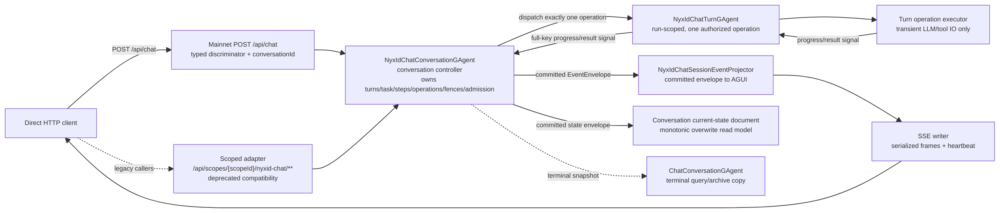
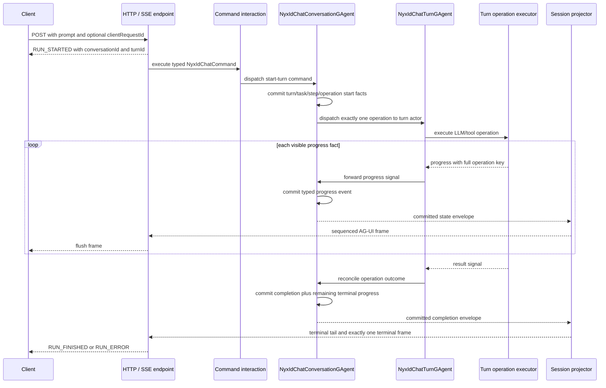
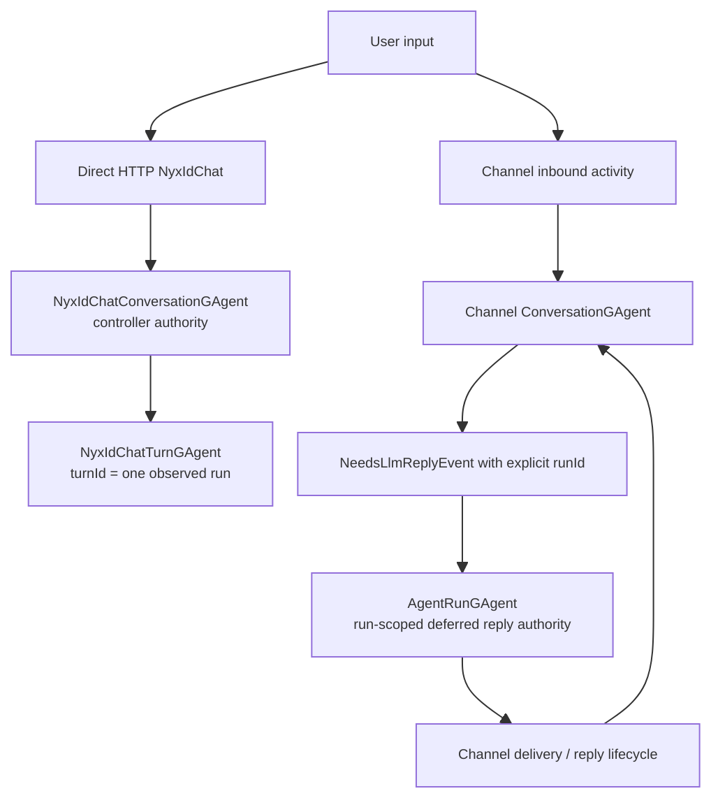

# NyxIdChat Actor 模型与已提交进度

> 版本与结论：本章描述 `current`（Mainnet NyxID Assistant Chat v1；正文同步目标为上游 HEAD `d9db826eb`——基于 feature/integrate 末端的 WIP 交接提交，frontmatter 审查基线仍为冻结 `f02aa690`）。权威运行时是 durable conversation controller actor（`NyxIdChatConversationGAgent`）加每 turn 一个 run-scoped turn actor（`NyxIdChatTurnGAgent`）：controller 拥有 turns/task/step/operation、control fence、continuation admission 与 action requests，turn actor 只执行被授权的一个 operation 并回报水线。`conversationId` 就是 controller 的 `actorId`，`turnId` 是一次被观察到的 run，`taskId/stepId/operationId/operationGeneration` 组成完整操作键。`NyxIdChatGAgent` 已降级为 `nyxid.chat.legacy` 兼容 actor；`/api/scopes/{scopeId}/nyxid-chat/**` 是 deprecated compatibility adapter。可对客户端承诺的进度来自 controller committed events 经 projection 转成 AG-UI，而不是 Host 旁路转发 provider callback。

本章只讲 direct HTTP NyxIdChat（Mainnet `POST /api/chat` 与 `/api/chat/conversations/**`，以及复用同一 actor 权威的 scoped 兼容适配器）。Channel webhook 的延迟回复使用 `ConversationGAgent + AgentRunGAgent` 另一条链路；两者共享部分 AI 能力代码，不共享 actor、run 或重连语义。

## 设计抽象与事实源

- `agents/Aevatar.GAgents.NyxidChat/NyxIdChatConversationGAgent.cs:18`、`:42`、`:571`：`nyxid.chat` conversation controller 拥有 turns/task/step/operation、control fence、continuation admission 与 action requests，`TransitionState` 从 `:42` 起消费全套 committed 事件。
- `agents/Aevatar.GAgents.NyxidChat/NyxIdChatTurnGAgent.cs:13`、`:56-63`、`:154`：`nyxid.chat.turn` run-scoped turn actor 只执行一个被授权的 operation，activation 在水线未交付时发布 `NyxIdChatRecoveryRequestedSignal` 恢复。
- `docs/canon/nyxid-chat-api.md:9`、`:78-84`、`:398-400`：v1 contract 覆盖 identity、actor-owned task execution、stop/steering、recovery 与 secret boundary；`/api/scopes/{scopeId}/nyxid-chat/**` 是 deprecated compatibility adapter。

## 身份模型：conversationId 就是 actorId



| 身份 | 所有者与寿命 | 当前用途 | 不是 |
|---|---|---|---|
| `scopeId` | 认证资源作用域 | 对话的归属/准入边界；Mainnet 从 principal 派生唯一 scope | 公开路由的路径参数 |
| `conversationId` / `actorId` | 服务端创建，conversation 寿命 | controller actor 地址、公开 thread、AG-UI `threadId`；无映射表、无第二个 ID | 一次请求的 runId |
| `turnId` | 服务端创建，一次提交或 continuation | 一次被观察到的 run；AG-UI `runId`、projection `SessionId` | conversation 身份、task 身份 |
| `taskId` | controller，一个 task plan | 一次 turn 的任务计划身份 | turnId |
| `stepId` | controller，一个 task step | 选择 taskId 内一个 typed step | — |
| `operationId` | controller，一个逻辑操作 | 关联一次 LLM/tool/postcondition 操作 | — |
| `operationGeneration` | controller，每 step 单调续期 | 拒绝陈旧 progress/result，fence retry | 陈旧证据的豁免 |
| `clientRequestId` | caller 可选，一次 transport retry 组 | 让相同请求可重放；body 优先于 `Idempotency-Key` | 资源身份、业务状态 |
| `commandId / correlationId` | CQRS dispatch / trace | 接受回执与链路关联 | commit 或 read-model 可见性 |
| `stopRequestId` / `steeringId` | caller 创建，一次控制意图 | 让一次 stop/steering 意图幂等 | turnId 别名 |
| `retryRequestId` / `skipRequestId` | caller 创建，一次 step 控制 | 让一次精确 step 控制幂等 | 任意重试许可 |
| approval `requestId` | controller | 选择待决 Aevatar tool approval | browser-action id |
| `actionRequestId` / `originTurnId` / `continuationTurnId` | controller | 一次 NyxID browser journey 与其报告；被阻塞 turn；steering/`action.continue` 后的新 run | 原 turnId 的续用 |
| `stateVersion` | controller committed version | 读模型新鲜度水位；projection 从不发明本地版本 | 本地生成序号 |

每个子 progress/result 都带完整操作键 `actorId + turnId + taskId + stepId + operationId + operationGeneration`，陈旧 generation 的进度被拒绝（canon `:78-84`）。内部 `ChatRequestEvent.SessionId` 承载 turnId，是沿用 RoleGAgent proto 字段名，不表示公开 API 仍接受 conversation-level `sessionId`；HTTP body 中 legacy `sessionId` 已弃用且忽略。

为什么 conversation 是一个 controller actor，而 turn 是独立 actor？跨轮对话需要串行拥有 transcript、task/turn 账本、approval、profile binding 与 replay cache；controller mailbox 正好提供这条单写边界。turn 需要独立生命周期，是因为一次 LLM/tool 操作可以长时间占用 mailbox、需要自己的恢复信号与终态水线；若把每轮执行塞进 controller，一个慢 turn 会阻塞同 conversation 的所有后续控制。拆出 run-scoped turn actor 后，controller 负责权威编排，turn 负责隔离执行，故障半径与一次 operation 对齐。legacy `NyxIdChatGAgent`（RoleGAgent 子类）的 turn 只是该 aggregate 中按服务端身份索引的子记录，这条旧路径不产生新的 turn actor。

## 一次 direct turn 的真实时序



`RUN_STARTED` 由 endpoint 在 dispatch 前写出，说明客户端已经拿到 transport context，不说明 controller 已接收命令。真正的 dispatch receipt 也只证明 CQRS admission。text/tool/usage/authorization/terminal 等业务帧则由 controller 先 commit（经 turn actor 回报），再经 projection 输出；这三类证据不能折成一个“已开始/已完成”。

### 冷 turn 为什么仍能 attach-existing

公开 projection port 只有 `AttachExistingChatProjectionAsync`，请求路径不能借观察 API 偷偷创建 scope。但 command interaction 在 observation bind 之前有一个窄的 lease-preparation 阶段：它调用 projection activation service，以 `(actorId, turnId, nyxid-chat-session)` `Ensure` 观察 scope；随后 lifecycle 只能 attach 这个已准备好的 scope。准备或 attach 失败返回 `PROJECTION_UNAVAILABLE`，命令不派发。

这个顺序避免两个坏结果：一是“命令已跑但当前请求永远看不到 terminal”；二是把通用观察端口变成任意 caller 都能激活 actorized infrastructure 的写接口。actor committed event hook 仍可为恢复/后续事实确保同一 scope，但不是首个 direct turn 唯一的冷启动路径。

## Actor committed progress，而不是 provider callback

### 每个 turn 有独立单调序列

controller 维护 turn/task/step/operation 的 committed 事件族：`NyxIdChatTurnStartedEvent`、`NyxIdChatOperationProgressedEvent`、`NyxIdChatOperationReconciledEvent`、`LateOperationEvidenceCommittedEvent`、`ControlFenceCommittedEvent`、`ContinuationAdmissionCommittedEvent`、`StepControlCommittedEvent`、`TurnAdmissionRejectedEvent`、`NyxIdChatActionRequestedEvent` 等（`NyxIdChatProjectionSession.cs:272-442`）。每个 progress/result 都带完整操作键；`operationGeneration` 单调续期，陈旧 generation 的 evidence 被拒绝。progress sequence 是 controller-owned 单调序列，projection 不发明本地版本。

Projector 再要求 envelope 是 committed state publication、turnId 与 projection session 一致，才把 payload 映射成 AG-UI，并把 controller sequence 原样放进 frame。AG-UI 帧集扩展到 `nyxid.task.snapshot`、`nyxid.task.step.changed`、`nyxid.control.changed` 等（canon `:136-141`）。同一 sequence 可能展开成多个不同 frame；sink fence 因此按“最新 sequence + protobuf fingerprint”去重：丢掉旧 sequence 与同序同内容重复，同时保留同序不同 frame。sequence 是 controller-owned 单调序列，不是全 controller `stateVersion`，更不是断线续传 cursor。

### terminal 与 replay 不重复执行

正常执行的 turn 由 controller commit authoritative completion 与尚未发出的 terminal tail；projector 只展开 `terminal_progress`，不从完整 snapshot 重新合成已经流过的 text/tool 帧。这样 completion commit 不会造成 UI 重复。

若相同 conversation + clientRequestId + 相同 input 重试，命中已 committed turn 语义，不再调用 provider/tool，而是按 operation-key 语义复用 admission/result；identity 复用但内容不同则 fail closed。更完整的 turn-authority 与 catalog fencing 见 [Turn 权威、工具目录与重试](04-turn-authority-tool-catalog-and-retry.md)。

为什么 progress 必须先 commit？直接把 provider chunk 写 SSE 延迟更低，但 actor 崩溃后客户端已见事实与 actor state 会分叉，tool start 也可能在工具实际执行后才被补写。先 commit 让“客户端看见”成为 actor 已接受的可审计事实；成本是每个可见进度都进入 event stream，吞吐与 event volume 必须由产品选择而不是 Host 偷偷旁路。

## Conversation history：执行权威与查询副本

controller 的 committed state 是 direct 链路的执行/重放权威：每个 turn 保存 prompt、operation 事实、usage、terminal outcome/time、progress sequence 等。legacy `NyxIdChatGAgent`（RoleGAgent 子类）仍以 `RoleGAgentState.sessions` 保存 per-turn 事实，激活时按 session sequence 从 completed sessions 重建运行时 `ChatHistory`；这些上限（`MaxTrackedSessions=128` 可裁剪目标、默认最近 100 条消息的 transcript）现在只约束 legacy 路径。

另一个 `ChatConversationGAgent` 会接收 NyxIdChat terminal user/assistant snapshot，供统一 chat-history index/query 使用；但 `SaveMessagesAsync` 只是向 archive actor dispatch append，发生在 direct 链路已提交 completion 之后，没有反向事务或 commit confirmation。archive 失败/滞后不回滚 direct terminal，archive 中仍存在的 turn 也不会被读回作为 replay cache。两套历史仍并存，统一所有权是 open issue `#2952` 的提案，不得写成已经完成。

Blocked 与 failed turn 也会以安全文本进入两侧历史，后续新 turn 仍可在同 conversation 上执行。凭据和原始错误体不进入 committed state/archive；NyxID access token 只在当前 turn 的 runtime context 中使用并在 turn 结束后清理。

## Direct HTTP 与 Channel deferred reply 不是一套 run



Direct HTTP 把 start-turn command 发给 conversation controller，turn actor 承载一次 run 的执行。Channel turn runner 则创建 explicit `runId`，dispatcher 由它派生独立 `AgentRunGAgent` actor；该 actor 负责一次 deferred reply 的生成、handoff、drop/failure 与 cleanup。Channel 需要独立 run actor，是因为 webhook 已先返回、回复凭据会过期、交付需重试且 conversation mailbox 不应被慢 I/O 占住。这些约束不存在于同一条 direct SSE request 中。

因此不能从 Channel 推导 direct chat 有 durable deferred delivery，也不能从 direct per-turn projection 推导 Channel AgentRun 使用相同 AG-UI/SSE 合同。Channel 的 delivery、空回复与修复策略归入 `08` 块。

## 最小静态示例

> Demo status：`verified-static`（按 endpoint、command interaction、controller/turn actor、projector、canon 与 tests 核对；未启动 NyxID provider、未建立真实 SSE、未测量 projection 延迟）。

```http
POST /api/chat
Authorization: Bearer <nyxid-access-token>
Content-Type: application/json
Idempotency-Key: client-request-42

{
  "type": "text",
  "conversationId": "nyx-chat-1",
  "prompt": "总结已连接仓库",
  "clientRequestId": "client-request-42"
}
```

`type` 是 Mainnet facade 的判别字段：带 `type`（`text`/`action.continue`/`approval.resolve`/`task.stop`/`task.steer`/`step.retry`/`step.skip`）的 JSON 路由到 NyxID Chat v1（`MainnetChatEndpoints.cs:22-32`、`:50-96`）；form 或无 `type` 的 JSON 走 Workflow Chat 分支。

静态预期：

```text
conversationId = nyx-chat-1 (== controller actorId)
turnId  = server-authored, one observed run

RUN_STARTED              sequence absent, transport context only
TEXT_MESSAGE_START       sequence 1, controller-committed progress
TEXT_MESSAGE_CONTENT     sequence 2..N, controller-committed progress
RUN_FINISHED/RUN_ERROR   final committed terminal progress
```

| 场景 | current 结果 | 不能推出 |
|---|---|---|
| 不带 clientRequestId | 服务端生成随机 turnId | 网络重试自动命中原 turn |
| 同 key、同 conversation、同 input | 按 operation-key 语义复用 committed admission/result，不再执行 LLM/tool | 永久幂等或新建第二个 turn actor |
| 同 key、同 conversation、不同 prompt/input | fail closed（identity 复用但内容不同） | 覆盖原 turn |
| projection scope prepare 失败 | dispatch 前 `PROJECTION_UNAVAILABLE` | controller 已执行 |
| SSE 5 分钟未见 terminal | endpoint 写安全 `STREAM_TIMEOUT` 并结束观察 | actor 已 stop、外部副作用已取消 |
| authorization required | typed blocker + blocked terminal | 自动续跑、pending approval 已建立 |
| scoped 兼容路径 | 复用同一 controller 权威，`/api/scopes/{scopeId}/nyxid-chat/**` 是 deprecated adapter | 两条独立权威 |

## 边界与演进

- `RUN_STARTED`、heartbeat 与 endpoint-local setup/timeout error 是 transport frames，不携 actor progress sequence；只有 committed progress/projected rejection 才有 actor-derived sequence。
- 当前 durable completion resolver 固定返回 incomplete。若 projection 没产出 terminal，endpoint 只能在有界 deadline 后给安全 `RUN_ERROR`，不能从 actor current state补回 authoritative terminal。
- request cancellation、SSE disconnect 与 `STREAM_TIMEOUT` 都不是 actor-owned stop。stop/steering 由 `NyxIdChatEndpoints.Controls.cs`（task.stop/task.steer/step.retry/step.skip）经 control fence 进入 controller；task plan/step 生命周期由 `NyxIdChatTaskLifecycle.cs`/`NyxIdChatTaskTransitionPolicy.cs` 与 `protos/nyxid_chat_task.proto` 建模，reconnect 语义由 `NyxIdChatTurnGAgent` 的 recovery signal 与 `NYXID_CHAT_OPERATION_*` 恢复状态承载（canon `:152-222`、`:402-415`）。
- projection sink 的 sequence fence 只活在该 attachment lease 内；它没有跨连接 cursor/history，也不构成断线续传合同。
- legacy `NyxIdChatGAgent` 以 128 为可裁剪 session 目标上限，但 pending completion delivery 可使其暂时超限；LLM runtime history 另有消息上限。被裁剪 turn 会失去 replay cache，而外部 ChatConversation archive 又不能回填它。保留、统一与权威收敛需要明确迁移设计。
- closed `#2893` 的 committed progress 与 typed presentation 在冻结代码/测试存在，可支撑 current；closed `#2891` 的 authorization-required 引导也是当前 typed blocker。open `#2954–#2957` 的 stop、durable reconnect、steering 与 task steps 已在 HEAD 落地（`NyxIdChatEndpoints.Controls.cs`、`NyxIdChatTaskLifecycle.cs`、`NyxIdChatTaskTransitionPolicy.cs`、`protos/nyxid_chat_task.proto`、`ProjectionNyxIdChatConversationStateQueryPort.cs`、`Projectors/NyxIdChatConversationCurrentStateProjector.cs`），它们属于 controller/turn 新模型，不属于 legacy `NyxIdChatGAgent` 权威路径；12/05 缺口账本相应行是冻结基线事实，已与 HEAD 冲突，需以 HEAD 为准。

## 读完应能回答

1. `actorId`、`turnId`、`clientRequestId`、CQRS commandId 与 approval requestId 为什么不能互换？
2. cold direct turn 怎样先准备 projection scope、再 attach-existing、最后 dispatch，为什么准备失败必须 fail closed？
3. 哪些 SSE frame 是 actor committed progress，哪些只是 endpoint transport context？
4. 相同 clientRequestId 的同输入与不同输入重试各发生什么，为什么都不需要第二个 turn actor？
5. Direct NyxIdChat 与 Channel deferred `AgentRunGAgent` 分别拥有哪条生命周期，为什么不能互相外推？

<details>
<summary>论断—证据映射</summary>

| 论断 | 等级 | 证据 |
|---|---|---|
| HTTP 为每次提交签发 turnId，无 key 时随机，有 key 时按 conversation+key 长度前缀材料哈希；legacy sessionId 忽略 | E1 | `agents/Aevatar.GAgents.NyxidChat/NyxIdChatEndpoints.Streaming.cs:745-754`、`:969-976` |
| command interaction 先确保 per-turn observation scope，再 attach-existing；失败在 dispatch 前返回 ProjectionUnavailable | E1 | `agents/Aevatar.GAgents.NyxidChat/NyxIdChatObservationScopeLeasePreparation.cs:24`、`:32`、`:44`、`:54`；`agents/Aevatar.GAgents.NyxidChat/NyxIdChatInteraction.cs:226`、`:242`、`:247` |
| controller 拥有 conversation 权威：`NyxIdChatConversationGAgent` 从 committed 事件族推进 turn/task/step/operation 状态并派发 turn actor | E1 | `agents/Aevatar.GAgents.NyxidChat/NyxIdChatConversationGAgent.cs:18`、`:42`、`:155`、`:217`、`:571` |
| turn actor run-scoped 只执行一个被授权 operation，activation 在水线未交付时发布 recovery signal | E1 | `agents/Aevatar.GAgents.NyxidChat/NyxIdChatTurnGAgent.cs:13`、`:56-63`、`:85`、`:154` |
| projector 只接受 committed envelope、匹配 turnId，再映射 typed AG-UI；controller 事件族含 turn/operation/control/continuation/action 全套 | E1 | `agents/Aevatar.GAgents.NyxidChat/NyxIdChatProjectionSession.cs:228`、`:236-445`（`:272-442` 事件族）；canon `docs/canon/nyxid-chat-api.md:136-141` |
| completed 同输入重试按 operation-key 语义复用 admission/result；identity 复用但内容不同 fail closed | E1 | `docs/canon/nyxid-chat-api.md:78-84`、`:105`、`:222`；`agents/Aevatar.GAgents.NyxidChat/NyxIdChatTurnGAgent.cs:16-29` |
| legacy `NyxIdChatGAgent`（RoleGAgent 子类）以 128 为可裁剪 session 目标上限，pending completion delivery 可阻止裁剪；默认 history 上限 100 条消息 | E1 | `agents/Aevatar.GAgents.NyxidChat/NyxIdChatGAgent.cs:40`；`src/Aevatar.AI.Core/RoleGAgent.cs:42`、`:2945-2948`；`src/Aevatar.AI.Core/Chat/ChatHistory.cs:16` |
| NyxIdChat terminal snapshot 在 completion 后另 dispatch 到 ChatConversation query/archive；无跨 actor 事务，也不替代 replay state | E1 | `agents/Aevatar.GAgents.NyxidChat/NyxIdChatGAgent.cs:384`、`:492-558`；`src/Aevatar.Studio.Infrastructure/ActorBacked/ActorBackedChatHistoryStore.cs:116`、`:125`、`:128` |
| Channel deferred reply 由 explicit runId 派生独立 AgentRunGAgent，direct HTTP 不使用该 actor | E1 | `agents/Aevatar.GAgents.NyxidChat/AgentRunDispatcher.cs:31-38`；`agents/Aevatar.GAgents.NyxidChat/AgentRunGAgent.cs:20-21`、`:35` |
| stop/steering/task-step 已在新 controller/turn 模型落地；#2954–#2957 不再属于未落地能力 | E1 | `agents/Aevatar.GAgents.NyxidChat/NyxIdChatEndpoints.Controls.cs:19-33`；`agents/Aevatar.GAgents.NyxidChat/NyxIdChatEndpoints.State.cs:11-79`；`agents/Aevatar.GAgents.NyxidChat/NyxIdChatTaskLifecycle.cs:20-84`；`agents/Aevatar.GAgents.NyxidChat/NyxIdChatTaskTransitionPolicy.cs:16-80` |

</details>
