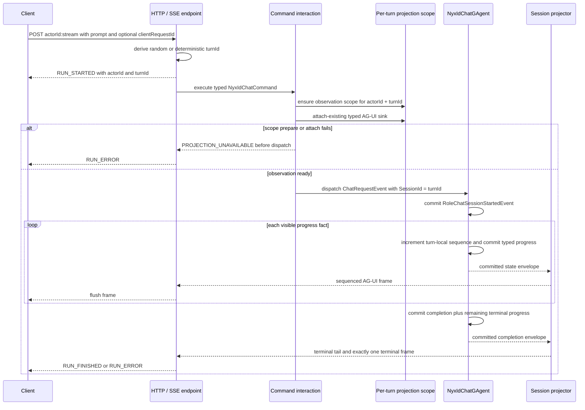
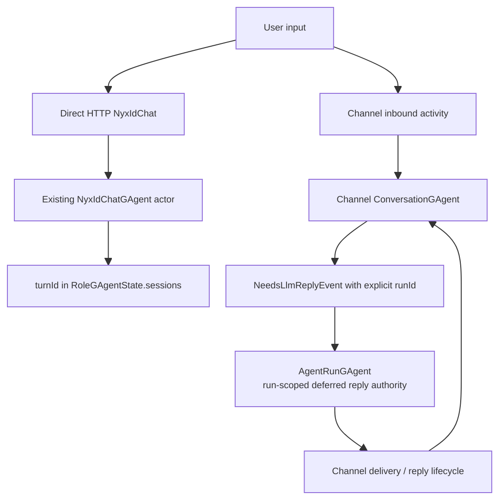

# NyxIdChat Actor 模型与已提交进度

> 版本与结论：本章描述 `current`。Direct HTTP chat 的 conversation 是一个跨多轮存活的 `NyxIdChatGAgent` actor；每次提交由服务端签发独立 `turnId`，它是 actor 内的执行、重放与观察身份，不是第二个业务 actor。可对客户端承诺的进度来自 actor committed events 经 projection 转成 AG-UI，而不是 Host 旁路转发 provider callback。

本章只讲 direct HTTP NyxIdChat。Channel webhook 的延迟回复使用 `ConversationGAgent + AgentRunGAgent` 另一条链路；两者共享部分 AI 能力代码，不共享 actor、run 或重连语义。

## 设计抽象与事实源

- `agents/Aevatar.GAgents.NyxidChat/NyxIdChatGAgent.cs:585`：conversation actor 执行 direct turn，并在 actor committed session 终态之后生成查询历史追加。
- `agents/Aevatar.GAgents.NyxidChat/NyxIdChatProjectionSession.cs:228`：per-turn projector 只消费 committed state envelope，把 typed progress 映射为 AG-UI。
- `docs/canon/nyxid-chat-api.md:9`：固定 `actorId / turnId / clientRequestId` 的所有权、流式与重放合同。

## 先把三层身份分开

```mermaid
%%{init: {"maxTextSize": 100000, "flowchart": {"useMaxWidth": false, "nodeSpacing": 18, "rankSpacing": 54}, "themeVariables": {"fontSize": "10px"}}}%%
flowchart LR
    Client["Direct HTTP client"]
    Endpoint["NyxIdChat stream endpoint<br/>auth、turn identity、SSE transport"]
    Conversation["NyxIdChatGAgent actor<br/>conversation execution/replay authority"]
    TurnState["RoleGAgentState.sessions[turnId]<br/>committed per-turn facts"]
    Scope["Per-turn projection scope<br/>observation infrastructure"]
    Projector["NyxIdChatSessionEventProjector<br/>committed event to AG-UI"]
    Sse["SSE writer<br/>serialized frames + heartbeat"]
    Archive["ChatConversationGAgent<br/>terminal query/archive copy"]

    Client -->|"actorId + prompt + optional clientRequestId"| Endpoint
    Endpoint -->|"prepare observation scope then dispatch ChatRequestEvent"| Conversation
    Conversation --> TurnState
    TurnState -.->|"CommittedStateEventPublished"| Scope
    Scope --> Projector
    Projector -->|"sequenced AGUIEvent"| Sse
    Sse --> Client
    Conversation -->|"terminal user/assistant snapshot"| Archive

    Channel["Channel webhook"]
    ChannelConversation["Channel ConversationGAgent"]
    AgentRun["AgentRunGAgent<br/>one deferred channel reply"]
    Channel --> ChannelConversation
    ChannelConversation --> AgentRun
    AgentRun -.->|"separate delivery path"| ChannelConversation
```



| 身份 | 所有者与寿命 | 当前用途 | 不是 |
|---|---|---|---|
| `actorId` | 服务端创建，conversation 寿命 | actor 地址、跨 turn 的对话身份、AG-UI `threadId` | 一次请求的 runId |
| `turnId` | 服务端签发，一次提交或 approval continuation | `RoleGAgentState.sessions` 键、重放键、projection `SessionId`、AG-UI `runId` | 子 actor、conversation identity |
| `clientRequestId` | caller 可选，一次 transport retry 组 | 让服务端在同 actor 下确定性派生相同 turnId | commandId、actorId、业务状态 |
| `commandId / correlationId` | CQRS dispatch / trace | 接收回执与链路关联 | LLM 完成或 turn replay identity |
| approval `requestId` | conversation actor 的 pending approval state | 选择待决审批；批准时另签 continuation turnId | 原 turnId 的别名 |

内部 `ChatRequestEvent.SessionId` 承载 turnId，是沿用 RoleGAgent proto 字段名，不表示公开 API 仍接受 conversation-level `sessionId`。HTTP body 中 legacy `sessionId` 已弃用且忽略。

为什么 conversation 是一个 actor，而 turn 不是一个 actor？跨轮对话需要串行拥有 transcript、pending approval、profile binding 与 replay cache；actor mailbox 正好提供这条单写边界。turn 的状态只是该 aggregate 中按服务端身份索引的子记录。为每轮再建业务 actor 会引入跨 actor transcript 拼接和审批归属协调，却没有独立并发价值。per-turn projection scope 确实是 actorized runtime lease，但它只拥有观察生命周期，不拥有 prompt、工具调用或 terminal outcome。

## 一次 direct turn 的真实时序



`RUN_STARTED` 由 endpoint 在 dispatch 前写出，说明客户端已经拿到 transport context，不说明 actor 已接收命令。真正的 dispatch receipt 也只证明 CQRS admission。text/tool/usage/authorization/terminal 等业务帧则由 actor 先 commit，再经 projection 输出；这三类证据不能折成一个“已开始/已完成”。

### 冷 turn 为什么仍能 attach-existing

公开 projection port 只有 `AttachExistingChatProjectionAsync`，请求路径不能借观察 API 偷偷创建 scope。但 command interaction 在 observation bind 之前有一个窄的 lease-preparation 阶段：它调用 projection activation service，以 `(actorId, turnId, nyxid-chat-session)` `Ensure` 观察 scope；随后 lifecycle 只能 attach 这个已准备好的 scope。准备或 attach 失败返回 `PROJECTION_UNAVAILABLE`，命令不派发。

这个顺序避免两个坏结果：一是“命令已跑但当前请求永远看不到 terminal”；二是把通用观察端口变成任意 caller 都能激活 actorized infrastructure 的写接口。actor committed event hook 仍可为恢复/后续事实确保同一 scope，但不是首个 direct turn 唯一的冷启动路径。

## Actor committed progress，而不是 provider callback

### 每个 turn 有独立单调序列

`RoleChatSessionProgressedEvent` 固定一个 `session_id = turnId`、正数 `sequence`，以及一个 typed payload：

- text start/delta/end 与 reasoning delta；
- media；
- tool start/result 与 tool approval required；
- usage；
- NyxID authorization required；
- terminal；
- 显式 replay snapshot。

RoleGAgent 从该 turn 的 `last_progress_sequence` 取水位，每次创建 progress 时加一；状态 transition 忽略小于等于当前水位的 progress。Projector 再要求 envelope 是 committed state publication、turnId 与 projection session 一致且 sequence 为正，才把 payload 映射成 AG-UI，并把 actor sequence 原样放进 frame。

同一 sequence 可能展开成多个不同 frame，例如显式 replay 会恢复 tool、reasoning、media、text、usage 与 terminal。sink fence 因此按“最新 sequence + protobuf fingerprint”去重：丢掉旧 sequence 与同序同内容重复，同时保留同序不同 frame。sequence 是 turn-local actor progress 顺序，不是全 actor `StateVersion`，更不是断线续传 cursor。

### terminal 与 replay 不重复执行

正常执行的 `RoleChatSessionCompletedEvent` 原子携带 authoritative completion 与尚未发出的 terminal tail。Projector只展开 `terminal_progress`，不从完整 snapshot 重新合成已经流过的 text/tool 帧。这样 completion commit 不会造成 UI 重复。

若相同 actor + clientRequestId + 相同 input 重试，RoleGAgent 命中已 completed session，不再调用 provider/tool，而是 commit 一个显式 replay progress，projection 才展开保存的 snapshot。相同 turnId 但 prompt 或 input parts 不同，则 actor commit `RoleChatCommandAttemptRejectedEvent`，projection 以 committed actor state version 输出 `IDEMPOTENCY_CONFLICT`；旧 session 的 terminal authority 不被改写。更完整的 turn-authority 与 catalog fencing 见 [Turn 权威、工具目录与重试](04-turn-authority-tool-catalog-and-retry.md)。

为什么 progress 必须先 commit？直接把 provider chunk 写 SSE 延迟更低，但 actor 崩溃后客户端已见事实与 actor state 会分叉，tool start 也可能在工具实际执行后才被补写。先 commit 让“客户端看见”成为 actor 已接受的可审计事实；成本是每个可见进度都进入 event stream，吞吐与 event volume 必须由产品选择而不是 Host 偷偷旁路。

## Conversation history：执行权威与查询副本

`RoleGAgentState.sessions` 是 direct actor 的执行/重放权威。每个 turn 保存 prompt、input/output、tool facts、usage、terminal outcome/time、last progress sequence 等。actor 激活时按 session sequence 从 completed sessions 重建运行时 `ChatHistory`，因此 passivation 后下一轮仍可读取已提交上下文，而不是依赖进程内 List。

当前存在两个明确上限/清理条件：

- `MaxTrackedSessions=128` 是可裁剪 session 的目标上限：超过后按 session sequence 移除最老的 eligible turn；若旧 turn 仍有 completion notification 未 dispatched/expired，则不能裁剪，map 可以暂时超过 128；
- 重建给 LLM 的运行时 transcript 默认只取最近 100 条消息，并受 `MaxHistoryMessages` 配置覆盖。

这意味着“一个 actor 持有多轮对话”不等于无限保存每轮细节。turn 一旦从 `RoleGAgentState.sessions` 裁剪，相同 deterministic turnId 不再命中 actor replay cache，可能作为新执行重新进入；幂等窗口由 retained session state 决定，不是哈希本身的永久保证。

另一个 `ChatConversationGAgent` 会接收 NyxIdChat terminal user/assistant snapshot，供统一 chat-history index/query 使用；但 `SaveMessagesAsync` 只是向 archive actor dispatch append，发生在 direct actor 已提交 completion 之后，没有反向事务或 commit confirmation。archive 失败/滞后不回滚 direct terminal，archive 中仍存在的 turn 也不会被 RoleGAgent 读回作为 replay cache。两套历史仍并存，统一所有权是 open issue `#2952` 的提案，不得写成已经完成。

Blocked 与 failed turn 也会以安全文本进入两侧历史，后续新 turn 仍可在同 actorId 上执行。凭据和原始错误体不进入 committed session/archive；NyxID access token 只在当前 turn 的 runtime context 中使用并在 turn 结束后清理。

## Direct HTTP 与 Channel deferred reply 不是一套 run



Direct HTTP 把 `ChatRequestEvent` 发给既有 conversation actor，turnId 只是 actor 内键。Channel turn runner 则创建 explicit `runId`，dispatcher 由它派生独立 `AgentRunGAgent` actor；该 actor 负责一次 deferred reply 的生成、handoff、drop/failure 与 cleanup。Channel 需要独立 run actor，是因为 webhook 已先返回、回复凭据会过期、交付需重试且 conversation mailbox 不应被慢 I/O 占住。这些约束不存在于同一条 direct SSE request 中。

因此不能从 Channel 推导 direct chat 有 durable deferred delivery，也不能从 direct per-turn projection 推导 Channel AgentRun 使用相同 AG-UI/SSE 合同。Channel 的 delivery、空回复与修复策略归入 `08` 块。

## 最小静态示例

> Demo status：`verified-static`（按冻结 endpoint、command interaction、RoleGAgent committed session/progress、NyxIdChat projector、canon 与 tests 核对；未启动 NyxID provider、未建立真实 SSE、未测量 projection 延迟）。

```http
POST /api/scopes/scope-alpha/nyxid-chat/conversations/nyx-chat-1:stream
Authorization: Bearer <nyxid-access-token>
Content-Type: application/json
Idempotency-Key: client-request-42

{
  "prompt": "总结已连接仓库",
  "clientRequestId": "client-request-42"
}
```

静态预期：

```text
actorId = nyx-chat-1
turnId  = turn-<sha256(length-prefixed actorId + clientRequestId)[:32]>

RUN_STARTED              sequence absent, transport context only
TEXT_MESSAGE_START       sequence 1, actor-committed progress
TEXT_MESSAGE_CONTENT     sequence 2..N, actor-committed progress
RUN_FINISHED/RUN_ERROR   final committed terminal progress
```

| 场景 | current 结果 | 不能推出 |
|---|---|---|
| 不带 clientRequestId | 服务端生成随机 turnId | 网络重试自动命中原 turn |
| 同 key、同 actor、同 input，且 session 尚保留 | 重放 committed snapshot，不再执行 LLM/tool | 永久幂等或新建第二个 turn actor |
| 同 key、同 actor、不同 prompt/input | committed `IDEMPOTENCY_CONFLICT` | 覆盖原 turn |
| projection scope prepare 失败 | dispatch 前 `PROJECTION_UNAVAILABLE` | actor 已执行 |
| SSE 5 分钟未见 terminal | endpoint 写安全 `STREAM_TIMEOUT` 并结束观察 | actor 已 stop、外部副作用已取消 |
| authorization required | typed blocker + blocked terminal | 自动续跑、pending approval 已建立 |

## 边界与演进

- `RUN_STARTED`、heartbeat 与 endpoint-local setup/timeout error 是 transport frames，不携 actor progress sequence；只有 committed progress/projected rejection 才有 actor-derived sequence。
- 当前 durable completion resolver 固定返回 incomplete。若 projection 没产出 terminal，endpoint 只能在有界 deadline 后给安全 `RUN_ERROR`，不能从 actor current state补回 authoritative terminal。
- request cancellation、SSE disconnect 与 `STREAM_TIMEOUT` 都不是 actor-owned stop。冻结基线没有 direct NyxIdChat stop command、mid-run steering、task plan/step lifecycle或 reconnect replay API。
- projection sink 的 sequence fence 只活在该 attachment lease 内；它没有跨连接 cursor/history，也不构成断线续传合同。
- direct actor 以 128 为可裁剪 session 目标上限，但 pending completion delivery 可使其暂时超限；LLM runtime history 另有消息上限。被裁剪 turn 会失去 replay cache，而外部 ChatConversation archive 又不能回填它。保留、统一与权威收敛需要明确迁移设计。
- closed `#2893` 的 committed progress 与 typed presentation 在冻结代码/测试存在，可支撑 current；closed `#2891` 的 authorization-required 引导也是当前 typed blocker。open `#2954–#2957` 的 stop、durable reconnect、steering 与 task steps 只进入计划中的 [开放缺口与 canon drift](../12/05-open-gaps-and-canon-drift.md)。

## 读完应能回答

1. `actorId`、`turnId`、`clientRequestId`、CQRS commandId 与 approval requestId 为什么不能互换？
2. cold direct turn 怎样先准备 projection scope、再 attach-existing、最后 dispatch，为什么准备失败必须 fail closed？
3. 哪些 SSE frame 是 actor committed progress，哪些只是 endpoint transport context？
4. 相同 clientRequestId 的同输入与不同输入重试各发生什么，为什么都不需要第二个 turn actor？
5. Direct NyxIdChat 与 Channel deferred `AgentRunGAgent` 分别拥有哪条生命周期，为什么不能互相外推？

<details>
<summary>论断—证据映射</summary>

| 论断 | 等级 | 证据 |
|---|---|---|
| HTTP 为每次提交签发 turnId，无 key 时随机，有 key 时按 actor+key 长度前缀材料哈希；legacy sessionId 忽略 | E1 | `agents/Aevatar.GAgents.NyxidChat/NyxIdChatEndpoints.Streaming.cs:34`、`:390`、`:399`、`:504`、`:509` |
| command interaction 先确保 per-turn observation scope，再 attach-existing；失败在 dispatch 前返回 ProjectionUnavailable | E1 | `agents/Aevatar.GAgents.NyxidChat/NyxIdChatObservationScopeLeasePreparation.cs:24`、`:32`、`:44`、`:54`；`agents/Aevatar.GAgents.NyxidChat/NyxIdChatInteraction.cs:226`、`:242`、`:247` |
| ChatRequestEvent.SessionId 内部承载 turnId，turn 仍派发给同一 actor | E1 | `agents/Aevatar.GAgents.NyxidChat/NyxIdChatInteraction.cs:17`、`:273`、`:276`、`:297` |
| progress sequence 由 actor 按 session last-progress 水位递增，typed progress 与 completion 都先 commit | E1 | `src/Aevatar.AI.Core/RoleGAgent.cs:1027`、`:1585`、`:1614`、`:1621`、`:1673`、`:1684`、`:1702`、`:1714` |
| projector 只接受 committed envelope、匹配 turnId 与正 sequence，再映射 typed AG-UI；正常 completion 只展开 terminal tail | E1 | `agents/Aevatar.GAgents.NyxidChat/NyxIdChatProjectionSession.cs:236`、`:243`、`:253`、`:263`、`:321`、`:344`、`:486` |
| completed 同输入重试显式 replay，不同输入提交 rejection；旧 terminal authority 不变 | E1 | `src/Aevatar.AI.Core/RoleGAgent.cs:963`、`:973`、`:982`、`:988`、`:2239`、`:2247`、`:2254` |
| actor committed sessions 重建 runtime transcript；128 是 eligible session 清理目标，pending completion delivery 可阻止裁剪；默认 history 上限 100 条消息 | E1 | `src/Aevatar.AI.Core/RoleGAgent.cs:42`、`:105`、`:2880`、`:2886`、`:2919`、`:2949`；`src/Aevatar.AI.Core/Chat/ChatHistory.cs:15` |
| NyxIdChat terminal session 在 direct completion 后另 dispatch 到 ChatConversation query/archive；无跨 actor 事务，也不替代 actor replay state | E1 | `agents/Aevatar.GAgents.NyxidChat/NyxIdChatGAgent.cs:585`、`:598`、`:718`、`:781`；`src/Aevatar.Studio.Infrastructure/ActorBacked/ActorBackedChatHistoryStore.cs:116`、`:125`、`:128` |
| Channel deferred reply 由 explicit runId 派生独立 AgentRunGAgent，direct HTTP 不使用该 actor | E1 | `agents/Aevatar.GAgents.NyxidChat/AgentRunDispatcher.cs:31`、`:35`、`:38`、`:41`；`agents/Aevatar.GAgents.NyxidChat/AgentRunGAgent.cs:20`、`:35` |
| #2891/#2893 已有冻结实现证据；#2954–#2957 仍是未落地能力 | E5 | 本仓库 issue 演进账本对应冻结成员行；current 论断由本表 E1 支撑 |

</details>
