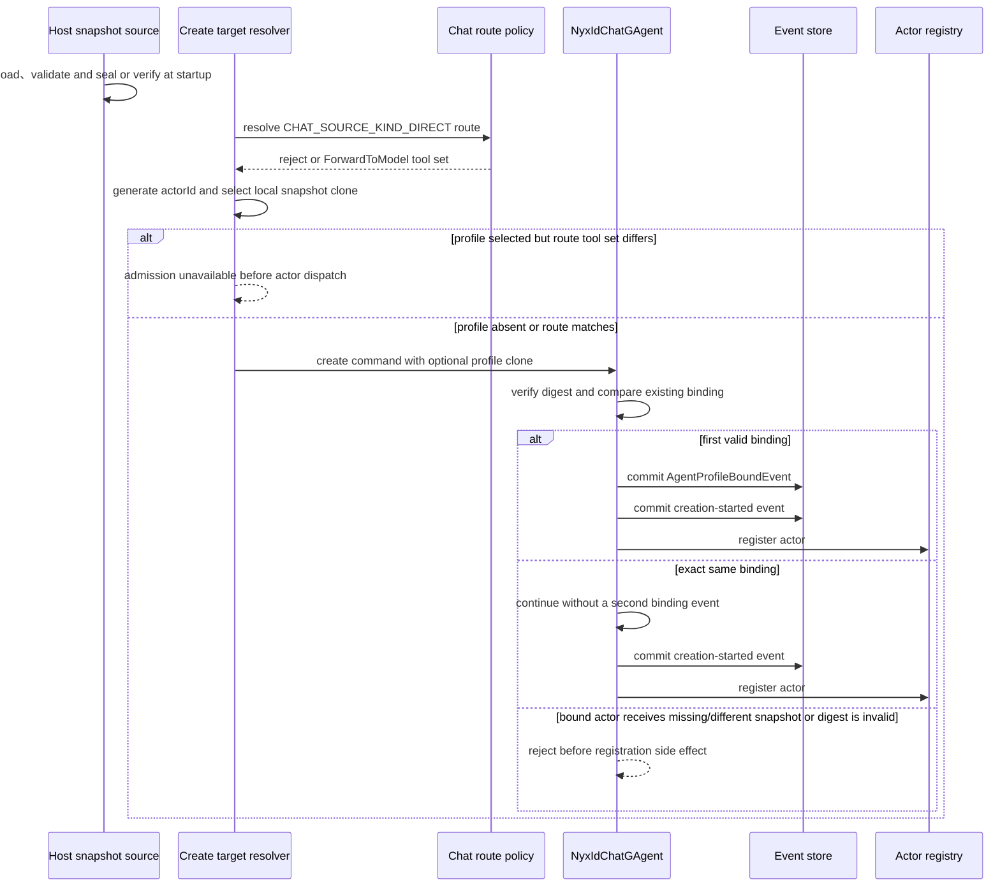
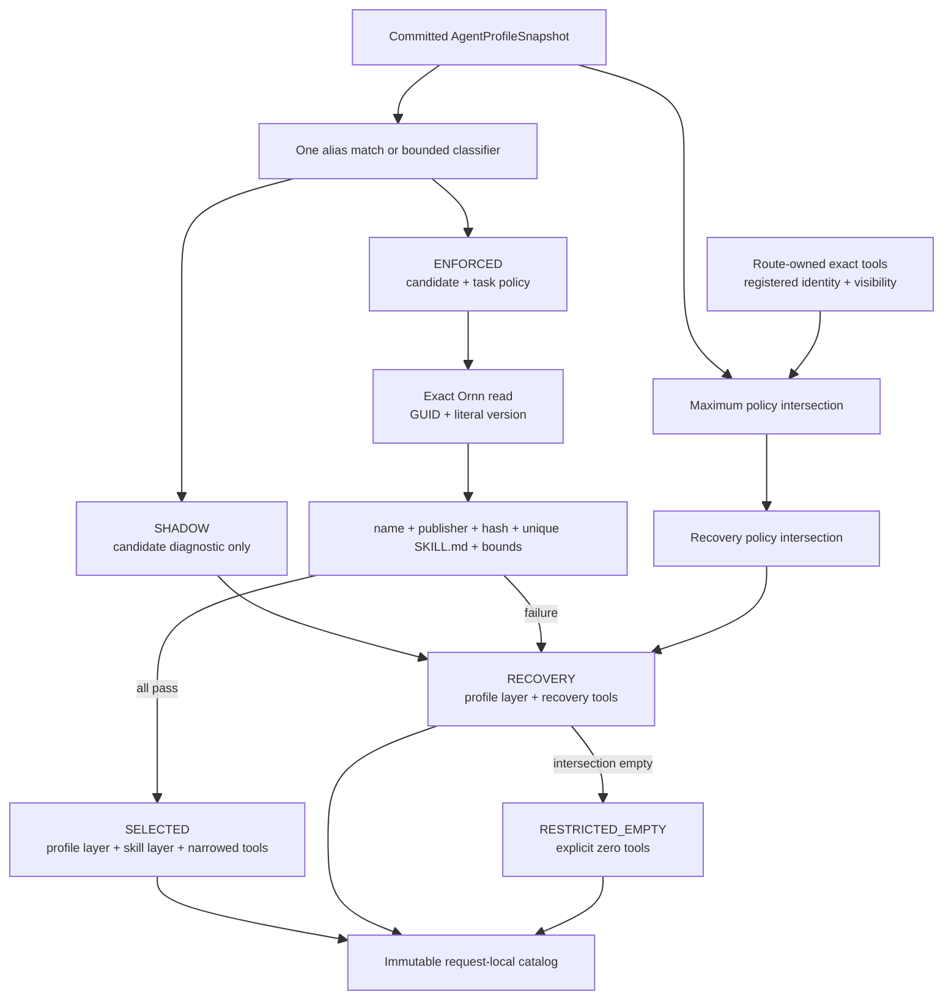

# Agent Profile 与不可变会话绑定

> 版本与结论：本章描述 `current`。Agent Profile 是 Host 审核并封装的 typed policy snapshot；新建 NyxIdChat conversation 可以把它完整提交进 actor state，之后所有 turn 都以这份 snapshot 为共同上限。Profile 不是可热更新的配置指针，也不是让客户端逐轮指定 skill 或工具的入口。

本章聚焦 conversation-level snapshot、exact Ornn reference、activation mode，以及它们如何生成 turn-local prompt/tool catalog。turn authority 的单调提交、reconcile 与 retry fencing 见 [Turn 权威、工具目录与重试](04-turn-authority-tool-catalog-and-retry.md)。

## 设计抽象与事实源

- `docs/canon/nyxid-chat-agent-profile-binding.md:9`：规定 Host snapshot、一次性 conversation binding 与 turn-local materialization 的权威边界。
- `src/Aevatar.AI.Core/AgentProfiles/AgentProfileSnapshotCodec.cs:11`：以 deterministic Protobuf bytes seal、验证并比较完整 snapshot。
- `agents/Aevatar.GAgents.NyxidChat/AgentProfiles/AgentProfileTurnCatalogMaterializer.cs:39`：把已绑定 profile 收敛为单次 turn 的 candidate、prompt layer、exact tool objects 与权限上限。

## Profile 是策略快照，不是运行时服务

```mermaid
%%{init: {"maxTextSize": 100000, "flowchart": {"useMaxWidth": false, "nodeSpacing": 18, "rankSpacing": 54}, "themeVariables": {"fontSize": "10px"}}}%%
flowchart LR
    Release["Reviewed deployment profile<br/>identity、versions、policies、bounds"]
    Host["Host startup<br/>validate + seal or verify"]
    Source["Local snapshot source<br/>immutable deployment clone"]
    Resolver["Conversation create resolver<br/>route admission + actor cohort"]
    Actor["NyxIdChatGAgent<br/>conversation owner"]
    State["RoleGAgentState.agent_profile<br/>committed sealed snapshot"]
    Turn["Turn-local materializer<br/>request context + current capabilities"]
    Catalog["AgentProfileTurnCatalog<br/>prompt layers + exact tools + visibility"]

    Release --> Host
    Host --> Source
    Source -->|"clone for selected new actor"| Resolver
    Resolver -->|"typed create command"| Actor
    Actor --> State
    State -->|"same snapshot across turns"| Turn
    Turn --> Catalog

    Client["HTTP client"]
    Ornn["Ornn exact read<br/>GUID + literal version"]
    Client -.->|"cannot supply or replace profile"| Actor
    Ornn -.->|"turn-time body only"| Turn
```



`AgentProfileSnapshot` 把下列职责放进一个可哈希的 Protobuf value：

| 字段组 | 固定什么 | 不替代什么 |
|---|---|---|
| `profile_id / profile_version / policy_revision / agent_kind` | policy identity 与适用 agent kind | conversation ID、turn ID |
| `skillset_provenance`、member `skill_ref` | version-pinned GUID + literal version | name/latest/search 查询 |
| `route_tool_set_ref`、maximum/recovery/member policy | route-owned capability 的最大集合与降级集合 | 当前请求实际可用工具 |
| member intent、alias、expected name、reviewed publisher | 候选路由与 exact identity evidence | LLM 自由选择任意 skill |
| classifier/fetch/body 等 bounds | 有界分类、网络读取与 prompt 注入 | 进程级 timeout 或无限正文 |
| `SHADOW / ENFORCED` | candidate 如何影响 prompt/tool authority | rollout cohort 是否命中 |

snapshot 的 digest 是“这组 typed policy bytes 是否仍是审核过的同一个值”的证据。`Seal` 先清空 digest，再对 deterministic serialization 做 SHA-256；`Verify` 以 fixed-time comparison 校验 32 bytes；`ByteEquivalent` 比较包含 digest 在内的完整 deterministic bytes。因此只比较 `profileVersion` 或文件名都不够，它们无法发现 policy member、tool ceiling 或 bound 被静默改写。

为什么把完整 snapshot 写进 actor，而不只保存 `profileId@version`？后者要求每次激活重新访问一个可变 registry，并让旧会话的含义受外部记录覆盖影响。完整 committed value 让 event replay、passivation 后恢复与后续 turn 都得到相同 policy input；代价是 profile 升级不能偷偷作用于存量会话，必须新建 conversation。

## 新会话只绑定一次



create resolver 仍先服从 direct chat route policy。只有 profile rollout 选中该 actor 时，route 的 `ForwardToModel.ToolSetRef.Name` 才必须与 snapshot 的 `route_tool_set_ref` 按 `Ordinal` 完全一致；不一致在 actor command dispatch 前 fail closed。Profile 不能越过 route denial，也不能自己发明另一条 ingress。

actor 收到 create command 后，在 `creation-started` 与 registry I/O 之前执行绑定：

- 未绑定 + 有效 snapshot：先 commit `AgentProfileBoundEvent`；
- 已绑定 + deterministic bytes 完全相同：把 create 当作幂等重入，不再追加 binding event；
- 已绑定 + 不同、缺失或 digest 无效的 snapshot：拒绝，不用新值覆盖旧值；
- 从未绑定 + command 无 snapshot：保留 legacy unprofiled conversation。

`RoleGAgentState.agent_profile` 因而是存量会话的 profile 权威，Host options 或 reviewed file 只决定以后创建的会话。协议使用 additive fields；旧 state bytes 解析后 profile 为空，冻结实现不 replay、backfill、lazy bind 或 hot-upgrade。

Mainnet rollout 还可以对 `profileVersion + NUL + actorId` 做 SHA-256，取 digest 前 4 bytes 的 big-endian `UInt32 mod 10000`，据此选择新 actor cohort。这个 bucket 只决定“创建时是否带 snapshot”；它不会把已存在 conversation 从 unprofiled 切到 profiled，也不会把已绑定 conversation 换到新 version。

## 每个 turn 从共同上限生成局部 catalog



materializer 先固定能力天花板，而不是先相信 classifier：route tool set 的 exact objects、actor 当前 registered tools、typed visibility、maximum policy 依次取交集；recovery policy 再从中取子集。同名工具只有引用同一个 `IAgentTool` object 才能合并，同名不同引用是 collision，该名字被整体移除。这避免“schema 来自工具 A、执行却按名字落到工具 B”。

候选优先由唯一 explicit alias 命中，否则交给有界 classifier；alias collision、no-match、未知 intent 或 classifier failure 都不能扩大权限。三个结果不是三种配置，而是单 turn 的执行收敛态：

| turn 结果 | prompt | tools | 典型原因 |
|---|---|---|---|
| `SELECTED` | profile routing layer + 已验证 skill body | recovery 与 member task policy 的并集，再受既有 ceiling 限制 | `ENFORCED` candidate 且 exact identity/integrity 全通过 |
| `RECOVERY` | profile routing layer，无 candidate skill body | recovery intersection | `SHADOW`、无 candidate、classifier/exact fetch/正文校验失败 |
| `RESTRICTED_EMPTY` | 仍是显式 profiled catalog | 空集合 | digest、route capability、collision 等失败使安全交集为空 |

`SHADOW` 只记录 candidate identity 与有界 diagnostic，始终使用 recovery prompt/tool 权限；它不会读取、解析或注入 candidate skill body。`ENFORCED` 也不是“分类器说了算”：Ornn fetch 必须按 exact GUID + literal version 读取，返回值还要匹配 expected skill name、reviewed publisher、hash evidence、唯一非空 `SKILL.md` 与 UTF-8 body bound，才能产生 `SelectedSkillPromptLayer`。读取失败只能降级，禁止按 name、latest 或 search 找一个“差不多”的版本。

为什么 prompt layer 与 tool catalog 必须同源但不能混成一个字符串？Prompt 说明模型应采用哪套 procedure；`FinalAllowedToolNames` 和 `RouteOwnedTools` 决定 schema 与实际 object capability。只注入 skill 文本会让模型看到不可执行的工具，只按名字过滤又可能发生 object substitution。一个 immutable turn catalog 同时携带两者，并在进入 LLM request 时继续与 visibility 取交集，才保持“看得见的能力就是可执行能力”。

## 最小静态示例

> Demo status：`verified-static`（按冻结 profile proto、codec、create resolver、actor binding、materializer、Ornn exact fetcher 与 tests 核对；未启动 Mainnet Host，未访问真实 Ornn，也未执行 rollout）。

下面是 policy 形状的最小摘录；生产 snapshot 还必须包含完整 reviewed fields，并带与 deterministic bytes 匹配的 digest：

```textproto
profile_id: "nyxid-chat"
profile_version: "release-v1"
agent_kind: "nyxid.chat"
policy_revision: "policy-v1"
route_tool_set_ref: "nyxid.chat.profile.v1"
maximum_tool_policy { tool_names: "service_read" tool_names: "service_call" }
recovery_tool_policy { tool_names: "service_read" }
members {
  intent_id: "call_service"
  routing_description: "Call one reviewed service operation."
  skill_ref { guid: "11111111-1111-1111-1111-111111111111" literal_version: "1.2" }
  expected_skill_name: "service-call"
  reviewed_publisher_id: "22222222-2222-2222-2222-222222222222"
  task_tool_policy { tool_names: "service_call" }
  side_effect_class: AGENT_PROFILE_SIDE_EFFECT_CLASS_SERVICE_CALL
}
classifier_timeout_ms: 600
exact_skill_fetch_timeout_ms: 1500
max_selected_skill_bytes: 24576
activation_mode: AGENT_PROFILE_ACTIVATION_MODE_ENFORCED
```

对输入命中 `call_service` 的 turn，静态判断顺序是：先验证 conversation 已绑定 snapshot；再把 `service_read/service_call` 与 route-owned objects、registered tools、visibility 取交集；commit candidate/exact-ref ceiling 后才读取 exact `1.2` body；所有 identity/integrity 检查通过才加入 selected layer。任何一步失败都保留已算出的 recovery 子集，子集为空则显式 restricted-empty，绝不回退到 actor 的全量工具。

## 边界与演进

- exact Ornn body、access token、tool object、prompt layer 与 free-form diagnostic 都不是 conversation profile state；它们只活在当前 turn materialization/request 中。
- snapshot 保存 exact reference 和 policy identity，不保存动态 Ornn body。这样 passivation 后仍能重建“允许读取哪个版本”，同时避免把外部正文和凭据写进 actor journal。
- 当前没有公开 profile 更新 API、profile query/readmodel 或对存量会话的 migration。观察到某个新 profile version 已发布，不能推出旧 conversation 已升级。
- rollout 只控制 new binding；`SHADOW` 与 `ENFORCED` 控制被绑定后的 turn 行为。把 cohort percentage 与 activation mode 混为一谈，会错误解释未绑定 conversation 或 shadow candidate。
- 非 profile consumer 必须显式传 `null` catalog；`null` 表示 unprofiled，而“非空 catalog + 零工具”表示 profiled restricted-empty。两者不能用同一个空集合替代。
- profile snapshot 本身不越过 route policy、typed tool visibility、human-session credential requirement 或 tool approval。它只能继续缩小这些既有边界。

## 读完应能回答

1. 为什么 actor 必须保存完整 sealed snapshot，而不是只保存 `profileId@version`？
2. 同一 create command 重入、不同 snapshot 重绑与 legacy 无 profile 创建分别发生什么？
3. rollout cohort、`SHADOW / ENFORCED` activation mode 与 `SELECTED / RECOVERY / RESTRICTED_EMPTY` turn 结果分别控制哪一层？
4. exact Ornn skill 需要哪些 identity/integrity 条件，为什么不能按 name 或 latest 回退？
5. 为什么 prompt layer、allowed names 与 exact tool objects 必须由同一个 request-local catalog 约束，又不能进入 conversation state？

<details>
<summary>论断—证据映射</summary>

| 论断 | 等级 | 证据 |
|---|---|---|
| Profile 是创建输入，Host snapshot source 本地 clone；create path 不访问 Ornn/NyxID | E1 | `docs/canon/nyxid-chat-agent-profile-binding.md:9`、`:23`；`src/Aevatar.Mainnet.Host.Api/AgentProfiles/MainnetNyxIdChatAgentProfileSnapshotSource.cs:8`、`:16`、`:21` |
| snapshot 对 deterministic Protobuf bytes seal/verify，完整 bytes 用于等价比较 | E1 | `src/Aevatar.AI.Core/AgentProfiles/AgentProfileSnapshotCodec.cs:11`、`:23`、`:35`、`:50` |
| create resolver 先服从 direct route，profile route tool set 不匹配则 admission unavailable | E1 | `agents/Aevatar.GAgents.NyxidChat/NyxIdChatLifecycleFacade.cs:195`、`:201`、`:217`、`:221`、`:228` |
| actor 在 creation-started 与 registry I/O 前绑定；同 bytes 幂等，不同/缺失/无效 profile 不能替换 | E1 | `agents/Aevatar.GAgents.NyxidChat/NyxIdChatGAgent.cs:145`、`:147`、`:158`、`:669`、`:679`、`:682`、`:688` |
| exact refs、activation mode、profile fields 和 actor state tags 都是 typed additive contract | E1 | `src/Aevatar.AI.Abstractions/ai_messages.proto:602`、`:625`、`:631`、`:642`、`:787` |
| rollout 对 profileVersion + actorId 做稳定 0..9999 bucket，只为新 conversation 返回 clone | E1 | `src/Aevatar.Mainnet.Host.Api/Profiles/MainnetAgentProfileRolloutSelector.cs:61`、`:66`、`:95`、`:105` |
| materializer 先取 route object、registered identity、visibility、maximum/recovery policy 交集，再选择 candidate | E1 | `agents/Aevatar.GAgents.NyxidChat/AgentProfiles/AgentProfileTurnCatalogMaterializer.cs:53`、`:68`、`:85`、`:94`、`:113` |
| SHADOW 固定 recovery；ENFORCED exact fetch 还必须核对 GUID/version/name/publisher/hash/body bounds | E1 | `agents/Aevatar.GAgents.NyxidChat/AgentProfiles/AgentProfileTurnCatalogMaterializer.cs:132`、`:146`、`:288`、`:405`、`:461`、`:473` |
| Ornn adapter 只接受 canonical nonzero GUID 和 major.minor literal version，并做 version-pinned reads | E1 | `src/Aevatar.AI.ToolProviders.Ornn/OrnnExactRemoteSkillFetcher.cs:16`、`:27`、`:35`、`:44`、`:110`、`:131` |
| turn catalog 同时冻结 allowed names、visibility、exact route-owned objects 与两个 prompt layers | E1 | `src/Aevatar.AI.Core/AgentProfiles/AgentProfileTurnCatalog.cs:28`、`:44`、`:48`、`:49`、`:63` |

</details>
