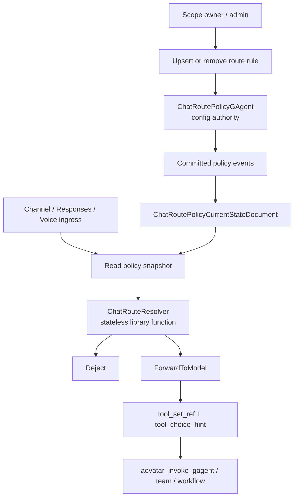

# ChatRouting:配置 Actor + 无状态边界解析器

## 事实源/设计抽象(以 ~/Code/aevatar 为准)

- `0024-chat-route-policy`:三段式 routing:policy authority、stateless resolver、readmodel。
- `0026-tool-first-chat-ingress`:动作收敛为 `Reject` + `ForwardToModel`,GAgent/team/workflow 通过 tool 暴露。
- `ChatRouteResolver`:入口热路径调用的无状态解析函数。

---

ChatRouting 不是新增一个"路由 actor"卡在所有请求中间。它把"谁能改策略"和"每次入口怎么做瞬时判断"分开:策略由 actor/event store 拥有,入口只读投影快照并同步调用纯解析器。

## 两层职责

| 层 | 做什么 | 不做什么 |
|---|---|---|
| ChatRoutePolicyGAgent | 接收配置命令,持久化规则/default target,让 projection 生成当前态 | 不 dispatch turn,不拿 reply token,不处理音频帧 |
| ChatRouteResolver | 在入口边界根据 snapshot + input 产出一次 ChatRouteDecision | 不持久化,不缓存跨请求状态,不是 actor |

ChatRouteDecision 是 per-request 决策,可作为 telemetry 观察,但不能进入 actor state、event store、readmodel 或持久日志。它被入口消费后就消失。

## 为什么 resolver 是无状态库函数

热路径上多一个 actor hop 只会增加排队和失败面,却不增加事实所有权。策略事实已经由 ChatRoutePolicyGAgent 拥有,入口只需要对一个已物化的 snapshot 做确定性解析。把 resolver 保持成库函数有三个直接收益:

1. 性能上零 actor 往返,Channel/Responses/Voice 入口都能在自己的边界内完成判断。
2. 正确性上不复制策略状态,避免出现"policy actor 一份、router actor 又缓存一份"。
3. 测试上可以用输入/输出覆盖优先级、default target、fallback、voice attach target,不用启动运行时。

## Tool-first ingress

ADR-0026 把旧的 ForwardToGAgent、ForwardToTeam、ForwardToWorkflow 收敛为 tool 调用。policy wire action 只剩:

| action | 语义 |
|---|---|
| Reject | 治理边界直接拒绝 |
| ForwardToModel | 选择模型,并通过 tool_set_ref/tool_choice_hint 注入可用工具或预填目标 |

这样 routing 不再维护第二套调用方言。GAgent/team/workflow 的执行进入既有 tool-calling backbone,继续沿 actor/run/projection 主链产生事实和观察结果。

## 验收

1. ChatRouting 的配置权威是谁?ChatRoutePolicyGAgent。
2. ChatRouteResolver 是 actor 吗?不是,是无状态库函数。
3. GAgent/team/workflow routing 现在怎么表达?通过 ForwardToModel 携带 tool set/hint,由工具执行。

⟦AI:AUTO-LOOP⟧
