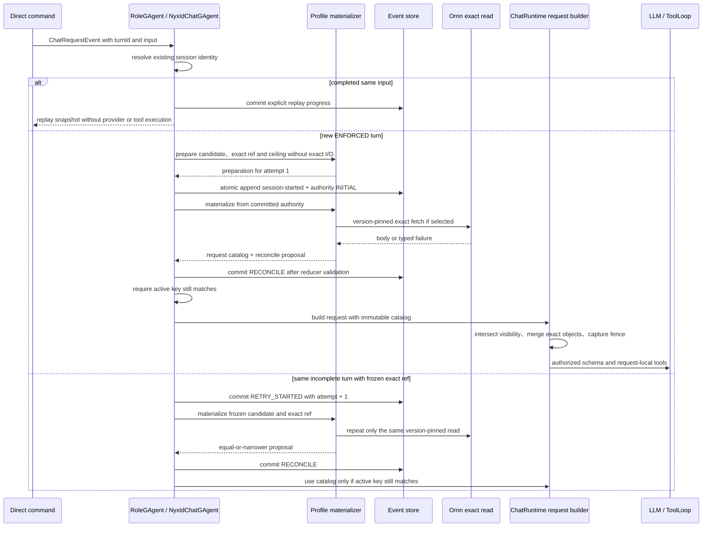
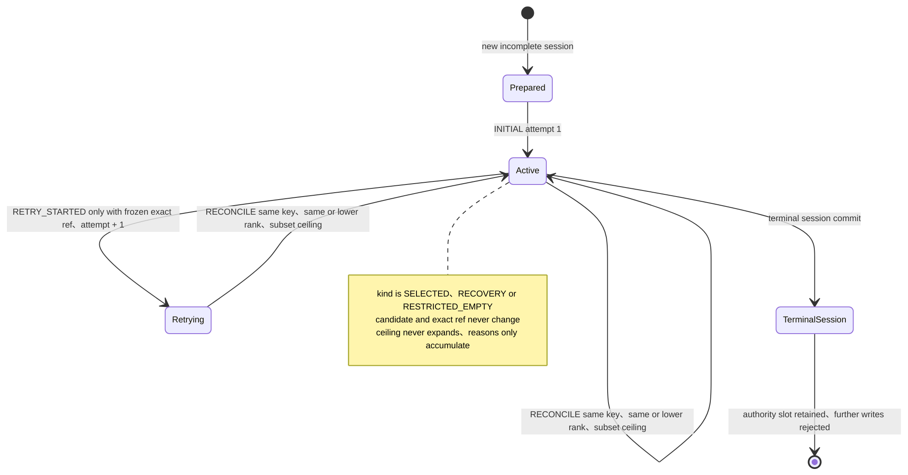

# Turn 权威、工具目录与重试

> 版本与结论：本章描述 `current`。Direct NyxIdChat 的重试身份首先由 actor 中的 `sessionId = turnId` 记录判定；绑定 `ENFORCED` profile 时，actor 还为当前 incomplete turn 提交一条单调收窄的 authority fence。只有 authority `RECONCILE` 已提交且 active reconciliation key 仍匹配时，对应的 volatile catalog 才能进入 LLM schema 和工具执行。

本章不把 Channel `AgentRunGAgent` 的 empty-reply recovery、delivery retry 或 run cleanup 借给 direct HTTP。conversation、turn 与 progress 的基础身份见 [NyxIdChat Actor 模型与已提交进度](02-nyxid-chat-actor-model-and-progress.md)，profile snapshot 与 SHADOW/ENFORCED 绑定见 [Agent Profile 与不可变会话绑定](03-agent-profile-and-immutable-binding.md)。

## 设计抽象与事实源

- `src/Aevatar.AI.Core/RoleGAgent.cs:963`：先按已提交 session 输入判定 conflict、completed replay 或 incomplete resume，再建立 actor-owned turn authority。
- `src/Aevatar.AI.Core/AgentProfiles/AgentProfileTurnCatalog.cs:28`：request-local immutable catalog 同时冻结 allowed names、exact tool objects、visibility 与 prompt layers。
- `agents/Aevatar.GAgents.NyxidChat/AgentProfiles/AgentProfileTurnCatalogMaterializer.cs:39`：prepare 不做 exact I/O，materialize 只在 committed authority ceiling 内读取并继续降权。

## 三种身份不能互相替代

```mermaid
%%{init: {"maxTextSize": 100000, "flowchart": {"useMaxWidth": false, "nodeSpacing": 18, "rankSpacing": 54}, "themeVariables": {"fontSize": "10px"}}}%%
flowchart LR
    Key["clientRequestId<br/>transport retry key"]
    Turn["turnId / sessionId<br/>actor execution + replay identity"]
    Input["Committed input identity<br/>prompt + inputParts + runContext"]
    Attempt["reconciliation key<br/>sessionId + attempt"]
    Authority["Actor-owned authority<br/>candidate + exact ref + kind + ceiling"]
    Catalog["Request-local catalog<br/>prompt + visibility + exact IAgentTool objects"]
    Request["Final LLMRequest<br/>schema + authorization fence"]
    Execute["Request-local ToolManager<br/>actual execution"]

    Key -->|"endpoint deterministic derivation"| Turn
    Turn --> Input
    Input -->|"same incomplete ENFORCED turn"| Attempt
    Attempt --> Authority
    Authority -->|"materialize then reconcile"| Catalog
    Catalog --> Request
    Request --> Execute

    Command["commandAttemptId"]
    Command -.->|"rejection audit only"| Input
    Catalog -.->|"never persisted"| Authority
```



`clientRequestId` 只帮助 endpoint 在同一个 actor 下派生同一个 turnId；actor 不直接信任 key。已有 session 命中后，它按 `Ordinal` 比较 prompt，逐项比较 multimodal `inputParts`，并比较 typed `runContext`：

- prompt 或 input parts 不同：commit `RoleChatCommandAttemptRejectedEvent`，projection 输出 `IDEMPOTENCY_CONFLICT`；
- runContext 不同：冻结实现抛出 invalid operation，由外层错误路径处理，不把新 context 覆盖进旧 session；
- 三者相同且 session completed：重发 completion notification 并 commit replay progress，不再运行 provider/tool；
- 三者相同且 session incomplete：才恢复当前 turn 的执行路径。

这也是为什么 `commandAttemptId` 不能当幂等键：它只标记一次冲突 command attempt，缺失时甚至会随机生成；真正阻止输入漂移的是 actor 已提交的 session facts。

## 首次执行先冻结，再做 exact I/O



新 ENFORCED turn 的 prepare 阶段可以做 local tool-set discovery、visibility/policy intersection 与 bounded classification，但不能读 Ornn exact body。actor 预测 reducer 可接受后，用一次不受 request cancellation 中断的 store append 原子提交 `RoleChatSessionStartedEvent` 与 `AgentProfileTurnAuthorityCommittedEvent(INITIAL)`。这次 append 是线性化点：append 前取消不留 started/authority；append 开始后，caller cancel 不能产生“session 已开始、authority 没写”的半状态。

exact fetch 和 catalog materialization 发生在 INITIAL commit 之后。materializer 返回 catalog 与 `ReconcileProposal`；actor 先用 reducer 验证 proposal，再 commit `RECONCILE`，最后还要检查 state 中 active key 与 proposal 相同，才把 catalog 交给 ChatRuntime。caller cancellation 保留已经 commit 的 fence，且不能伪造 `MATERIALIZATION_FAILED`；其他 materializer 异常则生成 fail-closed proposal并经正常 RECONCILE 约束。

为什么不先 fetch 再 commit？网络结果可能在 actor failover、请求取消或同 turn 重入之间漂移。先提交 candidate、version-pinned exact ref 与 ceiling，让所有后续 I/O 都有 durable 约束；代价是 interrupted turn 需要显式 retry attempt，而不是从进程内临时值继续。

## 同一 turn 的 reconcile 只允许保持或下降



reducer 先拒绝不存在/已 completed 的 session、非正 attempt、未知 authority kind，以及 kind 与 ceiling 不一致的状态。三个 commit kind 的附加约束是：

| commit kind | 允许条件 | 拒绝什么 |
|---|---|---|
| `INITIAL` | attempt = 1；同 key 必须 canonical-equal；除 legacy restricted-empty 修复外，不同 active session 必须有更大 sequence | 任意覆盖当前 session、对 completed turn 建 authority |
| `RETRY_STARTED` | active 有 exact ref；session 相同；attempt 恰好 +1；除 attempt 外完整 canonical facts 相同 | 重选 candidate、换 exact version、改 ceiling 或跳 attempt |
| `RECONCILE` | exact active key；candidate 与 exact ref 相同；kind rank 不升；新 ceiling 是旧 ceiling 子集 | `RECOVERY → SELECTED`、`RESTRICTED_EMPTY → RECOVERY` 或增加工具 |

accepted reconcile 会把 degradation reasons 做去重并集，因此历史失败不能在一次成功 fetch 后被擦掉。tool names 则 Trim、按 `OrdinalIgnoreCase` 去重并按 `Ordinal` 排序，使 event replay 不受输入顺序影响。

“只能下降”只约束同一个 reconciliation key 的 `RECONCILE`。更晚的新 session 可以通过 `INITIAL` 建立自己的任意合法 kind/ceiling，并取代 slot 中较旧 session 的 authority。incomplete session 若没有 frozen exact ref，则直接复用当前 attempt 做 materialization；只有保留 exact ref 时才先提交 `RETRY_STARTED` 并把 attempt 加一。

历史遗留的 bound session 若已 started、未 completed，却找不到对应 active authority，只允许沿正常 command 写路径提交一次 `RESTRICTED_EMPTY + LEGACY_AUTHORITY_MISSING`。它不扫描 journal、不回填所有历史 turn、不做 exact fetch，也不在 query path 修改 state。

## Catalog 从 schema 一直约束到执行

authority state 只保存 durable fence，不保存 skill body、tool object、token 或 prompt layer。`AgentProfileTurnCatalog` 则是当前 request 的 immutable capability value：

- `FinalAllowedToolNames` 形成 visibility ceiling；
- `RouteOwnedTools` 保存 exact object reference，发生同名不同实例 collision 时整名删除；
- `ProfilePromptLayer / SelectedSkillPromptLayer` 给同一 request 的 system prompt 提供 provenance-bound instruction；
- diagnostic 有数量和 UTF-8 长度上限，但不进入 actor state。

`AgentProfileTurnCatalogMaterialization.Create` 先机械拒绝 catalog 中任何超出 reconcile proposal ceiling 的名字。`ChatRuntimeRequestBuilder` 又把 caller visibility 与该 ceiling 取交集，并把 base tools 与 route-owned tools 按 object identity 合并；middleware 前捕获 `schema object + visibility` authorization fence，middleware 只能继续缩权。middleware 返回同名不同 object 时，该名字被拒绝。

ChatRuntime 的 main、step、fallback 与 skill-recovery 路径都从当前最终 `LLMRequest.Tools` 创建 request-local `ToolManager`。`Tools = null` 表示这次 call 没有工具，不能回查 actor-level manager。于是模型看到的 schema、tool call admission 与最终执行使用同一组 exact objects，而不是“按名字再找一次”。

为什么 authority 与 catalog 要分成 durable 和 volatile 两层？把 tool object 或 skill body 写进 actor event 不可序列化、会携带运行时/外部内容并放大 journal；只存名称又无法在执行时防同名替换。最小持久层保存 identity 与 ceiling，当前 request 再从这些 fence 物化 exact objects，兼顾恢复与 capability safety。

## 最小静态示例

> Demo status：`verified-static`（按冻结 RoleGAgent authority reducer、NyxIdChat materializer、shared request builder、ChatRuntime 与 tests 核对；未运行 LLM、Ornn 或真实 retry）。

```text
turnId = turn-abc
committed input = prompt P + inputParts I + runContext R

INITIAL attempt=1
  candidate = profile-v1 / policy-v1 / service_call
  exactRef  = guid-G @ 1.2
  kind      = SELECTED
  ceiling   = [service_call, service_read]

RECONCILE attempt=1
  kind      = RECOVERY
  ceiling   = [service_read]
  reasons   = [EXACT_SKILL_FETCH_FAILED]

RETRY_STARTED attempt=2
  candidate/exactRef/kind/ceiling/reasons = exact copy of active attempt 1

RECONCILE attempt=2
  kind      = RECOVERY
  ceiling   = [service_read]
  reasons   = [EXACT_SKILL_FETCH_FAILED]
```

即使 attempt 2 的 Ornn read 成功，reducer 也不允许把 active `RECOVERY` 升回 `SELECTED`，不允许重新加入 `service_call`，也不允许删除旧 degradation reason。若同 turn 的 prompt 或 input parts 改变，则在 authority 路径前就成为 committed idempotency conflict。

## Direct retry 不等于 Channel empty-reply retry

| Direct NyxIdChat | Channel deferred AgentRun |
|---|---|
| same turnId 命中 actor session | explicit runId 命中独立 `AgentRunGAgent` |
| completed same input replay snapshot | delivery/output retry 可能重送 run-owned output |
| incomplete authority 保留 frozen exact ref 才 attempt +1 | empty reply 可有一次专门 recovery step |
| SSE request 观察 actor progress | webhook 已返回，另有 reply credential 与 delivery lifecycle |

Channel 的 `empty_reply_retry` 是 run step 状态，保留 channel routing/context 并至多恢复一次；它不是 direct chat 的 clientRequestId replay 规则。Direct completion 为空、SSE timeout 或请求取消都不能据此自动创建 AgentRun、追加 prompt 或再执行一次 LLM。

## 边界与演进

- SHADOW 不提交 turn authority、不生成 execution catalog；本章状态机只适用于 ENFORCED profile execution。
- 当前 actor state 只保存一个 `agent_profile_turn_authority` slot，按 session sequence 让较新 incomplete turn 取代较旧 turn 的 authority；session completed 后 slot 不会立即清空，但 reducer 拒绝再给 completed session 写 authority。它不是每个历史 turn 的永久 authority map。
- session 被 `MaxTrackedSessions` 裁剪后，相同 deterministic turnId 可能重新进入新执行；authority fence 不把 actor replay cache 变成永久 exactly-once 存储。
- completed replay 在 authority establishment 之前短路；它不会为 replay 增加 attempt、重新 fetch Ornn 或重新 reconcile catalog。
- runContext mismatch 当前不是 `IDEMPOTENCY_CONFLICT` typed rejection，而是 invalid operation。不能把 prompt/input conflict 的 presentation 合同外推到这一分支。
- stop、steering、reconnect cursor 与 typed task steps 在冻结基线不存在；authority attempt 只 fence materialization retry，不是用户可见 task attempt。

## 读完应能回答

1. clientRequestId、turnId、commandAttemptId 与 authority reconciliation key 分别拥有哪一层身份？
2. 为什么 INITIAL 必须与 session-started 原子提交，而且 exact fetch 必须发生在它之后？
3. `RETRY_STARTED` 为什么要求除 attempt 外完全相同，`RECONCILE` 为什么只能降权？
4. catalog 如何从 committed ceiling 一直约束到 middleware 后的 schema object 和实际工具执行？
5. completed replay、incomplete authority retry 与 Channel empty-reply recovery 为什么是三种不同机制？

<details>
<summary>论断—证据映射</summary>

| 论断 | 等级 | 证据 |
|---|---|---|
| actor 比较 prompt、inputParts、runContext；completed same-input 短路为 replay | E1 | `src/Aevatar.AI.Core/RoleGAgent.cs:963`、`:982`、`:1002`、`:2239`、`:2247`、`:2254`、`:2261` |
| 新 turn 原子提交 session-started + INITIAL，incomplete exact turn 重入先 commit RETRY_STARTED | E1 | `src/Aevatar.AI.Core/RoleGAgent.cs:1142`、`:1160`、`:1168`、`:1182`、`:1194`、`:1210`、`:1215` |
| catalog 只在 materialize 后 commit RECONCILE，且 active key 仍匹配时才返回 | E1 | `src/Aevatar.AI.Core/RoleGAgent.cs:1224`、`:1233`、`:1241`、`:1246`、`:1247` |
| reducer 要求 active incomplete session、attempt/kind 合法，并对 retry/reconcile 执行 exact identity 与单调 ceiling 检查 | E1 | `src/Aevatar.AI.Core/RoleGAgent.cs:2386`、`:2397`、`:2407`、`:2459`、`:2478`、`:2490`、`:2548` |
| legacy missing authority 只前向建立 restricted-empty fence | E1 | `src/Aevatar.AI.Core/RoleGAgent.cs:1194`、`:1201`、`:1288` |
| materialization 不能给 catalog 授予 proposal ceiling 外的工具 | E1 | `src/Aevatar.AI.Core/AgentProfiles/AgentProfileTurnCatalogMaterialization.cs:47`、`:54`、`:58` |
| request builder 交集 visibility、合并 exact objects，并在 middleware 后按 object identity 重施 authorization fence | E1 | `src/Aevatar.AI.Core/Chat/ChatRuntimeRequestBuilder.cs:34`、`:53`、`:63`、`:173`、`:206`、`:218` |
| ChatRuntime 从每个最终 request tools 建 request-local manager，final-no-tools 使用 null | E1 | `src/Aevatar.AI.Core/Chat/ChatRuntime.cs:375`、`:396`、`:413`、`:753`、`:760`、`:767` |
| Channel AgentRun empty reply 有独立 one-shot recovery marker 与 step path | E1 | `agents/Aevatar.GAgents.NyxidChat/protos/agent_run.proto:227`；`agents/Aevatar.GAgents.NyxidChat/AgentRunGAgent.cs:775`、`:822`、`:855`、`:961` |

</details>
