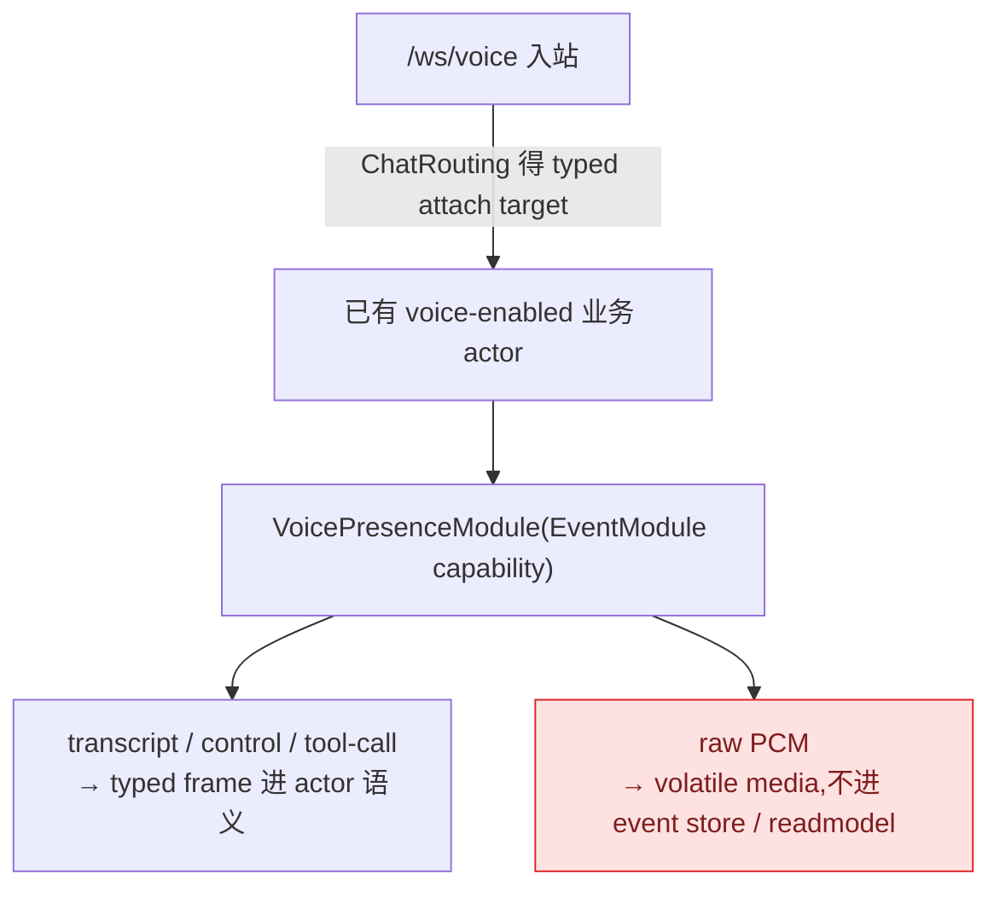
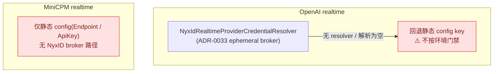

# VoicePresence:语音是挂载能力,不是第二套会话主干

## 事实源/设计抽象(以 ~/Code/aevatar 为准)

- `voice-presence-integration`:aevatar 作为 `/ws/voice` Brain,edge server 只在外部承担实时边缘职责。
- `0025-voice-router-integration`:Voice 是 `VoicePresence` EventModule capability,挂到已有 actor。
- `0031-voice-edge-local-tools`:LAN-only voice tools 走现有 NyxID service/node proxy 与 `IAgentToolSource`。

---

VoicePresence 的关键不是"多了 OpenAI/MiniCPM provider",而是语音流怎样不绕开现有 actor 生命周期。普通 `/ws/voice` 先经过 ChatRouting 得到 typed attach target,再把 transport/provider/session 状态机挂到已有 voice-enabled actor 上。

| 部分 | 职责 | 主干边界 |
|---|---|---|
| transport | WebSocket/WebRTC attach、lease、媒体转发 | raw PCM 是 volatile media,不进 event store/readmodel |
| provider | OpenAI/MiniCPM realtime session | provider result 回到 actor-owned voice session |
| VoicePresenceModule | 处理 transcript/control/tool-call lifecycle | EventModule capability,复用 actor 执行上下文 |
| tool invoker | 把模型 function call 交给 IAgentToolSource | 不建进程本地 session -> token 映射 |

## 为什么不是 `VoiceSessionGAgent`

Voice 的稳定事实属于被 attach 的业务 actor:它知道 persona、tool catalog、turn lifecycle 和授权边界。另起 VoiceSessionGAgent 会把语音会话 ID、连接元数据、临时 provider 状态变成第二个事实拥有者,还会诱导 raw audio 或 volatile session 状态进入 Actor/Event/ReadModel 层。

把 Voice 做成 EventModule capability 更符合现有主链:

1. 生命周期复用 actor activation、handler pipeline、state guard 和 event sourcing。
2. transcript/control/tool-call 可以按 typed frame 进入 actor 语义,raw PCM 仍留在 volatile media stream。
3. `/ws/voice` 的路由选择发生在 Host/Application 边界,VoicePresence foundation 包不反向依赖 ChatRouting。

## LAN-only tools 与凭证

ADR-0031 的短期路径是复用 NyxID service/node proxy:本地边缘服务把 Home Assistant/Frigate/ESP32 这类 LAN API 注册到 NyxID,模型通过已授权的 connected-service tool 间接调用。Aevatar 不保存本地服务目录,也不把 session/actor/user 到 NyxID token 的映射藏进进程内字典。

> ⚠️ **凭证现状(已核对源码)+ provider 成熟度不对称**:ADR-0033 描述的 NyxID ephemeral broker **只覆盖 OpenAI realtime**,broker 代码(`NyxIdRealtimeProviderCredentialResolver`)已落地。但有两处要诚实标注:
>
> - **OpenAI 的静态 key 回退不按环境门禁**:`OpenAIRealtimeProvider` 在没有 resolver(或 resolver 返回空)时回退到静态 config key,而这条回退**没有 `IsProduction` 守卫**——只要部署设了 `OPENAI_API_KEY` env,静态路径就会激活,与 ADR-0018「零长期密钥」相悖(已登记 [08/04 P0-2](../08/04-todo-list.md))。
> - **MiniCPM 没有 broker 路径**:`MiniCPMRealtimeProvider` 只读静态 config(Endpoint / ApiKey),无 per-session 凭证解析、无 NyxID。所以把 OpenAI / MiniCPM 并列时要注意:**两者凭证成熟度不对称**,broker 只到 OpenAI。
>
> ADR-0033 头仍是 proposed;本章不把 proposed 写成 accepted current。

## 验收

1. Voice 是独立 VoiceSessionGAgent 吗?不是,是挂到已有 actor 的 EventModule capability。
2. raw PCM 进入 actor event/readmodel 吗?不进入,它是 volatile media stream。
3. LAN-only tools 怎么走?经 NyxID service/node proxy 与既有 tool surface,不建本地 token 映射。

⟦AI:AUTO-LOOP⟧
