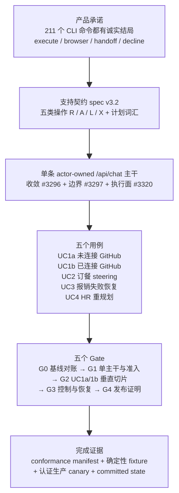
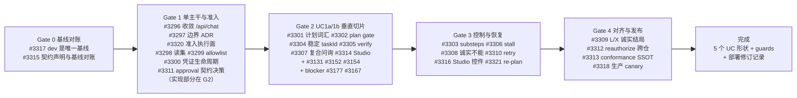
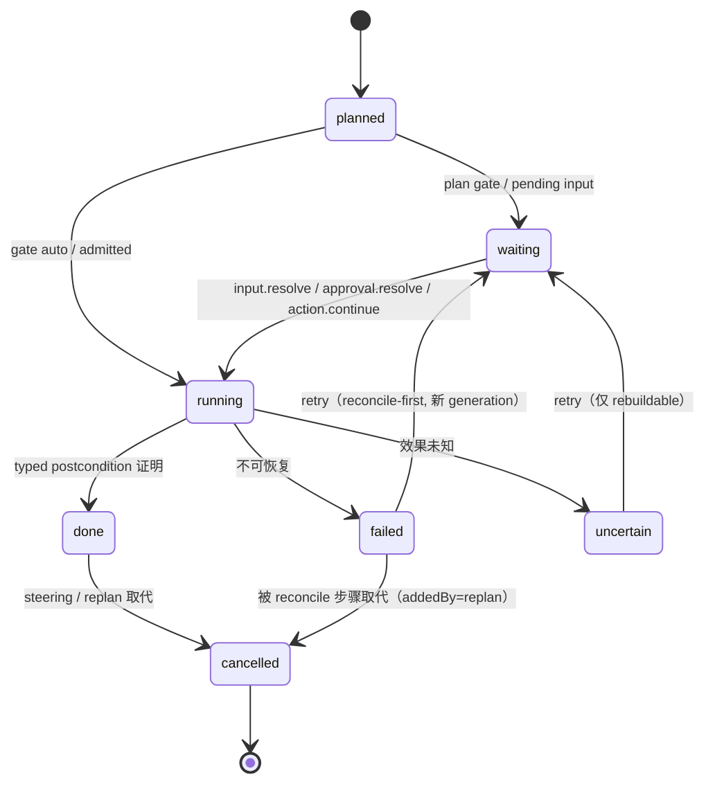

# Milestone 40 专题：NyxID Assistant Support Contract v1

> 版本与结论：本章是 **milestone 40（NyxID Assistant Support Contract v1）专题登记表**，状态 `target`——它描述的是 2026-08-07 创建、30 个 issue 全部 open、0 个 closed 的进行中里程碑（[milestone/40](https://github.com/aevatarAI/aevatar/milestone/40)），不是冻结基线 `f02aa690` 中的 shipped 事实，也**不是**路线承诺。事实来源为 milestone 描述、30 个 GitHub issue 正文与支持契约 spec Draft v3.2（gist `f45febb057a7182dab2495d4c739d2bb8d7026f5`，2026-08-06，`verified-static` 抓取），并按 2026-08-07 的 issue 状态逐条核验。正文引用的 `agents/...` 源码路径以本地工作树 HEAD 为准（00/02 正文同步例外：双基准任一命中即通过），与 07/01–04 等 `current` 章节的冻结基线引用并存。在 milestone 落地前，[07/01](01-conversation-turn-and-chat-history.md) 与 [07/02](02-nyxid-chat-actor-model-and-progress.md) 等 `current` 章节**保持原样**；本篇只做登记与导读，落地后按 [边界与演进](#边界与演进) 的清单回填。
>
> 一句话：milestone 40 要在**一条** actor-owned `/api/chat` 主线上交付 NyxID Assistant Support Contract v1，让每个受支持的 CLI 意图都有明确且诚实的对话结局——`execute`、browser action、local command handoff 或 `decline`——并在 backend-console Studio 发布五个用例（UC1a/UC1b/UC2/UC3/UC4）的完整体验。它**不**声称所有 CLI 操作都能在聊天里执行。

## 设计抽象与事实源

- `agents/Aevatar.GAgents.NyxidChat/NyxIdChatControlCommands.cs:453-560`：现有 `task.steer`/`task.stop` 控制命令的 terminal-fence 语义（milestone 要改为"同计划修订"，见 [§7.6 修订模型](#技术细节-btaskplan-词汇计划步骤与修订)）。
- `src/Aevatar.Mainnet.Host.Api/Chat/MainnetChatEndpoints.cs:44-103`：`POST /api/chat` 按请求形状（有无 `type` 字段）选择两条执行系统的现状——milestone Gate 1 的收敛对象。
- `agents/Aevatar.GAgents.NyxidChat/protos/nyxid_chat_task.proto`：v4 契约的 actor state 载体（`NyxIdChatConversationGAgentState`/`NyxIdChatTurnGAgentState`、pending input 形状、task-plan 词汇）；milestone 的任务计划字段（`addedBy`/`planRevision`/`gate`/`estimate`/`substeps`）是否已 shipped 是 Gate 0 要核验的争议点。

## 一页速览：这个 milestone 最终交付什么

milestone 40 的完整叙述在 [milestone/40 描述](https://github.com/aevatarAI/aevatar/milestone/40)，拆成三层：**产品承诺**、**五个 Gate 的执行次序**、**完成契约**。

| 层 | 内容 | 对应的可核验产物 |
|---|---|---|
| 产品承诺 | 每个受支持 CLI 意图都有诚实结局：`execute` / browser action / local command handoff / `decline`；不宣称 CLI 全量在 chat 内执行 | [spec v3.2 §0](https://gist.github.com/ctkm-aelf/b4dd5182c5ac1efc2ad546ecb5f948f3) 与 §9 义务表 |
| 执行路径 | 单条 actor-owned `/api/chat` 主干（收敛 `#3296`）+ 分操作类边界（`#3297`/`#3320`）+ 准入工具面（`#3298`/`#3299`/`#3300`） | 收敛后 `MainnetChatEndpoints` 不再按 `type` 选运行时 |
| 体验交付 | Studio 五个用例 UC1a/UC1b（`#3314`）与 UC2/UC3/UC4 控件（`#3316`） | 确定性 fixture 验收 + 生产 canary（`#3318`） |
| 完成契约 | 机器可读 conformance manifest 钉源码摘要；committed actor state 与 read-model 证据才算完成；ACK 文本、卡片外观不算 | `#3313` manifest、`#3318` canary 证据包 |

## 为什么现在需要它：211 个命令与一条分裂的 Chat

spec v3.2 的出发点（§0.3，`verified-static`）是两条产品承诺："chat 能做 CLI 能做的一切"（[§0.1](https://gist.github.com/ctkm-aelf/b4dd5182c5ac1efc2ad546ecb5f948f3)，完整 `nyxid` CLI 表面共 **211 个叶子命令、44 个顶层命令**）与"chat 是完成事情的主要方式"（§0.2）。而 2026-08-05 首次核验时，chat 只能执行**一个** browser action（`service.connect`）、挂载**零**个 NyxID 工具；当晚 `feature/integrate` 上 `53e20f9ba` 才注册了 REST-backed 读工具集（`NyxIdAssistantToolSource`），但 **proxy 执行仍未挂入 chat**（`ExcludeFromNyxIdChat` 过滤），运行时激活也未验证。

为什么这是一个"里程碑"而不是普通 feature？因为它同时踩在三条结构线上：

1. **执行路径分裂**：`MainnetChatEndpoints.cs:44-103` 用请求形状选运行时——有 `type` 走 NyxID Assistant actor 链，无 `type`（form/JSON）走 Workflow Chat。同一个产品模型被两条路径实现，直接产生死区：`#3177` 的 `nyxid_require_service` 因为 credential-kind 不匹配，**永远**无法在 workflow-chat turn 上发出 `service.connect` 卡片。
2. **跨仓库契约**：NyxID 拥有身份、连接、凭据、审批；Aevatar 拥有计划、步骤、耐久执行。两边必须对同一份 wire 契约（v4，Aevatar 拥有）和同一份支持契约（spec v3.2）达成一致，NyxID 的缺口是显式依赖，不能"假设不存在"。
3. **证据纪律**：完成判据不是 UI 看起来对，而是 committed actor state 与 read-model 证据、确定性 fixture、认证生产 canary 三样齐备——这与本仓库 [05/02](../05/02-committed-state-and-observation.md) 的"持久事实和实时可见性不是一回事"完全同构。

## 契约支柱：操作分类 R / A / L / X

spec §3 把完整 CLI 表面分成五类（表中为四类 + 保留类），每类有固定的 wire 机制与诚实结局：

| 类 | 语义 | wire 机制 | 结局 |
|---|---|---|---|
| **R（读）** | 只检查状态（connected、status、catalog、approval history） | 自动授权，无 prompt，走 REST 读工具（`#3298` 激活） | 直接执行 |
| **A（卡片）** | 连接服务、铸造 key、审批动作、轮换凭据 | NyxID 拥有的交互卡片，旅程跑在用户自己的浏览器会话 | browser action，`action.continue` 唤醒 |
| **P（代理执行）** | 连接服务的写入操作（UC1b 的 effect 步骤） | 经准入的 MCP catalog + typed 操作（`#3320`），**不是**通用 proxy | 执行 + typed postcondition 验证 |
| **L（本地移交）** | 真正跑在用户机器上的操作 | 检测后移交为可复制命令（`#3309`） | handoff，不假装在 chat 执行 |
| **X（诚实拒绝）** | 规格缺口或不可达 | 明确说"can't yet"（`#3308`/`#3309`） | decline，绝不幻觉 |

核心不变量（spec §1.1）：assistant 可以**花**用户已授予的访问、可以**请求**更多，但永远不能**自授**；每次授权动作都是刻意的真人点击；新铸造的 key 只向用户展示一次，不进 chat 历史、不交给 assistant。任何"Aevatar 合成第二个审批权威"的设计都被 milestone 的跨仓库规则明令禁止。

## 五个用例：UC1a / UC1b / UC2 / UC3 / UC4

五个用例来自 spec 的目标原型 [nyx-chat-wf.surge.sh](https://nyx-chat-wf.surge.sh/?lang=zh)，是里程碑验收的形状（shape）清单：

| 用例 | 场景 | 核心机制 | 归属 Gate |
|---|---|---|---|
| UC1a | GitHub **未连接** 起始：计划卡 → 复合 scoping 问询 → connect 卡片 → 连接后自动恢复 → 精确步骤审批 → verify | 连接受阻轮（spec 的 G9 gap，v1 范围：顺序连接、每阻塞轮一张卡片）、`action.continue` 唤醒 | G2（`#3314`/`#3304`/`#3311`） |
| UC1b | GitHub **已连接**：读 → 计划 → 审批门 → effect 执行 → 验证 | Class-P 准入执行面（`#3320`）+ verify 阶段（`#3305`） | G2 |
| UC2 | 订餐：运行中消息 = steering，修订**同一个**计划（"dinner's back on"） | `task.steer` 同计划修订（`#3321`）、工具偏好顺序（`#3308`） | G3 |
| UC3 | 报销：失败 → 只读 reconcile 证明 `not_applied` → retry lane → 可选 stop 部分成果回执 | retry/skip/stop 由 actor 计算（`#3310`）、failure-driven re-plan | G3 |
| UC4 | HR：重规划、诚实 stall 展示、reconcile 控件 | `availableActions` 驱动、re-plan（`#3321`/`#3316`） | G3 |

为什么是"形状"而不是"功能清单"？完成契约规定：**五个 UC 形状全部通过**（确定性 fixture + 生产 canary），且以 committed actor/current-state 证据为准——assistant 的散文、ACK 文本、卡片外观都不构成完成证据。

## 五个 Gate：从基线对账到发布证明

milestone 保持一个，但工作与验收通过显式 Gate 推进。每个 Gate 有明确的 issue 清单，前门不过不进入后门：

- **Gate 0（#3317 + #3315）**：绑定基线决策规则——**交付基线必须是 CI/release 主干 `dev`**；integration lineage（`feature/integrate` 上的 `53e20f9ba` 等）只是可移植实现的来源，永远不是替代基线。先盘点已 shipped 工作、按 issue 分类（`missing` / `present-on-lineage` / `present-needs-tests` / `obsolete`），再开始实现。
- **Gate 1**：单主干与准入能力面。`#3296` 收敛两条执行路径（见[技术细节 D](#技术细节-d单主干收敛与-typed-operation-policy)）；`#3297` 输出分操作类边界 ADR；`#3320` 落地 Class-P 准入执行面（Gate 1 缺口由 2026-08-07 review 补出：原先没有任何 issue 交付 Class-P 执行）。
- **Gate 2**：UC1a/UC1b 垂直切片——计划词汇与统一 decoder（`#3301`）、plan gate（`#3302`）、稳定 taskId + planRevision（`#3304`）、verify 泛化（`#3305`）、复合 scoping 问询（`#3307`）、Studio 体验（`#3314`），加上前序 feature 遗留（`#3131` pending input、`#3152` readiness 身份、`#3154` needs-you 恢复）与两个 blocker（`#3167` 无 action card、`#3177` 连接卡片永远发不出）。
- **Gate 3**：UC2/UC3/UC4 控制与恢复——substeps（`#3303`）、进度/stall（`#3306`）、工具偏好与诚实不能（`#3308`）、retry lane（`#3310`）、Studio 控件（`#3316`）、steering 与 failure-driven re-plan（`#3321`）。
- **Gate 4**：对齐与发布证明——Class-L/X 诚实结局（`#3309`）、reauthorize/key 生命周期（`#3312`，跨仓库阻塞）、conformance SSOT 与对抗性 harness（`#3313`）、认证生产 canary（`#3318`）。

## 技术细节 A：v4 wire 契约与三种事实 owner

milestone 的 wire 基础是 **v4 chat 契约**（Aevatar 拥有，已有章节 [07/02](02-nyxid-chat-actor-model-and-progress.md) 已详细解读）。契约优先级规则（spec §0）：**shipped wire 行为优先，spec 与之冲突时修正 spec**。要点回顾：

- **八个命令**：`text` / `input.resolve` / `action.continue` / `approval.resolve` / `task.stop` / `task.steer` / `step.retry` / `step.skip`；`type` 是命令判别符，不是运行时选择器（后者正是 `#3296` 要消灭的）。
- **身份模型**：`conversationId` = 持久 controller actor；`turnId` = 一次 run（task 跨 turn）；完整操作键 `actorId + turnId + taskId + stepId + operationId + operationGeneration`，任一不匹配即陈旧证据。
- **封闭状态机**：task/turn（`active/succeeded/failed/stopped/blocked`）、step（`planned/waiting/running/done/failed/skipped/cancelled/uncertain`）、operation phase、external-effect evidence（`not_started/not_applied/confirmed/may_have_changed`）；`uncertain` 不是成功也不自动重试。
- **观察帧**：10 种 committed frames（`nyxid.task.snapshot` 等）+ legacy `nyxid.authorization.required`；rehydration 只走 state query，**没有** events-replay endpoint。

**三种事实 owner**（`#3296` 明确要求保持现状、不重分）：`NyxIdChatConversationGAgent` 拥有全部语义任务事实（turns/task/step、pending input/approval/action、fences、effect evidence、terminal decisions）；`NyxIdChatTurnGAgent` 只拥有执行/恢复水线（一个被授权的 operation）；`ChatConversationGAgent` 只拥有耐久 transcript。milestone 的全部新能力（plan gate、re-plan、verify、retry lane）都必须**在现有 owner 边界内**实现，而不是新建状态归属。

## 技术细节 B：TaskPlan 词汇——计划、步骤与修订

spec §7.3 定义任务计划的 wire 词汇（这是 milestone 技术核心，`#3301` 负责落地并统一 frame/state 的 decoder）：

| 字段 | 语义 | 关键约束 |
|---|---|---|
| `taskId` | 一个目标计划的身份 | **跨 continuation turn 稳定**（`#3304`）；`planRevision` 每次修订单调递增 |
| `source` | 执行者标签（透明度契约 §8.1） | `llm / tool / action / input / approval / postcondition / web`；`web` 保留不发；`readinessCapabilityId` 由 producer 权威署名（`#3152`） |
| `externalEffect` | 外部效果证据 | `not_applied`/`confirmed`/`may_have_changed`；browser 报告不能把 step 变 `done` |
| `availableActions` | retry/skip/stop 可用性 | **只有 actor 计算**；前端永不发明 |
| `addedBy` | `initial / replan / steering` | 渲染器只凭 `addedBy` + `cancelled` + `planRevision` 画修订 diff |
| `substeps` | 展示性进度标记 | 一层深、无操作键、不能 gate/retry（`#3303`） |

步骤生命周期与修订模型（§7.4-7.6）：

修订的三个铁律（`#3321`，针对 `NyxIdChatControlCommands.cs:453-560` 现状的对立修正）：

1. **steering 修订同一个任务**——fence 提交、安全 checkpoint 生效后，新步骤 `addedBy: steering`、被取代步骤 `cancelled`、已完成步骤与效果证据原样保留、**永不重执行**；现状是 terminal-fence 旧任务再开全新任务，与 §7.6 相反。
2. **failure-driven re-plan**——失败/不确定步骤可被 reconcile 与替代步骤在同一任务内取代（`addedBy: replan`，UC3 的 list-instances 模式），喂给 `#3310` 的 retry lane；每次修订后重发完整 `nyxid.task.snapshot`。
3. **re-plan 不伪装失败**——不可恢复的必需步骤仍然终态化任务；已停止的任务永不恢复，新目标 = 新任务（UC2 的 "dinner's back on" 形状）。

## 技术细节 C：plan gate、verify 与 stall（§7.5、§7.7、§7.8）

- **Plan gate 是 derived 而非 chosen**：计划里含 registry 风险 ∈ {grant, destructive} 的 action、或 effect-capable 且 NyxID 审批会 gate 的 tool、或估算超阈值 → `confirm`（首步是 pending-input 步骤，复用 `ask_user`/`input.resolve` 机制，`allowFreeText: true`）；全读计划 → `auto`，直接开跑。**gate 是计划期 UX 通道，不是授权边界**——审批门在 effect 步骤执行时照常升起（`#3302`/`#3311`）。
- **Verify 阶段**：含至少一个 effect-capable 步骤的任务**必须**以验证步骤收尾——`source.kind: postcondition`（或可用的 tool read），其成功是承诺效果存在的 typed 证据；验证跑不了 → 诚实 `blocked/uncertain`，绝不乐观成功（`#3305`，直接针对 milestone 之外的前序 issue `#3182`/`#3211` 的"无回执声称成功"）。
- **进度与 stall**：running 步骤每 30 s 发一次 `step.changed`（substep/status）；120 s 无产出 → 前端展示 stalled，并只提供 actor 计算的 `availableActions`（`#3306`）。transport keepalive 不算进度。
- **复合 scoping 问询**（§0.2）："一次问完、一条消息、绝不滴灌"不需要新 wire——actor 把全部缺口写进一个 prose 问题，用户一条 free-text `input.resolve` 回答（`#3307`）；渲染器不得把它画成表单。

## 技术细节 D：单主干收敛与 typed operation policy

`#3296` 是 milestone 的架构主轴，核心问题是：`POST /api/chat` 目前是 facade，**请求形状选择运行时**（`MainnetChatEndpoints.cs:44-103`），UI、API 契约、workflow catalog 与实际执行路径描述的不是同一个产品模型。收敛决策：

- **Phase 1（本 issue）**：在现有 v4 wire 表面**之后**收敛运行时，schema 与行为兼容——相同命令、相同 required facts、相同状态/错误码、相同帧契约、相同 state query 语义；`type` 保留为 v4 命令判别符，死掉的是"type 的有无选择运行时"。
- **语义决策**：Chat = 用户交互协议；conversation controller 拥有全部语义任务事实；**ChatTask** = model-produced、conversation-bound、可自适应调整的目标计划（可含多个独立 fence 的操作、可 re-plan、可等用户决定）；**WorkflowRun** = 执行显式 workflow 定义/发布服务，有自己运行时身份与 read model。**origin/identity 选择 owner，复杂度永不选择**——ChatTask 不会因为长了步骤就变成 WorkflowRun。
- **复用 AgentProfile**：assistant 定义骑在现有 `AgentProfileGAgent` 上（published、server-sealed snapshot 冻结进 conversation），不引入新的 AssistantDefinition 抽象。
- **Typed operation policy**：每个暴露的 agent 操作声明强执行类——`Query`（读 committed read model）/ `AtomicCommand`（带幂等键与版本检查的单次变更）/ `BrowserAction`（registry verb 的 `nyxid.action.request`，完成靠 typed postcondition 证明）/ `DurableWorkflow`（只经 `publishedServiceId` 启动或 signal WorkflowRun）。粒度约束保留：**一个 LLM operation 恰好准入一个 tool call**。
- **迁移**：8 步，含把 workflow-shaped leg 冻结为显式标注的外部兼容适配器（唯一剩余调用者是 NyxID pinned `workflow: studio` 端点），最终删除在 `#3319`（外部门控，不属于本 issue）。

为什么是"收敛"而不是"再包一层 facade"？两个执行系统在 wire 层给出不同产品语义（一个命令同一结局在不同路径行为不同，`#3177` 即死区实例）；再包一层只会让第三个 facade 继承同样的分裂。收敛到 actor-owned 单主干后，任何 chat 命令的语义 owner、审批 owner、证据 owner 都只有一个可回答者。

## 技术细节 E：分操作类边界与审批契约（#3297 / #3311）

**#3297 边界 ADR**：spec 的 G1 是全球二选一 fork（MCP client vs REST extension），ADR 将其推翻为**按操作类与权威边界决策**——NyxID 管理/读/action 控制面走窄 typed REST 适配器；connected-service 执行走权威 MCP catalog + 准入 typed 操作（`#3320`）；通用 proxy 永远不对模型可见。传输选择不改变 actor ownership、审批权威、凭证策略与 committed-state observation。ADR 还必须裁定一个现存碰撞：profiled chat route 已暴露 typed per-service **写**工具（`NyxIdServiceTools`，ApprovalMode=AlwaysRequire），而 spec §6.3 把 `service.update/delete/route` 分到 Class-A registry waves——**一个操作不能有两个竞争 chat 机制**。

**#3311 审批契约**（Gate 1 决策 + Gate 2 实现）：两条决策车道都能用 NyxID **现有**表面实现，无需 NyxID 改动——这推翻了此前"NyxID 必须加 nonblocking 契约"的 blocker 定性：

- **Grant-mode 服务** → 原型的前置效果卡片：Aevatar 在计划期创建 tool approval request，用户在任何 NyxID 表面决定，决定写入 grant，计划的 effect 步骤之后经 `has_grant` 直接通过；`nyxidRequestId` 关联 request → decision → resume。
- **per_request 服务** → 决策面在 effect 步骤运行时出现；Aevatar **不得**在 tool call 内骑同步 `wait_for_decision` 越过 actor-turn 边界，改用非阻塞 create + poll continuation（legacy `NyxIdRemoteToolApprovalPort` 已有该模式）。
- **诚实约束**：grant 是 service/scope 级且 time-boxed，不是 task 级——grant 超出本任务时卡片文案必须诚实说明；Aevatar 永不合成审批，永不解绑、绕过 NyxID gate。

## 跨仓库规则与完成契约

**跨仓库规则**（milestone 描述，binding）：NyxID 拥有的缺口是显式依赖，不是"假设不存在"；Aevatar 不得合成第二个审批权威，也不得发布 dark executable actions 来宣称端到端完成；跨仓库依赖只能与受影响的验收声明一起推迟，否则阻塞所属 Gate。

**完成契约**（每一条都可独立核验）：

1. 确定性 fixture/integration 验收与认证生产 canary 是**两个独立要求**（fixture 过不代表 canary 过）。
2. 仓库拥有的机器可读 conformance manifest **钉死源码摘要**（`#3313`）；可变 gist 不是 CI 权威。
3. **committed actor state 与 read-model 证据决定完成**；ACK 文本、assistant 散文、卡片外观都不算。
4. Studio 资产自包含并符合 backend-console 静态资产策略（无外部 CDN、无 port 5000/5050）。
5. 所有阻塞依赖解决、五个 UC 形状通过、架构/test guards 通过、精确记录部署的 Aevatar/NyxID 修订。

`#3318` 的 canary 还有两个前置条件：**专用 canary 身份**（UC1a 需要 not-connected 起始态，连接重置是每轮的一部分，个人工作账号不合格）与**受制裁写入目标**（UC3 的测试 Lark Approval 流、UC4 的测试 Bitable 表，canary 写真实记录只能落在这里）。

## 边界与演进

### 与已有章节的关系（未落地前只链接、不修改）

| 已有章节 | 关系 |
|---|---|
| [07/02 NyxIdChat Actor 模型与已提交进度](02-nyxid-chat-actor-model-and-progress.md) | v4 契约、三种事实 owner、control fence 的 `current` 基线；milestone 的"同计划修订"是对其描述的 terminal-fence 现状的**目标态修正** |
| [07/04 Turn 权威、工具目录与重试](04-turn-authority-tool-catalog-and-retry.md) | tool catalog 准入与 retry 的现状；`#3299` allowlist-by-default、`#3310` retry lane 在其上扩展 |
| [04/03 Tool loop、请求目录与展示事实](../04/03-tool-loop-catalog-and-presentation.md) | 工具调用权力冻结；milestone 的 typed operation policy 是其执行类细化 |
| [04/04 工具审批与授权](../04/04-tool-approval-and-authorization.md) | Aevatar-scoped 审批现状；`#3311` 的 lane-A/lane-B 双车道在其上扩展 |
| [05/02 Committed state 与 observation](../05/02-committed-state-and-observation.md) | 完成契约的"committed state 才算数"的理论基础 |
| [06/04 Studio Command、ACK 与 Read Model](../06/04-studio-commands-acks-and-readmodels.md) | Studio 的受理≠提交语义；`#3314`/`#3316` 在其上做卡片与控件 |
| [12/05 开放缺口与 Canon Drift](../12/05-open-gaps-and-canon-drift.md) | 本篇是它的"有主推进计划"实例；落地后按退出条件回填 |

### 落地后的更新路径（回填清单）

milestone 落地（Gate 4 通过）后，按此顺序回填，避免污染 `current`：

1. **Gate 0 对账结果** → 更新本篇"现状 vs 目标态"差异表；把 `NyxIdAssistantToolSource`/`NyxIdProxyTool` 等只存在于 integration lineage 的组件按 `dev` 落地情况补入事实源。
2. **#3296 收敛完成** → 07/02 增补"单主干"描述；`MainnetChatEndpoints` 不再按 `type` 选运行时后更新相关 current 断言。
3. **#3301/#3304/#3321 落地** → 07/02 的 control-fence 段落改写为"同计划修订"语义，并链接本专题。
4. **#3297 ADR 合并** → 注册到 [13/02 Canon 与 ADR 索引](../13/02-canon-and-adr-index.md)。
5. **#3313 manifest 落地** → 本专题附录的 issue 表可替换为机器可读 manifest 引用。

### 本专题的局限

- 30 个 issue 的状态、依赖与 Gate 归属是 2026-08-07 的静态快照（`verified-static`）；issue 正文可能随时修订（本批 issue 全部带 `r2` 修订标记，说明 review 迭代仍在进行）。
- spec v3.2 是 **Draft**，且明确"shipped wire 行为优先"；`#3315` 正是"契约声明与基线对账"的 Gate 0 任务。
- 本篇引用的 `agents/...` 路径以本地工作树 HEAD 为准；`NyxIdAssistantToolSource.cs`、`NyxIdProxyTool.cs`、`AgentProfileTurnCatalogMaterializer.cs` 在 HEAD **不存在**（只在 integration lineage），其存在性本身是"未落地"的证据。[07/04](04-turn-authority-tool-catalog-and-retry.md) 等 `current` 章节引用的是冻结基线 `f02aa690` 下的同一路径，两者不矛盾。

## 读完应能回答

- milestone 40 的产品承诺是什么？它**不**承诺什么？
- 为什么 2026-08-07 时 chat "只能执行一个 browser action、挂载零个 NyxID 工具"是必须用里程碑解决的结构问题，而不只是补功能？
- 五个用例 UC1a/UC1b/UC2/UC3/UC4 各验证哪条机制？分别归哪个 Gate？
- v4 契约的八个命令、三种事实 owner、完整操作键是什么？milestone 为什么必须在不重分 owner 的前提下扩展能力？
- `addedBy: steering/replan` 与"terminal-fence 后开新任务"的现状差在哪里？为什么"已完成步骤与效果证据永不重执行"是不可谈判的铁律？
- plan gate 为什么是"derived"而不是"chosen"？它为什么不是授权边界？
- 为什么"NyxID 缺口是显式依赖"与"Aevatar 不得合成第二个审批权威"是同一枚硬币的两面？
- 完成契约为什么把 committed state 证据、确定性 fixture、生产 canary 三者分开？
- 落地后应该回填哪些已有章节，按什么顺序，才不会污染 `current`？

## 附录：30 个 issue 一览（2026-08-07 快照）

| Issue | Gate | 一句话职责 |
|---|---:|---|
| [#3317](https://github.com/aevatarAI/aevatar/issues/3317) | G0 | dev 是唯一交付基线；integration lineage 只作移植来源；盘点并分类 |
| [#3315](https://github.com/aevatarAI/aevatar/issues/3315) | G0 | 支持契约声明与 Gate 0 选定基线对账 |
| [#3296](https://github.com/aevatarAI/aevatar/issues/3296) | G1 | 收敛 /api/chat 到单 actor-owned 执行路径；ChatTask vs WorkflowRun 按 origin 区分 |
| [#3297](https://github.com/aevatarAI/aevatar/issues/3297) | G1 | 分操作类边界 ADR（REST 控制面 + 准入 MCP 执行） |
| [#3320](https://github.com/aevatarAI/aevatar/issues/3320) | G1 | 交付 Class-P 准入连接服务执行面（Gate 1 补出的缺口） |
| [#3298](https://github.com/aevatarAI/aevatar/issues/3298) | G1 | 激活 Class-R 读集并补 parity reads |
| [#3299](https://github.com/aevatarAI/aevatar/issues/3299) | G1 | chat 路由 NyxID 工具暴露 allowlist-by-default（spec 的 G7 gap，安全前置） |
| [#3300](https://github.com/aevatarAI/aevatar/issues/3300) | G1 | chat-turn NyxID 凭证生命周期（delegation refresh / bearer 决策） |
| [#3311](https://github.com/aevatarAI/aevatar/issues/3311) | G1+G2 | approval 契约决策（grant-mode vs per_request）+ lane-B 观察实现 |
| [#3301](https://github.com/aevatarAI/aevatar/issues/3301) | G2 | TaskPlan wire 词汇落地 + frame/state 统一 decoder |
| [#3302](https://github.com/aevatarAI/aevatar/issues/3302) | G2 | derived plan gate + propose-then-run 沟通 |
| [#3304](https://github.com/aevatarAI/aevatar/issues/3304) | G2 | 稳定 taskId + planRevision（action continuation 路径） |
| [#3305](https://github.com/aevatarAI/aevatar/issues/3305) | G2 | verify 阶段泛化到 effect-capable 步骤 |
| [#3307](https://github.com/aevatarAI/aevatar/issues/3307) | G2 | 复合 scoping 问询（一次问完、一条 free-text 回答） |
| [#3314](https://github.com/aevatarAI/aevatar/issues/3314) | G2 | Studio UC1a/UC1b 体验（plan/connect/approval/verify/rehydration） |
| [#3131](https://github.com/aevatarAI/aevatar/issues/3131) | G2 | pending input / approval / conversation attention 投影（前序遗留） |
| [#3152](https://github.com/aevatarAI/aevatar/issues/3152) | G2 | tool step 上投影权威 readinessCapabilityId |
| [#3154](https://github.com/aevatarAI/aevatar/issues/3154) | G2 | needs-you 解析恢复权威任务（前序遗留） |
| [#3167](https://github.com/aevatarAI/aevatar/issues/3167) | G2 | blocker：action-eligible turn 无卡片、无终帧 |
| [#3177](https://github.com/aevatarAI/aevatar/issues/3177) | G2 | blocker：nyxid_require_service 在 workflow-chat turn 永不发连接卡 |
| [#3303](https://github.com/aevatarAI/aevatar/issues/3303) | G3 | 展示性 substeps（一层深、无操作键） |
| [#3306](https://github.com/aevatarAI/aevatar/issues/3306) | G3 | 30s 进度心跳 + 120s 诚实 stall |
| [#3308](https://github.com/aevatarAI/aevatar/issues/3308) | G3 | 工具偏好顺序 + 泛化 cannot-check 诚实性 |
| [#3310](https://github.com/aevatarAI/aevatar/issues/3310) | G3 | retry lane（reconcile-first、新审批、generation 重入） |
| [#3316](https://github.com/aevatarAI/aevatar/issues/3316) | G3 | Studio UC2/3/4 控件（steer/stop/re-plan/stall/retry/reconcile） |
| [#3321](https://github.com/aevatarAI/aevatar/issues/3321) | G3 | steering 与 failure-driven re-plan 语义（同任务修订） |
| [#3309](https://github.com/aevatarAI/aevatar/issues/3309) | G4 | Class-L 移交与 Class-X 诚实拒绝（修订后不暗示 chat 内执行） |
| [#3312](https://github.com/aevatarAI/aevatar/issues/3312) | G4 | reauthorize + key 生命周期端到端（跨仓库阻塞） |
| [#3313](https://github.com/aevatarAI/aevatar/issues/3313) | G4 | 仓库内 conformance SSOT + 对抗性 harness（prompt injection 等） |
| [#3318](https://github.com/aevatarAI/aevatar/issues/3318) | G4 | 认证生产 canary（专用身份 + 受制裁写目标 + committed 证据） |

> 外部链接：milestone 描述与 30 个 issue 均在 [aevatarAI/aevatar](https://github.com/aevatarAI/aevatar)；支持契约 spec Draft v3.2 为公开 gist（`ctkm-aelf/b4dd5182c5ac1efc2ad546ecb5f948f3`，修订 `f45febb057a7182dab2495d4c739d2bb8d7026f5`）。
