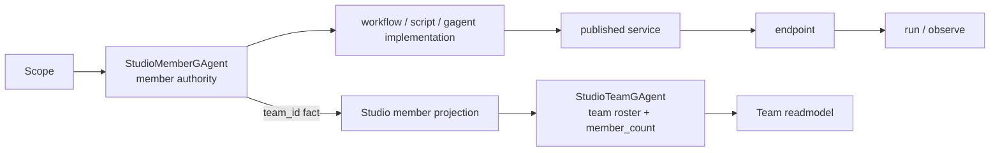
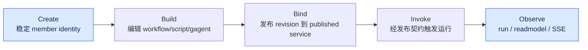

# Studio + Scripting:产品聚合如何挂到运行主干

## 事实源/设计抽象(以 ~/Code/aevatar 为准)

- `0016-studio-member-first-published-service`:Studio 主对象是 member,生命周期是 Create -> Build -> Bind -> Invoke -> Observe。
- `0017-studio-team-first-class-aggregate`:Team 是 scope 下的一等聚合,并组合在 member contract 之上。
- `scripting`:Scripting 的行为、编译、沙箱、投影与发布能力说明。

---

Studio 是产品聚合层,不是一组后台 service 名称。它把 workflow/script/gagent 这些实现种类折叠到同一个 member 生命周期里,再用 team 聚合组织协作事实。Scripting 则是其中一种可发布、可演进、可观察的实现能力。

## member-first

ADR-0016 把 Studio 的唯一主语定为 member:

| 阶段 | 语义 |
|---|---|
| Create | 创建一个稳定 member identity |
| Build | 编辑它的 workflow/script/gagent implementation |
| Bind | 把当前 revision 发布到 member-owned published service |
| Invoke | 通过发布契约触发运行 |
| Observe | 观察 run/readmodel/SSE 输出 |

publishedServiceId 是 member 的契约面,不是用户手工挑选的主对象。workflow/script/gagent 是 implementation kind,不是并列的身份系统。

## team-first

ADR-0017 没有推翻 member-first,而是在其上补 team 聚合。成员归属事实在 member 侧,team roster/member_count 是 TeamGAgent 对 member reassignment 事件的幂等聚合结果。这样做避免 UI 查询时临时拼接 roster,也避免单纯 counter 在重放或重复事件下漂移。

## Scripting

Scripting 的职责是让脚本行为进入同一套 actor/run/projection 语义:编译由 Roslyn + sandbox policy 控制,运行由 script behavior actor/dispatcher 承载,readmodel/materializer 给 Studio 和观察面使用。它不是"前端编辑器直接执行脚本",也不是绕开 tool/runtime 的自由代码执行口。

⚠️ Workflow/Cli/Maker/CaseProjection demos 当前只剩 build artifact 空壳或历史残留。本章不再把这些 demo 当可跑教程素材;后续需要维护者决定是删除文档引用、保留历史索引,还是重新恢复 demo 源码。

## 验收

1. Studio 的主对象是什么?member。
2. Team 与 member 的关系是什么?team 聚合组合在 member contract 之上,roster/member_count 来自 member 归属事实。
3. Scripting 进入哪条主链?编译/沙箱/actor 行为/projection/readmodel,不绕开运行时。

⟦AI:AUTO-LOOP⟧
