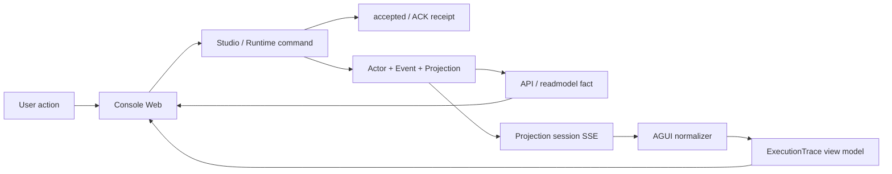
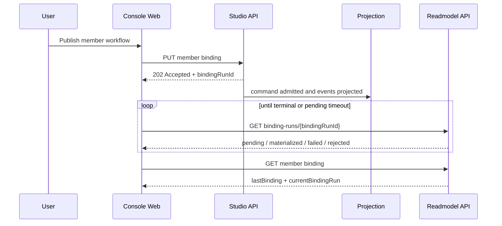
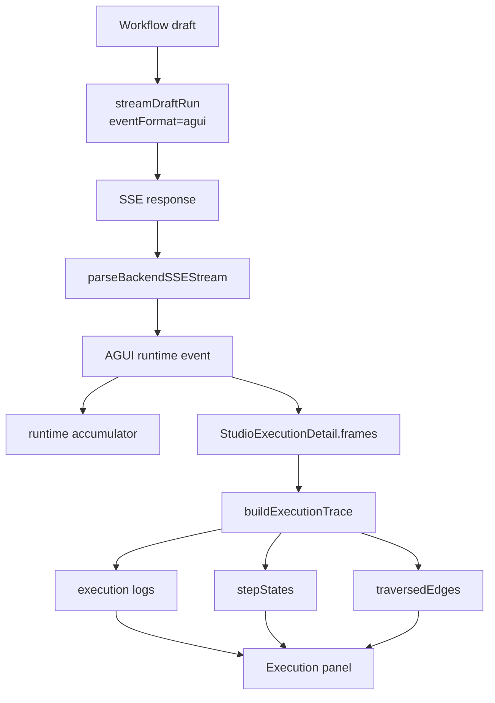

# 前端控制台:命令 ACK、读侧事实与运行观察

## 事实源/设计抽象(以 ~/Code/aevatar 为准)

本章讨论 Console Web 如何消费后端契约:Studio 写命令只得到 accepted/ACK,成员与运行事实从 API/readmodel 读,实时运行只作为 SSE/AGUI 观察流进入 UI。以下事实源覆盖同一条设计链路,因同时涉及命令回执、读侧物化和 ExecutionTrace 三个前端边界而略超过三条;它们只作事实入口,不是正文骨架。

- `docs/2026-04-27-member-first-studio-apis.md:18-45`:member-first Studio API 的 Bind / Invoke / Observe 路由,以及 `202 Accepted`、`bindingRunId`、readmodel 短暂不可见的语义。
- `apps/aevatar-console-web/src/pages/team-member-workflow-studio/hooks/useTeamMemberWorkflowStudio.ts:1248-1284`、`:1680-1880`:Workflow Studio 把 draft run SSE 积累成 execution detail,并在 publish 后按 `bindingRunId` 轮询 binding run 状态。
- `apps/aevatar-console-web/src/shared/api/runtimeRunsApi.ts:315-345`、`apps/aevatar-console-web/src/shared/agui/sseFrameNormalizer.ts:97-105`、`:257-340`:draft run 请求 AGUI SSE,并把后端 oneof / typed / flat frame 归一化成 UI event。
- `apps/aevatar-console-web/src/shared/studio/execution.ts:55-61`、`:415-620`:ExecutionTrace 是前端视图模型,把 frames 解释成 step states、traversed edges 和日志。

---

Console Web 是后端契约消费者,不是新的事实源。它可以发命令、解码回执、刷新 query、轮询 readmodel、消费 SSE,也可以把运行帧整理成图和日志;但成员绑定是否完成、run 是否终止、team entry 是否物化,仍以后端 API/readmodel 和投影事件为准。



这张图的重点是分层:ACK 只证明后端接收了命令,readmodel 回答"事实现在是什么",SSE/ExecutionTrace 回答"界面可以怎样观察这一段运行"。三者互相补充,但不能互相替代。

## 技术栈意图

| 选择 | 意图 |
|---|---|
| React + Umi | 提供多页工作台、路由、构建和本地代理骨架 |
| antd / Pro Components | 承载表单、表格、布局、设置页等管理台交互 |
| React Query | 把 API/readmodel 查询缓存、失效和轮询留在前端边界 |
| AGUI event model | 让后端运行帧进入 typed UI event,避免页面各自解析 SSE |
| Monaco / XYFlow | 分别服务 Studio 编辑和 workflow 图形化编排体验 |

为什么不是让前端直接维护"当前事实"?因为 Console Web 的生命周期短、页面可刷新、网络可中断,它只能持有交互态和缓存态。真正需要恢复、审计和跨客户端一致的事实必须在 Actor/Event/Projection/readmodel 主链路里。

## 命令 ACK 与 readmodel 物化等待

Studio member binding 是最典型的边界:前端 `PUT /binding` 后拿到的是 accepted response 和稳定的 `bindingRunId`,不是"已经发布成功"。随后 Console Web 用 `GET /binding-runs/{bindingRunId}` 或 member binding view 查询 readmodel;短时间 404 只能说明投影尚未物化,不能被解释成终态失败。只有明确的 `failed` / `rejected` 才能作为发布错误展示。



这样设计的正当性在于:HTTP 请求不需要阻塞到跨 actor 执行完成,用户也不会被一个过早的 UI 成功态误导。Console Web 可以显示"已接收、等待物化",但不能用本地 mutation 状态冒充后端事实。

team/member 命令回执同理。`accepted`、`no_change`、`commandId`、`correlationId` 这类字段适合做用户反馈和后续查询线索,不适合替代 readmodel。Scheduled workflow 的 recurring prompt 可为空,也只是命令 payload 形态变化;调度是否存在、是否启用、是否触发,仍由后端 schedule/readmodel 契约决定。

## SSE、AGUI 与 ExecutionTrace

运行观察是另一条分支。draft run 会以 `Accept: text/event-stream` 请求后端,并声明 `eventFormat: "agui"`;Console Web 用 shared AGUI normalizer 兼容后端 oneof-style、typed+nested、already-flat 三类帧。页面拿到 typed runtime event 后,先更新 runtime accumulator,再把帧保存到 `StudioExecutionDetail.frames`。



ExecutionTrace 不是后端协议名,也不是新的事件源。它只是 Console Web 内部的解释层:把 `aevatar.step.request`、`aevatar.step.completed`、human input、usage、snapshot 等观察帧映射成可读日志、节点状态和边高亮。节点 run 后仍可选择、拖拽和编辑,是因为图编辑状态属于 Studio UI;运行 trace 只装饰画布,不接管 workflow 定义事实。

为什么不让每个页面自己解析 SSE?因为运行帧形态会随后端演进,集中 normalizer 能把兼容性放在一个边界里;页面只消费稳定的 AGUI-like event 和局部视图模型。为什么又要有 ExecutionTrace?因为 AGUI event 是跨页面观察格式,而 Workflow Studio 需要把同一批帧投影成"哪个 step active / 哪条边走过 / 默认看哪条日志"这类界面问题。

## 本地代理 split

README 里的代理 split 把 runtime routes 与 Studio Hosting routes 分到不同后端目标。这个 split 是开发便利,不是架构新边界:生产语义仍然是 Console 通过 Host/Studio API 与主干交互。

## 最小形状示例

命令 ACK 的形状应该被读成"后续查询句柄",而不是完成事实:

```json
{
  "status": "accepted",
  "bindingRunId": "br_123",
  "scopeId": "scope-a",
  "memberId": "member-b",
  "ackStage": "admitted"
}
```

运行帧进入 UI 后也只形成观察态:

```json
{
  "type": "CUSTOM",
  "name": "aevatar.step.completed",
  "payload": {
    "stepId": "draft",
    "success": true,
    "nextStepId": "review"
  }
}
```

前一个 JSON 驱动轮询 readmodel,后一个 JSON 驱动 trace 装饰。它们都不让 Console Web 成为事实权威。

## 验收

1. Console Web 拥有成员、team 或 run 的权威事实吗?不拥有;它消费 ACK、API/readmodel 和 SSE/AGUI。
2. `202 Accepted` 或 `accepted` receipt 等于发布完成吗?不等于;它只提供稳定查询句柄,完成态要看 binding run/readmodel。
3. readmodel 短暂 404 应怎样解释?按投影尚未物化处理,不能当作终态失败。
4. SSE 帧在哪里归一化?shared AGUI normalizer。
5. ExecutionTrace 是后端协议吗?不是;它是前端把运行帧解释成日志、step 状态和边高亮的视图模型。

⟦AI:AUTO-LOOP⟧
