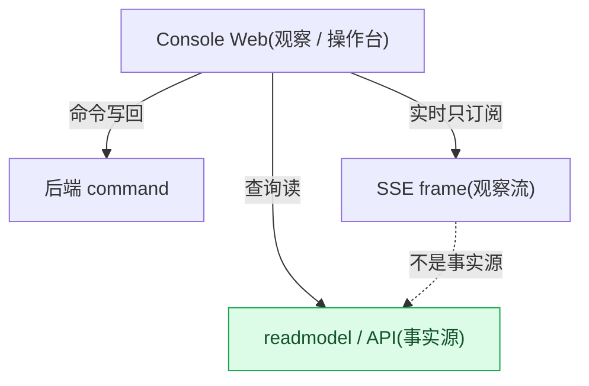
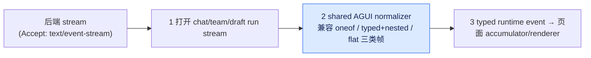

# 前端控制台:技术栈意图与 SSE 消费模式

## 事实源/设计抽象(以 ~/Code/aevatar 为准)

- `apps/aevatar-console-web/README.md`:控制台技术栈、本地 API 目标、NyxID 登录环境和代理 split。
- `apps/aevatar-console-web/src/shared/api/runtimeRunsApi.ts`:chat/team/draft run 的 SSE 请求入口。
- `apps/aevatar-console-web/src/shared/agui/sseFrameNormalizer.ts`:后端 SSE 帧到 AGUI/UI runtime event 的归一化逻辑。

---

Console Web 是观察与操作台,不是新的事实源。它的职责是把 Studio/runtime/readmodel/API/SSE 组合成可操作界面:命令写回后端,查询读 readmodel/API,实时运行只订阅 SSE frame 并归一化成 UI 事件。

## 技术栈意图

| 选择 | 意图 |
|---|---|
| React + Umi | 提供多页工作台、路由、构建和本地代理骨架 |
| antd / Pro Components | 承载表单、表格、布局、设置页等管理台交互 |
| React Query | 把普通 API 查询缓存和失效控制留在前端边界 |
| AGUI event model | 让后端运行帧进入 typed UI event,避免页面各自解析 SSE |
| Monaco / XYFlow | 分别服务 Studio 编辑和 workflow/图形化编排体验 |

这里保留的是产品/架构选择,不是 package.json 行号库存。版本号会变,但"控制台只消费后端契约,不拥有运行事实"这个边界不能变。

## SSE 消费模式

运行类入口会以 Accept: text/event-stream 请求后端 stream,拿到 response 后交给 UI 层逐帧消费。前端只做三件事:

1. 打开 chat/team/draft run 等 stream。
2. 用 shared AGUI normalizer 兼容 oneof-style、typed+nested、already-flat 三类帧。
3. 把 typed runtime event 送入页面 accumulator/renderer。

这意味着前端看到的是观察流,不是查询事实源。run 是否完成、readmodel 当前状态、Studio member/team 当前态,仍应以后端 query/readmodel 契约为准。

## 本地代理 split

README 里的代理 split 把 runtime routes 与 Studio Hosting routes 分到不同后端目标。这个 split 是开发便利,不是架构新边界:生产语义仍然是 Console 通过 Host/Studio API 与主干交互。

## 验收

1. Console Web 拥有运行事实吗?不拥有,它消费 API/readmodel/SSE。
2. SSE 帧在哪里归一化?shared AGUI normalizer。
3. 本地 proxy split 是什么性质?开发期目标拆分,不是新的事实权威。

⟦AI:AUTO-LOOP⟧
