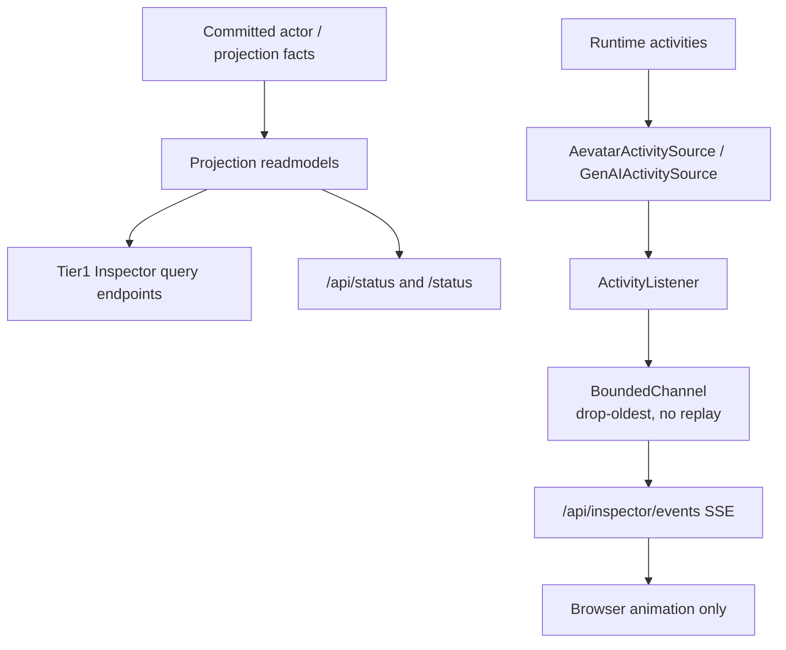
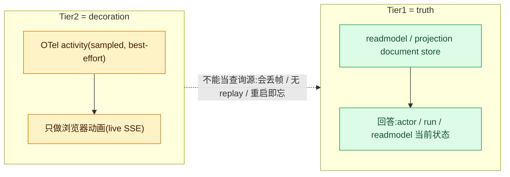

# 可观测性:OTel 语义、/status 与两级 Inspector

## 事实源/设计抽象(以 ~/Code/aevatar 为准)

- `0022-otel-aevatar-semantic-conventions`:aevatar.* activities/tags 与 GenAI OTel 的关系。
- `0023-two-tier-inspector-architecture`:Inspector 分 Tier1 canonical readmodel 与 Tier2 OTel observation。
- `tools/ci/inspector_tier_boundary_guard.sh`:Tier2 只能作为 `/api/inspector/events` live SSE,不能服务查询。

---

可观测性分两类:生产/调试观察信号,以及回答"当前事实是什么"的查询。aevatar 的边界是前者可以来自 OTel/SSE,后者必须来自 readmodel/query port。

## OTel 负责什么

ADR-0022 给 actor lifecycle、projection materialization、readmodel writes、workflow run 等活动定义 aevatar.* tags/activities;AI/LLM/tool 侧沿用标准 OTel GenAI semconv。OTel 的价值是让生产栈和调试 UI 看到同一类观察信号,而不是再建一条私有 observation bus。

这些信号默认就是 sampled、best-effort、可能丢失。它们适合描述"刚发生了什么",不适合回答"系统现在真实状态是什么"。

## /status 面板

/api/status 和 /status 是轻量健康/目标/文档面板。它们的职责是把已有 health query port 和文档入口组织成当前状态视图,不是从 telemetry stream 重放系统历史。

## 为什么 Tier2 是动画不是查询源

ADR-0023 的核心规则是:Tier1 是 truth,Tier2 是 decoration。Tier1 endpoint 读取 readmodel/projection document store,回答 actor、workflow run、readmodel 当前状态;Tier2 endpoint 只把 OTel activity 作为 live SSE 推给浏览器做动画。

如果让 Tier2 回答查询,会立刻破坏正确性:

1. OTel 可能采样或丢帧,会产生幽灵 actor 或漏掉 deactivate。
2. Bounded channel 是 live broadcaster,没有历史 replay 语义。
3. 进程重启会丢 Tier2 记忆,但 readmodel 仍然是 ground truth。

⚠️ Inspector demo 源码当前已删/空壳;仍存活的是 ADR-0023 的边界规则和 guard scaffold。本章不把 demo 写成可运行当前能力,也不建议在本 issue 恢复已删源码。

## 验收

1. `aevatar.*` OTel 语义解决什么?统一生产/调试观察信号。
2. Inspector Tier1 从哪里读?canonical readmodel/query port。
3. Inspector Tier2 能做查询事实源吗?不能,它只是 OTel live SSE 动画。

⟦AI:AUTO-LOOP⟧
