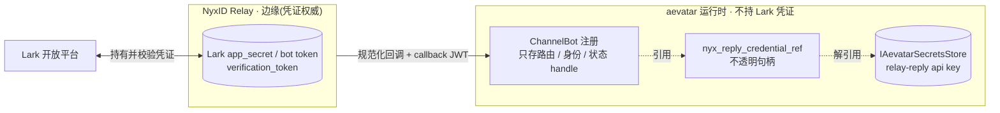
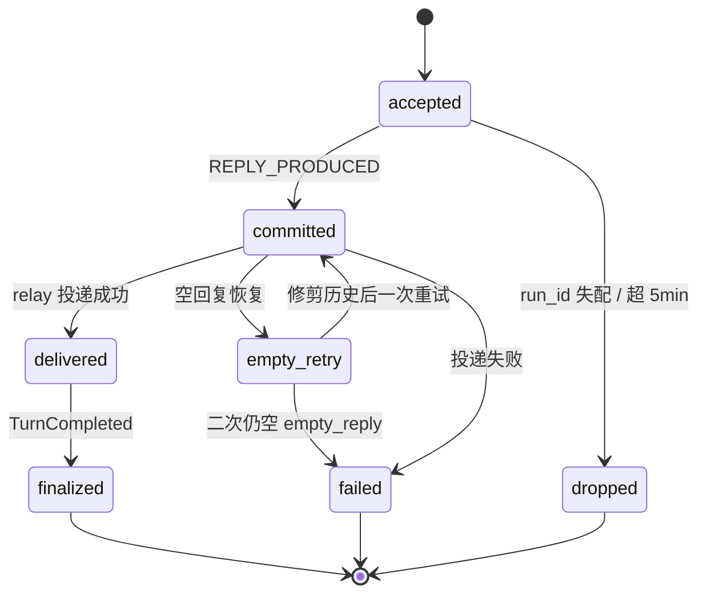

# Lark Bot 调 aevatar 全链路:从 webhook 到回复

## 事实源/设计抽象(以 ~/Code/aevatar 为准)

> 本篇追一条消息从 Lark 到 aevatar 再回到 Lark 的完整链路。下列是这条链路的**事实源脊柱**(非正文骨架),按入站/回合/出站三段给出高价值锚点:

- 设计契约:`0013-unified-channel-inbound-backbone`(统一入站)、`0012-channel-runtime-credential-boundary`(凭证边界)、`0014-interactive-reply-abstraction`(中性回复)、`0027-lark-reply-run-dispatcher-plain-task-handoff`(回复 run 派发)、canon `lark-reply-completion-semantics`(完成语义)。
- 入站:`agents/Aevatar.GAgents.NyxidChat/NyxIdChatEndpoints.cs`(唯一 relay webhook)+ `agents/channels/Aevatar.GAgents.Channel.NyxIdRelay/NyxIdRelayTransport.cs`(规范化成 ChatActivity)。
- 回合:`agents/Aevatar.GAgents.Channel.Runtime/Conversation/ConversationGAgent.cs`(长命事实源)+ `agents/Aevatar.GAgents.NyxidChat/AgentRunGAgent.cs`(短命 run)+ `src/Aevatar.AI.Core/Tools/ToolCallLoop.cs`(LLM+工具引擎)。
- 出站:`src/Aevatar.AI.ToolProviders.Channel/ReplyWithInteractionTool.cs`(回复意图)+ `agents/platforms/Aevatar.GAgents.Platform.Lark/LarkMessageComposer.cs`(渲染原生卡片)+ `src/Aevatar.AI.ToolProviders.NyxId/NyxIdApiClient.cs`(经 relay 投递)。

> 本篇是 [01 Channel Runtime](01-channels.md) 的**具体走查版**:01 讲三个边界的抽象,本篇沿一条真实消息把每一跳走一遍,并补 01 没展开的 **run actor / 完成语义 / 空回复恢复**。路由细节见 [03 ChatRouting](03-chat-routing.md)。

---

## 0. 一句话主线

> **Lark 用户 @bot → NyxID relay(边缘持凭证)→ aevatar 的 `/api/webhooks/nyxid-relay` → 规范化成 `ChatActivity` → `ConversationGAgent`(长命、去重、持历史)→ 路由解析 → run dispatcher 派出短命 `AgentRunGAgent` → `ToolCallLoop` 跑 LLM+工具 → `reply_with_interaction` 产出中性意图 → Lark composer 渲染原生卡片 → 经 relay 投递回 Lark。**

整条链路最关键的一个设计判断:**aevatar 不直接对接 Lark,也不持有任何 Lark 凭证**。Lark↔NyxID 是边缘,aevatar 只和 NyxID 说话。这样凭证权威留在 relay,aevatar 主链只处理强类型的 `ChatActivity`(为什么这么切,见 §2)。

```mermaid
sequenceDiagram
    autonumber
    actor U as Lark 用户
    participant LK as Lark 开放平台
    participant NYX as NyxID Relay
    participant EP as Relay Webhook
    participant CV as ConversationGAgent
    participant TR as TurnRunner
    participant RUN as AgentRunGAgent
    participant LOOP as ToolCallLoop
    U->>LK: @bot 发消息
    LK->>NYX: 事件回调（携 Lark 凭证）
    NYX->>EP: POST /api/webhooks/nyxid-relay
    EP->>EP: 校验 callback JWT
    EP->>EP: 规范化为 ChatActivity
    EP-->>NYX: 202 Accepted
    EP->>CV: NyxRelayInboundActivity（按 scope 建 actor）
    CV->>CV: 两层去重 JTI / activity.Id
    CV->>TR: 委派一回合
    TR->>RUN: 路由解析 + run dispatcher 派发
    RUN->>LOOP: 驱动 LLM + 工具循环
    LOOP-->>RUN: reply_with_interaction 中性意图
    RUN->>CV: LlmReplyReadyEvent（REPLY_PRODUCED）
    CV->>NYX: 经 relay 投递回复
    NYX->>LK: 渲染原生卡片
    LK-->>U: 看到回复
    CV->>CV: Delivered → TurnCompleted
```

---

## 1. 入站:Lark → relay → ChatActivity

| # | 步 | 组件 | 职责 |
|---|---|---|---|
| 1 | Lark 把事件投给 **NyxID**,不投 aevatar | NyxID relay(外部) | aevatar **不托管** Lark webhook |
| 2 | Nyx 规范化后 POST 到 aevatar 唯一入站路由 `/api/webhooks/nyxid-relay`(`AllowAnonymous`) | `NyxIdChatEndpoints` | 薄 HTTP shim:读 body → 校验 → 派发 → `202 Accepted` |
| 3 | 校验 Nyx callback JWT(OIDC/JWKS + body-hash 绑定) | `NyxIdRelayAuthValidator` | 入口不信任明文,先验签 |
| 4 | 把原始 Lark/relay JSON 规范化成 **`ChatActivity`** | `NyxIdRelayTransport.Parse` | 统一入站类型(ADR-0013);`Id` 用 Nyx `message_id` 作确定性去重键 |
| 5 | 解析 scope(JWT 带 `scope_id`,否则按 api_key_id 解析) | `INyxIdRelayScopeResolver` | 多 bot/多 token 按 scope + api_key 路由 |
| 6 | 包成 `NyxRelayInboundActivity`,按 scope 建/取 `ConversationGAgent`,派发 | `NyxIdRelayIngressPort` | endpoint 不在 shim 里编排对话 |

**`ChatActivity` 是什么、为什么是它**:它是"transport 解析"与"对话处理"之间**唯一**的跨界契约(ADR-0013)。Lark 和 Telegram 走的是**同一个** `NyxIdRelayTransport`,差异只停在 `Parse` 里(Lark 富文本 `post`、群 `chat_id`、@提及的恢复)。一旦变成 `ChatActivity`,主干代码就不再知道"这是 Lark"——这是 aevatar 把"支持几个平台"从主链剥离的关键。

---

## 2. 凭证边界:为什么是 relay,不是直连(ADR-0012)



注册时(`NyxLarkProvisioningService`),`app_id`/`app_secret`/`verification_token` 被**转发给 Nyx**,**本地一律不落盘**。注册 proto 里 `reserved "credential_ref"`,只保留非密 handle(`nyx_agent_api_key_id`、`nyx_reply_credential_ref`)。aevatar 唯一可能存的密文是 **relay 回复用的 api key**(`secrets://channel/nyxid/lark/{id}/reply-api-key`),藏在 `IAevatarSecretsStore` 后,正文里只以不透明 `nyx_reply_credential_ref` 出现。

**正当性**:凭证权威留在边缘,aevatar 主链就永远拿不到、也不需要 Lark 长期密钥——符合"事实拥有者"与最小权限边界(对应仓库不动点 FI-002/FI-005)。代价是多一跳 relay,但换来主链零密钥与统一入站。

**入站去重(两层,均为 actor 自持久化状态,重启不丢)**:① relay callback JTI 重放声明(首次落 `NyxRelayCallbackAdmittedEvent`);② activity-id 去重(`ProcessedMessageIds` 滑窗)。Lark 会重投,去重必须在做业务前。

---

## 3. 回合:ConversationGAgent → 路由 → run dispatcher

`ConversationGAgent` 是这条链路的**长命事实源**:持有 `RetainedHistory`(LLM 对话窗,约 100 条)、去重集、投递台账。它收到 `ChatActivity` 后:

1. 去重通过 → 把这一回合委派给 `IConversationTurnRunner`(实现 `ChannelConversationTurnRunner`)。
2. turn runner 解析注册/斜杠命令/LLM 资格 → 产出 `NeedsLlmReplyEvent`(`ConversationTurnResult.LlmReplyRequested`)。
3. **路由(ADR-0024/0026)**:`ChatRouteResolver.Resolve(policy, input)` 是**无状态同步**解析器,策略权威在 `ChatRoutePolicyGAgent`(按 scope)。冷启动兜底 → `ForwardToModel(env AEVATAR_DEFAULT_LLM_MODEL)`。**tool-first ingress(ADR-0026)**:动作面收敛成 `ForwardToModel | Reject`;过去的"路由到 GAgent/team/workflow"不再是入口动作,而是 LLM 在循环里发的**工具调用**。
4. `ConversationGAgent` 给 `NeedsLlmReplyEvent` 盖上 `target_actor_id`,附上 `prior_history`,剥掉临时凭证 → 调 `IChannelLlmReplyRunDispatcher`。
5. **run dispatcher(ADR-0027)**:`AgentRunDispatcher` 用确定性 `run_id` 建 `AgentRunGAgent`,包成 `AgentRunStartRequested` 经 `IActorDispatchPort` 派发。**dispatcher 只返回 `Task`——含义仅是"actor 已建 + start 信封被接收",不在 dispatcher 本地做准入/去重判定**(判定归 run actor)。

**为什么把 run 拆成独立短命 actor**:`ConversationGAgent` 是长命对话事实拥有者,`AgentRunGAgent` 是一次回合的短命执行者(owns LLM 循环续跑)。这正是仓库"长命事实拥有者 / 短命 run actor"的边界(FI-001/FI-004):对话历史与投递台账不被一次次 run 的执行细节污染。

---

## 4. 回合执行:AgentRunGAgent → ToolCallLoop

`AgentRunGAgent`(`[GAgent("nyxid.chat.agent-run")]`)持有 run 续跑,把每个 LLM 步委派给 `IAgentRunReplyGenerationExecutorPort`(在脱离任务里跑),结果以确定性状态事件回折。底层引擎是 `ToolCallLoop`:**LLM 调用 → 后采样 hook → 有工具调用则在 `AgentToolContextScope` 下执行 → 结果回填历史 → 再调 LLM,直到终止或 `maxRounds`**。

> ⚠️ **常见误解纠正**:Lark→回复这条**热路径不经过** `RoleGAgent`。`src/Aevatar.AI.Core/RoleGAgent.cs`(处理 `ChatRequestEvent`)是 **workflow / role-actor** 那条 `llm_call` 路径;channel 路径经 `AgentRunGAgent` → `AgentRunReplyGenerationExecutor` 进 LLM 循环。两条路径**汇聚到同一个 `ToolCallLoop` 引擎**,但入口 actor 不同。读源码时别把两者混为一条。

**空回复恢复(commit `bcd2d2e3f`)**:当累计文本为空、无流式文本、无出站意图、也无待执行工具调用时,`ShouldRecoverEmptyLlmStep` 触发**恰好一次**重试:`TrimMessagesToRecentFloor` 保留全部 `system` 消息 + 最近 **6** 条非系统消息(丢中间),并追加一条**不落库**的提示("现在用纯文本给出最终答案")。假设是"历史太大导致空输出"。二次仍空 → 终态 `FAILED(empty_reply)`。

---

## 5. 出站:中性回复意图 → Lark 渲染 → relay 投递 → 完成

| # | 步 | 组件 | 说明 |
|---|---|---|---|
| 1 | agent 发**中性**回复意图 `reply_with_interaction` | `ReplyWithInteractionTool` → `MessageContent` proto | 经 turn-scoped `IInteractiveReplyCollector` 收集;agent 不知道目标是 Lark(ADR-0014) |
| 2 | run 产出 → 落 `AgentRunReplyProducedEvent`(`REPLY_PRODUCED` = 已提交)→ 发 `LlmReplyReadyEvent` | `AgentRunGAgent` | 提交先于投递 |
| 3 | 对话渲染并发送(支持流式分片) | `ConversationGAgent.RunLlmReplyAsync` | |
| 4 | 按 `ChannelId` 取 composer,把 `MessageContent` 渲染成原生 | `LarkMessageComposer` | 纯文本→`msg_type=text`;动作/卡片→`interactive`(Lark 卡片 2.0);`is_danger`→橙色头 |
| 5 | **经 NyxID relay 投递(非直连 Lark API)** | `NyxIdApiClient.SendChannelRelayReplyAsync` → `POST /api/v1/channel-relay/reply`(改写走 `/reply/update`) | |
| 6 | 投递成功 → 依次落 `LlmReplyDeliveredEvent` → `DeliveryProducedEvent` → `ConversationTurnCompletedEvent`;失败 → 落失败事件 | `ConversationGAgent` | run 设 `cleanup_completed_at` |

**回复完成语义(为什么需要状态机)**:Lark 会重投、网络会抖,投递必须**幂等且可断点续**。完成被建模成四个链阶段 + run FSM:



幂等靠三点:① 信封 `OperationId = "agent-run-start:{runId}"` + actor id 由 `run_id` 派生(重复落到同一 actor);② 每个 handler 入口 `IsTerminal` 短路、`cleanup_completed_at != 0` 使清理幂等;③ 陈旧丢弃(`run_id` 失配直接 drop;年龄 > `MaxRunRequestAgeMs`=5min → `AgentRunDroppedEvent`)。**单 actor 串行状态即事实源,无进程内去重字典。**

---

## 6. 可观测性(简)

通道回合外层有 `channel.pipeline.invoke` span(`TracingMiddleware`),带 `aevatar.channel.*` 标签(activity_id / canonical_key / bot_instance_id)。每次 LLM 调用 / 工具执行的 `gen_ai.*` span **仅当宿主注册了 `GenAIObservabilityMiddleware` 时**才有。

---

## 7. ⚠️ 边界与已知缺口(诚实标注)

- **多份 ADR 已被取代**:`0008`(multi-token `ChannelUserGAgent`)/`0011`(直连 Lark webhook)/`0009`(bot-callback)描述的是**已不在代码里**的旧模型;当前以 `0012`/`0013` + 源码为准。canon `aevatar-channel-architecture.md` 是含目标态接口(`IChannelTransport` 等)的长 RFC,**当前实际入站路径是上面那条具体 relay shim**,不是那些接口。
- **返回码**:aevatar 端点返回 **`202`**(不是 Lark 要求的 `200`)——因为 Lark↔Nyx 才是承担 `200` 契约的边缘,aevatar 只回 Nyx。
- **ADR-0026 部分落地**:`ChatRunActor`/`VoiceSessionActor` 未实现;生产用的 channel run actor 是 `AgentRunGAgent`。其 D5/D6 视为目标态。
- **ADR-0022 在本路径偏目标态**:`aevatar.conversation.*`/`aevatar.run.*`/`aevatar.reply.*` span 尚不存在;常量 `channel.bot.turn` 已定义但**从未被启动**。`gen_ai.*` 不保证有(取决于宿主是否注册中间件)。
- **会话边界**:relay payload 无显式 `session_id`;会话/去重键是 `ConversationReference.CanonicalKey`(平台+scope+会话+发送者的哈希)。Lark 目标解析(`chat_id` > `union_id` > `open_id`)在 `LarkConversationTargets`。
- **ADR-0014 端口改名**:`FeishuCardHumanInteractionPort` 现为 `FeishuCardNotificationPort`(canon/ADR 文字未同步)。

> **读者可回答**:为什么 aevatar 不直连 Lark 而走 NyxID relay(§2 凭证边界)?一条 Lark 消息进来后,长命的谁、短命的谁、各拥有什么事实(§3/§4)?回复为什么要完成状态机、怎么做到幂等(§5)?Lark 热路径到底经不经过 `RoleGAgent`(§4 ⚠️)?

⟦AI:AUTO-LOOP⟧
