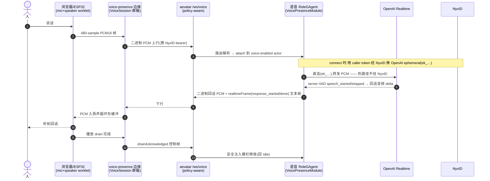
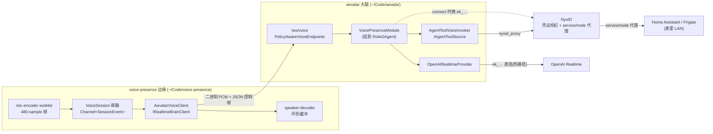
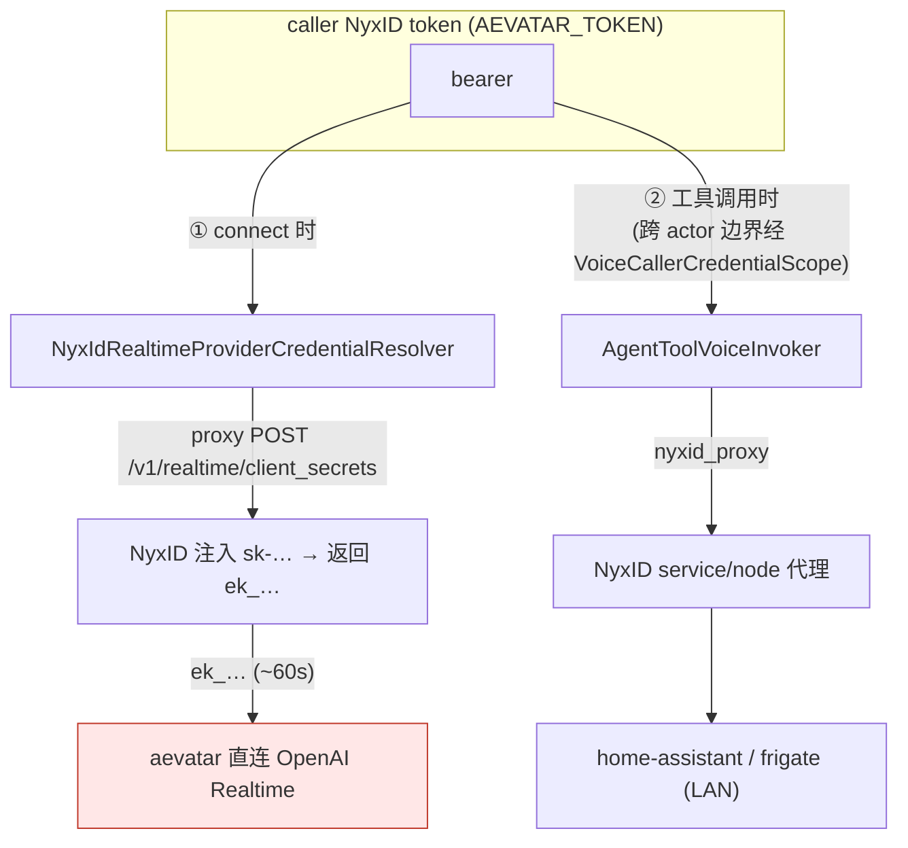
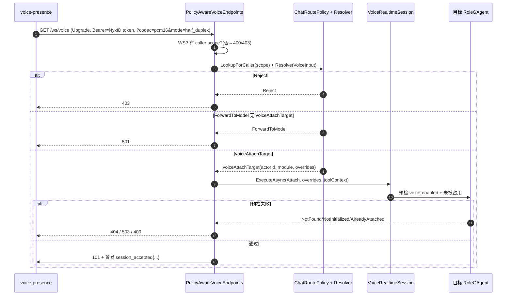
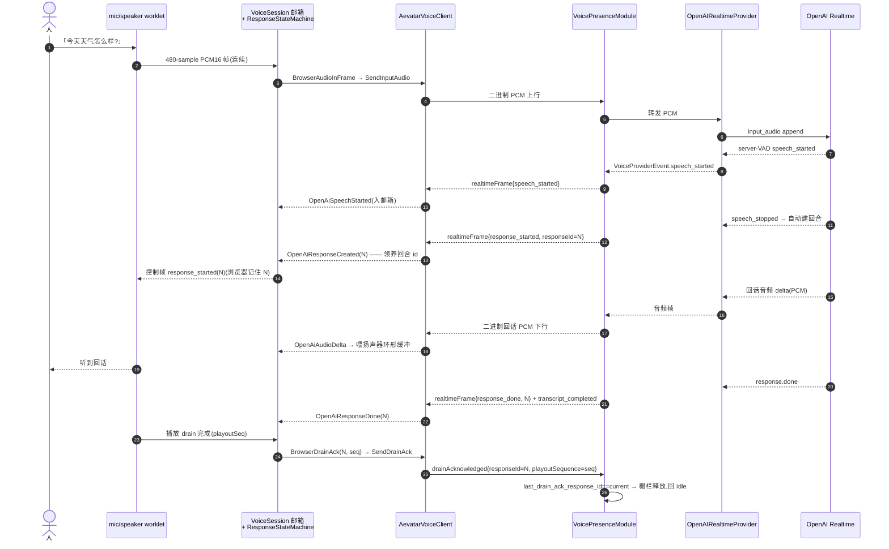
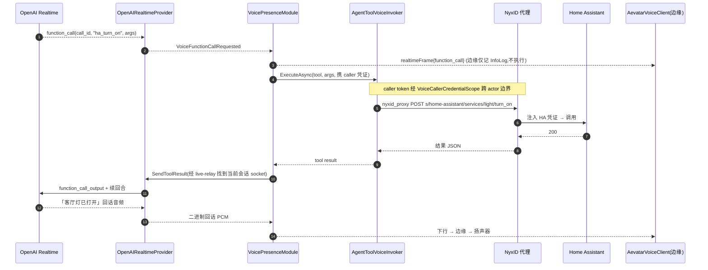
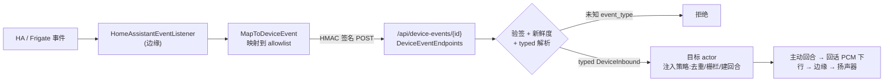

# voice-presence × aevatar + NyxID:给边缘装上大脑的全链路

## 事实源/设计抽象(以 ~/Code/aevatar 为准)

> 本篇追一条「人说话 → AI 回话」的完整链路,横跨**两个仓库**:外部边缘服务 `voice-presence`(实时音频边缘,本机 `~/Code/voice-presence`,非本仓事实源)和它的**大脑** aevatar + NyxID(本仓事实源 `~/Code/aevatar`)。下列是这条链路在 aevatar 侧的脊柱锚点(高价值,非正文骨架):

- 边界契约:`docs/adr/0025-voice-router-integration.md`(policy-aware `/ws/voice` 边界)、`docs/adr/0031-voice-edge-local-tools.md`(LAN 工具经 NyxID service/node 代理)、`docs/adr/0033-voice-provider-nyxid-ephemeral-broker.md`(provider 凭证经 NyxID 临时密钥经纪)。
- 入口与传输:`src/Aevatar.Mainnet.Host.Api/Voice/PolicyAwareVoiceEndpoints.cs`(attach 前路由解析)、`src/Aevatar.Foundation.VoicePresence/Modules/VoicePresenceModule.cs`(语音会话挂到已有 actor 的 EventModule)。
- 帧契约:`src/Aevatar.Foundation.VoicePresence.Abstractions/Protos/voice_presence.proto`(`VoiceControlFrame` / `VoiceRealtimeFrame` oneof)。

> 本篇与 [07/04 VoicePresence](04-voice-presence.md) 互补:04 讲 aevatar 内部「语音是挂载能力不是第二套会话主干」的抽象;本篇站在**边缘 ↔ 大脑**的接缝上,沿一条真实语音把每一跳走一遍,补 04 没展开的 **wire 契约 / 凭证三角 / 语音问答时序 / 主动播报**。它是 [07/08 Lark 全链路](08-lark-end-to-end.md) 的「语音版」走查。

---

## 0. 一句话主线

> **人对着麦克风说话 → `voice-presence` 边缘把 24kHz PCM16 切帧、单写者入队、经 `/ws/voice` 上行 → aevatar 用 NyxID 换来的 OpenAI 临时密钥直连 OpenAI Realtime(音频热路径不经 NyxID)→ 模型在 actor 内执行工具(经 NyxID 代理打到家里的 Home Assistant)→ 回话 PCM 原路下行 → 边缘喂给扬声器环形缓冲 → 播完回 `drain_ack`,actor 的安全注入栅栏释放。**

整条链路最关键的一个判断:**边缘不持大脑,大脑不碰音频边缘**。`voice-presence` 只拥有「实时音频边缘职责」——切帧、环形缓冲、回声消除、重连、drain 栅栏;而 **provider、persona、工具、回合生命周期、事件注入策略全在 aevatar actor 内**,凭证全由 NyxID 经纪。这把一个会被「既要管音频又要管大脑」拖垮的系统,切成两个各自单一职责的部分(为什么这么切,见 §7)。



---

## 1. 两个仓库、一条边界:谁拥有什么

`voice-presence`(ADR-018 的 L1 边缘验证器)与 aevatar 之间,用一个**可插拔的大脑抽象** `IRealtimeBrainClient`(边缘侧)隔开。它有两种实现:`OpenAiSessionClient`(边缘自己直连 OpenAI,回合/persona/工具都在边缘本地)和 `AevatarVoiceClient`(把大脑整体外包给 aevatar)。本篇只讲后者。

切换由 `BrainProvider` 决定(边缘侧 `~/Code/voice-presence/src/VoicePresence.Server/Voice/BrainOptions.cs`):设了 `AEVATAR_URL` 就默认走 aevatar。这个抽象的关键属性是 `OwnsTurnLifecycle`:aevatar 模式下为 `true`,意味着**边缘不再调 `response.create` / `response.cancel`**,回合 id 由 actor 分配、边缘从 `response_started` 帧里**领养**。

| 职责 | 谁拥有 | 边界不变量 |
|---|---|---|
| 麦克风切帧(128→480 sample)、扬声器环形缓冲、AEC、barge-in 手感 | **边缘** | 无损音频帧契约(ADR-018 I5);per-callback 整块传递是回归 |
| 单写者邮箱(每个 ingress 入 `Channel<SessionEvent>`) | **边缘** | 边缘内的单写者(ADR-018 D4)——但**不再写 OpenAI**,只写 aevatar WS |
| WS 重连 + 退避、drain_ack 反馈 | **边缘** | 5 次指数退避后才上抛 disconnect |
| **provider 选择 + 直连**(OpenAI/MiniCPM realtime) | **aevatar actor** | 音频热路径 actor↔provider 直连(ADR-013) |
| **persona / 指令 / server-VAD 参数 / 工具目录** | **aevatar actor** | 边缘的 `session.update` 在 aevatar 模式是 no-op |
| **回合生命周期**(response_id 分配、create/cancel) | **aevatar actor** | 边缘 `OwnsTurnLifecycle=true`,领养而非驱动 |
| **工具执行**(HA / Frigate / …) | **aevatar actor** | 边缘只观测 `functionCall`(记 InfoLog),**绝不执行** |
| **事件注入策略**(去重 / 栅栏 / 建回合) | **aevatar actor** | 家庭事件经 device-event ingress,actor 拥有注入 |
| **凭证**(OpenAI key / HA token / …) | **NyxID** | 零长期 secret material;aevatar 不持裸 key |



---

## 2. 凭证三角:NyxID 的三个角色

这条链路里 NyxID 出现在三个**互不重叠**的位置,每个都遵守「NyxID 不进音频热路径」(ADR-013):

1. **Voice provider 凭证经纪(ADR-0033)**:aevatar 不再读裸 `OPENAI_API_KEY`。`/ws/voice` connect 时,用 **caller 的 NyxID token** 经 NyxID 代理 `POST /api/v1/proxy/s/openai-realtime/v1/realtime/client_secrets`,NyxID 注入真实 `sk-…` 向 OpenAI 申请一个 **~60s TTL 的 ephemeral `ek_…`**,aevatar 随后用它**直连** OpenAI。caller token 经 `AgentToolContextScope` 走 AsyncLocal 流到 resolver,**不落 grain/proto/log**。
2. **LAN 工具经 connected-service 代理(ADR-0031)**:模型在 actor 内发起 `function_call` 时,工具经 `nyxid_proxy` / connected-service tool 打到 NyxID 注册的 `home-assistant`、`frigate` service;NyxID 再经 node 出站 WebSocket 路由到家里的私网主机。aevatar 不直连 LAN,也不存本地 service 目录。
3. **设备事件回调形状(§6)**:家庭事件以 NyxID relay 的 `CallbackPayload` 形状、HMAC-SHA256 签名投递到 `/api/device-events/{id}`。



> **当前状态(诚实标注)**:ADR-0033 文件头仍写 `status: proposed`,但 broker 代码(`NyxIdRealtimeProviderCredentialResolver` + 默认 service slug `openai-realtime` 写进 `NyxIdRealtimeProviderCredentialOptions`)已落到 aevatar mainnet 分支,且该链路在 **mainnet 生产已端到端可用**(运维实证,2026-06 验证;非 ADR 的 accepted 状态)。把这条记成「代码已落、ADR 头待转正」的文档滞后,而不是 accepted current。

---

## 3. 连接握手:policy-aware `/ws/voice` 怎样落到一个 voice-enabled actor

边缘拨号有两条路(`BuildAevatarVoiceUri`,边缘侧 `BrainOptions`):设了 `AEVATAR_VOICE_ACTOR_ID` 就拨 dev-bypass `/ws/voice/{actorId}`(需 token 带 `voice:bypass` scope 或 admin role);**不设**就拨 policy-aware `/ws/voice`,让 caller 的 **chat-route policy** 解析目标 agent。生产用后者。

policy-aware 入口(`PolicyAwareVoiceEndpoints.cs`)在 **WebSocket upgrade 之前**做完路由与授权,是个 fail-closed 的边界:

1. 不是 WS 请求 → `400`。
2. 取不到已验证的 caller scope(NyxID `sub`/`uid`)→ `403`。
3. 按 caller scope 查 `ChatRoutePolicy` 快照,无状态 `ChatRouteResolver` 解析 `ChatRouteInput{ SourceKind = Voice, Voice{codec, mode, module} }`。
4. 决策分支:`Reject → 403`;`ForwardToModel` 但**没有** typed `voiceAttachTarget` → `501`(普通模型转发不是语音 attach);拿到 `voiceAttachTarget(actorId, voiceModuleName, sessionOverrides)` → attach。
5. attach 前先用 caller bearer 经 `IVoiceToolCredentialIssuer` 发一个 5 分钟 TTL 的 tool credential ref(写进 `VoiceToolExecutionContext`),再 `voiceRealtimeSession.ExecuteAsync(Attach)` 预检 → 通过才 `AcceptWebSocketAsync()`。
6. accept 后第一帧就回 `session_accepted`(actorId / moduleName / sessionId / pcmSampleRateHz / wire_contract_version)。

> 没有 chat-route 规则时,policy-aware `/ws/voice` 会 `501 ForwardToModel`。**让语音能落地的那条规则**是 `sourceKind=VOICE → voiceAttachTarget(agent, voice_presence_openai)`,其 `sessionOverrides.instructions` 同时承载该语音会话的 system prompt(生产实证:见 [07/03 ChatRouting](03-chat-routing.md) 的 policy 语义)。



---

## 4. 语音问答工作流程(核心)

attach 成功后,socket 上只跑两种东西:**二进制 PCM16**(双向音频)和 **JSON 控制帧**(生命周期/VAD/转写/错误)。下面是一次完整问答的端到端时序。

### 4.1 happy path:一问一答



关键点:

- **回合 id 领养**:`response_started` 来之前,边缘不知道回合号;浏览器只有收到边缘转发的 `response_started(N)` 控制帧后,才能在 drain 时回 `drain_ack(N)`。边缘若漏发这个控制帧,浏览器会回 `drain_ack(0)`,栅栏永不释放(这是边缘侧 ADR-018 的已知坑,在 aevatar 模式同样成立)。
- **二进制/文本分流**:`AevatarVoiceClient.ReadUntilDropAsync` 按帧类型分流——`Binary` → `OpenAiAudioDelta` 直接进邮箱喂扬声器;`Text` → `AevatarRealtimeFrameParser` 解析成对应 `SessionEvent`。解析器同时容忍 protobuf JsonFormatter 的 lowerCamelCase 与 snake_case。
- **转写**:aevatar 当前只回 assistant 侧 `transcript_completed`(空文本帧是 drain 回声,被丢弃);没有 user transcript case。

### 4.2 工具分支:「把客厅灯打开」

模型决定调工具时,**工具在 actor 内执行,边缘完全不参与**。`AevatarRealtimeFrameParser` 看到 `functionCall` 帧**故意不**映射成 `OpenAiFunctionCall`(那会导致边缘和 actor 双重执行),只记一条 InfoLog。



> 这里有一个 aevatar 侧的**载荷送达不变量**:工具结果必须送回**当前 live relay 的 provider session**(`IVoiceVolatileMediaStreamPort` 按 transport lease 索引),而不是新开一个空 socket——否则 `function_call_output` 落在一个没见过 `function_call`、音频也无处可去的会话上,模型「一直在查」却永不回话。这是生产里真实踩过并修掉的坑(见 [07/04](04-voice-presence.md) 的工具执行边界)。

### 4.3 打断(barge-in)

aevatar 模式下回合生命周期是 actor 拥有的,所以**边缘不发 `response.cancel`**(`SendResponseCancelAsync` 是 no-op)。用户在 AI 说话中途插话时,OpenAI server-VAD 触发 `speech_started`,provider → module 决定取消当前回合并发 `response_cancelled`;边缘从 `realtimeFrame{response_cancelled}` 领养这个状态、停下当前播放。**取消决策的权威在 actor**,边缘只反映。这与边缘自连 OpenAI 模式(边缘自己算 `wasInProgress` 再决定 cancel)正相反——是把「状态机难点」整体上移给大脑的直接收益。

---

## 5. 摄像头帧:typed input-image 控制帧

边缘要给模型看一张图(如门铃快照)时,不走音频通道,而是发 typed `input_image` 控制帧:`{"inputImage":{"mediaType":"image/jpeg","data":<base64>}}`。边缘在**本地**就做校验(jpeg/png、解码后 ≤500KB),违规直接丢弃**不**上行——因为 aevatar 的 `WebSocketVoiceTransport` 对超限/不支持的图会用 `PolicyViolation` **关掉整个 socket**,丢一帧图不该赔上整条音频会话。这是「把对端的硬约束镜像到本地预检」的防御性设计。

---

## 6. 主动播报:家庭事件 → device ingress → 主动回合

「有人按门铃了」这类**外部事件**不骑在音频 socket 上,而是边缘经 `AevatarDeviceEventClient` 投到 aevatar 的设备事件入口 `POST /api/device-events/{registrationId}`,HMAC-SHA256 签名(`X-NyxID-Signature`,签名覆盖整个回调 body)。aevatar 侧 `DeviceEventEndpoints` 把它当 NyxID relay 的 `CallbackPayload` 处理:查注册 → 验 HMAC → 验新鲜度(默认 10s 窗口)→ 解析成 **typed `DeviceInbound`**(未知 `event_type` 在此被拒,绝不透传裸 bag)→ 经命令 facade 派发到目标 actor → `202 Accepted`。

边缘的 `MapToDeviceEvent` 负责把本地词汇(HA 标签 + dev-mock 类型)映射到 aevatar 的 `DeviceInbound` **allowlist**;映射不干净的事件**宁可丢弃也不错标**(错标会污染 actor 的强类型模型)。typed allowlist 的几个槽位:

| 边缘事件 | aevatar `event_type` | `DeviceInbound` 槽 |
|---|---|---|
| doorbell / smoke / water_leak / gas / alarm / tamper | `doorbell_pressed` / `smoke_detected` / `water_leak_detected` / `carbon_monoxide_detected` / `alarm_triggered` / `lock_tampered` | `home_alert`(severity 由 actor 按类型派生) |
| motion | `motion_detected` | `motion` |
| presence / person_arrived | `person_detected` | `camera`(scene_description) |
| Frigate sensor_update | `camera_scene` | `camera` |
| speech | `speech_detected` | `speech` |
| temperature / humidity(仅带数值读数时) | `temperature_change` | `sensor` |

事件进 actor 后,**注入策略由 actor 拥有**:去重栅栏、`safe-to-inject`(只在 Idle 且 drain_ack 匹配当前回合时注入)、建回合。边缘只负责「映射 + 投递」,不再算注入时机——这正是 §1 那条「事件注入策略归 actor」的落点。没配 `AEVATAR_DEVICE_REGISTRATION_ID` / `AEVATAR_DEVICE_HMAC_KEY` 时,aevatar 模式会把事件丢弃并告警(边缘不再有 OpenAI 那条「往会话里塞 system message」的本地注入路径)。



---

## 7. 帧契约速查(wire contract)

socket 上的稳定语义是 protobuf(`voice_presence.proto` 的两个 oneof)。边缘按这个契约收发:

| 方向 | 形状 | oneof case |
|---|---|---|
| 上行 二进制 | PCM16 麦克风帧 | —(裸二进制) |
| 上行 文本 `VoiceControlFrame` | `{"drainAcknowledged":{responseId, playoutSequence}}` | `drain_acknowledged` |
| 上行 文本 `VoiceControlFrame` | `{"inputImage":{mediaType, data}}` | `input_image` |
| 下行 文本 `VoiceControlFrame`(首帧) | `{"sessionAccepted":{actorId, moduleName, sessionId, pcmSampleRateHz, wireContractVersion}}` | `session_accepted` |
| 下行 文本 `VoiceControlFrame`(事件出口) | `{"realtimeFrame":{<VoiceRealtimeFrame oneof>}}` | `realtime_frame` |
| 下行 二进制 | PCM16 回话音频 | —(裸二进制) |

`VoiceRealtimeFrame` oneof(下行事件):`response_started` / `response_done` / `response_cancelled` / `speech_started` / `speech_stopped` / `function_call` / `error` / `disconnected` / `transcript_delta` / `transcript_completed` / `session_closed`。边缘 `AevatarRealtimeFrameParser` 把它们逐一映射到邮箱 `SessionEvent`,唯独 `function_call` 只记日志不执行(§4.2)。

> **PCM 速率契约**:边缘音频路径固定 24kHz(`AudioContext` + worklet);`session_accepted` 若报了非 24kHz 的 `pcmSampleRateHz`,边缘记一条失真告警——契约不匹配时宁可吵闹也不静默出畸形音。

---

## 8. 设计正当性:为什么是「边缘 + 大脑」拆分

- **为什么音频热路径 actor↔OpenAI 直连、NyxID 只换凭证?** NyxID 进音频热路径会给每一帧加一跳代理延迟,实时语音受不了(ADR-013)。临时密钥 `ek_…` 把「凭证经纪」压缩成 connect 时的一次 HTTP,泄漏窗口 ~60s,音频随后直连。这是「控制面经纪、数据面直连」的标准切法。
- **为什么回合生命周期上移给 actor(`OwnsTurnLifecycle=true`)?** 边缘自连模式里,「该不该发 cancel」要读**翻转前**的状态(ADR-018 著名的 cancel-logic bug)。把回合权威收进 actor,边缘退化成「领养 + 反映」,状态机难点只剩一份、在拥有完整 persona/工具/turn 上下文的地方解决。
- **为什么工具只在 actor 执行、边缘只观测?** 浏览器/边缘永远不该知道工具做了什么(ADR-018 I4)。工具在 actor 内执行还顺带拿到 caller 的 NyxID 凭证去打 LAN service——边缘执行则要么没凭证、要么要把凭证下放到边缘,两者都破边界。
- **为什么家庭事件走 device ingress 而不是音频 socket?** 事件是**强类型**的、要去重要建回合要过栅栏,这些是 actor 的事实;走 typed `DeviceInbound` allowlist 能在入口就拒掉脏数据,而不是让裸 payload 飘进 actor 后再解释(ADR-0031 的「边界优先」)。
- **为什么不在 aevatar 起一个 `VoiceSessionGAgent`?** 语音的稳定事实属于被 attach 的业务 actor(它知道 persona、工具、授权);另起 actor 会制造第二个事实拥有者,还会诱导 raw audio 进 event/readmodel(见 [07/04](04-voice-presence.md))。

---

## 9. 配置速查 + 最小复现

边缘侧 aevatar 大脑模式的关键 env(全部在 `~/Code/voice-presence/src/VoicePresence.Server/Voice/BrainOptions.cs` 注释里):

```bash
export BRAIN_PROVIDER=aevatar
export AEVATAR_URL=https://aevatar-console-backend-api.aevatar.ai
export AEVATAR_TOKEN_FILE=~/.nyxid/access_token   # 由本地 nyxid CLI 保鲜,connect 时重读避免过期
# 不设 AEVATAR_VOICE_ACTOR_ID → 拨 policy-aware /ws/voice(生产路径)
# 主动播报(可选):
export AEVATAR_DEVICE_REGISTRATION_ID=...
export AEVATAR_DEVICE_HMAC_KEY=...
```

NyxID 侧一次性运维(凭证只存 NyxID):

```bash
# provider 凭证经纪(ADR-0033):注册 openai-realtime service,填真实 sk-…
nyxid service add --custom --slug openai-realtime \
  --endpoint-url https://api.openai.com --auth-method bearer
# LAN 工具(ADR-0031):把家里的 home-assistant / frigate 注册成 via-node service
```

aevatar 侧:给目标 RoleGAgent 开 voice(`module=voice_presence_openai`),并在 caller scope 的 chat-route policy 里加 `sourceKind=VOICE → voiceAttachTarget(agent, voice_presence_openai)` 规则,`sessionOverrides.instructions` 写 system prompt(否则 policy-aware `/ws/voice` 返回 `501`)。

跑起来:边缘 `dotnet run --project src/VoicePresence.Server` → 打开 `/test.html` → Start session → 对着麦克风说话。失败时先看边缘的 live event stream(它通常直接把失败模式画出来),再看 aevatar pod 日志。

---

## 10. 验收

1. **谁拥有大脑?** aevatar actor —— provider/persona/工具/回合/注入策略全在 actor;边缘只拥有音频边缘职责 + 单写者邮箱。
2. **NyxID 进音频热路径吗?** 不进。只在 connect 时换 OpenAI ephemeral、在工具调用时代理 LAN service;音频 aevatar↔OpenAI 直连(ADR-013)。
3. **边缘会执行工具或驱动回合吗?** 都不会。`OwnsTurnLifecycle=true`,边缘领养回合 id;`functionCall` 只记日志,工具在 actor 内经 NyxID 代理执行。
4. **家庭事件怎么进 AI?** 经 `/api/device-events/{id}`(HMAC + typed `DeviceInbound` allowlist),actor 拥有去重/栅栏/建回合;未知 event_type 在入口被拒。
5. **socket 上跑什么?** 二进制 PCM16 + `VoiceControlFrame`/`VoiceRealtimeFrame` 两个 oneof;首帧 `session_accepted`,回合事件 `realtimeFrame`,播完回 `drainAcknowledged`。
