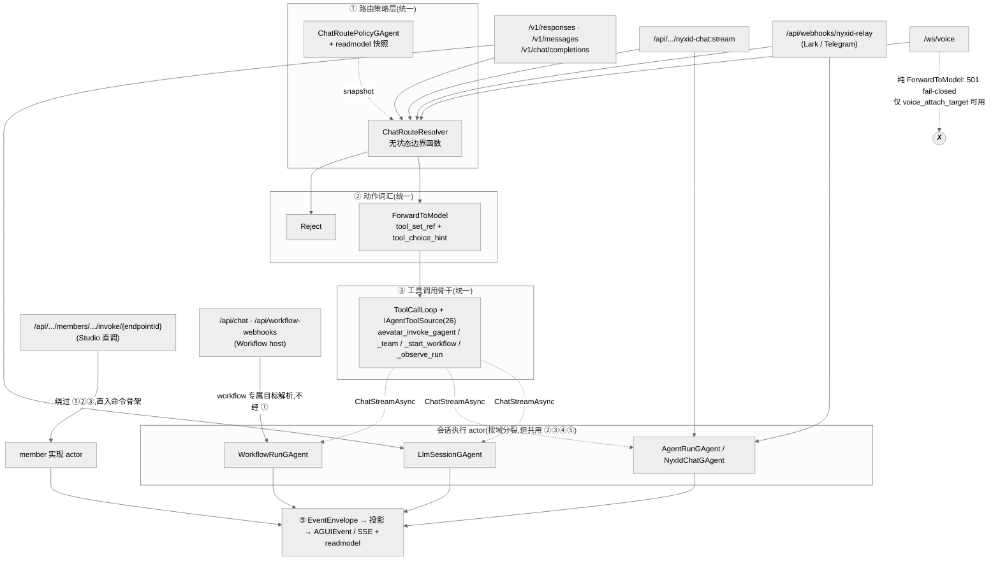

# 统一 Input 入口:从多个前门收敛到「策略 + 工具 + 命令骨架」一套主干

## 事实源/设计抽象(以 ~/Code/aevatar 为准)

> 本篇回答一个问题:aevatar 现在有多少个 **input 入口**(Studio、Voice、Lark bot、模型 API……),它们的处理逻辑统一了吗?在哪些层面统一、还差什么。下面是这条「入口收敛」主线的事实源脊柱(非正文骨架):

- `docs/adr/0024-chat-route-policy.md`:三段式路由 —— config actor(`ChatRoutePolicyGAgent`)+ 无状态边界 resolver(`ChatRouteResolver`)+ readmodel;入口不新增 router actor。
- `docs/adr/0026-tool-first-chat-ingress.md`:把 `ChatRouteAction` 收敛为 `ForwardToModel` + `Reject`,GAgent/team/workflow 目标改由 `aevatar_invoke_*` tool 表达,所有 chat 入口复用同一条 `ToolCallLoop`。
- `docs/adr/0013-unified-channel-inbound-backbone.md`:通道入站统一骨干 `transport adapter -> ChatActivity -> ConversationGAgent -> turn runner`。
- `docs/canon/chat-api.md`:Workflow chat 入口走 CQRS 标准命令骨架 `target resolve -> envelope -> dispatch port -> accepted receipt`,capability 只提供目标解析与映射。

---

「统一」在 aevatar 里不是「把所有入口塞进一个 actor」,而是**让每个入口只负责协议适配,然后汇入同一套机制**:同一个路由策略、同一套动作词汇、同一条工具调用骨干、同一个命令骨架、同一条投影/观察链。这一篇把所有入口先列全,再逐层回答「统一到什么程度」。

## 1. 全部 input 入口清单

按「面」分组。注意:很多东西看起来像入口,其实不是 —— Console-Web 只是 API 消费方,AGUI 是出站事件格式,A2A 已退役。真正的后端 input 入口是下面这些。

| 面 | 入口 | 协议 | 进入主干的方式 | 会话/执行 actor | 当前状态 |
|---|---|---|---|---|---|
| 模型 API | `/v1/responses`、`/v1/messages`、`/v1/chat/completions` | HTTP + SSE | resolver → `ForwardToModel(tool_set_ref)` → `ToolCallLoop` | `LlmSessionGAgent` | 现役;三个 facade 共用一个 session actor |
| 直聊 | `/api/scopes/{scopeId}/nyxid-chat/...:stream` | HTTP + SSE | resolver(在 create command target resolver 内)→ run actor | `NyxIdChatGAgent` / `AgentRunGAgent` | 现役 |
| 通道(Lark/Telegram bot) | `/api/webhooks/nyxid-relay` | HTTP(202)+ relay 回包 | `ChatActivity` → `ConversationGAgent`(入站 admission 时调 resolver)→ turn runner | `ConversationGAgent` + `AgentRunGAgent` | 现役;见 [01](01-channels.md)/[08](08-lark-end-to-end.md) |
| 语音 | `/ws/voice`(策略门)、`/ws/voice/{actorId}`(dev/admin 绕过) | WebSocket(PCM16 + 控制帧) | resolver → 必须解析出 `voice_attach_target`,否则 fail-closed | voice `RoleGAgent` + VoicePresence EventModule | 现役;纯 `ForwardToModel` 返回 501,见 [04](04-voice-presence.md)/[09](09-voice-presence-edge-brain.md) |
| Studio 调用 | `POST /api/scopes/{scopeId}/members/{memberId}/invoke/{endpointId}` | HTTP(+ `:stream`) | **故意不走 resolver/LLM**;`IServiceInvocationPort` → 命令骨架 | published service / member 实现 actor | 现役;system-to-system 直调面,见 [05](05-studio-and-scripting.md) |
| Workflow chat | `/api/chat`、`/api/ws/chat`、`/api/workflow-webhooks/{routeKey}`、`/api/workflows/resume`、`/api/workflows/signal` | HTTP/SSE/WS/JSON | workflow 专属目标解析(**不经 ChatRoutePolicy**)→ 命令骨架 | `WorkflowRunGAgent` + `WorkflowRoleGAgent` | 现役;另一扇 chat 前门,详见下文 §4 |
| 外部触发 | skill runner external trigger、device callback、OAuth callback、broker revocation | HTTP webhook | 各自 command service → `IActorDispatchPort` | 对应域 actor | 现役;start-run 语义,非 continuation |
| A2A | (历史)Host boundary 把 A2A task 映射成框架消息 | — | — | — | ⚠️ 源码已删/空壳;现在 agent→agent 走 `aevatar_invoke_*` tool,不是独立入口 |
| AGUI | `AGUIEvent` / 投影 session SSE | SSE 出站 | — | — | **不是 input**;是出站观察帧,所有入口的结果都「渲染成」它 |
| Console-Web | 前端 | — | 只消费上面的 API/SSE/readmodel | — | 不是后端入口,见 [06](06-console-web.md) |

## 2. 所有入口怎么汇流(一张图)

## 3. 已经统一的五个层面

### ③.1 路由策略层 —— 四条 chat 入口都调同一个 resolver

ADR-0024 把「谁能改策略」与「每次入口怎么判断」拆开:策略事实归 `ChatRoutePolicyGAgent`(event-sourced)拥有,入口只读投影快照、同步调用无状态的 `ChatRouteResolver`。**当前代码里,四条 chat 入口都已接上 resolver**:Responses(经 `ResponsesRouteResolver` 包装)、Voice(`PolicyAwareVoiceEndpoints`)、直聊(`NyxIdChatLifecycleFacade` 的 create command target resolver)、通道(`ConversationGAgent` 入站 admission)。这就是 ADR-0024 计划里「四个入口各加一次 resolver 调用」(Phase 3)的落地态。

**为什么不是 router actor?** 热路径上多一个 actor hop 只增加排队与失败面,却不增加事实所有权 —— 策略事实已被 policy actor 拥有,入口只需对一个已物化快照做确定性解析。把 resolver 留成库函数,Channel/Responses/Voice 各自在自己的边界内零往返完成判断,也不会出现「policy actor 一份、router actor 又缓存一份」的双事实源。

### ③.2 动作词汇 —— 收敛成 `ForwardToModel` + `Reject`,其余走 tool

ADR-0026 是这条收敛主线的核心决策:`ChatRouteAction` 的 live 变体只剩 `ForwardToModel` 与 `Reject`;旧的 `ForwardToGAgent` / `ForwardToTeam` / `ForwardToWorkflow` / `Bypass` 只保留 proto tag 占位、不再被任何写侧 emit。GAgent / team / workflow 这些目标不再是「第二套路由方言」,而是统一表达为 `ForwardToModel.tool_set_ref + tool_choice_hint` —— 由模型在 `ToolCallLoop` 里选择 `aevatar_invoke_gagent(actor_id, payload)` 之类的 tool 来触发。

**为什么把转发动作折叠成工具?** 因为 tool-calling backbone 早就存在且承重:与其让 routing 维护一套「forward 到某 actor」的并行分发链,不如让它进入既有的「LLM 决定调哪个 tool → dispatcher 执行 → 结果回流」主链。少一套方言,`/v1/messages` 这种以前因为托不动并行方言而返回 501 的入口,也能托同一套编排。

当前 live 的 ChatRouteAction(<code>src/Aevatar.ChatRouting.Abstractions/chat_route_policy.proto</code>)

- `ForwardToModel` —— 携带 `tool_set_ref`(注入哪一组 tool)、`tool_choice_hint`(钉某个 tool + 预填参数;其 `voice_attach_target` 子消息是 `/ws/voice` 唯一的 attach 目标)。
- `Reject` —— 治理边界直接拒绝。
- `ForwardToGAgent / ForwardToTeam / ForwardToWorkflow / Bypass` —— reserved,不得复用为字段。

### ③.3 工具调用骨干 —— `ToolCallLoop` + `IAgentToolSource`

这是真正让「不同入口背后跑的是同一台引擎」的那一层。`ToolCallLoop`(`src/Aevatar.AI.Core/Tools/ToolCallLoop.cs`)是统一的「LLM → tool_call → 执行 → 结果回灌 history」循环;`IAgentToolSource` 有约 26 个实现(NyxID、MCP、Lark、Telegram、ChronoStorage、Scripting、Skills、Workflow…),由 `ToolSetRegistry` 按 `tool_set_ref` 装配。ADR-0026 新增的四个编排 tool(`aevatar_invoke_gagent` / `_invoke_team` / `_start_workflow` / `_observe_run`)都已实现。

关键事实:**文本类入口的会话 actor 各不相同,但都复用这一条 loop**。Responses 走 `LlmSessionGAgent`;通道走 `ConversationReplyGenerator`(内部 `new ToolCallLoop(...)` + `runtime.ChatStreamAsync(...)`);直聊走 `AgentRunGAgent`;Workflow 的 `llm_call` 走 `WorkflowRoleGAgent`。它们共享 `RoleGAgent.ChatStreamAsync` 这条流式 + tool + hook 的执行通道。`LlmSessionGAgent` 正是 ADR-0026 当年记为「尚未实现」的 `ChatRunActor` 会话拥有者的现役落地形态(iter75 起复用于 forwarded Responses)。

### ③.4 命令骨架 —— `Normalize → Resolve Target → Envelope → Dispatch → Receipt → Observe`

不只是 chat,**所有**入口(含 Studio 直调、Workflow chat、通道、外部 webhook)进入应用层后都走同一条 CQRS 命令骨架:外部 JSON 在 Host/Adapter 边界规范化成 typed 命令模型 → 解析目标 actor → 包成 `EventEnvelope` → 经 `IActorDispatchPort` 投递 → 返回 `accepted` receipt → 通过投影异步观察。Host endpoint 只做 routing 与 bound stream,不在 endpoint 里编排业务、不直接 `new` actor、不同步等跨 actor 回复。

**为什么 ACK 只承诺 accepted?** `command.ack` / `202` 只表示「系统接受了该次交互并返回追踪句柄」,不等于领域事件已提交或 readmodel 已可见。强保证留给独立契约或异步观察 —— 这让通道入口能立即 202 返回、LLM 回复走事件驱动(`NeedsLlmReplyEvent` / `LlmReplyReadyEvent`),不在 HTTP 线程里阻塞等模型。

### ③.5 投影/观察链 —— 单一出站帧格式

写侧 committed event 以 `EventEnvelope` 进入同一条投影主链,物化成 readmodel 并实时推 SSE;对外统一渲染成 `AGUIEvent` / `WorkflowRunEventEnvelope`。AGUI 因此**不是 input**,而是所有入口共享的出站观察面。这呼应顶层约束「CQRS 与 AGUI 走同一套 Projection Pipeline,禁止双轨」。

## 4. 还没统一的地方 + 彻底统一还要做什么

先厘清一个容易误判的点:**「彻底统一」不等于「一个 actor 吃下所有入口」**。ADR-0026 D5 明确要求 `ChatRunActor`(`LlmSessionGAgent`)、通道 run actor、voice `RoleGAgent` 「保持各自权威 actor,不得为实现便利而合并」。所以统一的目标是**机制级**(同 resolver + 同 tool loop + 同命令骨架 + 同投影),不是 actor 级。按这个标准,还差的是下面几处。

### 缺口 1(最大):语音的工具执行没并入 `ToolCallLoop`

语音目前是「路由统一、工具未统一」:`/ws/voice` 调了 resolver,实时帧也走共享投影,但 **tool 执行是 provider 原生 function-calling**(OpenAI Realtime / MiniCPM 自己发 `FunctionCall`,由 `VoicePresenceModule` 经 `IVoiceToolInvoker` 同步执行),不是共享的 `ToolCallLoop` + `IAgentToolSource` 发现模型;语音的可用 tool 还是一份独立 allowlist(`nyxid_proxy` 等 NyxID service-operation tool),而非按 caller scope 装配的 tool set。同时 `/ws/voice` 对**纯 `ForwardToModel`(无 `voice_attach_target`)仍 fail-closed 返回 501**。

→ **要做的**:落 ADR-0026 Stage 5 的 `VoiceSessionActor` —— 在 session 建立时跑一次 `ChatRouteResolver`,把解析出的 tool set 声明给 realtime provider,再让 provider 的 function call 回灌同一条 `ToolCallLoop`。前置依赖是 `VoicePresence.OpenAI` 完成 beta→GA 的 `session.update` 形状迁移。完成后语音才能从「只支持 typed attach」升级到「与文本入口同形的 model-forward + tool_set 执行」。

### 缺口 2:Workflow chat 是另一扇没经过 ChatRoutePolicy 的 chat 前门

Workflow host 的 `/api/chat` 与 Mainnet 共享同一套命令骨架与 `IActorDispatchPort`,但它做的是 **workflow 专属目标解析**(`workflow` 名称 / inline YAML bundle / `auto` 默认),**不经过 `ChatRoutePolicy` 这一层**。于是「chat 入口」其实有两类:模型-chat(经 ChatRoutePolicy + tool-first)与 workflow-chat(经 workflow 目标解析)。

→ **要做的**:这部分**部分是有意的**(workflow 是一种 capability 目标解析,且 `aevatar_start_workflow` tool 已存在,可在 tool-first 链里触发 workflow)。彻底收敛的方向是让「触发 workflow」尽量走 `ForwardToModel + aevatar_start_workflow`,把 workflow host 的专属 chat 端点收窄为「不需要 LLM 中介的直调面」(与 Studio invoke 同性质),而不是第二套 chat 路由。是否要走这一步需要维护者决策,不应默认。

### 缺口 3:Studio 直调与外部 webhook —— 有意绕过,不算 gap

`members/.../invoke/{endpointId}` 故意不走 resolver/LLM,是给「明确不想要 LLM 中介」的 system-to-system 调用留的直调面(ADR-0026 Boundaries 明确保留);外部 webhook 是 start-run 语义。两者都已在共享命令骨架上,属于**有意的非统一**,不需要强行并入 chat 主链。

### 缺口 4:A2A 若回归,应骑 tool-first 而非另起适配链

A2A 源码已删/空壳。如果未来恢复 agent→agent 协议,正确做法是复用 `aevatar_invoke_gagent` / `_invoke_team` 这条已统一的 tool 入口,而不是再长出一条并行 ingress adapter(否则又回到 ADR-0026 要消灭的「双轨」)。

### 统一矩阵(各入口 × 各层面)

| 入口 | ① resolver | ② tool-first 动作 | ③ ToolCallLoop | ④ 命令骨架 | ⑤ 投影/SSE |
|---|:--:|:--:|:--:|:--:|:--:|
| 模型 API(responses/messages/completions) | ✅ | ✅ | ✅ | ✅ | ✅ |
| 直聊(nyxid-chat) | ✅ | ✅ | ✅ | ✅ | ✅ |
| 通道(Lark/Telegram) | ✅ | ✅ | ✅ | ✅ | ✅ |
| 语音(/ws/voice) | ✅ | ⚠️ 仅 attach;纯 forward 501 | ❌ provider 原生 | ✅ | ✅ |
| Studio 直调 | ➖ 有意绕过 | ➖ | ➖ | ✅ | ✅ |
| Workflow chat | ❌ 走 workflow 目标解析 | ⚠️ 经 `aevatar_start_workflow` 可达 | ✅(llm_call) | ✅ | ✅ |

✅=已统一　⚠️=部分/受限　❌=未统一　➖=有意不适用

## 5. 验收

1. aevatar 现在有哪些 input 入口?模型 API(`/v1/responses`·`/v1/messages`·`/v1/chat/completions`)、直聊(`nyxid-chat`)、通道(Lark/Telegram 经 `nyxid-relay`)、语音(`/ws/voice`)、Studio 直调(`members/.../invoke`)、Workflow chat(`/api/chat` 等)、外部 webhook;A2A 已退役,AGUI/Console 不是后端入口。
2. 处理逻辑统一了吗?在哪些层面?**机制级已基本统一**:① 路由策略(四条 chat 入口共用 `ChatRouteResolver`)、② 动作词汇(`ForwardToModel`+`Reject`,其余走 tool)、③ 工具调用骨干(`ToolCallLoop`+`IAgentToolSource`)、④ CQRS 命令骨架、⑤ 投影/观察链 —— 五层都已收敛;会话执行 actor 按域分裂是**有意设计**,不是分裂残留。
3. 彻底统一还要做什么?主要是**语音**:落 `VoiceSessionActor`,把语音 tool 执行从 provider 原生 function-calling 并入 `ToolCallLoop`,解除 `/ws/voice` 对纯 `ForwardToModel` 的 fail-closed(前置:`VoicePresence.OpenAI` GA 迁移)。其次是决定 **Workflow chat** 是否收窄为直调面、让触发尽量走 `aevatar_start_workflow`;A2A 若回归须骑 tool-first。

⟦AI:AUTO-LOOP⟧
