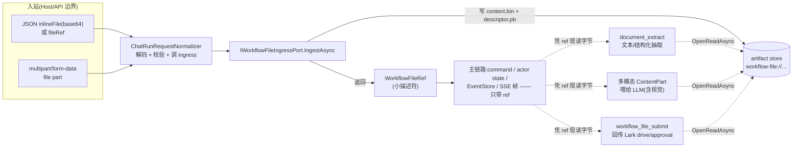
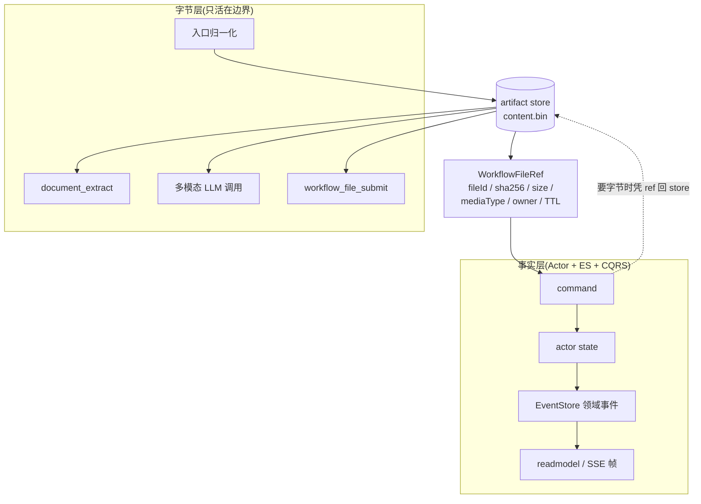
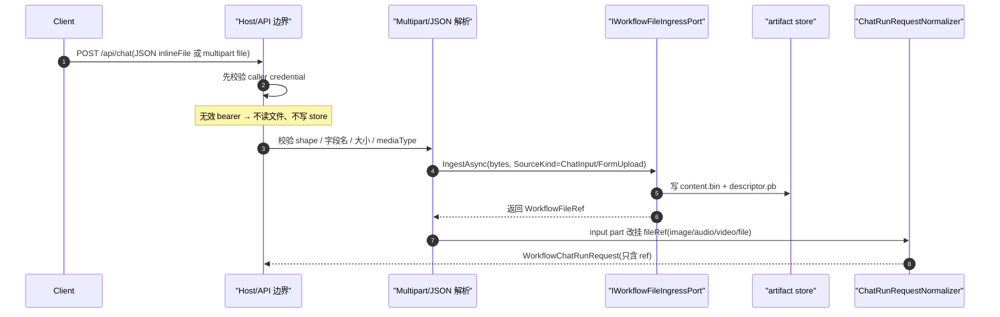
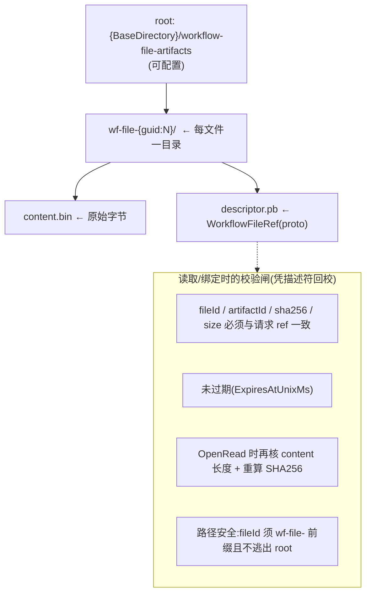
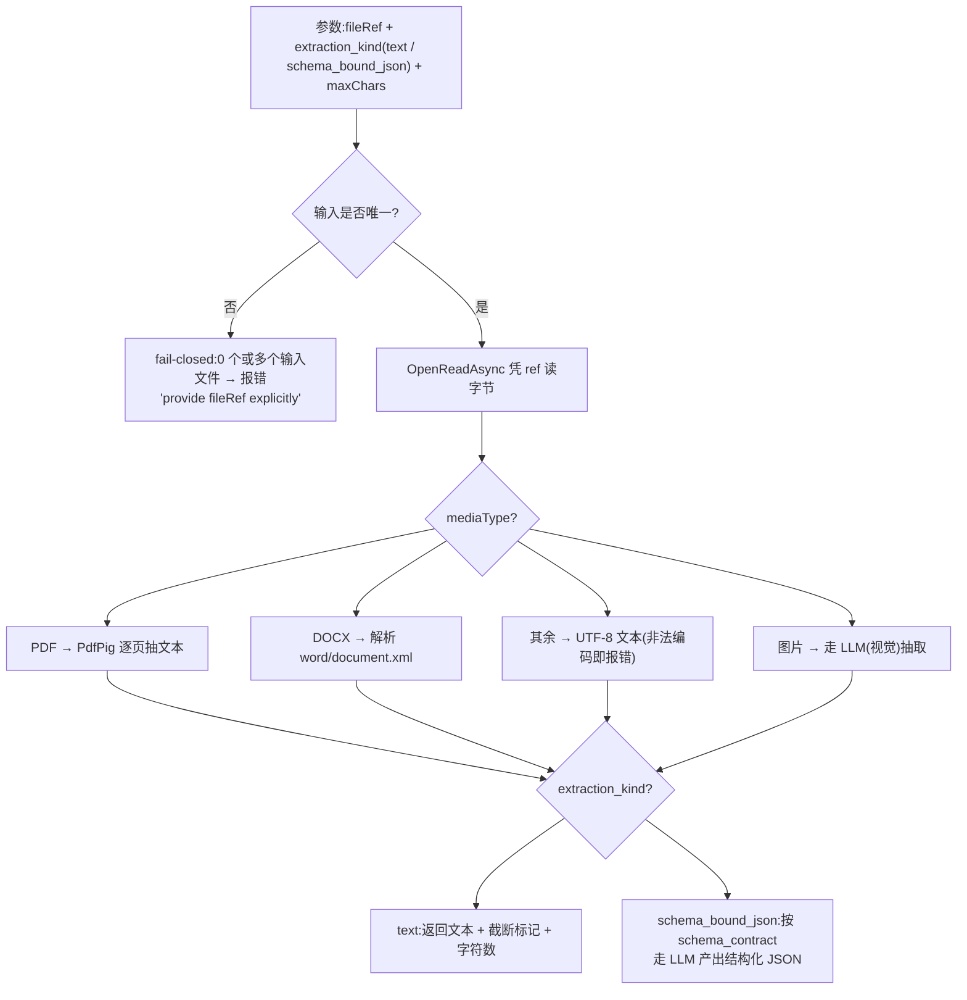
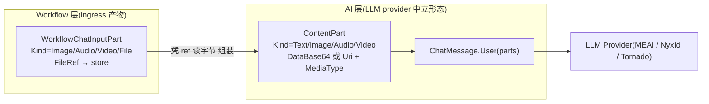
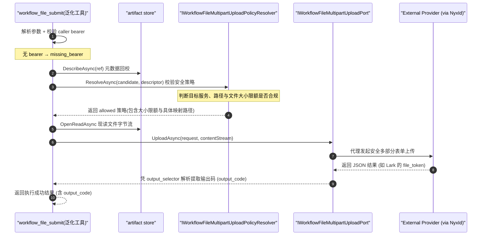

# 文件全链路:一个文件怎么进 aevatar、被处理、再出去——以及为什么字节从不进 actor

## 事实源/设计抽象(以 ~/Code/aevatar 为准)

> 本篇沿"一个文件从进来到处理到出去"走完每一跳,落点是一条**以 Workflow 为中心的文件工件链路**。下面是这条链路的**事实源脊柱**(非正文骨架),按"入站归一化 / 引用模型 / 存储实现 / 抽取处理 / 多模态 / 回传"六段给高价值锚点,正文用设计语言 + 图 + 边界论证展开,不逐行堆行号:

- **入站(两个 producer)**:`docs/canon/chat-api.md`(JSON `inlineFile`/`fileRef` 与 `multipart/form-data` 两条 producer,以及"actor-facing 不得携带 bytes"的契约原文)、`src/workflow/Aevatar.Workflow.Infrastructure/CapabilityApi/ChatRunRequestNormalizer.cs`(`inlineFile`/`fileRef` 互斥、base64 解码与长度校验、调用 ingress)。
- **引用模型(主链路里流动的东西)**:`src/workflow/Aevatar.Workflow.Application.Abstractions/Runs/WorkflowChatRunModels.cs`(`WorkflowFileRef` / `WorkflowFileSourceKind` / `WorkflowChatInputPart` / `WorkflowChatRunStartError.InvalidFileInput`)、proto `src/workflow/Aevatar.Workflow.Abstractions/workflow_execution_messages.proto`(`WorkflowFileRef` 持久形态)。
- **ingress port + 存储实现**:`.../Runs/WorkflowFileIngressPort.cs`(`IWorkflowFileIngressPort` + 三个伴生 port:read / ownership / cleanup)、`src/workflow/Aevatar.Workflow.Infrastructure/Runs/FileSystemWorkflowFileIngressPort.cs`(文件系统实现:每文件一目录 + SHA256 + TTL + owner 绑定 + 路径安全)、`.../Runs/WorkflowFileArtifactCleanupHostedService.cs`(后台周期清理)。
- **抽取处理**:`.../Runs/WorkflowDocumentExtractToolSource.cs`(`document_extract` 工具:text / schema_bound_json 两种 kind,PDF/DOCX/文本走本地解析,图片走 LLM)。
- **多模态(AI 层)**:`src/Aevatar.AI.Abstractions/LLMProviders/LLMRequest.cs`(`ContentPart` / `ContentPartKind`)、`src/Aevatar.AI.Abstractions/ContentPartProtoMapper.cs`。
- **回传(port/adapter 分层)**:`.../Runs/WorkflowFileSubmitToolSource.cs`(`workflow_file_submit` 工具,泛化 + `IWorkflowFileMultipartUploadPort` 接口实现)、`src/Aevatar.AI.ToolProviders.NyxId/NyxIdWorkflowFileMultipartUploadPort.cs`(NyxID 代理上传，支持 Lark 附件等场景)。

> 本篇是 [08 Lark 全链路](08-lark-end-to-end.md) / [12 定时任务](12-scheduled-tasks.md) 的姊妹篇:那两篇讲"消息/定时怎么把活儿叫起来",本篇讲"一个文件怎么穿过这套 Actor + ES + CQRS 而不把字节灌进事实层"。运行报告类"artifact"是另一回事,见第 7 节消歧与 [05/04 Workflow 投影](../05/04-workflow-projection.md)。

---

## 0. 一句话主线

> **文件在 aevatar 里走的是"字节外置、引用入链"的路线**:入口一拿到文件就把它**落进 artifact store**,换回一个强类型的小描述符 `WorkflowFileRef`;此后命令、actor 状态、事件日志、SSE 帧里**只流动这个 ref**。真正需要字节的三处——`document_extract` 抽取、喂给 LLM 的多模态、`workflow_file_submit` 回传——都在**适配边界**凭 ref 现去 store 流式读出。字节从不进 actor。



实线是"描述符流",贯穿主链路;虚线是"字节流",只在三个适配边界出现,且都指回 store。这条分裂正是全篇要论证的设计。

---

## 1. 核心边界:为什么字节不进 actor,只有 `WorkflowFileRef` 入链 ★

aevatar 的运行内核是 **Actor + Event Sourcing + CQRS**(见 [03 运行内核](../03/index.md)、[05 CQRS 与读侧](../05/index.md)):actor 状态要可持久化、事件日志要可重放、投影要可消费。这三件事都有一个隐含前提——**事实层必须小且可审计**。一张 5MB 的发票如果以 base64 进了 `ChatRequestEvent`,就会:被写进 EventStore 永久留存、在每次重放时反序列化、随 SSE 帧推给前端、落进 readmodel。文件字节会把"事件日志"撑成"对象存储",违背 ES 的根本假设。

所以 aevatar 把文件**从一开始就劈成两层**:



这条边界不是本篇的推断,而是 canon 的明文契约。`docs/canon/chat-api.md` 写死:

> actor-facing command、state、readmodel、stream frame 与日志都不得携带上传文件 bytes/base64;它们只携带 `WorkflowFileRef` 或由它派生出的 URI/metadata。

**为什么是 ref 而不是 URL?** 因为 ref 是**自描述 + 可校验**的:它带 `sha256`、`sizeBytes`、`mediaType`、`ownerRunId/ownerScopeId`、`expiresAtUnixMs`。任何下游(抽取/回传)拿到 ref 去 store 读时,store 会拿描述符**回校**内容长度与哈希(见第 3 节),一处都对不上就拒绝。URL 给不了这种端到端完整性与归属保证。

> 这正是 aevatar 区别于"普通 Agent 框架"的取舍:别的框架可能直接把图片塞进 prompt 历史;aevatar 因为要把"一次运行"做成可重放、可投影的事实流,**必须**把大字节挡在事实层之外。文件处理在这里不是附加功能,而是 ES/CQRS 论题的一个推论。

---

## 2. 入站:两个 producer,一个归一化出口

Host/API 边界提供**两条** producer,但它们**汇到同一个** `WorkflowChatRunRequest`,再进同一条 CQRS command skeleton。Host 不因为"有文件上传"另起一套执行链路。

| Producer | 文件怎么带 | 典型场景 |
|---|---|---|
| **JSON `ChatInput`** | `inputParts[].inlineFile`(base64 内联)或 `inputParts[].fileRef`(已存在引用) | 程序化调用、已上传过的文件复用 |
| **`multipart/form-data`** | `file` part(可重复),配可选 `payload` JSON | 浏览器/表单直接传文件 |

两条 producer 的关键约束都指向同一件事——**把"裸字节"尽早收口成 ref**:

- JSON 路径:`inlineFile` 与 `fileRef` **互斥**,同时给即 `InvalidFileInput`;`inlineFile` 会被解码、校验 base64 合法性、并在声明了 `sizeBytes` 时**逐字节核对**长度。
- multipart 路径:`payload` JSON **禁止**再带 `inlineFile`/`fileRef`/`dataBase64`(否则就有两个真相);文件只能走 `file` part。默认 `MaxFileBytes=10MB`,媒体类型白名单覆盖常见图片/音视频/PDF/Office/文本。



**为什么入口就归一化,而不是把 base64 透传进 actor 再说?** 三个理由层层递进:(1) **凭证前置**——Host 先验 caller credential,无效 bearer 连文件都不读、store 都不写,把"未授权却已落盘"的窗口关死;(2) **单一真相**——把 multipart 的 `file` 与 JSON 的 `inlineFile` 在边界统一成 `WorkflowFileRef`,后续 command skeleton 完全不区分 producer,投影/重放逻辑只有一种输入形态;(3) **媒体语义归类**——`image/*`→`image`、`audio/*`→`audio`、`video/*`→`video`、其余受支持类型→`file`,这一步决定了它后面是走多模态(第 5 节)还是走 `document_extract`(第 4 节)。

`WorkflowChatInputPartKind` 因此有 `Text/Image/Audio/Video/File` 五种;`WorkflowFileSourceKind` 则记录这个文件**从哪来**:`ChatInput`(用户消息)、`FormUpload`(表单)、`ConnectedServiceResource`/`ExternalResource`(外部资源引用)、`Generated`(工具产出)。来源在后面的归属与回传策略里都会用到。

<details><summary><code>WorkflowFileRef</code> 的形态(主链路里流动的就是它)</summary>

```csharp
public sealed record WorkflowFileRef
{
    public string? FileId { get; init; }       // wf-file-{guid:N}
    public string? ArtifactId { get; init; }    // workflow-file://wf-file-…
    public WorkflowFileSourceKind SourceKind { get; init; }
    public string? FileName { get; init; }
    public string? MediaType { get; init; }
    public long SizeBytes { get; init; }
    public string? Sha256 { get; init; }
    public long CreatedAtUnixMs { get; init; }
    public long ExpiresAtUnixMs { get; init; } // TTL,见第 3 节
    public string? OwnerRunId { get; init; }    // 归属,见第 3 节
    public string? OwnerScopeId { get; init; }
}
```
有对应 proto(`workflow_execution_messages.proto` 的 `WorkflowFileRef`),所以它能跟着事件一起持久化——但它只有几十字节的元数据,不含字节本体。
</details>

---

## 3. 存储:`workflow-file://` 工件 store 与它的不变量

默认实现 `FileSystemWorkflowFileIngressPort` 把每个文件落成**一个目录两个文件**:



这个实现同时挑起**四个 port** 的职责(它们是分开的接口,可被换实现替换):

| Port | 职责 | 关键不变量 |
|---|---|---|
| `IWorkflowFileIngressPort` | 写入(`IngestAsync`) | 空内容直接拒;算 SHA256;按配置 TTL(默认 1 天)定 `ExpiresAt` |
| `IWorkflowFileArtifactReadPort` | 描述 / 打开读 | 读前回校 ref 一致性 + 未过期;`OpenRead` 再核长度与哈希 |
| `IWorkflowFileArtifactOwnershipPort` | 绑定 owner | 可补绑 run/scope,但**不能改绑**到另一个 owner |
| `IWorkflowFileArtifactCleanupPort` | 清理 | 删过期工件 + 删"只有目录没 descriptor"的残件 |

**为什么是 port 抽象 + 文件系统默认实现?** 因为存储是**最该被替换**的一层:本地开发用文件系统零依赖即可跑;生产换对象存储只要另写一个实现满足这四个 port,主链路一行不动。把"怎么存"藏在 port 后面,是 aevatar 一贯的"边界优先"做法(同 [03/05 路由拓扑](../03/05-routing-and-topology.md)、[05/03 ReadModel providers](../05/03-readmodel-providers.md))。

**为什么读取要这么多道校验?** 因为 ref 会跟着事件被持久化、被重放、甚至被不同 actor 传递,而字节单独躺在 store 里——两者可能**漂移**(文件被删、被换、过期)。读取端凭描述符回校长度与哈希,等于在"事实层的 ref"和"字节层的内容"之间架了一道**端到端完整性闸**:对不上就 fail,绝不把可疑字节喂给 LLM 或回传出去。

**清理不是口头 TODO,是真有后台 sweeper。** `WorkflowFileArtifactCleanupHostedService` 是一个 `IHostedService`:启动时若 `CleanupEnabled` 则按 `CleanupOnStart` 先扫一遍,之后用 `PeriodicTimer` 按 `CleanupInterval` 周期调 `CleanupAsync`,删掉过期与残件并记日志。也就是说 TTL 不只是读取时挡一下,过期工件会被真正回收。

!!! warning "诚实标注:当前实现的边界"
    - 默认 store 是**单机文件系统**;**没有** S3/MinIO/对象存储实现,也**没有**内容加密层。多节点部署需要自带共享存储或新实现(port 已经给好了挂点)。
    - 工件是**单版本**模型(一个 fileId 一份内容),无版本化/分支。

---

## 4. 处理之一:`document_extract`——把文件变成文本/结构化 JSON

`document_extract` 是一个 Workflow 工具(`tool_call` 可调),职责是:**凭 ref 从 store 读出字节,产出文本或受 schema 约束的 JSON**。它自己不持有字节,而是通过 `IWorkflowFileArtifactReadPort.OpenReadAsync` 现读——又一次印证"字节只在边界出现"。



几个有意为之的设计点:

- **两种 kind**:`text`(纯抽取)与 `schema_bound_json`(给定 `schema_contract`,产出结构化 JSON)。后者本质是"抽取 + 约束生成",所以需要配置好的 LLM provider。
- **本地解析 vs LLM 解析分流**:PDF/DOCX/纯文本走**本地库**(PDF 用 `UglyToad.PdfPig`、DOCX 解 XML),零 LLM 成本;**图片**才走 LLM(因为没有独立 OCR 引擎,见下)。`schema_bound_json` 无论源格式都要过一次 LLM。
- **有界 + fail-closed**:文本默认上限 `20_000` 字符、硬上限 `100_000`,超出截断并标 `truncated`;图片字节上限 `5MB`。输入**必须唯一**——给了 0 个或多个候选文件时**不猜**,直接要求显式 `fileRef`。

**为什么 fail-closed、为什么有界?** 这是工具喂给 LLM 的入口,既要防"猜错文件",也要防"把一个超大 PDF 整篇灌进上下文"撑爆 token / 成本。宁可报一个清晰的错(`unsupported_media_type` / `image_too_large` / `invalid_text_encoding` / `artifact_unavailable` / `schema_bound_extraction_failed`)让上游决策,也不静默截断或静默选错文件——这与 [04/03 工具体系](../04/03-tool-providers.md) 的"工具边界要硬"一脉相承。

**为什么没有独立 OCR 服务?** aevatar 不集成 Tesseract / 云 Vision API 这类专用 OCR。"看图"统一交给**多模态 LLM**:要么走 `document_extract` 的图片分支,要么走第 5 节的 vision role。少一个外部依赖、少一套凭证与运维面,代价是 OCR 质量取决于所选模型——这是显式取舍,不是遗漏。

---

## 5. 处理之二:多模态 `ContentPart`——文件怎么"变成"喂给 LLM 的内容

第 4 节是"文件→文本"的一条路;另一条路是文件**直接作为多模态内容**进 LLM。这里要跨一个层边界:Workflow 层的 `WorkflowChatInputPart`/`WorkflowFileRef` 不是 LLM provider 认识的形态,**AI 层**有它自己的中立抽象 `ContentPart`(见 [04/02 LLM providers](../04/02-llm-providers.md))。



`ContentPart` 的设计很克制:`Kind` 是 `Text/Image/Audio/Video`;媒体既可以 `DataBase64`(内联 base64,不带 data-uri 前缀)也可以 `Uri`(远程或 data-uri),配 `MediaType` 与可选 `Name`;并提供 `ImagePart/ImageUriPart/AudioPart/VideoPart…` 等工厂。它经 `ContentPartProtoMapper` 在 proto 之间双向映射。

**为什么 AI 层要另起一个 `ContentPart`,而不复用 `WorkflowChatInputPart`?** 这是分层职责的边界问题:

- `WorkflowChatInputPart` 是**编排层入站事实**——它携带 `FileRef`(指向 store),服务于"一次 workflow run 的输入"。
- `ContentPart` 是**AI 层与 provider 的契约**——它要适配各家 LLM 的多模态格式(inline base64 vs URI),不关心 artifact store、不关心 owner/TTL。
- 两者之间隔着"凭 ref 读字节并组装"的一步,正好落在前面反复出现的**适配边界**上:字节在这里从 store 读出、变成 provider 能吃的 `DataBase64`/`Uri`,而不会回灌进 Workflow 的 actor 状态。

这就是 `invoice_ocr_approval` 那个 vision role 的底层机制:角色不指定 provider/model(跟随会话默认路由),用户消息里的发票图片作为多模态内容进 LLM,模型直接"读图"产出 JSON 字段——**没有**单独的 OCR 步骤。

---

## 6. 出站:`workflow_file_submit`——把工件回传给外部服务

回传走 `workflow_file_submit` 工具，其设计采用 **泛化工具 (WorkflowFileSubmitTool) + 策略解析器 (Resolver) + 统一多部分表单端口 (MultipartUploadPort)** 的三层架构，以实现高扩展性的安全流式出站：

- `WorkflowFileSubmitTool`(由 `WorkflowFileSubmitToolSource` 注册)是**与外部 API 无关**的通用工具壳：解析参数、校验 caller token、描述元数据回校，并触发流式读取。
- `IWorkflowFileMultipartUploadPolicyResolver` (实现如 `MainnetWorkflowFileMultipartUploadSafetyPolicyResolver`)解析并返回目标服务的安全控制策略，判断该请求的目标 URL (服务 slug、相对 path)和文件大小等是否在允许范围内。
- `IWorkflowFileMultipartUploadPort` (实现如 `NyxIdWorkflowFileMultipartUploadPort`)定义真正的数据传输机制。生产态通过 NyxID API 代理发起真正的多部分表单 (`multipart/form-data`) 上传请求。



上传至外部服务（如 Lark Drive 或 审批附件）时，底层直接代理给 NyxID 网关实现，支持的目标配置和约束如下：

| 目标 (Service Slug) | 用途 | 输出码提取目标 (Selector) | 大小限额 (MaxFileBytes) |
|---|---|---|---|
| `lark_drive_media` | 传到 Lark Drive (供文档/多维表格引用) | `data.file_token` 或 `file_token` | 20 MB |
| `lark_approval_file` | 审批附件 | `file_code` | 图片 10 MB / 其他 30 MB |

文件名上限 250 字符。

**为什么是 Port + Policy 架构，而不是直接针对具体服务编写上传 Adapter？**
因为“将工件以 multipart 表单上传给外部”是**通用的 HTTP 传输动作**，而“由谁代理、上传到哪个服务、允许什么大小”是**宿主安全策略与具体网关逻辑**。
通过将通用流程（校验凭证、回校 ref、流式读字节）留在泛化壳，将安全策略限制归于 `PolicyResolver`，将通信细节关入 `MultipartUploadPort`，系统完美实现了职责分离：
本地测试可以注入空/模拟的 resolver，而生产态只需通过配置注册相应的 upload path 安全策略。同样，文件字节也是在 `OpenReadAsync` 处直接流式流向外部，中间**绝不**灌入 Actor 的状态中。

> 顺带厘清一个易错点:`invoice_ocr_approval.yaml` 虽然叫 "OCR approval",但它**不**用 `workflow_file_submit` 传附件——它经 `nyxid_proxy` 提交审批表单,并在契约允许时**省略**附件 widget(见该 YAML 顶部 TODO 注释)。所以它是第 5 节"入站视觉"的例子,不是本节"出站回传"的例子。

---

## 7. 术语消歧:aevatar 里的 "artifact" 有两义

"artifact" 在这套代码里指两类**完全不同**的东西,极易混淆:

| 维度 | 用户文件工件(**本篇**) | 运行报告/图工件 |
|---|---|---|
| 是什么 | 用户传入或工具产出的**文件字节** | 一次 run 的**洞察/报告/时间线/图**,由投影派生 |
| 标识 | `workflow-file://wf-file-…`(`ArtifactId`) | run 维度的 readmodel/document |
| 谁写 | `IWorkflowFileIngressPort` 写进 store | Projector 从领域事件**派生** |
| 谁读 | `document_extract` / `workflow_file_submit` / 多模态组装 | `workflow_artifact_query` 等查询面 |
| 落点章节 | 本篇(07/11) | [05/04 Workflow 投影](../05/04-workflow-projection.md) |

一句话:**本篇的 artifact 是"文件"(字节 + 描述符),05/04 的 artifact 是"对运行过程的派生记录"**。两者都叫 artifact,但既不共用存储,也不共用生命周期。

---

## 8. 边界与诚实标注

**当前实现 vs 目标态**(按代码事实):

| 面 | 当前实现 | 说明 |
|---|---|---|
| 存储后端 | 单机文件系统(`FileSystemWorkflowFileIngressPort`) | port 已抽象,换对象存储只需另写实现;**当前无** S3/MinIO/加密 |
| 过期回收 | 后台 `WorkflowFileArtifactCleanupHostedService` 周期清理 + 读取时挡过期 | 受 `CleanupEnabled/CleanupInterval` 控制 |
| 完整性 | 入库算 SHA256、读取回校长度 + 重算哈希 | 端到端完整性闸 |
| 归属 | `OwnerRunId/OwnerScopeId` 绑定,不可改绑 | 防跨 run/scope 误用 |
| OCR/视觉 | 统一交多模态 LLM(`document_extract` 图片分支 / vision role) | **无**独立 OCR 引擎(Tesseract/云 Vision) |
| 版本化 | 单版本(一个 fileId 一份内容) | 无版本/分支 |

**明确"没有"的东西**(避免脑补):无对象存储/CDN、无内容加密、无专用 OCR 服务、无文件版本化。这些不是 bug,是当前阶段的取舍;真要上生产多节点,优先补的是"共享存储实现"这一个 port。

---

## 小结与最小 demo

把全篇压成一句:**文件在 aevatar 里"字节外置、引用入链";`WorkflowFileRef` 是唯一穿过 Actor + ES + CQRS 的东西,字节只在入口归一化、`document_extract`、多模态组装、`workflow_file_submit` 四个边界出现,且都回指同一个 artifact store。**

最小入站示例(JSON `inlineFile`,base64 截断示意):

```json
{
  "prompt": "extract the invoice fields",
  "workflow": "invoice_ocr_approval",
  "inputParts": [
    { "kind": "image",
      "inlineFile": { "dataBase64": "<...>", "mediaType": "image/png", "sizeBytes": 20480 } }
  ]
}
```

或 `multipart/form-data`:一个 `file` part(`image/png`)+ 可选 `payload` JSON(其中**不得**再带 `inlineFile/fileRef/dataBase64`)。两条 producer 经归一化后进入同一条 `WorkflowChatRunRequest` 主链路。

随后在 workflow 里:`document_extract`(若要把 PDF/DOCX 转文本或抽结构化 JSON)→ 业务步骤 → `workflow_file_submit`(若要把结果文件回传 Lark)。整条链路中,`inputParts[].inlineFile` 的字节在入口就换成了 `fileRef`,此后再没进过 actor。
