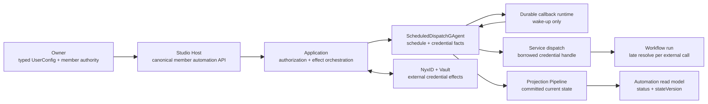
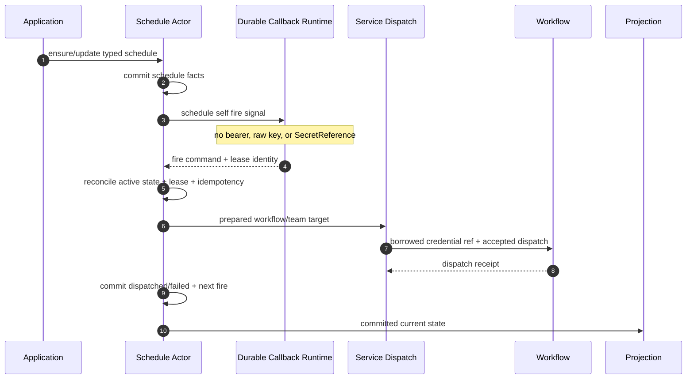
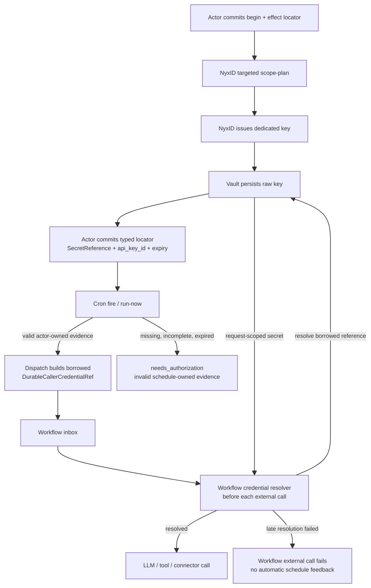

# 定时任务全链路:ScheduledDispatchGAgent、Team Member Automation 与 Agent Key

## 事实源/设计抽象(以 ~/Code/aevatar 为准)

> 本篇以当前实现为主,回答“定时配置由谁持有、到点后如何可靠触发、无人值守凭证如何存取、客户端怎样判断真正完成”。事实源集中在三个稳定边界:

- `docs/canon/scheduled-skill-runners.md`:当前 Team Member Automation API、schedule/credential actor ownership、投影状态与已退役 runtime。
- `docs/canon/workflow-runtime.md`:durable callback、typed target、幂等 fire、credential requirement 与 query/readmodel 边界。
- `docs/adr/0041-scheduled-invocation-agent-key-credential-reference.md`、`docs/adr/0043-scheduled-credential-lifecycle-compensation.md`:Agent Key typed reference、Vault 与双轨补偿。

> 本篇是 [01 Channel](01-channels.md) / [08 Lark 全链路](08-lark-end-to-end.md) 的姊妹篇:那两篇讲“一条消息怎么进来又回去”,本篇讲“没有人发消息时,谁保存下一拍、谁拥有凭证事实、到点后怎样进入同一执行主链”。生产验证见 [Studio Team Member Automation 使用 Agent Key](../09/03-provision-and-observe-via-nyxid/02-scheduled-agent-key-production-canary.md)。

---

## 0. 当前主线

> **当前 canonical Studio 定时资源是 Team Member Automation。** `ScheduledDispatchGAgent` 是 schedule 与 credential lifecycle 的唯一权威 actor;workflow/team service contract 负责执行;Projection Pipeline 把 committed current state 物化为查询副本。已删除的 `SkillRunnerGAgent` 不再是定时任务消费者。



这条主线刻意分开四类职责:

1. **Host 只组合 HTTP**:校验 scope/team/member path,把请求交给 application port,不编排 credential saga。
2. **Actor 拥有事实**:schedule definition、下一次 fire、授权状态、credential generation、删除与补偿 intent 都由 `ScheduledDispatchGAgent` 串行提交。
3. **Adapter 执行副作用**:NyxID scope-plan/key 与 Vault store/revoke 是 effect,不能反过来定义 actor 状态。
4. **Query 只读 read model**:`202 Accepted` 是投递收据;`active`、`revocation_pending`、删除后 not found 等结论必须由 committed state 的投影版本证明。

为什么这样切?定时器、外部凭证系统和查询存储不能参加同一个数据库事务。让 actor 先保存 intent,再做可重试 effect,最后提交 outcome,网络中断后仍有唯一恢复点;若直接在 HTTP handler 串调用 NyxID/Vault,一次超时就无法区分“没执行”与“执行成功但响应丢失”。

---

## 1. 资源身份与 API

canonical 资源路径完整表达所有权:

```text
/api/scopes/{scopeId}/teams/{teamId}/members/{memberId}/automations
```

持久 owner 是 `(scopeId, memberId)`;`teamId` 是每次操作都要验证的 containment guard。`scheduleId` 单独出现不构成权限,也不能用 `workflowId`、`publishedServiceId` 或路由位置猜 member 身份。

| 操作 | 语义 | 完成证据 |
|---|---|---|
| `POST /preflight` | 从当前 read models 构建 typed authorization plan,不签发 key | 返回 exact plan、policy 与 `PermissionDigest` |
| `POST` | 以已确认 plan 启动 create | `202` 后读取 projected `active` |
| `PUT` / `reauthorize` | revalidate 后更新配置或替换 credential generation | 更高 `stateVersion` 与对应终态 |
| `pause` / `resume` | 只控制是否 fire,不等同于 revoke/create key | projected `enabled` |
| `run-now` | 对同一 schedule actor 发起 owner-scoped manual fire | run 终态 + schedule fire state |
| `DELETE` | 提交 tombstone 与双轨 revocation intent | 双轨完成后 projected not found |
| `retry-revocation` | 用 fresh bearer 重试原删除操作的 pending tracks | 原 operation identity 达到终态 |

浏览器不能提供或替换 `publishedServiceId`、grant identity、key ID、secret reference、raw key 或 credential expiry。服务端从 member binding、prepared revision、owner UserConfig 与授权 catalog 推导这些事实,避免一个 API 字段同时承担“名称查找”和“授权身份”两种语义。

---

## 2. 到点触发为什么不会靠进程内 Timer

`ScheduledDispatchGAgent` 计算下一次 fire,但把“到点唤醒”委托给 runtime durable callback。callback 只携带最小 fire signal,不携带目标凭证;回调到达后重新进入 actor inbox,由 actor 校验 lease、幂等键与当前状态,再准备 typed target。



三个不变量使它能跨重启工作:

- **durable callback 只发信号**:callback/runtime 不读写 schedule 业务事实,更不能把 token 放进长期存储。
- **lease 拒绝陈旧回调**:重挂、更新或恢复后,旧 generation/slot 的回调不能推进新 schedule。
- **fire identity 幂等**:同一 `scheduleId + scheduledFireAt` 对应稳定幂等身份;重复投递不能制造第二次业务执行。

`run-now` 与 cron fire 都进入 schedule actor 的 manual/scheduled fire 语义并复用后续 dispatch。前者适合可控 canary,但它不证明 wall-clock cron 精度;后者额外覆盖 runtime 到点唤醒。两者都不能用 command ACK 冒充 workflow 完成。

---

## 3. Agent Key 从计划到运行

### 3.1 三个 digest 各管一层

| Digest | 来源 | 用途 |
|---|---|---|
| catalog `ContentDigest` | catalog actor | 绑定 owner-scoped catalog current state |
| authorization `PermissionDigest` | Aevatar planner | 绑定 member、prepared revision、owner LLM selection 与授权证据 |
| `normalized_grant_digest` | NyxID targeted scope-plan | 创建 key 时作为 `scope_plan_digest`,让 NyxID 对 exact grants 再校验 |

preflight 只做一次纯 read-model planning,不刷新 catalog、不轮询 projection、也不调用 NyxID 创建 key。create/reauthorize 进入写侧后,actor 先提交 stable operation identity、mutation digest 与 deterministic effect locator;获得 fenced effect attempt 的 caller 才能请求 targeted scope-plan、创建 key并写 Vault。

### 3.2 state 保存 locator,不保存 raw key



raw key 的唯一持久化位置是 Vault。actor current state 只持 `ScheduledInvocationAgentKeyCredentialReferenceState`,也就是 `SecretReference + api_key_id + key_expires_at_unix_ms`;public automation view 不投影 secret reference,只暴露 credential source kind、expiry、generation、authorization status、revocation tracks 与权威 `stateVersion`。

为什么不在每次 fire 时重新换一张 short-lived token?canonical Team Member Automation 要在 owner 离线后继续工作。创建/reauthorize 时固定 exact grants;fire/dispatch 只传 borrowed typed handle,workflow 内每次真实外呼前再解析 Vault secret。actor-owned reference shape、expiry 或授权事实失效可以进入 `needs_authorization`;late Vault resolution failure 当前只会让 workflow 外呼 fail closed,没有证据表明它会自动反馈为 schedule 状态迁移。

---

## 4. ACK、状态与 read model

mutation endpoint 返回的 `202 Accepted` 只说明 command/effect 已受理。客户端必须继续读取 canonical detail/list,并用更高的 authoritative `stateVersion` 判断 materialization 是否追上。

| `authorizationStatus` | 含义 |
|---|---|
| `provisioning_pending` | 首次 credential effect 已开始,尚未提交 active generation |
| `active` | credential generation 可用;是否触发仍由 `enabled` 决定 |
| `needs_authorization` | owner/service/policy/digest/expiry/credential evidence 已不可用 |
| `replacement_pending` | reauthorize 已开始,新 generation 尚未终结 |
| `deleting` | tombstone/revocation intent 正在提交或执行 |
| `revocation_pending` | 至少一个外部 track 未完成,资源必须继续可查询 |
| `failed` | lifecycle operation 以稳定 error code 失败 |

这套读写分离避免三种伪完成:

- create `202` 不能冒充 key 已存入 Vault;
- workflow dispatch receipt 不能冒充 workflow/run read model 已完成;
- delete `202` 不能冒充 NyxID key 与 Vault secret 都已撤销。

---

## 5. 删除为什么必须先留 tombstone

删除跨 NyxID 与 Vault 两个独立外部系统。actor 先提交 tombstone/revocation intent,随后执行两条 track,再把各自 outcome 提交回 actor。track 的公开值是 `NotRequired / Pending / Completed / Failed`;存在 Agent Key 时,两条 track 都到 `Completed` 后,projection 才能让 detail 变成 not found。

任何 track 失败都要保留 `revocation_pending` 事实。重试使用 fresh bearer,但必须复用原 delete `operationId`/`idempotencyKey`;换一组 ID 会把同一次补偿伪装成第二次删除。历史数据若缺 exact secret reference,必须保持 blocked 并走受控 admin repair,不能猜 Vault 坐标或把 track 标成无需执行。

这种设计看起来比“删除成功就立刻 404”更慢,但语义更诚实:资源暂时仍可见,正是为了告诉操作者外部凭证尚未完全失效。

---

## 6. 三条 schedule surface 不能混成一条

这一段区分当前产品 surface 与已退役 runtime:

1. **`SkillRunnerGAgent` runtime 已删除。** `ISkillRunnerCronSchedulePort`、`TriggerSkillRunnerExecutionCommand` 与 `ScheduledDispatchScheduleKind.SkillRunner` 只能出现在历史清理说明或测试里,不得再作为创建、路由或查询入口。
2. **one-call `/api/scopes/{scopeId}/provision-workflow` 仍使用 fire-time exchange。** 它只保存 `SenderNyxId`,不保存带 `BindingId` 的 `CallerAuthority`;每次 fire 由 dispatch 换一张短票,写入 `WorkflowCallerDurableBearerToken` Vault reference,再交给 workflow run 内各 consumer 解析并复用。host 未装 exchange、binding 不存在/已撤销、scope 不匹配或 Vault 不可用时,fire 会在 workflow dispatch 前失败。
3. **caller-authority per-call re-mint 是另一种基础设施能力,不是当前 C1。** 只有 auth 带完整 `CallerAuthority + BindingId` 时,dispatch 才会传 authority-only reference,由每个 LLM/tool/connector consumer 独立 re-mint。canonical Team Member Automation 也不走这条分支:它使用 dedicated Agent Key borrowed handle。

| 路径 | 当前定位 | Credential 语义 |
|---|---|---|
| Team Member Automation | canonical Studio member 定时资源 | create/reauthorize 时 dedicated Agent Key + Vault-backed typed locator |
| one-call `provision-workflow` | 独立的非阻塞 C1 provisioning 入口 | `SenderNyxId`;每 fire dispatch exchange 一张短票,run 内复用 |
| caller-authority workflow | 基础设施能力,非当前 C1 contract | `CallerAuthority + BindingId`;每个外呼 independently re-mint |
| retired SkillRunner | 历史清理状态 | 不得新建或路由 |

旧故障的真正教训不是“所有 schedule 都应该把 raw key 放进 state”,而是**无人值守授权必须有明确 owner、稳定 typed locator、可重试 lifecycle 和可观察终态**。当前主链实现的是这四点。

---

## 7. 验证一条 Team Member Automation

按证据强度从弱到强检查:

1. preflight 返回唯一 exact `UserService.id` grant,两个 wildcard 为 false,owner LLM 五字段一致。
2. create `202` 后,projected row 到 `active`,credential source 为 `scheduled_invocation_agent_key`,recurring `enabled` 与请求一致。
3. exact NyxID key 在执行前 active 且 `last_used_at` 为空;`run-now` 或 cron fire 完成后,同一 key 的 `last_used_at` 变为非空。
4. schedule `stateVersion` 推进,run 输出包含本次唯一 marker;不能只看 LLM 文案。
5. delete 后两条 revocation track 均终结;detail not found、exact key inactive/absent、automation inventory 为零。
6. 最后再清理 revision、member、draft 与 Team,避免先删 owner 导致 pending credential 无法恢复。

完整生产门禁、证据等级与失败恢复表见 [09/03/02](../09/03-provision-and-observe-via-nyxid/02-scheduled-agent-key-production-canary.md)。

---

## 8. 边界与读者检查

- **Agent Key 功能验证不等于 cron 精度验证**:`run-now` 复用 schedule actor dispatch,但 recurring disabled 时没有覆盖 wall-clock callback。
- **public view 不含 typed secret reference**:reference 在 actor-owned credential locator 内;read model 只投影查询所需的非敏感状态。
- **dispatch 不解密 Agent Key**:它传 borrowed typed handle;workflow 的 LLM/tool/connector consumer 在每次外呼前 late resolve,避免把 secret 扩散进 dispatch envelope。
- **不是所有 Workflow-kind schedule 都自动采用 Agent Key**:以具体 API/owner contract 为准,尤其不要把 `provision-workflow` 与 canonical member automation 混为一谈。
- **query 不做 priming/replay**:看不到新版本时诚实等待 projection,不能在 GET 路径同步重放 actor 事件补结果。

> **读者可回答**:schedule、credential lifecycle、外部 effect 与 read model 分别由谁拥有?为什么 durable callback 不能带凭证?`202`、`active`、run completion、`last_used_at` 与 `6202` 各证明哪一层?当前 C1 fire-time exchange、caller-authority per-call re-mint 与 canonical Member Automation Agent Key 有什么边界?
