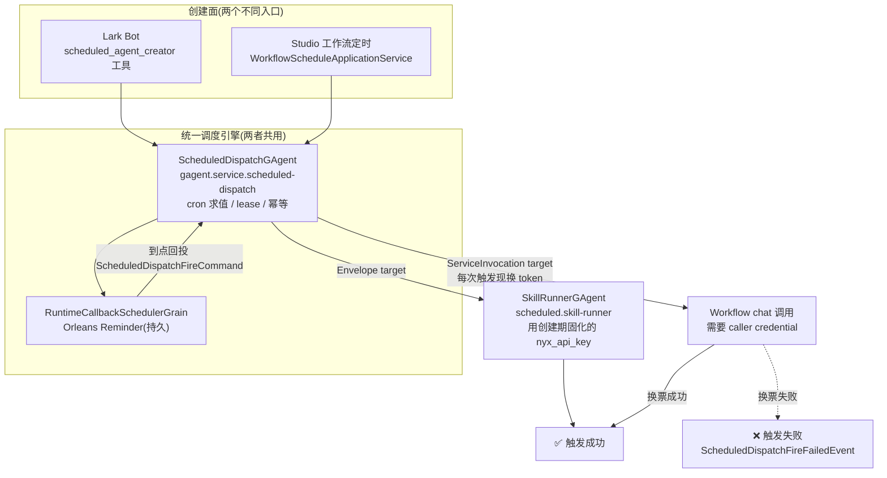
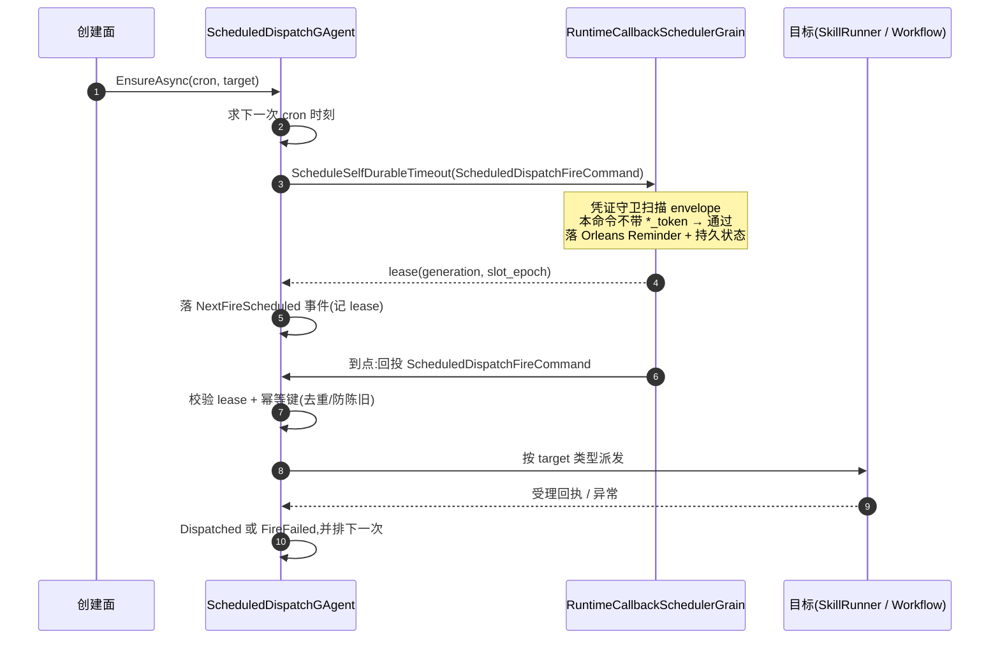
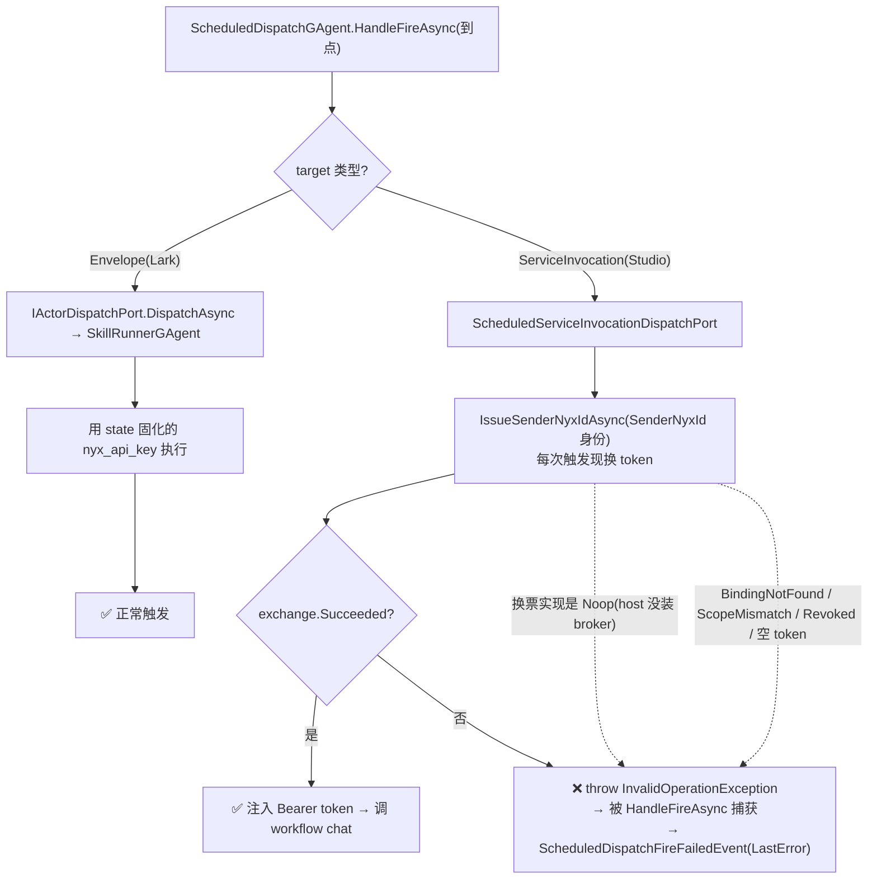

# 定时任务全链路:一个 cron 引擎、两类消费者,以及「Studio 触发失败 / Lark 正常」根因

## 事实源/设计抽象(以 ~/Code/aevatar 为准)

> 本篇把"用户口中的 ScheduleGAgent"拆成它真实对应的三个抽象,沿一次 cron 触发走完每一跳,并定位"在 Studio 上设的定时任务触发失败、在 Lark Bot 上设的能正常触发"的根因。下列是这条链路的**事实源脊柱**(非正文骨架),按"调度引擎 / Lark 消费者 / Studio 消费者 / 触发期换票"四段给出高价值锚点:

- **调度引擎(两者共用)**:`src/platform/Aevatar.GAgentService.Core/Schedules/ScheduledDispatchGAgent.cs`(cron 求值 + lease + 幂等 + 触发期分叉)、`src/Aevatar.Foundation.Runtime.Implementations.Orleans/Grains/Callbacks/RuntimeCallbackSchedulerGrain.cs`(Orleans Reminder 持久回调)、状态 proto `src/Aevatar.Foundation.Runtime/runtime_callback_scheduler_state.proto`、凭证守卫 `src/Aevatar.Foundation.Runtime.Implementations.Orleans/Grains/Callbacks/DurableCallbackEnvelopeCredentialGuard.cs`。
- **Lark 消费者(正常)**:`agents/Aevatar.GAgents.Scheduled/SkillRunnerGAgent.cs`(`[GAgent("scheduled.skill-runner")]`)、`agents/Aevatar.GAgents.Scheduled/SkillRunnerCronSchedulePort.cs`(注册成 Envelope target)、`agents/Aevatar.GAgents.Authoring.Lark/ScheduledAgentApiKeyIssuer.cs`(创建期签发长效 key)、canon `docs/canon/scheduled-skill-runners.md`。
- **Studio 消费者(失败)**:`src/workflow/Aevatar.Workflow.Application/Schedules/WorkflowScheduleConfigurationMapper.cs`(映射成 ServiceInvocation target + 身份)、`src/workflow/Aevatar.Workflow.Application/Schedules/WorkflowScheduleApplicationService.cs`。
- **触发期换票(分叉点)**:`src/platform/Aevatar.GAgentService.Infrastructure/Schedules/ScheduledServiceInvocationDispatchPort.cs`(每次触发现换 NyxID token)、两个换票实现 `.../Application/Schedules/NoopScheduledServiceInvocationCredentialExchangePort.cs` 与 `.../Infrastructure/Schedules/NyxIdScheduledServiceInvocationCredentialExchangePort.cs`、装配 `src/platform/Aevatar.GAgentService.Hosting/DependencyInjection/ServiceCollectionExtensions.cs`。

> 本篇是 [01 Channel](01-channels.md) / [08 Lark 全链路](08-lark-end-to-end.md) 的姊妹篇:那两篇讲"一条消息怎么进来又回去",本篇讲"没有人发消息时,定时器怎么把活儿叫起来"。

---

## 0. 一句话主线

> **「ScheduleGAgent」不是一个类,而是三件东西**:`ScheduledDispatchGAgent`(统一 cron 引擎,本仓库口径下"定时任务"指的就是它)+ 底层 `RuntimeCallbackSchedulerGrain`(Orleans Reminder 持久回调)+ 两个不同的**消费者**(Lark 的 `SkillRunnerGAgent`、Studio 的 Workflow `chat` 服务调用)。两个入口在**创建期**长得几乎一样,但在**触发期**走了两条凭证完全不同的路:**Lark 用创建时就固化的长效 API key,Studio 每次触发都要现去 NyxID 换一张短期 token——换不到票,触发就失败。**

---

## 1. 一个 cron 引擎,两类消费者(为什么这么切)

aevatar 没有为"定时智能体"和"定时工作流"各写一套定时器。两者都把自己**降维成一份 `ScheduledDispatchConfiguration`**,交给同一个 `IScheduledDispatchApplicationService`,最终落到同一个 actor:`ScheduledDispatchGAgent`(`src/platform/Aevatar.GAgentService.Core/Schedules/ScheduledDispatchGAgent.cs`,`[GAgent("gagent.service.scheduled-dispatch")]`)。

这份配置只有一个有分歧的字段——**target descriptor**:

| 维度 | Lark 定时智能体 | Studio 定时工作流 |
|---|---|---|
| 注册者 | `SkillRunnerCronSchedulePort`(`agents/Aevatar.GAgents.Scheduled/`) | `WorkflowScheduleConfigurationMapper`(`src/workflow/Aevatar.Workflow.Application/Schedules/`) |
| `ScheduleKind` | `SkillRunner` | `Workflow` |
| target 类型 | `Envelope` | `ServiceInvocation` |
| 触发时投什么 | 一个**无凭证**的 `TriggerSkillRunnerExecutionCommand{Reason="schedule"}` | 一个 `ChatRequestEvent`(endpoint = `"chat"`)+ `Auth.SenderNyxId`**身份** |
| 触发时凭证从哪来 | `SkillRunnerGAgent` state 里**创建期固化**的 `nyx_api_key` | **每次触发现换**:用存的身份去 NyxID 换 token |

**为什么是"同一个引擎 + 不同 target",而不是两套定时器**:cron 求值、Orleans Reminder 持久化、lease 防重投、幂等键去重、跨重启恢复——这些是"定时"的硬骨头,与"定时叫起来的是智能体还是工作流"无关。把它们收口到 `ScheduledDispatchGAgent` 一处,消费者只需声明"到点了把这个 envelope 投给那个 actor"或"到点了调这个服务"。这正是仓库不动点 **FI-003/FI-005**(稳定核心小而可审计、边界优先于便利)的体现:定时是核心,凭证与目标是消费者各自的事实。

代价正是本篇要讲的:**两类消费者在"触发期凭证"上做了不同选择,而这条差异恰好是 Studio 触发失败的根因**(见 §4)。

---

## 2. 调度引擎内核:durable callback + lease + 幂等 + 凭证守卫

`ScheduledDispatchGAgent` 自己不持有定时器,它把"到点叫我"这件事委托给底层 `RuntimeCallbackSchedulerGrain`(`src/Aevatar.Foundation.Runtime.Implementations.Orleans/Grains/Callbacks/RuntimeCallbackSchedulerGrain.cs`)——一个用 **Orleans Reminder** 做持久回调的 grain,状态落在 `runtime_callback_scheduler_state.proto` 描述的 grain state 里,进程重启不丢、到点重投。

三个值得记住的设计点:

1. **durable callback 里永远不放凭证**。`ScheduledDispatchGAgent` 排下一次触发时,投给调度器的只是一个 `ScheduledDispatchFireCommand{ScheduledFireAt, Manual=false}`(`ActivateNextFireIntentAsync`)——**没有任何 token / 身份**。真正的目标 envelope 是**到点后在 actor turn 内**才现场构造的(`BuildDispatchEnvelopeAsync`)。这是被 **凭证守卫** `DurableCallbackEnvelopeCredentialGuard` 强制的:任何要持久化的 callback envelope 一旦带 `reply_token` / `nyx_user_access_token` / 任意 `*_token` 字段,直接 `throw InvalidOperationException`(集成测试 `test/Aevatar.Foundation.Runtime.Hosting.Tests/RuntimeCallbackSchedulerGrainCredentialGuardIntegrationTests.cs` 固化了这条:sanitized 的能落、带 token 的被拒)。**正当性**:Reminder 状态可能在库里躺很久,把短期凭证写进去等于"过期票 + 泄漏面",所以凭证必须在触发那一刻重新解析(FI-002/FI-004)。

   > ⚠️ **一个很容易踩的误判**:既然有这条凭证守卫,直觉会怀疑"Studio 的票被守卫拦了"。**不是**。守卫只看**持久化的 callback envelope**,而那永远是无凭证的 `ScheduledDispatchFireCommand`;Studio 的 token 是在**触发后、actor turn 内**才去换的,根本不经过守卫。真正的失败点在 §4。

2. **lease(generation + slot_epoch)防陈旧重投**。每次排程返回一个 lease 并落进 state;到点回投时 `HandleFireAsync` 先比对 `MatchesNextFireLease`,对不上的(延迟/重复的旧 Reminder)直接丢弃。

3. **幂等键去重**。按 `(scheduleId, scheduledFireAt)` 生成幂等键,已是终态(Dispatched/Failed)的同一次触发不再执行;触发成功后立刻排下一次。

---

## 3. 消费者 A:Lark 定时智能体(SkillRunner)—— 为什么它能稳定触发

Lark Bot 上"设个定时任务",走的是 `scheduled_agent_creator` 工具,落成一个 `SkillRunnerGAgent`(`agents/Aevatar.GAgents.Scheduled/SkillRunnerGAgent.cs`,`[GAgent("scheduled.skill-runner")]`)。关键在**创建期就把凭证固化下来**:

- `ScheduledAgentApiKeyIssuer.IssueAsync`(`agents/Aevatar.GAgents.Authoring.Lark/`)在创建时向 NyxID 申一张**作用域收敛的长效 API key**(scopes `read write proxy`,按交付 slug / 失败通知 slug / ornn / LLM proxy 收敛),把 `FullKey` 写进 `SkillRunnerOutboundConfig.nyx_api_key`(proto `agents/Aevatar.GAgents.Scheduled/protos/skill_runner.proto`),固化进 `SkillRunnerState`。
- `SkillRunnerCronSchedulePort.EnsureAsync` 把定时注册成 **`Envelope` target**:触发时投的 `TriggerSkillRunnerExecutionCommand{Reason="schedule"}` **不带任何凭证**(见 `SkillRunnerCronSchedulePort.cs` 的 `CreateConfiguration`)。
- 到点后 `ScheduledDispatchGAgent` 对 `Envelope` target 直接 `IActorDispatchPort.DispatchAsync` 投给 `SkillRunnerGAgent`;后者执行 skill 时,**从自己 state 里读那张固化的 key** 去交付。

**为什么这条路稳**:触发期**零外部依赖**——不查 NyxID、不换票、不依赖某个用户当下还登录着。创建时拿到一次授权就够用整个生命周期。代价是这张 key 长期有效(靠创建期作用域收敛 + 可吊销 `api_key_id` 来兜底)。

---

## 4. 消费者 B:Studio 定时工作流(Workflow ServiceInvocation)—— 为什么它触发失败

Studio 上"给工作流设定时",走 `WorkflowScheduleApplicationService` → `WorkflowScheduleConfigurationMapper.ToScheduledDispatchConfiguration`(`src/workflow/Aevatar.Workflow.Application/Schedules/`)。它映射出的 target 与 Lark 截然不同:

- target 类型是 **`ServiceInvocation`**,endpoint = `"chat"`,payload 是一个 `ChatRequestEvent`(把 workflow 的 prompt 包进去)。
- 凭证位只存**身份**,不存 token:`Auth.SenderNyxId = { Subject(platform, tenant, externalUserId), Scope }`。mapper 强制要求这块非空(否则创建期就 `ArgumentException`)——**所以"能创建成功"恰恰说明身份是齐的,问题不在创建期**。

到点后,`ScheduledDispatchGAgent` 对 `ServiceInvocation` target 不走普通派发,而是调 `_serviceInvocationDispatchPort.DispatchAsync(...)`,并对 `ScheduleKind==Workflow` 打开一个开关:`ProjectSenderNyxIdAccessTokenToWorkflowCallerCredential = true`(`DispatchPreparedTargetAsync`)。注意此时传下去的 `ToRuntimeAuth(...)` **只有身份、没有 token**。于是真正的换票发生在 `ScheduledServiceInvocationDispatchPort`(`src/platform/Aevatar.GAgentService.Infrastructure/Schedules/`):

换票一旦不成功,`ScheduledServiceInvocationDispatchPort` 直接 `throw InvalidOperationException`(`BuildInvocationRequestAsync` 里 `if (!exchange.Succeeded) throw ...`),这个异常被 `ScheduledDispatchGAgent.HandleFireAsync` 的 `catch` 接住,落成 `ScheduledDispatchFireFailedEvent`,体现为该定时任务的 `LastError` 和 `FailureCount++`。**任务还在、cron 还在排下一次,但每次触发都失败**——和用户观察到的现象完全吻合。

换票为什么会不成功?有两个相互独立的轴,都由代码事实支撑:

**轴一:host 到底装没装换票能力。** 装配点 `ServiceCollectionExtensions.cs` 的 `AddScheduledCredentialExchangePort` 是条件注册:

- 若容器里有 `INyxIdCapabilityBroker` → 装 `NyxIdScheduledServiceInvocationCredentialExchangePort`(真换票);
- 否则 → 装 `NoopScheduledServiceInvocationCredentialExchangePort`,它的 `IssueSenderNyxIdAsync` **永远返回失败**:`"Scheduled service invocation sender NyxID credential exchange is not configured."`

也就是说:**只要承载 Studio 工作流定时的 host 没注册 NyxID broker,所有 Workflow 定时触发 100% 失败,而 Lark 定时(走 Envelope,不换票)毫不受影响**——这正好能解释"同一套部署里 Lark 行、Studio 不行"。

**轴二:就算装了真换票,身份能不能换到票。** `NyxIdScheduledServiceInvocationCredentialExchangePort` 拿存下的 `SenderNyxId` 身份去 `broker.IssueShortLivedAsync(subject, scope)`,以下情况都会落成失败 → 触发失败:

- `BindingNotFoundException` → "NyxID binding was not found for the scheduled subject."
- `BindingScopeMismatchException` → 该 binding 不覆盖定时请求的 scope。
- `BindingRevokedException` → binding 已吊销。
- 返回空 token / 其它异常 → "NyxID credential exchange failed."

**为什么 Lark 用户几乎不会撞上轴二、Studio 用户容易撞上**:Lark 用户是经 NyxID relay 进来的(见 [08 Lark 全链路](08-lark-end-to-end.md)),天然有一条可换短期 token 的 NyxID binding;而 Studio 侧的登录身份未必绑定到能换票的 NyxID subject/scope——一旦身份与 binding 对不上(尤其 `tenant` 缺失的"tenantless"情形,mapper 里 `tenant` 是 optional、可空),换票就报 binding 类错误。git 历史也印证了这块是反复打补丁的高危区:`Add scheduled workflow NyxID token exchange` → `Fix scheduled workflow NyxID token dispatch` → `Fix scheduled workflow caller credential projection` → `Fix tenantless schedule auth and role dispatch`。

---

## 5. 根因总结 + 怎么定位

**一句话根因**:Studio 定时(Workflow ServiceInvocation)在**每次触发**都依赖一次"用存的身份去 NyxID 现换短期 token"的操作;这一步在"后台无人值守 + host 未装 broker / 身份无可用 binding / scope/tenant 对不上"时失败,异常被吞成 `FireFailed`。Lark 定时(SkillRunner Envelope)在**创建期**就把长效 key 固化进 state,触发期零换票、零外部依赖,所以照常跑。

| 对照项 | Lark 定时智能体(✅) | Studio 定时工作流(❌) |
|---|---|---|
| target 类型 | `Envelope` | `ServiceInvocation`(endpoint=`chat`) |
| 触发期凭证 | 创建期固化的 `nyx_api_key` | 每次触发现换 NyxID short-lived token |
| 触发期外部依赖 | 无 | NyxID broker + 身份 binding + scope 匹配 |
| 失败时表现 | —— | `ScheduledDispatchFireFailedEvent`,`LastError` 带换票错误 |
| 失败的硬下限 | —— | host 装了 `Noop` 换票 → 必然失败 |

**怎么在你的环境里坐实是哪一种**(按成本从低到高):

1. **读 `LastError`**:查这条定时任务的 fire 记录 / `ScheduledDispatchFireFailedEvent`。
   - 文案含 *"...credential exchange is not configured."* → **轴一**:host 没装 NyxID broker,装上即可。
   - 文案含 *"binding was not found / does not grant the requested schedule scope / was revoked"* → **轴二**:Studio 创建定时时落下的 `SenderNyxId`(platform/tenant/externalUserId/scope)没有可换票的 NyxID binding;对齐身份/scope(或为该 subject 建 binding)。
2. **核对 host 装配**:承载 Workflow 定时的 host 是否注册了 `INyxIdCapabilityBroker`(见 `ServiceCollectionExtensions.cs`)。
3. **对比创建期落库**:同一身份在 Lark 入站(有 binding)与 Studio 登录(可能无 binding)下,`SenderNyxId` 是否一致、`tenant` 是否为空。

> 本仓库是只读解读仓,不改 `~/Code/aevatar`;上面是定位路径与设计依据,具体修复(补 broker 装配 / 对齐身份 binding / 让换票失败的报错透传到 Studio 前端而非静默 `FireFailed`)属于源码仓的工作。

---

## 6. ⚠️ 边界与诚实标注

- **凭证守卫不是 Studio 失败的原因**(§2 已纠正)。守卫只管"别把 token 写进持久 Reminder",而 Studio 的换票在触发后的 actor turn 内,绕开守卫。把两者混为一谈会误修。
- **「ScheduleGAgent」是俗称**:代码里没有这个类名;它对应 `ScheduledDispatchGAgent`(引擎)+ `SkillRunnerGAgent`(Lark 消费者)+ Workflow `chat` 调用(Studio 消费者)。
- **本篇未亲验的环节**:Studio 前端 → `WorkflowScheduleApplicationService` 之间那段 HTTP 端点如何把当前登录态填进 `Auth.SenderNyxId`,我只确认了"mapper 强制要求它非空、否则创建期就报错",因此把失败点定位在触发期换票而非创建期校验(这与"能建、触发才失败"的现象一致)。若需精确到"Studio 落的 subject 到底长什么样",需再追该端点。
- **高危演进区**:Workflow 定时的 token exchange / caller credential projection 是 git 历史里反复修的地方(`193c1b6` / `db9c384` / `c3ea4f7` / `c61446a` 等),阅读源码时以当前 HEAD 为准,不要照搬被取代的旧实现。
- **当前态 vs 目标态**:换票失败目前是**静默**地变成 `FireFailed`(只进 `LastError`),Studio 用户不一定能直接看到原因——这是体验缺口,登记为后续可改进项。

> **读者可回答**:为什么 aevatar 用一个 `ScheduledDispatchGAgent` 同时承载定时智能体和定时工作流(§1)?定时回调为什么坚持"不在持久 envelope 里放凭证"、凭证守卫到底守什么(§2)?Lark 定时为什么不换票、Studio 定时为什么每次都要换票(§3/§4)?同一套部署里"Lark 行、Studio 不行"的两条独立原因分别是什么、怎么从 `LastError` 区分(§4/§5)?
