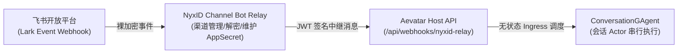

# Lark Bot 注册与接入指南：零凭证架构下的中继入站

## 事实源/设计抽象(以 ~/Code/aevatar 为准)

- **Webhook 接口注册**：[NyxIdChatEndpoints.cs:L35](file:///Users/zhaoyiqi/Code/aevatar/agents/Aevatar.GAgents.NyxidChat/NyxIdChatEndpoints.cs#L35) (`app.MapPost("/api/webhooks/nyxid-relay", HandleRelayWebhookAsync)` 暴露匿名入站地址)。
- **中继认证与签名校验**：[NyxIdRelayAuthValidator.cs](file:///Users/zhaoyiqi/Code/aevatar/agents/channels/Aevatar.GAgents.Channel.NyxIdRelay/NyxIdRelayAuthValidator.cs) (使用 JWT 强校验 `X-NyxID-Callback-Token` 的身份凭证)。
- **Relay Ingress 转换**：[NyxIdChatEndpoints.Relay.cs:L142](file:///Users/zhaoyiqi/Code/aevatar/agents/Aevatar.GAgents.NyxidChat/NyxIdChatEndpoints.Relay.cs#L142) (验证后归一化为中立的 `ChatActivity` 并推入 Actor)。

---

## 1. 核心边界: 为什么 Aevatar 不直接自管理 Lark Bot？ ★

在传统的 Agent 框架中，通常让宿主程序直接持有飞书（Lark）机器人的 `App ID` 与 `App Secret`，并在本地启动一个服务器直接监听飞书开放平台的 HTTP 事件回调。

Aevatar 的设计原则是**宿主中立、多租户隔离与零长期凭证 (Zero Standing Secrets)**（参见 [06/06 零长期密钥](../06/06-credentials-zero-standing-secrets.md)）。若直接在 Aevatar 的 Actor State 中存储敏感的飞书 AppSecret，会面临两重问题：
1. **安全性倾泻**：飞书 API 的高危权限（如消息发送、成员读取）直接暴露在分布式 Actor 的序列化状态中，极易因 Grain State 溢出或导出导致密钥泄露。
2. **状态污染**：飞书特有的 Webhook 验签、解密和流控逻辑如果与 Core 编排耦合，会破坏 Aevatar “中立执行体”的架构原则。

因此，Aevatar 将所有渠道机器人的接入、凭证生命周期维护完全委托给 **NyxID Gateway (统一中继网关)**。



在 Aevatar 侧，**没有任何飞书 AppSecret 的物理副本**。宿主通过拦截带有加密校验 JWT 的中继请求，只解析归一化后的无状态 Payload，消除了密钥泄露和接口适配的不确定性。

---

## 2. 消息流与验证时序

飞书事件到达 Aevatar 的完整处理流如下：

```mermaid
sequenceDiagram
    autonumber
    participant Lark as 飞书开放平台
    participant Nyx as NyxID Gateway
    participant Endpoint as Aevatar Webhook
    participant Validator as NyxIdRelayAuthValidator
    participant Ingress as INyxIdRelayIngressPort
    participant Actor as ConversationGAgent

    Lark->>Nyx: 飞书推送消息事件 (携带 APP 校验)
    Nyx->>Nyx: 验证并解密飞书 Payload，将数据归一化
    Nyx->>Nyx: 签发带有 scope_id 的 JWT 签名 (Callback Token)
    Nyx->>Endpoint: POST /api/webhooks/nyxid-relay
    Endpoint->>Validator: ValidateAsync(body, headers)
    Note over Validator: 1. 验证 JWT 证书与签名是否合法<br/>2. 验证 JTI 唯一性防止重放攻击
    Validator-->>Endpoint: 返回 AuthResult (含 scopeId 和 token)
    Endpoint->>Endpoint: 归一化 Payload 为 ChatActivity
    Endpoint->>Ingress: AcceptAsync(ingressRequest)
    Ingress->>Actor: 将 activity 作为 turn 请求分流至 Scoped Actor
    Actor-->>Endpoint: 返回 Accepted (202)
    Endpoint-->>Nyx: HTTP 202 Accepted
    Nyx-->>Lark: 响应成功
```

---

## 3. Lark Bot 注册与对接步骤

### 步骤一：在飞书开放平台新建应用
1. 登录 [飞书开放平台](https://open.feishu.cn/app)，点击「创建企业自建应用」。
2. 获取应用的凭证元数据：
   - **App ID**
   - **App Secret**
3. 进入「应用功能」-「机器人」，点击「启用机器人」能力。
4. 进入「安全设置」，获取并配置以下信息：
   - **Encrypt Key** (解密 Key)
   - **Verification Token** (校验 Token)
5. 在「事件订阅」的「请求地址 (Request URL)」中填入**步骤二中由 NyxID 生成的回调地址**，并订阅对应的消息和交互事件（如 `im.message.receive_v1` 接收消息）。

### 步骤二：在 NyxID 平台绑定 Lark Bot
由于 Aevatar 依靠 NyxID 充当 Relay，您需要登录您的 NyxID 租户管理控制台（例如 `nyx-api.chrono-ai.fun`）：
1. 在 Connected Services (已连接服务) 或是 Bot Channels (机器人渠道) 下，选择添加新渠道类型为 `Lark` (飞书)。
2. 将步骤一中飞书应用的 `App ID`、`App Secret`、`Encrypt Key` 和 `Verification Token` 填入配置中。
3. 绑定并保存后，NyxID 将会生成一个专用的 **Gateway Webhook Address** (如 `https://nyx-api.chrono-ai.fun/api/v1/channels/lark/callback/{binding_id}`)。
4. 将该 Gateway Webhook 地址填入步骤一中飞书应用的「事件订阅 Request URL」中，完成飞书与 NyxID 网关的二次握手。

### 步骤三：启动 Aevatar 并注册 Ingress Webhook
1. Aevatar Host 启动时，需要配置好 NyxID 选项：
   ```json
   {
     "NyxIdTool": {
       "BaseUrl": "https://nyx-api.chrono-ai.fun"
     },
     "NyxIdRelay": {
       "RelayReplyTokenRuntimeTtlSeconds": 3600
     }
   }
   ```
2. 在 API 引导引导层中启用 Webhook：
   ```csharp
   // Map 统一的 webhook 入口
   app.MapNyxIdChatEndpoints();
   ```
3. Aevatar 的宿主暴露的 Webhook 接入路由固定为：
   `https://your-aevatar-host/api/webhooks/nyxid-relay`
4. 在 NyxID 管理端，将此中继路由配置为您该 Scope 下的 Aevatar Target Ingress。至此，从飞书到 Aevatar 的整条数据流即可打通。

---

## 4. 零内存防重放 (Anti-Replay) 机制

在接收到中继 Webhook 时，为了防止请求重放攻击（Replay Attack），系统必须对请求进行唯一性校验。

传统的实现方案通常在 API 宿主内存中使用一个带锁的 ConcurrentDictionary 来缓存处理过的请求 `jti` (JWT ID)，但这会导致宿主成为有状态节点，违反了**无状态 API Gateway** 的微服务设计原则。

Aevatar 基于 Actor + Event Sourcing 模型，将**防重放的准入过滤职责直接下沉到了 `ConversationGAgent` 中**：

1. **宿主只负责解析 JWT**：
   `HandleRelayWebhookAsync` 从 `X-NyxID-Callback-Token` 中读出 API 凭据、`scope_id` 和唯一的 `CallbackJti`。
2. **Actor 级幂等防重放**：
   在 Ingress 接收后，`CallbackJti` 被作为请求信封的一部分发送给对应的 `ConversationGAgent`。该 Actor 通过对自身状态（Event Sourcing 事实记录）进行校验，确认是否处理过相同的 `jti`。如果不合规，则由 Actor 同步拒绝处理，并持久化准入失败记录，而不需要宿主做任何内存级的状态缓存。

这套设计使得 API 宿主节点能够做到完全的**水平无状态扩容**，同时依然保证了端到端的强幂等和防重放语义。
