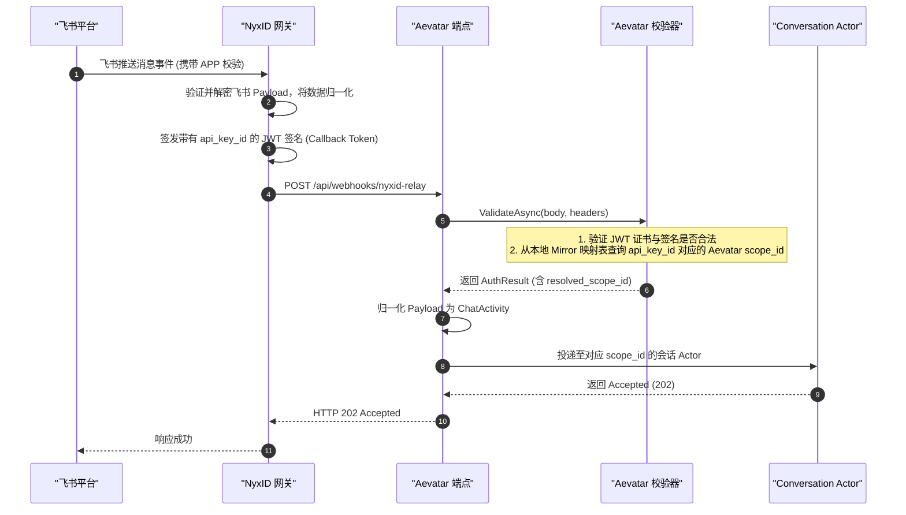

# Lark Bot 注册与接入指南：零凭证架构下的中继入站

## 事实源/设计抽象 (以 ~/Code/aevatar 为准)

- **Webhook 回调路由与网关注册**：[ChannelCallbackEndpoints.cs](file:///Users/zhaoyiqi/Code/aevatar/agents/channels/Aevatar.GAgents.Channel.NyxIdRelay/ChannelCallbackEndpoints.cs) (暴露匿名入站路由 `/api/webhooks/nyxid-relay`，及注册入口 `/api/channels/registrations`)。
- **本地凭证与 Scope 映射 Mirror 校验**：[NyxIdRelayAuthValidator.cs](file:///Users/zhaoyiqi/Code/aevatar/agents/channels/Aevatar.GAgents.Channel.NyxIdRelay/NyxIdRelayAuthValidator.cs) (校验 JWT 并在入站阶段验证 Aevatar 本地 Scope 映射)。
- **Lark Bot 渠道供应机制**：[NyxLarkProvisioningService.cs](file:///Users/zhaoyiqi/Code/aevatar/agents/channels/Aevatar.GAgents.Channel.NyxIdRelay/NyxLarkProvisioningService.cs) (负责调用 NyxID OpenAPI 供应机器人，同时发起本地 Aevatar Mirror 注册写入)。
- **消息回复及 Owner LLM 配置应用**：[AgentRunReplyGenerationExecutor.cs](file:///Users/zhaoyiqi/Code/aevatar/agents/Aevatar.GAgents.NyxidChat/AgentRunReplyGenerationExecutor.cs) (在回复生成时加载会话所有者的 LLM 偏好设置)。

---

## 1. 核心边界: 零凭证架构与 Aevatar 门禁机制 ★

在 Aevatar 架构中，所有渠道机器人（Lark、Telegram 等）的接入、凭证生命周期维护完全委托给 **NyxID Gateway (统一中继网关)**。Aevatar 的设计原则是**宿主中立、多租户隔离与零长期凭证 (Zero Standing Secrets)**。

在 Aevatar 侧，**没有任何飞书 (Lark) AppSecret 的物理副本**。Aevatar 只暴露回调入口接收来自 NyxID 中继。

### 为什么必须通过 Aevatar Facade 注册？
NyxID 转发入站消息时，会带有两个 Header 令牌：
1. `X-NyxID-Callback-Token`：包含 integrity 和 routing 声明（`api_key_id`、`message_id` 等）的 JWT，**但不包含 Aevatar 的租户 `scope_id`**。
2. `X-NyxID-User-Token`：包含所有者 NyxID 身份凭证的 JWT，**同样不包含 Aevatar 租户 `scope_id`**。

Aevatar 的租户 `scope_id`（例如 `2c5c9b72...`）与所有者在 NyxID 中的用户 UUID（例如 `2db990b5...`）是完全独立且不相等的。为了能在入站消息到达时，将请求正确路由到对应的租户 Actor 上，Aevatar 本地维护了一份 **`nyx_agent_api_key_id → scope_id` 的 Mirror (映射关系)**：
- **Facade API 注册是唯一写入此 Mirror 的路径**：当调用 Aevatar 的 Ingress 注册端点时，`NyxLarkProvisioningService` 会通过本地 Command 触发 `ChannelBotRegistrationGAgent` 写入 Mirror。
- **直接通过 NyxID API/CLI 注册将丢失 Mirror**：仅在 NyxID 侧绑定机器人，Aevatar 无法识别 `api_key_id` 所属的 Aevatar `scope_id`，入站时 `NyxIdRelayScopeResolver` 将无法解析 Scope，直接返回 `401 Unauthorized` 拒绝服务。

---

## 2. 交互流与验证时序

飞书事件到达 Aevatar 的完整处理流如下：



---

## 3. 飞书 (Lark) 机器人注册步骤

### 步骤一：在飞书开放平台收集凭证
1. 登录 [飞书开放平台](https://open.feishu.cn/app)，创建企业自建应用。
2. 在「凭证与基础信息」中获取应用凭证：
   - **App ID** (格式一般为 `cli_...`)
   - **App Secret**
3. 在「应用功能」-「机器人」中，开启机器人能力。
4. 在「安全设置」中获取：
   - **Verification Token** (校验 Token)
   - **Encrypt Key** (解密 Key，如果没有设置则为空)

### 步骤二：通过 Aevatar Facade 注册 (写入 Mirror)
在命令行使用 `curl` 或者是客户端向 Aevatar 的 API 发送注册请求：

```bash
curl -i -X POST 'https://aevatar-console-backend-api.aevatar.ai/api/channels/registrations' \
  -H "Authorization: Bearer $AEVATAR_TOKEN" \
  -H 'Content-Type: application/json' \
  -d '{
    "platform": "lark",
    "webhook_base_url": "https://aevatar-console-backend-api.aevatar.ai",
    "app_id": "cli_xxxxxxxxxxxxxxxx",
    "app_secret": "YOUR_LARK_APP_SECRET",
    "verification_token": "YOUR_LARK_VERIFICATION_TOKEN",
    "label": "My Aevatar Lark Bot"
  }'
```

> [!IMPORTANT]
> **Cloudflare 403 阻断警告 (Error Code: 1010)**  
> Aevatar 主网托管环境前置了 Cloudflare 门禁。如果使用裸 HTTP 客户端（例如 Python 的 `urllib` 或 Go 的默认 `http.Client`），在未声明浏览器类型 User-Agent 的情况下会被 Cloudflare 直接拦截并返回 `403`。请确保使用 `curl` 或者在代码中手动设置浏览器 User-Agent Header。

> [!NOTE]
> **主网 502 Block 历史背景**  
> 主网宿主使用了只读的 `EnvironmentSecretsStore`。在旧版本设计中，Lark 注册流试图将 API 密钥明文写入该 secrets 存储，导致抛出只读异常并回滚（502 错误）。目前该冗余的 secrets 写入已被移除，Lark 路径在主网上可顺利完成注册。

### 步骤三：在飞书控制台配置回调及权限

#### 1. 配置回调 URL
将注册成功返回的 `webhook_url`（形如 `https://nyx-api.chrono-ai.fun/api/v1/webhooks/channel/lark/<BOT_ID>`）填入飞书开发者后台的「事件订阅」-「请求地址 (Request URL)」中。如果后台有独立的卡片回调地址，填入相同 URL。

#### 2. 配置消息与交互权限 (Scopes) — 💡 常见故障 #1 修复
仅开启 `im:message:send_as_bot`（以机器人身份发送消息）**不足以让机器人工作**。如果没有读取消息权限，飞书将不会推送任何事件。请开通以下权限：

- **Tier 1 (基础收发)**：
  - `im:message:send_as_bot` (发送消息)
  - `im:message.p2p_msg:readonly` (接收私聊消息)
  - `im:message.group_at_msg:readonly` (接收群聊中 @ 机器人的消息)
  - `im:message.group_at_msg.include_bot:readonly` (群聊 @ 包含机器人)
  - `im:resource` (媒体/文件传输)
- **Tier 2 (高级卡片与交互偏好)**：
  - `contact:contact.base:readonly` (解析发送者用户名和个人资料)
  - `cardkit:card:read` 与 `cardkit:card:write` (使用飞书 CardKit 流式卡片进行交互)
  - 订阅 `im.message.receive_v1` 事件。

> [!WARNING]
> 权限及订阅事件修改后，必须在「版本管理与发布」中**创建新版本并提交发布**。只有发布被企业管理员审批通过后，新权限才会正式对机器人生效。

### 步骤四：配置所有者 (Owner) LLM
Aevatar 的中继会话在执行时，会根据消息绑定的所有者 NyxID 身份，提取其首选的 LLM 路由配置。**如果所有者未配置 LLM，回复生成会默认走 Gateway 路由，若没有连接 OpenAI 账号，则会默默失败（表现为不回复或回复 Sorry）**。

在绑定机器人后，必须使用注册时的同一 NyxID 用户 Token 配置 LLM：

```bash
curl -i -X PUT 'https://aevatar-console-backend-api.aevatar.ai/api/user-config/llm' \
  -H "Authorization: Bearer $AEVATAR_TOKEN" \
  -H 'Content-Type: application/json' \
  -d '{"routeValue":"chrono-llm-public","model":"gpt-5.5"}'
```
- 推荐使用 `chrono-llm-public` 公共代理路由和 `gpt-5.5` 模型，此路由无需绑定个人 OpenAI 凭证即可开箱即用。

---

## 4. 零内存防重放 (Anti-Replay) 机制

在接收到中继 Webhook 时，为了防止请求重放攻击（Replay Attack），系统必须对请求进行唯一性校验。

传统的实现方案通常在 API 宿主内存中使用一个带锁的 `ConcurrentDictionary` 来缓存处理过的请求 `jti` (JWT ID)，但这会导致宿主成为有状态节点，违反了无状态 API Gateway 的设计原则。

Aevatar 基于 Actor + Event Sourcing 模型，将**防重放的准入过滤职责直接下沉到了 `ConversationGAgent` 中**：
1. **宿主只负责解析 JWT**：`HandleRelayWebhookAsync` 从 `X-NyxID-Callback-Token` 中读出 API 凭据、`scope_id` 和唯一的 `CallbackJti`。
2. **Actor 级幂等防重放**：在 Ingress 接收后，`CallbackJti` 被作为请求信封的一部分发送给对应的 `ConversationGAgent`。该 Actor 通过对自身状态（Event Sourcing 事实记录）进行校验，确认是否处理过相同的 `jti`。如果不合规，则由 Actor 同步拒绝处理，并持久化准入失败记录，而不需要宿主做任何内存级的状态缓存。

---

## 5. 调试与常见故障排查

Aevatar 提供了管道自定位故障脚本 `scripts/diagnose-lark-bot.sh`，如果绑定的机器人没有响应，可以通过该脚本快速定位损坏的层级：

```bash
BOT_ID=<YOUR_BOT_ID> bash scripts/diagnose-lark-bot.sh
```

该脚本将依次测试五个阶段的配置，对应的故障定位矩阵如下：

| 故障现象 | 根因分类 | 解决方法 |
|---|---|---|
| 注册返回 **502**，日志报错 `channel_bot_id_request_failed nyx_status=409` | **飞书 APP ID 冲突** | 该飞书应用在 NyxID 中已被其他租户或用户绑定。需要使用 `nyxid channel-bot delete <BOT_ID> --yes` 废弃原有绑定，再重新注册。重新注册将产生新的 `BOT_ID`，必须重新更新飞书 Request URL。 |
| 注册返回 **502**，日志报错 `EnvironmentSecretsStore is read-only` | **旧主网宿主代码冲突** | 检查当前部署的 Aevatar 主网 Host 构建版本，需升级至合并了 [NyxLarkProvisioningService.cs](file:///Users/zhaoyiqi/Code/aevatar/agents/channels/Aevatar.GAgents.Channel.NyxIdRelay/NyxLarkProvisioningService.cs) 移除 relay key 写入逻辑的代码。 |
| 发送私聊机器人完全没有反应，NyxID 中 bot 状态为 `pending_webhook`，且 aevatar 无任何中继日志 | **飞书事件未到达网关** (Lark-console 侧故障) | 1. 检查飞书应用的事件订阅权限，确保开通了私聊和群聊的只读权限（见 §3 步骤三）。<br/>2. 确保权限调整后**发布了新版应用**。<br/>3. 检查飞书订阅 Request URL 格式，确保结尾为飞书专用路由 `/channel/lark/<BOT_ID>`。<br/>4. 检查 Verification Token 与注册时输入是否一致。 |
| 飞书日志显示事件已成功发送，但 Aevatar 端返回 `401 Unauthorized`，日志提示 `did not resolve a canonical scope id` | **Aevatar Mirror 丢失** (Aevatar-relay 侧故障) | 该机器人并非通过 Aevatar Facade API 注册，而是直接在 NyxID CLI/后台注册的，这导致 Aevatar 缺失 `api_key_id → scope_id` 映射。必须重新通过 Facade 接口注册。 |
| 飞书卡片显示「处理中」或返回空回复 ("Sorry...") | **Owner LLM 未配置** (LLM 配置故障) | 机器人所有者身份未在 Aevatar 绑定有效的 LLM 配置。使用该所有者的 Access Token 请求 `PUT /api/user-config/llm`（见 §3 步骤四）更新 LLM 路由偏好。 |
