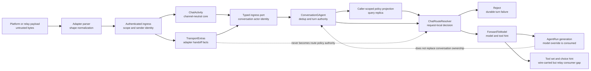
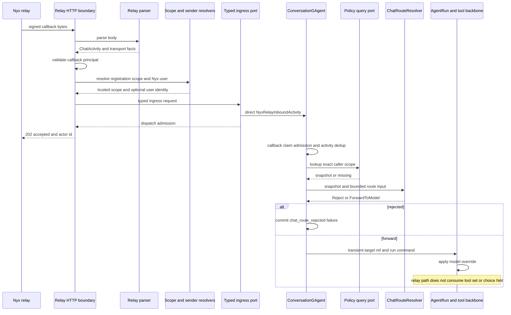
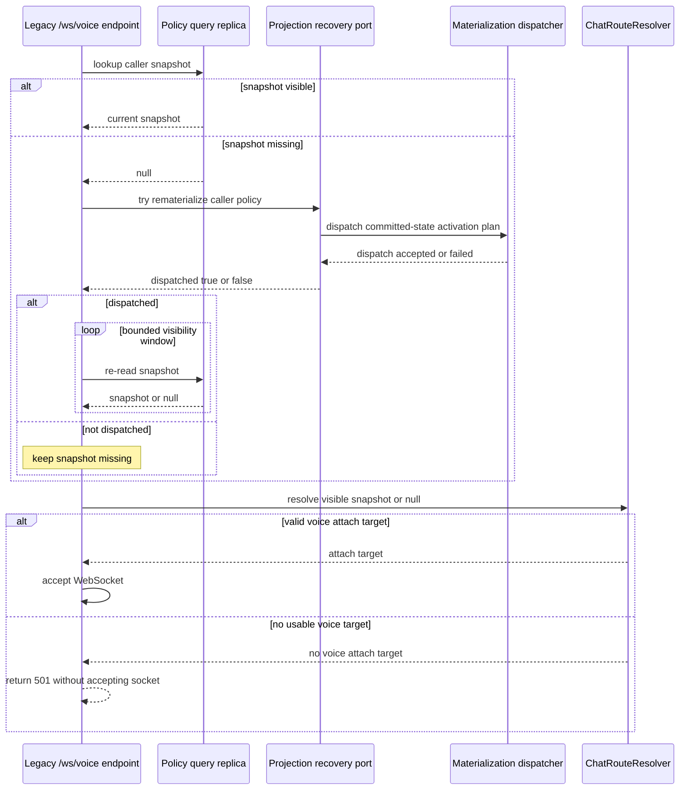
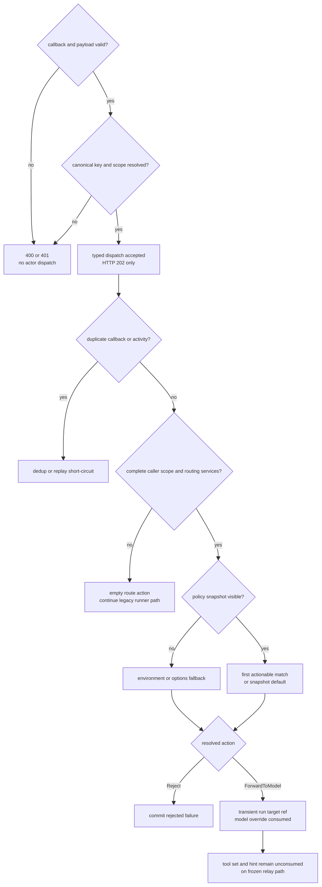

# Ingress 规范化与路由：先固定身份，再选择执行意图

> 版本与结论：本章描述 `current`。外部 Channel payload 先在 adapter / HTTP 边界被验证并规范化成 `ChatActivity`，再由 canonical conversation identity 进入 `ConversationGAgent`。路由策略不直接改写 conversation owner，也不新增一个热路径 router actor；它用 caller-scoped policy snapshot 与无状态 resolver 生成本次请求的 `Reject` 或 `ForwardToModel`。legacy `/ws/voice` WebSocket ingress 会在 snapshot 首次不可见时请求 read model 重物化并有界重读，仍不可见才 fail closed；这不会把 projection 升格为 authority。wire contract 已把 GAgent、Team、Workflow 目标收敛为 tool hint，但冻结 relay execution 只证明 `model_name` 被消费，tool-set/hint 的执行闭环仍有缺口。

## 设计抽象与事实源

- `agents/Aevatar.GAgents.Channel.Abstractions/protos/chat_activity.proto:133`、`:325`、`:341`、`:352`、`:414`：canonical conversation、channel-neutral content、异步回复上下文、transport extras 与统一 activity envelope。
- `agents/Aevatar.GAgents.Channel.Runtime/ConversationDispatchMiddleware.cs:25`、`:30`、`:37`、`:40`、`:48`：通用 pipeline 只按 canonical key 建立 conversation actor identity 并 direct dispatch typed envelope。
- `src/Aevatar.Mainnet.Host.Api/Voice/PolicyAwareVoiceEndpoints.cs:75-103`、`src/Aevatar.ChatRouting.Core/IChatRoutePolicyProjectionRecoveryPort.cs:22`：legacy `/ws/voice` 查询 miss 后请求 projection 重物化、有界重读，再交给 resolver。

## 一条 ingress 链有三个不同的“规范化”

“规范化”不是把所有平台字段塞进一个通用 map。冻结实现实际分成三道边界：

1. **消息形状规范化**：adapter 把 JSON、conversation type、sender、正文、attachment 与 card action 变成 `ChatActivity`。
2. **可信身份规范化**：认证后的 callback 边界解析 registration scope，并尽力解析 sender 的 NyxID user identity；未认证 payload 不能自己声明 owner scope。
3. **执行意图规范化**：Conversation actor 把 caller scope 与有限 route hints 交给 policy resolver，得到 `Reject` 或 `ForwardToModel`。

这三步不能交换顺序。若先路由再认证，平台 payload 就能伪造 tenant；若把执行意图写回 `ChatActivity`，transport contract 会变成策略事实源；若让 adapter 直接决定 Workflow actor，Lark、Telegram 与 HTTP ingress 会各自长出一套调用方言。



### `ChatActivity` 固定通用形状，不抹掉 transport 事实

`ChatActivity` 的核心字段是 activity identity/type、channel/bot、canonical conversation、sender/mentions、timestamp 与 `MessageContent`。`MessageContent` 再承载正文、attachment references、typed actions/cards 与 card submission。平台原始 bytes 不进入这些字段；冻结 Nyx relay parser 只根据 body hash 生成 `platform-raw:<hash>` 形式的 opaque reference。冻结树没有与这一步配对的 blob write，因而这个值只能证明“可关联的引用字段已填”，不能证明 raw payload bytes 已被持久化或已完成内容清洗。

并非所有平台信息都能删掉。异步回复仍需要 opaque reply message id、correlation id、provider address 与 adapter native identity，所以协议把它们放进 `OutboundDeliveryContext` 和 `TransportExtras`。这是一条显式隔离带：core conversation logic 可以读取必要的 typed facts，但不能把 `nyx_lark_union_id`、provider slug 或 access token 升格为 provider-neutral business semantics。Lark 如何选择 address、CardKit 如何投递属于 [08/03](03-lark-delivery-interaction-and-repair.md)，attachment bytes 与引用的边界属于 [08/04](04-file-artifacts-and-attachments.md)。

为什么不只保留 raw JSON？因为 raw JSON 让 dedup、conversation identity、card action 与附件都依赖每个平台的字段拼写，actor 无法建立稳定不变量。为什么也不把 transport extras 全删掉？因为“通用”不等于丢失可回复性；adapter 仍需拿回 provider address，只是这些字段不能成为核心路由方言。

### owner scope 只能由认证边界补齐

Nyx relay webhook 的当前顺序是：读取 bytes、解析 payload、验证 callback、解析 canonical scope、补充 sender identity，再交给 typed ingress port。scope 的优先级是已验证 scope、API-key 到 registration scope 的 authoritative mirror、最后才是已验证 user token 的 `scope_id / uid / sub` claims。三者都没有时返回 `401`，不会用 platform、bot label 或 sender display name 猜 tenant。

sender NyxID 则采用 fail-soft：入口用 relay user token 查询当前 user；失败时保留空值并记录 warning。后果不是“用户变成匿名 owner”，而是本 turn 无法命中要求非空 Nyx user identity 的 policy。query port 仍会先尝试 `(empty user, platform, registration, sender)` 的精确 tuple，再尝试清空 user/sender 的 scope-only policy；两者都不可见时才由 resolver 使用 default/fallback。这里用可用性换取个性化策略精度，不能把降级写成完整授权成功。

`ConversationGAgent` 构造 route caller scope 时还要求 platform、registration scope 与 sender canonical id。缺任一项，冻结实现返回空 route action 并继续原 runner，而不是隐式拒绝。这个 fail-open 只影响**是否应用 route policy**，不绕过 webhook authentication；两者是不同边界。

## canonical conversation 决定 mailbox，owner scope 决定 policy

conversation identity 与 policy owner identity 不能混为一谈：

| identity | 来源 | 用途 | 不能替代 |
|---|---|---|---|
| `ChatActivity.id` | adapter-owned message/callback id | actor 内 ingress dedup、correlation | conversation identity、run identity |
| `ConversationReference.canonical_key` | channel + scope shape + platform conversation/sender identity | 选择长期 conversation mailbox | tenant owner scope |
| authenticated `scopeId` | callback validation / registration mirror / verified claims | relay actor identity 的 scope fence、registration ownership | platform conversation id |
| `OwnerScope` | Nyx user + platform + registration scope + sender | 精确查找 route policy | conversation actor id |
| `runId` | deferred `AgentRunGAgent` dispatch | 一次 Channel execution/retry identity | conversation mailbox |

通用 `ChannelPipeline` 中，`ConversationResolverMiddleware` 会在 canonical key 缺失时短路，`ConversationDispatchMiddleware` 再构造 `channel-conversation:<canonical-key>` 并 direct dispatch `ChatActivity`。Nyx relay HTTP 路径没有复用这段 middleware：typed `NyxIdRelayIngressPort` 用 `scopeId` 的 SHA-256 segment 追加 scope fence，然后 dispatch `NyxRelayInboundActivity`。两条路径都把 canonical conversation 交给 `ConversationGAgent`，但 actor-id derivation 并不相同。

这意味着当前实现不能把“所有 adapter 天然收敛到同一 actor id”当作不变量。同一逻辑 ingress 必须选择唯一已注册路径；若未来让 relay 同时流经通用 pipeline，应先统一 scoped actor-id contract，并提供旧 actor state 的迁移/alias 证据。简单地去掉 scope hash 会把不同 tenant 的相同 platform key 合并，简单地给通用路径补 hash 又会切断既有 actor history。



HTTP `202` 只证明 ingress port 的 actor dispatch 已返回；Conversation callback claim、activity dedup、policy lookup、turn event commit 与 outbound delivery 都发生在后续 actor turn。把 `accepted` 写成“路由成功”会再次折叠 admission、authority 与 execution。

### command skeleton：同是 direct envelope，payload 与 identity fence 不同

| ingress | target actor identity | envelope payload | publisher | runtime-only / sensitive data | admission 之后的 authority |
|---|---|---|---|---|---|
| 通用 `ChannelPipeline` | `ConversationGAgent.BuildActorId(canonicalKey)` | `Any.Pack(ChatActivity)` | `channel-runtime.conversation-dispatch` | 该 middleware 不单独携带 reply token | Conversation actor 对 activity id 去重并完成 turn |
| Nyx relay typed port | `BuildActorId(canonicalKey) + :scope:<sha256(scopeId)>` | `Any.Pack(NyxRelayInboundActivity)` | `nyxid-chat.relay` | reply token、expiry、callback JTI 与 replay window 随 command 进入 actor；durable clone 清除 raw token | Conversation actor 先提交 callback replay claim，再处理 activity 与 route |

两者都生成新的 envelope id、UTC timestamp 与 direct route，并调用 actor dispatch port；它们不是“调用方法返回就完成业务”的 RPC。relay 多出来的 scope hash 是 tenant fence，callback JTI 是 replay admission identity，reply token 是短命 delivery capability；三者不能合并成一个通用 `commandId`。

## Route policy 选择意图，不选择第二个业务 actor

### route input 是有限分类，不是完整消息副本

`ChatRouteInput` 明确禁止 reply token、bearer token、WS connection id 与 raw audio frame。它包含 source kind、caller scope、channel、command name、bounded content hint、tool mode、voice input 与 original model。冻结 relay path 当前只填：

- `source_kind = NYX_RELAY`；
- cloned caller scope；
- normalized platform 作为 channel；
- 正文第一个 token 若以 `/` 开头，则作为 command name；
- `content_hint = ""`、`tool_mode = NONE`。

所以 route rule 可以匹配 `/summary`，但 resolver 看不到 `/summary` 后的正文，更不能读取 user access token。完整 `ChatActivity.Content.Text` 仍交给 turn runner；`command_name` 只是分类 hint，不是重建后的业务 command。

### snapshot 先服从 owner，再服从规则顺序

query port 先查完整 caller scope；对非 `nyxid` platform，若 registration scope 完整，还会查一次清空 user/sender 的 scope-only policy。每次查询都把四个 owner-scope 字段作为 equality filters 下推。document missing 或 default target 无效时返回 `null`，不会激活 policy actor或重放 EventStore。

resolver 自身不做 IO：

1. snapshot missing 时使用 environment/options fallback；
2. snapshot 存在时按 snapshot 当前顺序寻找第一条全部非默认 match fields 均匹配、且 action 非空的规则；
3. 没有 actionable match 时返回 snapshot 的 `default_target`；
4. `ForwardToModel` 未带 tool set 时可补配置的 default tool set。

规则的 priority-desc、rule-id lexical tie-break 由 policy authority 写入时排序；`ChatRoutePolicySnapshot` 只 clone，不重新排序。官方 projection 路径保留该不变量，但手工构造或未来导入 snapshot 的 caller 也必须先保证顺序，不能指望 resolver 修复乱序输入。

为什么 resolver 不是 actor？策略事实已经由 `ChatRoutePolicyGAgent` 与 projection 拥有；给每次 ingress 再加 router actor hop 只会增加 mailbox 排队和故障面，并复制一份可漂移 cache。resolver 是 request-local library decision，但其 `resolved_at` 使用当前时钟，因此只能说 action selection 对同一有序 snapshot/input/options 是确定的，不能声称整个 serialized decision byte-for-byte 可复现。

### legacy `/ws/voice` query miss 先修复副本

legacy `/ws/voice` 对 snapshot miss 的处理不同于 text relay 的 configured fallback。该 WebSocket endpoint 首次查询返回 `null` 时，通过 recovery port 按 caller 的 `NyxUserId` 定位 `chat-route-policy:{scopeId}`，重新派发与 committed-state projection 相同的 durable materialization plan。它只从已提交事件重建 `ChatRoutePolicyCurrentStateDocument`，不提交新事件、不修改 grain state，也不提升 state version。这样既修复长期 idle 后丢失或滞后的查询副本，又保持 EventStore / actor committed state 的 authority 边界。

为什么不直接从 grain 读策略或经 command port 重写一次？前者会让 query path 绕过 CQRS projection，后者会制造没有业务变化的新提交；两者都会混淆“恢复副本”和“改变策略”。recovery port 返回 `true` 也只表示 materialization 已派发，不表示文档已同步可见，因此 endpoint 最多重读五次，首次重读立即发生，后续重试间隔 400 ms。fresh snapshot 不进入恢复路径，真实无策略或恢复后仍不可见则继续按 voice attach 约束返回 `501`，不会借用 text default 接受 WebSocket。



固定证据只证明 recovery 被放在 legacy `/ws/voice` WebSocket endpoint 的初始 miss 分支中；fresh snapshot 不进入该分支，text routing 也不运行这个 handler。legacy WebSocket 的 fail-closed 决策因此发生在有限恢复窗口之后，而不是把暂时不可见直接判成永久无策略。其他 voice ingress 是否采用相同策略，需要各自入口的实现与测试证据，不能由这条局部路径外推。

### tool-first target resolution

wire action 只剩：

| action | ingress 语义 | 下游边界 |
|---|---|---|
| `Reject` | Conversation actor 持久化 `chat_route_rejected` permanent failure 并清理 reply lifecycle | 不创建 `AgentRun` |
| `ForwardToModel.model_name` | 为本次 generation 选择 model override | 不改变 run target actor |
| `ForwardToModel.tool_set_ref` | wire 表达 request-local tool set；resolver 还能补 default ref | 冻结 relay `AgentRun` 未找到 registry resolve 消费点 |
| `ForwardToModel.tool_choice_hint` | wire 表达工具名与 trusted prefilled arguments | 冻结 relay `AgentRun` 未找到 pin/prefill/conflict-rejection 消费点 |

旧 `ForwardToGAgent`、`ForwardToTeam`、`ForwardToWorkflow` 已从 proto reserve；协议和 ADR 规定对应目标使用 `aevatar_invoke_gagent`、`aevatar_invoke_team`、`aevatar_start_workflow` 这类 tool hints。`AgentRunGAgent.TargetActorId` 仍由 dispatch command 决定，测试也只证明 tool hint 不会改写这个 target。冻结 relay run 的实际读取点只有 `ForwardToModel.model_name`：generation executor 把它写入 `LLMControlContext.ModelOverride`。全树没有找到 relay `AgentRun` 对 `tool_set_ref`、`tool_choice_hint` 或 `prefilled_arguments` 的消费点。因此，tool-first 是 current wire contract，但“route rule 已把 Channel turn 钉到 GAgent/Team/Workflow tool”不是冻结 runtime 事实。

`ChatRouteDecision` 与 run-bound `target_ref` 都是瞬时事实。Conversation actor 可以把 target ref 放进发往 run actor 的 command copy，但在持久化 `NeedsLlmReplyEvent` 前清空；reply token 与 raw user access token 同样不能进入 durable activity copy。policy 是可持久配置，decision 是当次边界判断，两者不能互换。



## 最小静态示例

> Demo status：`verified-static`（逐项核对冻结 relay parser、authenticated endpoint、typed ingress port、Conversation route admission、policy query/resolver 与 run target-ref tests；未启动 Host，未调用真实 NyxID/Lark，也未证明 issue #2358 的具体截断点）。

下面是**协议示意**，不是可直接提交给 Host 的配置文件。它刻意把完整正文与 route input 分开：

```yaml
normalized_activity:
  id: msg-42
  conversation:
    canonical_key: "lark:direct:user-7"
  content:
    text: |
      /summary 本周变更
      同时列出风险

route_input:
  source_kind: NYX_RELAY
  caller_scope:
    nyx_user_id: user-7
    platform: lark
    registration_scope_id: scope-alpha
    sender_id: on-sender-7
  channel: lark
  command_name: /summary
  content_hint: ""
  tool_mode: NONE

matched_action:
  forward_to_model:
    model_name: anthropic/claude-sonnet-4-6
```

这个示例只展示冻结 relay execution 已闭合的 model override。两行用户正文仍由原 `ChatActivity` 进入 turn runner；resolver 不把剩余文本压成单行。若把 action 改成 `tool_name: aevatar_start_workflow` 与 trusted `workflow_id`，wire value 会被带到 run command，但冻结代码不足以证明 `AgentRun` 会用它约束实际 tool catalog/choice，因此不能把该变体标成 `verified-static` 成功路径。

## 边界与演进

| 情况 | current 行为 | 不能外推 |
|---|---|---|
| JSON 无法解析或缺 message id | `400` typed error | actor 已看到请求 |
| payload 可识别但为空/unsupported | `202 ignored` 并记录 reason | bot 已成功处理 |
| callback auth 或 canonical scope 失败 | `401` | 使用 payload 自报 owner 降级 |
| canonical conversation key 缺失 | relay HTTP 返回 `400`；通用 middleware 记录 warning 并短路 | 自动创建随机 conversation |
| sender NyxID 查询失败 | user id 留空，先查 empty-user/sender tuple，再查 scope-only policy | authentication 失败或所有 policy 均失效 |
| text relay 的 policy projection missing | resolver 使用 configured fallback | authority actor 不存在或规则从未配置 |
| legacy `/ws/voice` WebSocket 的 policy projection 首次 missing | 按 `NyxUserId` 请求重物化并有界重读；仍无 snapshot/voice target 则 `501` | recovery dispatch 成功即代表 projection 已可见，或可以改读 grain authority |
| route services/caller scope 不完整 | Conversation route helper 返回 empty action并继续 runner | policy 明确允许 |
| `Reject` | actor commit typed permanent failure | HTTP ingress 已同步返回业务拒绝 |
| `ForwardToModel` | target ref 仅随 run command 传递并在 durable copy 清除 | route decision 是审计事实或重放依据 |
| relay route 带 tool set/hint | wire 与 transient dispatch 均保留字段，但 run consumer 未闭合 | GAgent/Team/Workflow 已被该 route 强制执行 |
| `RawPayloadBlobRef = platform-raw:<hash>` | parser 生成可关联 opaque ref；冻结树未证明对应 blob write | raw bytes 已持久化、可按该 ref 取回或已完成清洗 |

!!! warning "多行 slash command 的根因仍未闭合"

    冻结 issue 快照中的 #2358 记录“多行 slash message 只有首行进入 workflow”。冻结 route path 只抽取第一个 slash token 作为 `command_name`，同时仍把完整 `ChatActivity.Content.Text` 交给 runner；这能证明 route resolver 不是完整参数 parser，却不能单独定位首行丢失点。当前文档不得把 issue 现象误写成 resolver 已修复，也不得凭猜测指定某一 parser 为根因。该 gap 需要在 [12/05](../12/05-open-gaps-and-canon-drift.md) 保留，退出条件是带换行输入的 adapter → runner → workflow regression test 能在冻结后实现中明确 RED/GREEN。

!!! warning "relay tool-first consumer 未闭合"

    `chat_route_policy.proto` 与 ADR-0026 已把非模型目标收敛到 `ForwardToModel.tool_set_ref/tool_choice_hint`；Conversation actor 也会把完整 `target_ref` 交给 transient run command。然而冻结 `AgentRunGAgent` / `AgentRunReplyGenerationExecutor` 只读取 `model_name`，没有找到 route tool set resolve、tool choice pin 或 prefilled-argument conflict check。该 code/canon gap 必须进入 [12/05](../12/05-open-gaps-and-canon-drift.md)。退出条件是增加 relay route → actual LLM request/tool admission 的回归测试，证明指定 tool set 被解析、tool 被固定、trusted prefill 冲突 fail closed，并让 canon 与实现对失败语义达成一致；另一种合法出口是从 canon 删除 relay 已支持的承诺。

另外两项演进边界也必须显式：

1. 通用 pipeline 与 relay typed ingress 的 actor-id derivation 不同。退出条件是给出统一 identity/alias 方案，并证明不同 tenant 不合并、既有 actor history 不丢失。
2. scope policy lookup 在 per-user identity 缺失与 projection lag 时优先可用性。若产品要求 fail closed，必须把“哪些 source kind、哪些 rule 类型必须拒绝 fallback”写成 typed policy，而不是靠 endpoint 分支散落实现。

## 读完应能回答

1. `ChatActivity`、`TransportExtras` 与 `ChatRouteInput` 分别承载什么，为什么不能合成一个开放 map？
2. canonical conversation key 与 `OwnerScope` 分别决定哪条边界，为什么一个不能替代另一个？
3. relay HTTP 返回 `202 accepted` 时，哪些 actor/policy/execution 事实仍未发生？
4. Workflow target 在 wire 上为什么表达成 `ForwardToModel + aevatar_start_workflow`，冻结 relay runtime 又为什么还不能宣称执行闭环？
5. per-user identity 或 policy projection 不可用时，text 与 legacy `/ws/voice` 分别如何处理，哪些结果不能解释成授权成功？

<details>
<summary>论断—冻结证据映射</summary>

| 论断 | 冻结证据 |
|---|---|
| `ChatActivity` 分离 canonical content、outbound context 与 transport extras | `agents/Aevatar.GAgents.Channel.Abstractions/protos/chat_activity.proto:133-171`、`:325-350`、`:352-442` |
| relay parser 规范化 text/card/attachment/conversation，并生成 hash-derived raw ref 而未证明 blob write | `agents/channels/Aevatar.GAgents.Channel.NyxIdRelay/NyxIdRelayTransport.cs:17-52`、`:67-109`、`:119-187`；全树 `RawPayloadBlobRef` 写入点只有该 parser |
| webhook 先认证，再解析 scope/sender，最后进入 typed ingress port | `agents/Aevatar.GAgents.NyxidChat/NyxIdChatEndpoints.Relay.cs:27-84`、`:115-153`、`:218-335` |
| relay actor id 同时 fence canonical key 与 scope hash | `agents/Aevatar.GAgents.NyxidChat/NyxIdRelayIngressPort.cs:54-107` |
| 通用 middleware 使用 canonical key direct dispatch | `agents/Aevatar.GAgents.Channel.Runtime/ConversationDispatchMiddleware.cs:25-49`；`agents/Aevatar.GAgents.Channel.Runtime/Middleware/ConversationResolverMiddleware.cs:24-38` |
| actor 先 dedup，再 route，再把 transient target ref 交给 run dispatch | `agents/Aevatar.GAgents.Channel.Runtime/Conversation/ConversationGAgent.cs:239-294`、`:329-363` |
| caller scope 来自 platform/registration/sender，Nyx user 可为空 | `agents/Aevatar.GAgents.Channel.Runtime/Conversation/ConversationGAgent.cs:487-533` |
| policy query 先 exact caller scope，再允许 scope-only fallback | `src/Aevatar.ChatRouting.Core/ChatRoutePolicyQueryPort.cs:20-33`、`:66-110` |
| legacy `/ws/voice` snapshot miss 会重派 committed-state materialization plan，再做有界重读 | `src/Aevatar.Mainnet.Host.Api/Voice/PolicyAwareVoiceEndpoints.cs:75-103`；`agents/Aevatar.GAgents.ChatRouting/ChatRoutePolicyProjectionRecoveryPort.cs:37-68` |
| recovery 不提交事件、不改 authority state，且 dispatch 不保证立即可见 | `src/Aevatar.ChatRouting.Core/IChatRoutePolicyProjectionRecoveryPort.cs:5-27`；`test/Aevatar.ChatRouting.Voice.Integration.Tests/PolicyAwareVoiceEndpointsTests.cs:158-252` |
| resolver 选择第一条 actionable match，否则 default/fallback | `src/Aevatar.ChatRouting.Core/ChatRouteResolver.cs:26-60`、`:62-119` |
| wire action 已删除专用 GAgent/Team/Workflow forward variants | `src/Aevatar.ChatRouting.Abstractions/chat_route_policy.proto:122-155` |
| route decision 与 target ref 不得持久化 | `src/Aevatar.ChatRouting.Abstractions/chat_route_policy.proto:226-254`；`agents/Aevatar.GAgents.Channel.Runtime/protos/conversation_events.proto:47-78`；`agents/Aevatar.GAgents.Channel.Runtime/Conversation/ConversationGAgent.cs:337-362` |
| raw relay user token 从 durable activity clone 清除 | `agents/Aevatar.GAgents.Channel.Runtime/Conversation/ConversationGAgent.cs:2611-2631` |
| GAgent tool hint 被带到 dispatcher，但 event/state 中 target ref 为空 | `test/Aevatar.GAgents.Channel.Protocol.Tests/ConversationGAgentDedupTests.cs:1219-1287` |
| run actor 不把 tool hint 当 actor addressing，generation executor 只消费 routed model | `agents/Aevatar.GAgents.NyxidChat/AgentRunGAgent.cs:2146-2193`；`agents/Aevatar.GAgents.NyxidChat/AgentRunReplyGenerationExecutor.cs:498-510` |

</details>
